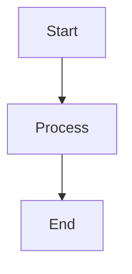

# Project Structure Documentation

## Overview

This document explains the complete folder structure and organization of the Enterprise GenAI Training Program materials.

## Directory Layout

```
enterprise-genai-training-2025/
│
├── 📄 README.md                       # Project overview & getting started
├── 📄 contract.md                     # Original contract (Greek)
│
├── 📁 docs/                           # Documentation & governance
│   ├── 📄 CONTRIBUTING.md             # How to contribute
│   ├── 📁 planning/                   # Project planning docs
│   │   ├── schedule.md                # Detailed schedule
│   │   ├── setup-guide.md             # Environment setup
│   │   └── curriculum-map.md          # Learning path
│   └── 📁 quality/                    # Quality assurance
│       ├── standards.md               # Quality standards
│       ├── review-checklist.md        # Review process
│       └── feedback-process.md        # Feedback collection
│
├── 📁 training-materials/             # Core training content
│   │
│   ├── 📁 week-01/                    # Week 1 materials
│   │   ├── 📄 README.md               # Week overview & schedule
│   │   │
│   │   ├── 📁 lessons/                # Lesson content (markdown)
│   │   │   ├── 01-what-is-genai.md
│   │   │   ├── 02-large-language-models.md
│   │   │   ├── 03-genai-applications.md
│   │   │   └── 04-development-setup.md
│   │   │
│   │   ├── 📁 labs/                   # Hands-on labs (notebooks)
│   │   │   ├── lab-01-openai-basics.ipynb
│   │   │   ├── lab-02-text-generation.ipynb
│   │   │   └── lab-03-simple-app.ipynb
│   │   │
│   │   ├── 📁 exercises/              # Practice exercises
│   │   │   ├── quiz-01.md
│   │   │   ├── exercise-02-parameters.py
│   │   │   └── exercise-03-processor.py
│   │   │
│   │   ├── 📁 solutions/              # Exercise solutions
│   │   │   ├── exercise-02-solution.py
│   │   │   └── exercise-03-solution.py
│   │   │
│   │   └── 📁 resources/              # Additional materials
│   │       ├── references.md          # Links & readings
│   │       ├── glossary.md            # Term definitions
│   │       └── troubleshooting.md     # Common issues
│   │
│   ├── 📁 week-02/ ... week-12/       # Same structure repeated
│   │
│   └── 📄 curriculum-overview.md      # Complete curriculum map
│
├── 📁 deliverables/                   # Contract deliverables
│   │
│   ├── 📁 monthly-reports/            # Progress reports
│   │   ├── 2025-10-month-1.md         # Month 1 report (Due Oct 31)
│   │   ├── 2025-11-month-2.md         # Month 2 report (Due Nov 30)
│   │   └── 2025-12-month-3.md         # Month 3 report (Due Dec 31)
│   │
│   ├── 📁 pocs/                       # Proof of concepts
│   │   │
│   │   ├── 📁 poc-01-rag-system/      # POC 1: RAG System
│   │   │   ├── README.md
│   │   │   ├── src/
│   │   │   ├── tests/
│   │   │   ├── docs/
│   │   │   └── requirements.txt
│   │   │
│   │   ├── 📁 poc-02-multi-agent/     # POC 2: Multi-Agent
│   │   │   └── [same structure]
│   │   │
│   │   └── 📁 poc-03-production-app/  # POC 3: Production App
│   │       └── [same structure]
│   │
│   └── 📁 assessments/                # Evaluations
│       ├── midterm/
│       │   ├── questions.md
│       │   ├── practical-exam.ipynb
│       │   └── rubric.md
│       └── final/
│           ├── questions.md
│           ├── project-requirements.md
│           └── rubric.md
│
├── 📁 templates/                      # Reusable templates
│   │
│   ├── 📁 lessons/                    # Lesson templates
│   │   └── lesson-template.md
│   │
│   ├── 📁 exercises/                  # Exercise templates
│   │   └── exercise-template.py
│   │
│   └── 📁 diagrams/                   # Diagram templates
│       └── mermaid-templates.md
│
└── 📁 resources/                      # Shared resources
    │
    ├── 📁 references/                 # Reference materials
    │   ├── api-references.md
    │   ├── best-practices.md
    │   └── terminology.md
    │
    ├── 📁 tools/                      # Utility scripts
    │   ├── setup_env.py
    │   ├── token_counter.py
    │   └── cost_calculator.py
    │
    ├── 📁 datasets/                   # Sample data
    │   ├── sample_texts.json
    │   ├── training_examples.csv
    │   └── test_cases.yaml
    │
    └── 📁 diagrams/                   # Shared diagrams
        ├── architecture-overview.md
        ├── learning-path.md
        └── tech-stack.md
```

## Content Types

### 📄 Markdown Files (.md)
**Purpose:** All written content, lessons, documentation

**Structure:**
- Clear heading hierarchy (H1 → H2 → H3)
- Code blocks with language tags
- Mermaid diagrams embedded
- Links to related materials
- Tables for structured data

**Example:**
```markdown
# Lesson Title

## Section
Content here...

```python
code_example()
```
```

### 📓 Jupyter Notebooks (.ipynb)
**Purpose:** Interactive labs and hands-on exercises

**Structure:**
- Markdown cells for explanations
- Code cells with executable Python
- Output cells showing results
- Clear section separation
- Instructions in markdown

**Example:**
```python
# Cell 1: Markdown
# # Lab: OpenAI Basics
# This lab introduces...

# Cell 2: Code
import openai
client = openai.OpenAI()

# Cell 3: Exercise
# TODO: Implement...
```

### 🐍 Python Files (.py)
**Purpose:** Exercises, solutions, utility scripts

**Structure:**
- Docstrings at module/class/function level
- Type hints for parameters
- Test functions included
- Example usage
- Clear comments

**Example:**
```python
"""
Module: exercise.py
Description: Exercise implementation
"""

def function(param: str) -> str:
    """Function docstring."""
    pass

if __name__ == "__main__":
    # Tests and examples
    pass
```

## File Naming Conventions

### Lessons
```
NN-descriptive-name.md
01-what-is-genai.md
02-large-language-models.md
```

### Labs
```
lab-NN-descriptive-name.ipynb
lab-01-openai-basics.ipynb
lab-02-text-generation.ipynb
```

### Exercises
```
exercise-NN-descriptive-name.py
quiz-NN.md
exercise-02-parameters.py
quiz-01.md
```

### Solutions
```
exercise-NN-solution.py
lab-NN-solution.ipynb
exercise-02-solution.py
```

### Reports
```
YYYY-MM-description.md
2025-10-month-1.md
2025-11-month-2.md
```

## Content Organization Principles

### 1. Progressive Complexity
- Start simple, build complexity
- Each week builds on previous weeks
- Clear prerequisites documented
- Review sections link back

### 2. Modular Design
- Self-contained lessons
- Reusable components
- Independent exercises
- Flexible ordering when possible

### 3. Consistency
- Same structure across weeks
- Consistent file naming
- Standard templates used
- Uniform code style

### 4. Accessibility
- Clear navigation (README files)
- Multiple entry points
- Search-friendly naming
- Cross-referencing

### 5. Maintainability
- Version control friendly
- Easy to update
- Clear ownership
- Change logs

## Weekly Content Checklist

Each week folder should contain:

- [ ] README.md with overview
- [ ] 3-5 lesson markdown files
- [ ] 2-3 hands-on labs (notebooks)
- [ ] 2-3 exercises (Python/markdown)
- [ ] Solutions for all exercises
- [ ] Resources folder with references
- [ ] All diagrams embedded in markdown
- [ ] Clear learning objectives
- [ ] Prerequisites documented
- [ ] Estimated times provided

## Deliverables Organization

### Monthly Reports
**Location:** `deliverables/monthly-reports/`

**Content:**
- Executive summary
- Week-by-week breakdown
- Metrics and analytics
- Challenges and solutions
- Next month planning

**Due Dates:**
- Month 1: October 31, 2025
- Month 2: November 30, 2025
- Month 3: December 31, 2025

### POCs (Proof of Concepts)
**Location:** `deliverables/pocs/poc-NN-name/`

**Structure:**
```
poc-01-rag-system/
├── README.md              # Overview & setup
├── ARCHITECTURE.md        # Design decisions
├── src/                   # Source code
│   ├── __init__.py
│   ├── main.py
│   └── modules/
├── tests/                 # Test suite
│   └── test_*.py
├── docs/                  # Documentation
│   ├── api.md
│   └── deployment.md
├── requirements.txt       # Dependencies
├── .env.example          # Config template
└── docker-compose.yml    # Container setup
```

### Assessments
**Location:** `deliverables/assessments/`

**Components:**
- Theory questions (markdown)
- Practical exercises (notebooks)
- Grading rubrics
- Model answers
- Performance criteria

## Templates Usage

### When to Use Templates

**Lesson Template:** Every new lesson
**Exercise Template:** All Python exercises  
**Diagram Templates:** Architecture/flow diagrams

### How to Use Templates

1. Copy template to destination
2. Rename appropriately
3. Fill in all sections
4. Replace placeholders
5. Remove template markers
6. Test all code examples

## Maintenance Guidelines

### Regular Updates
- Review content quarterly
- Update links monthly
- Test code examples weekly
- Check for deprecations

### Version Control
- Commit logical changes
- Clear commit messages
- Tag major releases
- Branch for experiments

### Quality Checks
- Run all code examples
- Verify all links
- Check markdown rendering
- Test notebooks execute

## Resource Management

### Shared Resources
- Store in `resources/`
- Reference from lessons
- Don't duplicate
- Keep updated

### External References
- Use permanent links
- Add to resources/references.md
- Include access date
- Check availability

### Diagrams
- Create in Mermaid syntax
- Embed in markdown
- Store source in diagrams/
- Use consistent styling

---

## Quick Reference

### Adding New Week Content
```bash
# Navigate to week folder
cd training-materials/week-XX

# Create lesson
cp ../../templates/lessons/lesson-template.md lessons/01-topic.md

# Create exercise
cp ../../templates/exercises/exercise-template.py exercises/exercise-01-name.py

# Create lab (manually in Jupyter)
# Edit README.md with overview
```

### Creating a POC
```bash
# Create POC structure
cd deliverables/pocs
mkdir poc-XX-name
cd poc-XX-name
mkdir -p src tests docs

# Add files
touch README.md ARCHITECTURE.md requirements.txt
```

### Adding Diagrams
```markdown
# In your markdown file:


```

---

**Document Version:** 1.0  
**Last Updated:** October 27, 2025  
**Next Review:** January 27, 2026
