# Training Program Architecture

## System Overview

## Content Flow

## Weekly Content Structure

## Learning Path Progression

```mermaid
graph TB
    Start[Program Start] --> M1[Month 1: Foundations]
    
    M1 --> W1[Week 1: GenAI Intro]
    W1 --> W2[Week 2: Prompt Engineering]
    W2 --> W3[Week 3: Advanced Prompting]
    W3 --> W4[Week 4: RAG Fundamentals]
    
    W4 --> R1[Month 1 Report]
    R1 --> M2[Month 2: Advanced Techniques]
    
    M2 --> W5[Week 5: Advanced RAG]
    W5 --> W6[Week 6: Function Calling]
    W6 --> W7[Week 7: Agents]
    W7 --> W8[Week 8: Fine-tuning]
    
    W8 --> Mid[🎯 Mid-term Assessment]
    Mid --> POC1[📦 POC 1: RAG System]
    POC1 --> R2[Month 2 Report]
    
    R2 --> M3[Month 3: Production]
    
    M3 --> W9[Week 9: MLOps]
    W9 --> W10[Week 10: Security]
    W10 --> W11[Week 11: Computer Vision]
    W11 --> W12[Week 12: Final Project]
    
    W12 --> POC2[📦 POC 2: Multi-Agent]
    POC2 --> POC3[📦 POC 3: Production App]
    POC3 --> Final[🎯 Final Assessment]
    Final --> R3[Month 3 Report]
    R3 --> Complete[🎓 Program Complete]
    
    style Start fill:#e8f5e9
    style M1 fill:#e8f5e9
    style M2 fill:#fff3e0
    style M3 fill:#f3e5f5
    style Complete fill:#c8e6c9
    style Mid fill:#e1f5ff
    style Final fill:#e1f5ff
    style R1 fill:#e1f5ff
    style R2 fill:#e1f5ff
    style R3 fill:#e1f5ff
```

## Timeline Gantt Chart

## Technology Stack

## File Type Distribution

## Quality Assurance Flow

## Student Learning Journey

## POC Development Cycle

---

**Created:** October 27, 2025  
**Version:** 1.0  
**Status:** ✅ Complete & Professional
