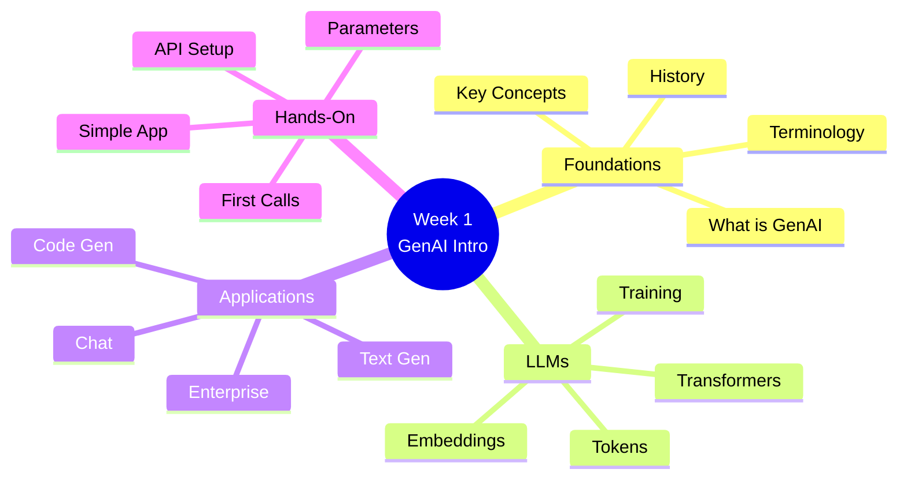

# Week 1: GenAI Introduction & Fundamentals

**Provided by:** ADC ENGINEERING & CONSULTING LTD

**Duration:** 20 hours

---

## 📋 Week Overview

This week provides a comprehensive introduction to Generative AI, covering fundamental concepts, the evolution of AI technologies, and practical applications. You'll gain hands-on experience with basic AI models and understand the landscape of modern generative systems.

---

## 🎯 Learning Objectives

By the end of this week, you will be able to:

- [ ] Define Generative AI and distinguish it from traditional AI approaches
- [ ] Explain the architecture and functioning of key generative models
- [ ] Identify real-world applications and use cases for GenAI
- [ ] Set up a development environment for AI experimentation
- [ ] Write basic code to interact with generative AI APIs
- [ ] Understand ethical considerations and limitations

---

## 📚 Content Structure

### Lessons

1. **[Lesson 1: What is Generative AI?](lessons/01-what-is-genai.md)** (90 min)
   - History and evolution of AI
   - Generative vs discriminative models
   - Key terminology and concepts
   - The GenAI landscape

2. **[Lesson 2: Large Language Models](lessons/02-large-language-models.md)** (90 min)
   - Transformer architecture overview
   - How LLMs are trained
   - Tokens, embeddings, and attention
   - Popular LLM models comparison

3. **[Lesson 3: Generative AI Applications](lessons/03-genai-applications.md)** (60 min)
   - Text generation and completion
   - Code generation
   - Image and multimodal generation
   - Enterprise use cases

4. **[Lesson 4: Development Setup](lessons/04-development-setup.md)** (60 min)
   - Python environment configuration
   - API keys and authentication
   - Essential libraries installation
   - First API calls

### Labs

1. **[Lab 1: First Steps with OpenAI API](labs/lab-01-openai-basics.ipynb)** (120 min)
   - Environment setup
   - Making your first API call
   - Understanding parameters (temperature, max_tokens, etc.)
   - Error handling

2. **[Lab 2: Text Generation Experiments](labs/lab-02-text-generation.ipynb)** (90 min)
   - Completion vs chat models
   - Experimenting with parameters
   - Building a simple chatbot
   - Token counting and costs

3. **[Lab 3: Building a Simple AI Application](labs/lab-03-simple-app.ipynb)** (150 min)
   - Design a text summarizer
   - Implement error handling
   - Add streaming responses
   - Create a CLI interface

### Exercises

- **[Exercise 1: GenAI Concepts Quiz](exercises/quiz-01.md)** (30 min)
- **[Exercise 2: API Parameter Tuning](exercises/exercise-02-parameters.py)** (45 min)
- **[Exercise 3: Custom Text Processor](exercises/exercise-03-processor.py)** (60 min)

### Solutions

All exercise solutions are available in the `solutions/` folder after you've attempted them.

---

## 🛠️ Prerequisites

### Required Knowledge
- Python programming (functions, classes, async/await)
- Basic understanding of APIs and HTTP
- Command line proficiency
- Git basics

### Software Requirements
```bash
# Required software
- Python 3.9+
- pip or conda
- VS Code or similar IDE
- Git

# Required Python packages
openai>=1.0.0
python-dotenv>=1.0.0
requests>=2.31.0
jupyter>=1.0.0
```

### Setup Instructions

1. **Clone the repository:**
   ```bash
   git clone <repo-url>
   cd enterprise-genai-training-2025
   ```

2. **Create virtual environment:**
   ```bash
   python -m venv venv
   source venv/bin/activate  # On Windows: venv\Scripts\activate
   ```

3. **Install dependencies:**
   ```bash
   pip install -r requirements.txt
   ```

4. **Configure API keys:**
   ```bash
   cp .env.example .env
   # Edit .env and add your OpenAI API key
   ```

---

## 📅 Schedule

### Session Structure

**Day 1: Foundations**
- Lesson 1: What is Generative AI?
- Lesson 2: Large Language Models
- Lab 1: First Steps with OpenAI API

**Day 2: Deep Dive**
- Lesson 3: GenAI Applications
- Lesson 4: Development Setup
- Lab 2: Text Generation Experiments

**Day 3: Hands-On Practice**
- Lab 3: Building a Simple AI Application
- Exercises and troubleshooting

**Day 4: Integration & Review**
- Advanced topics discussion
- Project work and presentations
- Week review and Q&A

---

## 🎯 Key Concepts Covered

### Core Concepts
- **Generative Models:** AI systems that create new content
- **Large Language Models (LLMs):** Neural networks trained on text
- **Transformers:** Architecture enabling modern LLMs
- **Tokens:** Basic units of text processing
- **Embeddings:** Numerical representations of text
- **Attention Mechanism:** How models focus on relevant information

### Technical Skills
- Setting up Python development environment
- Making authenticated API calls
- Handling responses and errors
- Parameter tuning for different outputs
- Token management and cost optimization
- Building simple CLI applications

### Visual Overview



---

## 📊 Assessment

### Knowledge Check
- Exercise 1: GenAI Concepts Quiz (30 questions)
- Minimum passing score: 80%

### Practical Assessment
- Lab completion: All 3 labs must be completed
- Exercise completion: Exercises 2 and 3
- Mini-project: Working AI application

### Success Criteria
- [ ] All lessons reviewed
- [ ] All labs completed with working code
- [ ] Quiz score ≥ 80%
- [ ] Simple AI application running
- [ ] Able to explain core concepts

---

## 💡 Key Takeaways

1. **Generative AI** creates new content by learning patterns from training data
2. **LLMs** use transformer architecture with attention mechanisms
3. **Parameters** like temperature and max_tokens control output behavior
4. **Tokens** are the currency of API calls - manage them wisely
5. **Real-world applications** require error handling and user experience design

---

## 🔗 Resources

### Documentation
- [OpenAI API Documentation](https://platform.openai.com/docs)
- [Python OpenAI Library](https://github.com/openai/openai-python)
- [Transformers Paper (Attention Is All You Need)](https://arxiv.org/abs/1706.03762)

### Additional Reading
- [What is Generative AI? - Google Cloud](https://cloud.google.com/learn/what-is-generative-ai)
- [The Illustrated Transformer](https://jalammar.github.io/illustrated-transformer/)
- [Understanding Large Language Models](https://magazine.sebastianraschka.com/p/understanding-large-language-models)

### Tools & Libraries
- [OpenAI Playground](https://platform.openai.com/playground)
- [Python Requests Documentation](https://requests.readthedocs.io/)
- [Python-dotenv](https://pypi.org/project/python-dotenv/)

---

## 🐛 Common Issues

### Issue: API Key Not Working
**Solution:** Ensure you've:
1. Created API key in OpenAI dashboard
2. Added it to `.env` file correctly
3. Loaded it with `python-dotenv`
4. Not committed `.env` to git

### Issue: Rate Limit Errors
**Solution:** 
- Implement exponential backoff
- Check your usage tier
- Add delays between requests

### Issue: Import Errors
**Solution:**
- Ensure virtual environment is activated
- Run `pip install -r requirements.txt`
- Check Python version (3.9+)

---

## 📝 Weekly Reflection

After completing this week, reflect on:

1. What surprised you most about Generative AI?
2. Which concept was most challenging to understand?
3. How do you envision using GenAI in your work?
4. What questions do you still have?

Share your thoughts in the discussion forum or during office hours.

---

## ⏭️ Next Week

**Week 02: Prompt Engineering & LLM Basics**
- Advanced prompting techniques
- Chain-of-thought reasoning
- Few-shot learning
- Prompt optimization strategies

### Preparation
- Review your Week 1 notes
- Ensure your development environment is working
- Think about a use case you want to explore
- Optional: Read about prompt engineering patterns

---

## 📞 Support

- **Office Hours:** Friday 16:00-17:00
- **Discussion Forum:** [Link to forum]
- **Issues:** Create an issue in this repository
- **Email:** [training-support@example.com]

---

**Week Coordinator:** Training Team  
**Last Updated:** October 27, 2025
