# Week 01 - Lesson 1: What is Generative AI?

**Duration:** 90 minutes  
**Level:** Beginner  
**Prerequisites:** Basic understanding of programming and machine learning concepts

---

## 🎯 Learning Objectives

By the end of this lesson, you will:
- [ ] Understand what Generative AI is and how it differs from traditional AI
- [ ] Explain the evolution from traditional ML to Generative AI
- [ ] Identify key types of generative models and their applications
- [ ] Recognize the business value and use cases of GenAI

---

## 📚 Table of Contents

1. [Introduction](#1-introduction)
2. [AI Evolution: From Rule-Based to Generative](#2-ai-evolution-from-rule-based-to-generative)
3. [What is Generative AI?](#3-what-is-generative-ai)
4. [Types of Generative Models](#4-types-of-generative-models)
5. [The GenAI Landscape](#5-the-genai-landscape)
6. [Business Applications](#6-business-applications)
7. [Summary](#7-summary)
8. [Further Reading](#8-further-reading)

---

## 1. Introduction

### The AI Revolution We're Living Through

We are experiencing a fundamental shift in how we interact with technology. Generative AI represents one of the most significant technological breakthroughs since the internet itself. But what exactly is it, and why does it matter?

### A Quick Example

**Traditional AI (Discriminative):**
- Input: "Is this email spam?"
- Output: Yes or No

**Generative AI:**
- Input: "Write a professional email apologizing for a delayed shipment"
- Output: Complete, contextual, original text

The difference? **Creation vs Classification**.

---

## 2. AI Evolution: From Rule-Based to Generative

### The Journey of Artificial Intelligence

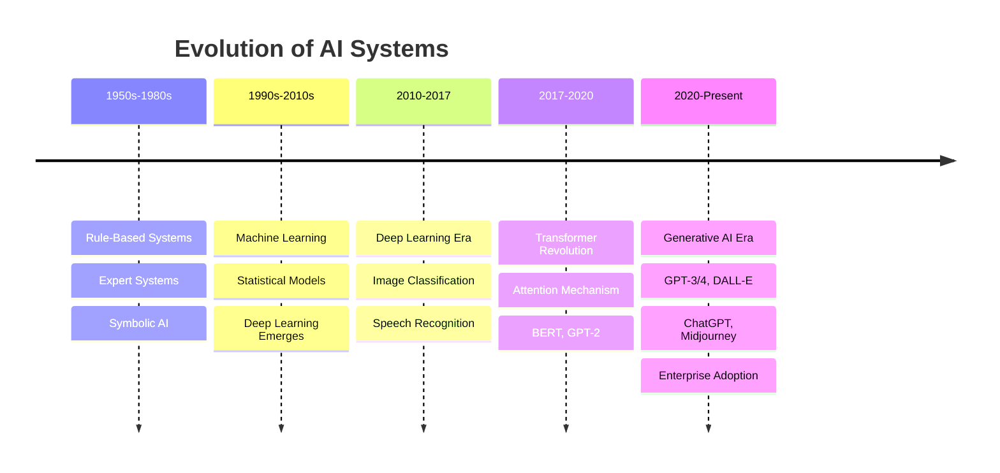

### 1. Rule-Based Systems (1950s-1980s)

**How they worked:**
```python
# Simple rule-based system
def classify_email(email_text):
    spam_keywords = ['free', 'winner', 'click here', 'urgent']
    
    spam_count = sum(1 for keyword in spam_keywords 
                     if keyword in email_text.lower())
    
    if spam_count >= 2:
        return "SPAM"
    return "NOT SPAM"
```

**Limitations:**
- Rigid, hand-coded rules
- Couldn't learn from data
- Broke with edge cases
- Required expert knowledge

### 2. Machine Learning Era (1990s-2010s)

**Key Innovation:** Learn patterns from data

```python
# Machine Learning approach
from sklearn.naive_bayes import MultinomialNB

# Train on examples
model = MultinomialNB()
model.fit(training_emails, training_labels)

# Predict new emails
prediction = model.predict(new_email)
```

**Advantages:**
- Learns from data
- Adapts to new patterns
- Statistical decision-making
- Scales with more data

**Still Limited:**
- Needed feature engineering
- Primarily classification/regression
- Couldn't generate new content

### 3. Deep Learning Revolution (2010-2017)

**Breakthrough:** Neural networks with many layers

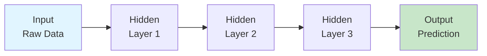

**Key Achievements:**
- Image classification (ImageNet 2012)
- Speech recognition
- Machine translation
- Game playing (AlphaGo)

**But:** Still primarily **discriminative** - classifying, not creating.

### 4. The Transformer Era (2017-2020)

**2017:** "Attention Is All You Need" paper introduces Transformers

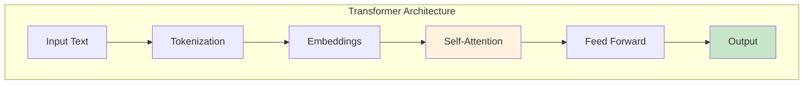

**Key Innovation:** Attention Mechanism
- Models can "pay attention" to relevant parts of input
- Processes sequences in parallel (vs sequential RNNs)
- Scales to massive datasets

**Major Models:**
- BERT (2018) - Understanding language
- GPT-2 (2019) - Generating text
- T5 (2019) - Text-to-text framework

### 5. Generative AI Explosion (2020-Present)

**The Breakthrough Moment:**

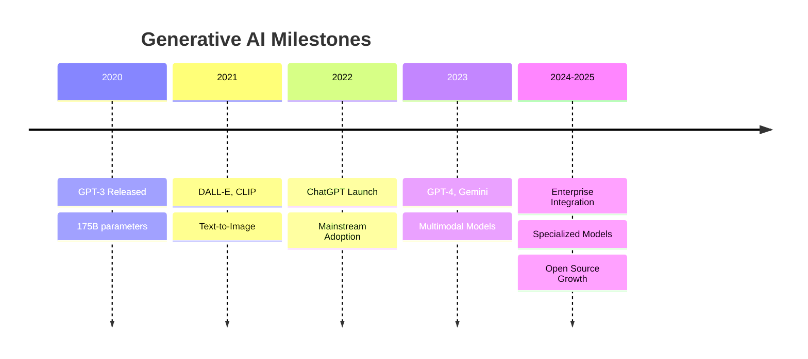

**What Changed:**
1. **Scale:** Models with 100B+ parameters
2. **Data:** Trained on internet-scale datasets
3. **Emergence:** Unexpected capabilities emerged
4. **Usability:** Natural language interfaces

---

## 3. What is Generative AI?

### Definition

**Generative AI** refers to artificial intelligence systems that can **create new content** that is similar to, but not a copy of, their training data.

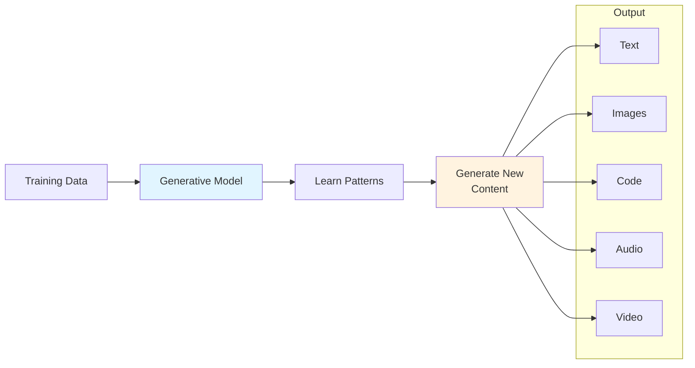

### Discriminative vs Generative AI

| Aspect | Discriminative AI | Generative AI |
|--------|------------------|---------------|
| **Purpose** | Classify/Predict | Create/Generate |
| **Input** | Data sample | Prompt/Description |
| **Output** | Category/Value | New content |
| **Question** | "What is this?" | "Make me something like this" |
| **Example** | Spam filter | Write an email |
| **Models** | SVM, Random Forest | GPT, DALL-E, Stable Diffusion |

### The Key Difference

**Discriminative:**
```python
# Input: Features of an image
# Output: "This is a cat" (classification)

def classify_image(image):
    features = extract_features(image)
    return model.predict(features)  # Returns: "cat"
```

**Generative:**
```python
# Input: Text description
# Output: New image (generation)

def generate_image(prompt):
    return model.generate(prompt)  # Returns: New cat image
```

---

## 4. Types of Generative Models

### Overview of Model Types

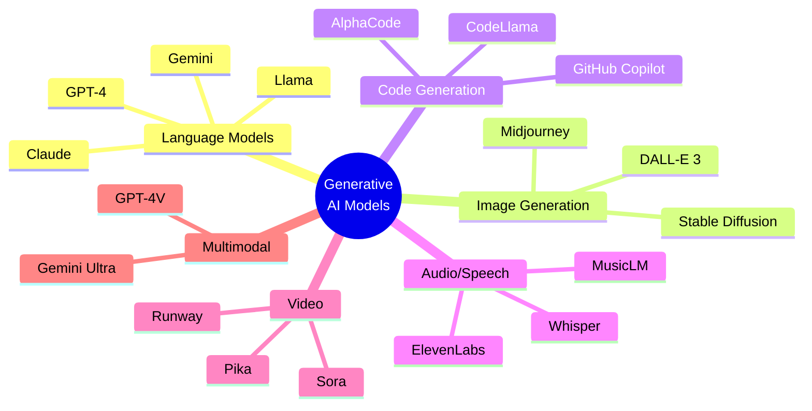

### 1. Large Language Models (LLMs)

**Purpose:** Generate and understand human language

**Key Models:**
- **GPT-4** (OpenAI) - Most capable, multimodal
- **Claude** (Anthropic) - Strong reasoning, safe
- **Gemini** (Google) - Multimodal, integrated
- **Llama** (Meta) - Open source, customizable

**Capabilities:**
- Text generation
- Translation
- Summarization
- Question answering
- Code generation
- Reasoning and analysis

**Example Use:**
```python
import openai

response = openai.ChatCompletion.create(
    model="gpt-4",
    messages=[
        {"role": "user", "content": "Explain quantum computing simply"}
    ]
)

print(response.choices[0].message.content)
```

### 2. Image Generation Models

**Purpose:** Create images from text descriptions

**Key Models:**
- **DALL-E 3** - High quality, integrated with ChatGPT
- **Midjourney** - Artistic, highly aesthetic
- **Stable Diffusion** - Open source, customizable

**How They Work:**
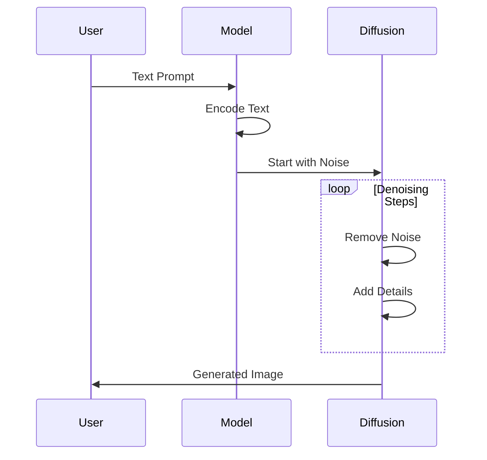

### 3. Code Generation Models

**Purpose:** Generate and understand code

**Key Models:**
- **GitHub Copilot** (GPT-4 based)
- **CodeLlama** (Meta)
- **AlphaCode** (DeepMind)

**Capabilities:**
- Code completion
- Function generation
- Bug fixing
- Code explanation
- Test generation

### 4. Audio and Music Models

**Purpose:** Generate or process audio

**Examples:**
- **Whisper** - Speech to text
- **ElevenLabs** - Text to speech
- **MusicLM** - Text to music

### 5. Video Generation Models

**Purpose:** Create video from text or images

**Emerging Models:**
- **Sora** (OpenAI) - Text to video
- **Runway** - Video editing and generation
- **Pika** - Video generation

**Current State:** Early but rapidly improving

### 6. Multimodal Models

**Purpose:** Work across multiple types of content

**Key Models:**
- **GPT-4V** (Vision) - Text + images
- **Gemini Ultra** - Text, image, audio, video

**Breakthrough:** Understanding and generating across modalities

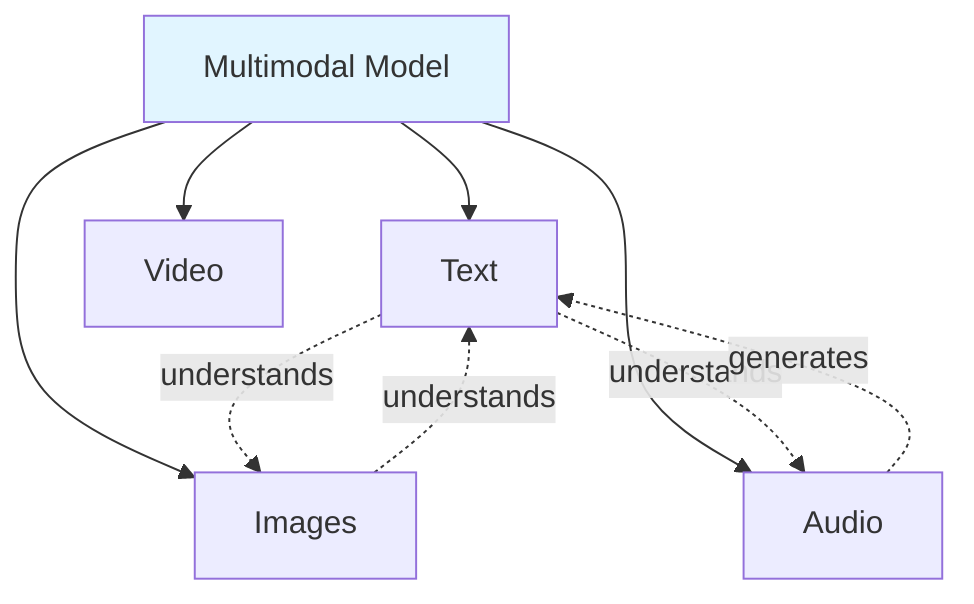

---

## 5. The GenAI Landscape

### Market Overview

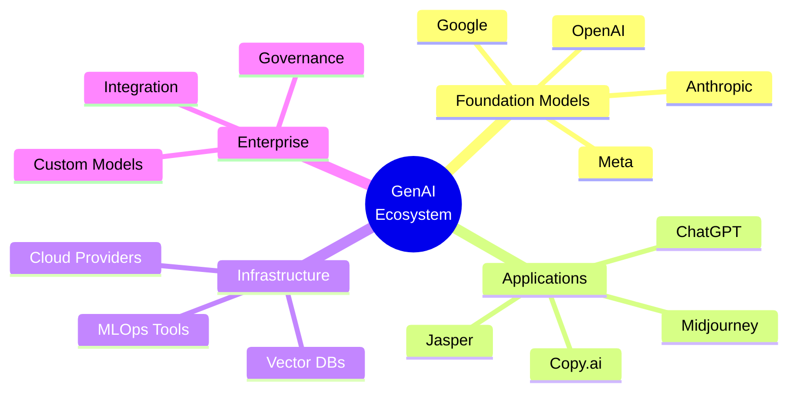

### Key Players

**1. Foundation Model Providers:**
- OpenAI (GPT-4, DALL-E)
- Anthropic (Claude)
- Google (Gemini)
- Meta (Llama)
- Mistral AI
- Cohere

**2. Application Layer:**
- ChatGPT
- Microsoft Copilot
- Jasper (marketing)
- Midjourney (art)
- Runway (video)

**3. Infrastructure:**
- Pinecone (vector database)
- LangChain (orchestration)
- Weights & Biases (MLOps)
- HuggingFace (models hub)

### Open Source vs Closed Source

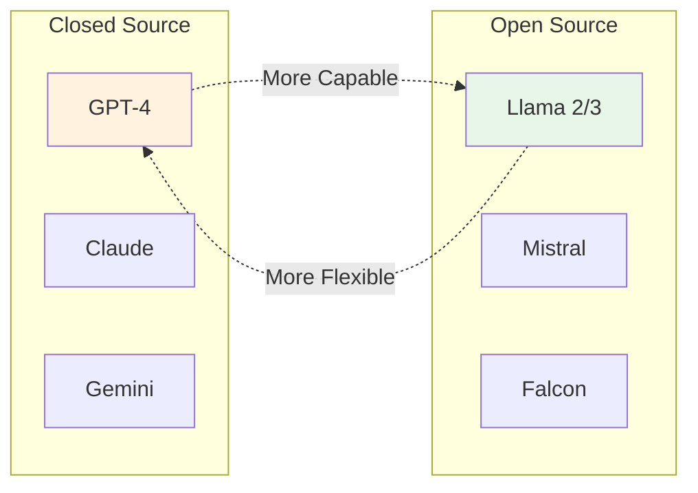

**Trade-offs:**

| Aspect | Closed Source | Open Source |
|--------|---------------|-------------|
| **Performance** | Generally better | Improving rapidly |
| **Cost** | API fees | Self-hosting costs |
| **Privacy** | Data sent to provider | Full control |
| **Customization** | Limited | Full flexibility |
| **Support** | Professional | Community |

---

## 6. Business Applications

### Enterprise Use Cases

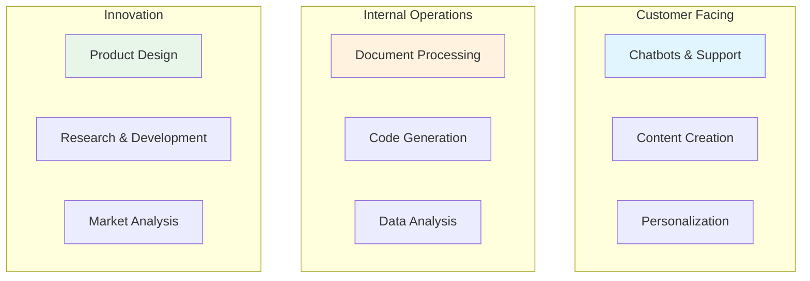

### Real-World Examples

**1. Customer Service**
- **Problem:** High support ticket volume
- **Solution:** AI-powered chatbots handle common queries
- **Impact:** 60% ticket reduction, 24/7 availability

**2. Content Marketing**
- **Problem:** Need for constant content creation
- **Solution:** AI-assisted writing and ideation
- **Impact:** 5x content production speed

**3. Software Development**
- **Problem:** Repetitive coding tasks
- **Solution:** AI code assistants (Copilot)
- **Impact:** 30-40% productivity increase

**4. Document Analysis**
- **Problem:** Manual review of contracts/reports
- **Solution:** AI summarization and extraction
- **Impact:** 80% time reduction

**5. Personalization**
- **Problem:** Generic user experiences
- **Solution:** AI-generated personalized content
- **Impact:** 25% engagement increase

### Industry Applications

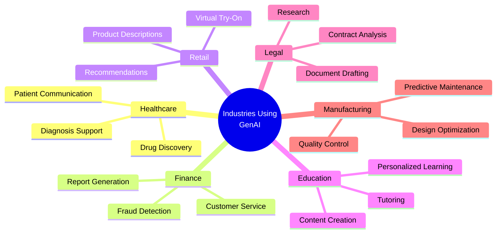

### Value Proposition

**Why Companies Invest in GenAI:**

1. **Efficiency:** Automate repetitive tasks
2. **Scalability:** Handle increasing workloads
3. **Innovation:** New product possibilities
4. **Cost Reduction:** Lower operational expenses
5. **Competitive Advantage:** Early adopter benefits

**ROI Timeline:**
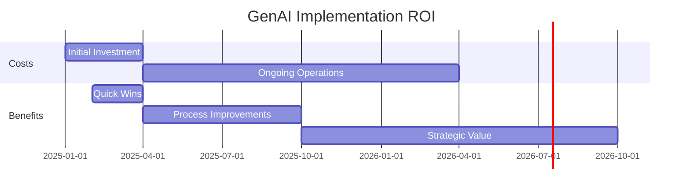

---

## 7. Summary

### Key Takeaways

1. **Evolution:** AI has evolved from rule-based systems → ML → Deep Learning → Generative AI

2. **Definition:** Generative AI creates new content rather than just classifying existing content

3. **Types:** Multiple modalities - text, image, code, audio, video, and multimodal

4. **Landscape:** Diverse ecosystem of foundation models, applications, and infrastructure

5. **Business Value:** Transforming industries through automation, augmentation, and innovation

### The Paradigm Shift

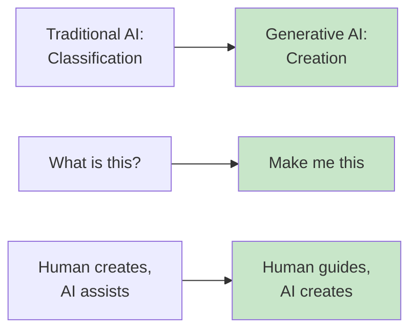

### What's Next?

In the upcoming lessons, we'll dive deeper into:
- **Lesson 2:** How Large Language Models work
- **Lesson 3:** Practical applications and use cases
- **Lesson 4:** Getting started with development

---

## 8. Further Reading

### Official Documentation
- [OpenAI Research](https://openai.com/research) - Latest AI research
- [Anthropic](https://www.anthropic.com/) - Claude and AI safety
- [Google AI](https://ai.google/) - Gemini and research

### Papers & Articles
- ["Attention Is All You Need"](https://arxiv.org/abs/1706.03762) - Original Transformer paper
- ["Language Models are Few-Shot Learners"](https://arxiv.org/abs/2005.14165) - GPT-3 paper
- [The Illustrated Transformer](https://jalammar.github.io/illustrated-transformer/) - Visual guide

### Books
- "The AI Revolution" by Louis Rosenberg
- "Life 3.0" by Max Tegmark
- "Architects of Intelligence" by Martin Ford

### Industry Resources
- [Hugging Face Blog](https://huggingface.co/blog)
- [OpenAI Blog](https://openai.com/blog)
- [Google AI Blog](https://ai.googleblog.com/)

### Courses & Tutorials
- [DeepLearning.AI Short Courses](https://www.deeplearning.ai/short-courses/)
- [Fast.ai](https://www.fast.ai/)
- [Stanford CS224N](http://web.stanford.edu/class/cs224n/) - NLP with Deep Learning

---

## 📝 Review Questions

1. What is the fundamental difference between discriminative and generative AI?
2. Name three major breakthroughs that led to the current GenAI revolution
3. What are the main types of generative models?
4. Explain the attention mechanism and why it was important
5. Give three examples of business applications for GenAI

---

## 🔗 Related Content

- **Next:** [Lesson 2: Large Language Models](02-large-language-models.md)
- **Lab:** [Lab 1: First Steps with OpenAI API](../labs/lab-01-openai-basics.ipynb)
- **Exercise:** [Quiz: GenAI Fundamentals](../exercises/quiz-01.md)

---

**Author:** Training Team  
**Last Updated:** October 27, 2025  
**Version:** 1.0  
**License:** Proprietary - Enterprise Training Materials
