# Week 01 - Lesson 2: Large Language Models

**Duration:** 90 minutes  
**Level:** Beginner  
**Prerequisites:** Lesson 1 - What is Generative AI

---

## 🎯 Learning Objectives

By the end of this lesson, you will:
- [ ] Understand the architecture of Large Language Models
- [ ] Explain how transformers and attention mechanisms work
- [ ] Describe the training process for LLMs
- [ ] Understand tokens, embeddings, and context windows
- [ ] Compare different LLM models and their capabilities

---

## 📚 Table of Contents

1. [Introduction to LLMs](#1-introduction-to-llms)
2. [The Transformer Architecture](#2-the-transformer-architecture)
3. [How LLMs Learn](#3-how-llms-learn)
4. [Tokens and Embeddings](#4-tokens-and-embeddings)
5. [Model Comparison](#5-model-comparison)
6. [Limitations and Challenges](#6-limitations-and-challenges)
7. [Summary](#7-summary)
8. [Further Reading](#8-further-reading)

---

## 1. Introduction to LLMs

### What is a Large Language Model?

A **Large Language Model (LLM)** is a type of artificial intelligence model trained on massive amounts of text data to understand and generate human language.

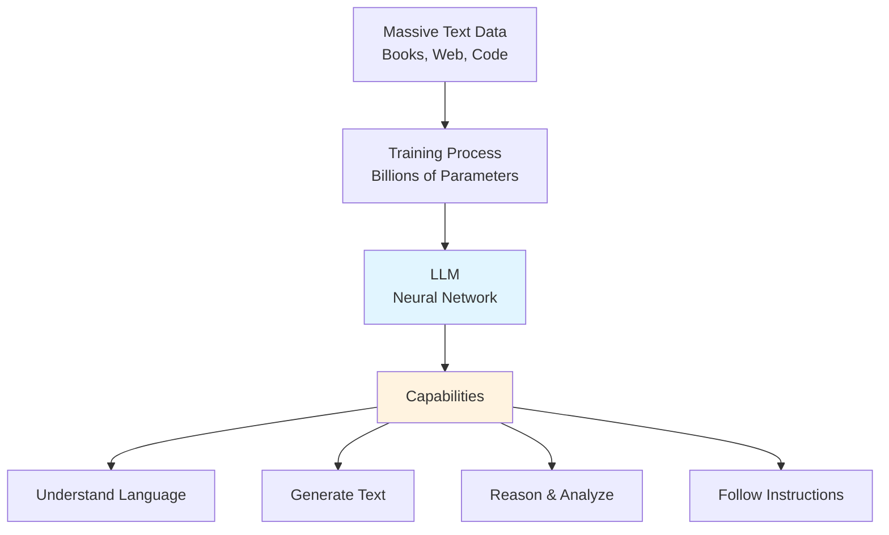

### Why "Large"?

**Scale Matters:**

| Model | Parameters | Training Data | Year |
|-------|-----------|---------------|------|
| GPT-2 | 1.5B | 40GB | 2019 |
| GPT-3 | 175B | 570GB | 2020 |
| GPT-4 | ~1.7T (estimated) | Undisclosed | 2023 |
| Llama 2 | 70B | 2T tokens | 2023 |
| Gemini Ultra | Undisclosed | Multimodal | 2023 |

**Why Size Matters:**
1. **More Patterns:** Captures subtle language nuances
2. **Better Reasoning:** Emergent abilities at scale
3. **Broader Knowledge:** More training data = more knowledge
4. **Few-shot Learning:** Can learn from examples in prompts

### Emergent Capabilities

Some abilities only appear at scale:

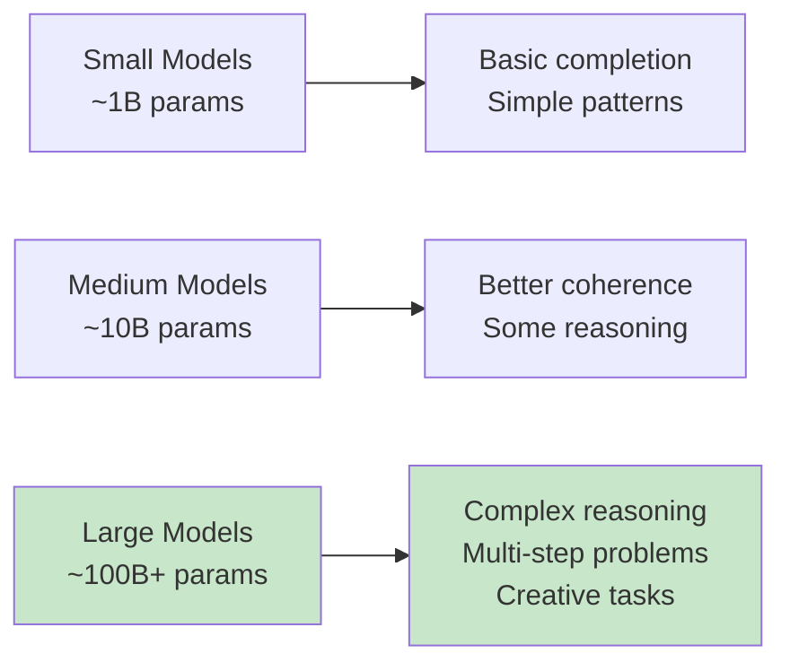

**Surprising Behaviors:**
- Multi-step mathematical reasoning
- Understanding context across long conversations
- Following complex instructions
- Creative problem solving
- Code generation and debugging

---

## 2. The Transformer Architecture

### The Foundation

All modern LLMs are built on the **Transformer** architecture, introduced in the 2017 paper "Attention Is All You Need."

### High-Level Architecture

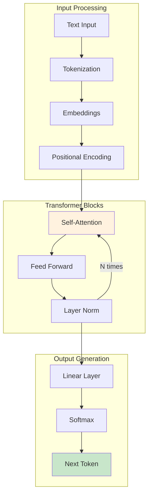

### Key Components

#### 1. Embeddings

**Purpose:** Convert discrete tokens to continuous vectors

```python
# Simplified concept
token = "hello"
embedding = [0.23, -0.45, 0.67, 0.12, ...]  # Vector of 768+ dimensions

# Similar words have similar embeddings
similarity("king", "queen") > similarity("king", "banana")
```

**Properties:**
- High-dimensional vectors (768, 1536, 4096 dims)
- Capture semantic meaning
- Learned during training

```mermaid
graph LR
    A[Word: "cat"] --> B[Embedding Vector]
    B --> C[0.23, -0.45, 0.67, ...]
    
    D[Word: "kitten"] --> E[Embedding Vector]
    E --> F[0.25, -0.43, 0.65, ...]
    
    C -.Similar vectors.-> F
    
    style B fill:#e1f5ff
    style E fill:#e1f5ff
```

#### 2. Positional Encoding

**Problem:** Transformers process all tokens at once (not sequential)

**Solution:** Add position information to embeddings

```python
# Position information added to embedding
embedding_with_position = token_embedding + position_encoding

# Position 1: "The" gets position info for slot 1
# Position 2: "cat" gets position info for slot 2
# etc.
```

**Why It Matters:**
- "Dog bites man" ≠ "Man bites dog"
- Order matters in language
- Position encoding preserves sequence information

#### 3. Self-Attention: The Magic Ingredient

**The Key Innovation:** Models can "pay attention" to relevant parts of the input.

**How It Works:**

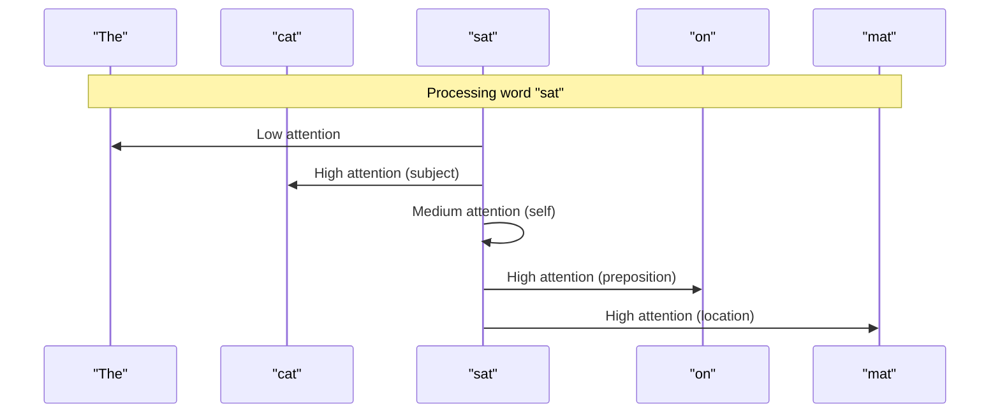

**Example:**

Input: "The animal didn't cross the street because it was too tired"

When processing "it":
- High attention to "animal" (refers to the animal)
- Low attention to "street" (not what 'it' refers to)
- Context determines meaning

**Attention Visualization:**

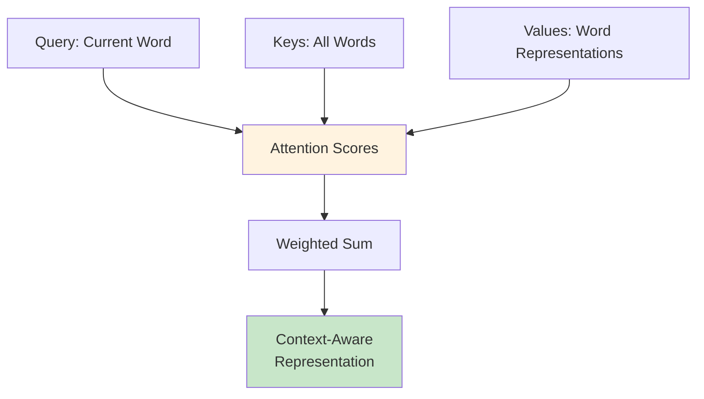

**Mathematical View (Simplified):**

```python
# For each word, calculate attention to all other words
def attention(query, keys, values):
    # How much should we pay attention to each word?
    scores = query @ keys.T  # Dot product
    weights = softmax(scores / sqrt(d_k))  # Normalize
    output = weights @ values  # Weighted sum
    return output

# This happens in parallel for all words
```

#### 4. Multi-Head Attention

**Problem:** Different relationships to capture

**Solution:** Multiple attention mechanisms in parallel

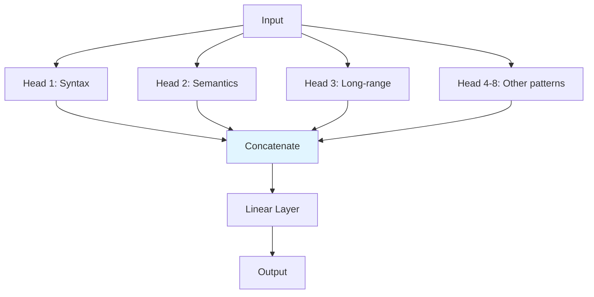

**Each head learns different patterns:**
- Head 1: Subject-verb relationships
- Head 2: Adjective-noun relationships
- Head 3: Long-distance dependencies
- Head 4-8: Other linguistic patterns

#### 5. Feed-Forward Network

After attention, each position goes through the same feed-forward network:

```python
def feed_forward(x):
    # Expand to higher dimension
    hidden = linear1(x)  # e.g., 768 -> 3072
    hidden = activation(hidden)  # ReLU or GELU
    # Project back
    output = linear2(hidden)  # e.g., 3072 -> 768
    return output
```

**Purpose:**
- Process information gathered by attention
- Add non-linearity
- Learn complex patterns

#### 6. Layer Normalization & Residual Connections

**Residual Connections:** Skip connections that help training

```python
# Instead of: output = layer(input)
# We do: output = input + layer(input)

x = input
x = x + self_attention(layer_norm(x))
x = x + feed_forward(layer_norm(x))
output = x
```

**Benefits:**
- Easier to train deep networks
- Prevents vanishing gradients
- Allows information to flow

### Complete Transformer Block

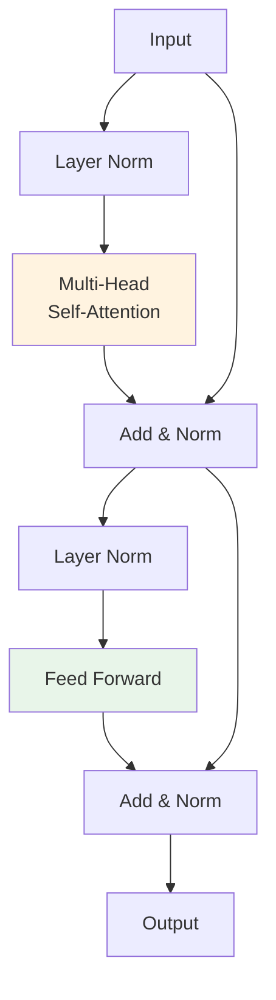

### Decoder-Only vs Encoder-Decoder

**Two Main Architectures:**

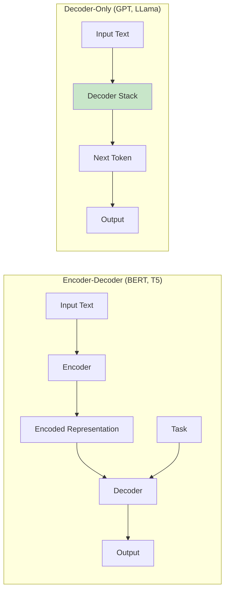

**Decoder-Only (GPT family):**
- Generate text left-to-right
- Predict next token
- Simpler architecture
- Most common for LLMs

**Encoder-Decoder (BERT, T5):**
- Encode input, decode output
- Good for translation, summarization
- Can attend to full input at once

---

## 3. How LLMs Learn

### Training Process Overview

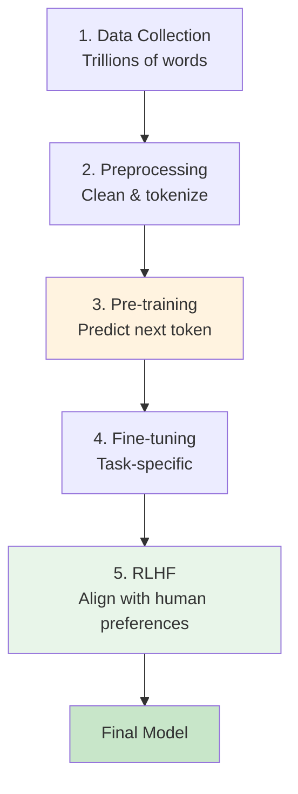

### Stage 1: Pre-training

**Objective:** Learn language patterns from massive text data

**Method:** Next Token Prediction

```python
# Training objective
text = "The cat sat on the"
input = "The cat sat on"
target = "the"

# Model learns to predict next token
prediction = model(input)
loss = calculate_loss(prediction, target)
update_parameters(loss)
```

**The Learning Process:**

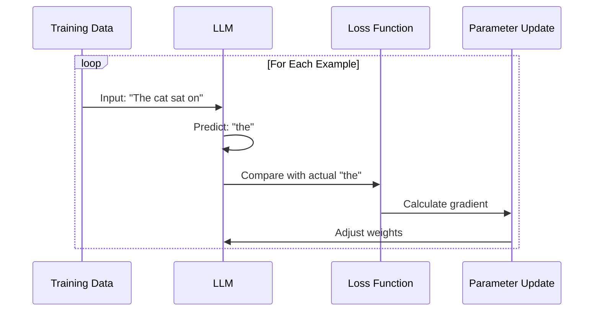

**What the Model Learns:**
- Grammar and syntax
- World knowledge
- Reasoning patterns
- Common sense
- Task patterns (from examples in data)

**Scale of Pre-training:**
- **Data:** Hundreds of billions to trillions of tokens
- **Compute:** Thousands of GPUs for months
- **Cost:** Millions to tens of millions of dollars

### Stage 2: Supervised Fine-Tuning

**Purpose:** Teach specific behaviors and formats

**Method:** Train on curated instruction-response pairs

```python
# Fine-tuning examples
examples = [
    {
        "instruction": "Summarize this article...",
        "response": "The article discusses..."
    },
    {
        "instruction": "Translate to French...",
        "response": "Voici la traduction..."
    }
]
```

**What It Achieves:**
- Better instruction following
- Appropriate formatting
- Task-specific improvements
- Consistent behavior

### Stage 3: RLHF (Reinforcement Learning from Human Feedback)

**Purpose:** Align with human preferences and values

**Process:**

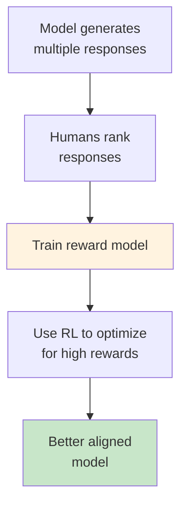

**Steps:**
1. Generate multiple outputs for same input
2. Humans rank outputs (best to worst)
3. Train reward model to predict human preferences
4. Use reinforcement learning to maximize reward

**Benefits:**
- More helpful responses
- Reduces harmful outputs
- Better follows intentions
- Improves consistency

---

## 4. Tokens and Embeddings

### What is a Token?

**Token:** Basic unit of text processed by LLMs

```python
# Example tokenization
text = "Hello, world!"
tokens = ["Hello", ",", " world", "!"]

# Or with subword tokens
tokens = ["Hel", "lo", ",", " world", "!"]
```

### Tokenization in Practice

**Different approaches:**

```mermaid
graph TB
    A[Input: "unhappiness"] --> B{Tokenization Method}
    
    B --> C[Word Level: unhappiness]
    B --> D[Subword: un + happi + ness]
    B --> E[Character: u+n+h+a+p+p+i+n+e+s+s]
    
    style D fill:#c8e6c9
```

**Most LLMs use:** Byte-Pair Encoding (BPE) or similar

**Why Subword?**
- Balance between vocabulary size and flexibility
- Handles rare words
- Better for multilingual models

### Token Counting

**Important for:**
- API pricing
- Context limits
- Performance

```python
import tiktoken

def count_tokens(text, model="gpt-4"):
    encoding = tiktoken.encoding_for_model(model)
    tokens = encoding.encode(text)
    return len(tokens)

# Examples
count_tokens("Hello world")  # ~2 tokens
count_tokens("Hello, how are you doing today?")  # ~7 tokens
count_tokens("The quick brown fox jumps")  # ~5 tokens
```

**Rules of Thumb:**
- 1 token ≈ 4 characters in English
- 1 token ≈ ¾ words
- 100 tokens ≈ 75 words

### Context Windows

**Context Window:** Maximum tokens model can process at once

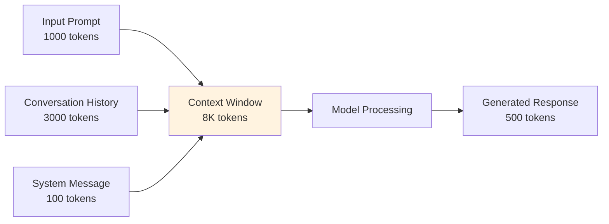

**Model Comparisons:**

| Model | Context Window | Practical Use |
|-------|----------------|---------------|
| GPT-3.5-turbo | 16K tokens | ~12K words |
| GPT-4 | 8K / 32K / 128K | Varies by version |
| Claude 3 | 200K tokens | ~150K words, entire books |
| Gemini Pro | 32K tokens | ~24K words |
| Llama 2 | 4K tokens | ~3K words |

**Managing Context:**
- Summarize long conversations
- Keep only relevant history
- Use sliding windows
- Implement memory systems

---

## 5. Model Comparison

### GPT Family (OpenAI)

**GPT-4:**
- Most capable general model
- Multimodal (text + images)
- Best reasoning abilities
- 128K context window

**GPT-3.5-turbo:**
- Fast and cost-effective
- Good for simple tasks
- 16K context window
- Great for high-volume applications

### Claude (Anthropic)

**Strengths:**
- Constitutional AI (safety-focused)
- 200K context window (longest)
- Strong at analysis and research
- Detailed, nuanced responses

**Use Cases:**
- Long document analysis
- Research synthesis
- Safe, responsible AI applications

### Gemini (Google)

**Gemini Ultra:**
- Multimodal (text, image, audio, video)
- Strong reasoning
- Integrated with Google services

**Gemini Pro:**
- Fast, efficient
- Good general performance
- Free tier available

### Open Source: Llama (Meta)

**Llama 2:**
- Fully open source
- 7B, 13B, 70B parameter versions
- Can be fine-tuned and deployed
- No API costs (just hosting)

**Advantages:**
- Full control and customization
- Data privacy
- No per-token costs
- Can run locally

**Trade-offs:**
- Requires infrastructure
- Generally less capable than GPT-4
- Need ML expertise to deploy

### Choosing a Model

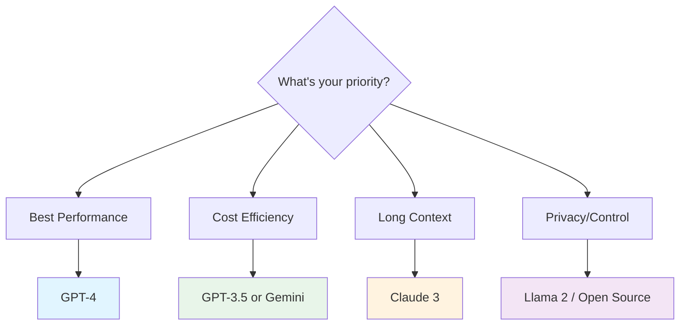

---

## 6. Limitations and Challenges

### Current Limitations

**1. Hallucinations**
- Generate plausible but incorrect information
- Confidently state false facts
- Difficult to fully eliminate

```python
# Example
prompt = "What is the capital of Atlantis?"
# May generate: "The capital of Atlantis is Poseidonia..."
# (Atlantis is mythical!)
```

**2. Knowledge Cutoff**
- Training data has a cutoff date
- No real-time information
- Can't know recent events

**3. Context Limitations**
- Even with large windows, can lose track
- Performance degrades with very long context
- May miss details in middle of long documents

**4. Reasoning Limitations**
- Can make logical errors
- Struggles with complex math
- May be inconsistent across attempts

**5. Lack of True Understanding**
- No real-world experience
- Pattern matching, not comprehension
- Can be easily confused

### Mitigation Strategies

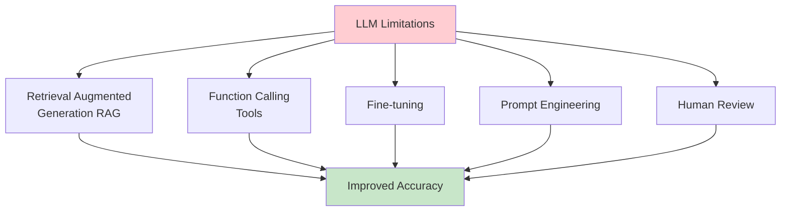

---

## 7. Summary

### Key Takeaways

1. **LLMs are transformer-based** neural networks with billions of parameters

2. **Self-attention is the key mechanism** allowing models to understand context

3. **Training involves three stages:** pre-training, fine-tuning, and RLHF

4. **Tokens are the basic units** of processing, important for pricing and limits

5. **Different models have different strengths** - choose based on your needs

6. **LLMs have limitations** but can be improved with proper techniques

### The Transformer Recipe

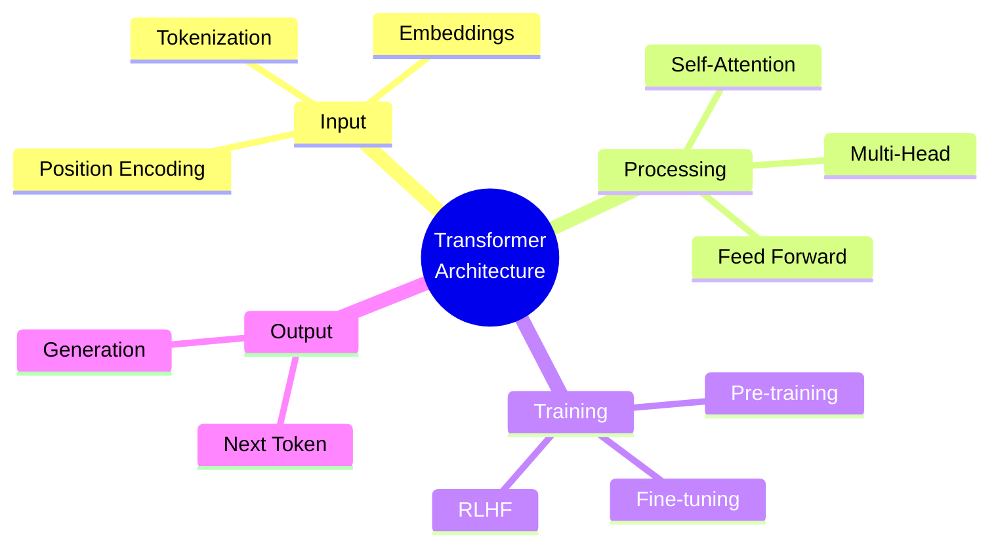

---

## 8. Further Reading

### Research Papers

- ["Attention Is All You Need"](https://arxiv.org/abs/1706.03762) - Original Transformer paper
- ["Language Models are Few-Shot Learners"](https://arxiv.org/abs/2005.14165) - GPT-3
- ["Training language models to follow instructions"](https://arxiv.org/abs/2203.02155) - InstructGPT

### Interactive Resources

- [The Illustrated Transformer](https://jalammar.github.io/illustrated-transformer/)
- [Transformer Explainer](https://poloclub.github.io/transformer-explainer/)
- [LLM Visualization](https://bbycroft.net/llm)

### Video Content

- [Andrej Karpathy: Let's build GPT](https://www.youtube.com/watch?v=kCc8FmEb1nY)
- [3Blue1Brown: Attention in transformers](https://www.youtube.com/watch?v=eMlx5fFNoYc)

---

## 🔗 Related Content

- **Previous:** [Lesson 1: What is Generative AI?](01-what-is-genai.md)
- **Next:** [Lesson 3: GenAI Applications](03-genai-applications.md)
- **Lab:** [Lab 1: First Steps with OpenAI API](../labs/lab-01-openai-basics.ipynb)

---

**Author:** Training Team  
**Last Updated:** October 27, 2025  
**Version:** 1.0  
**License:** Proprietary - Enterprise Training Materials
