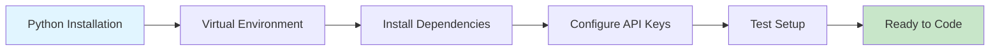
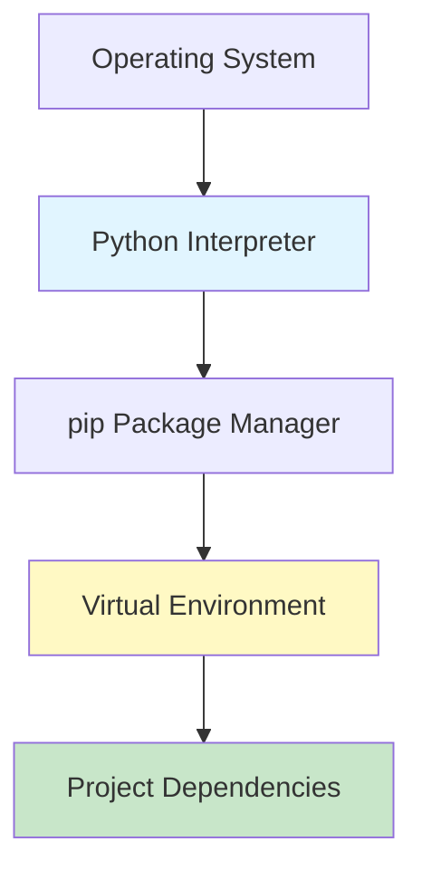
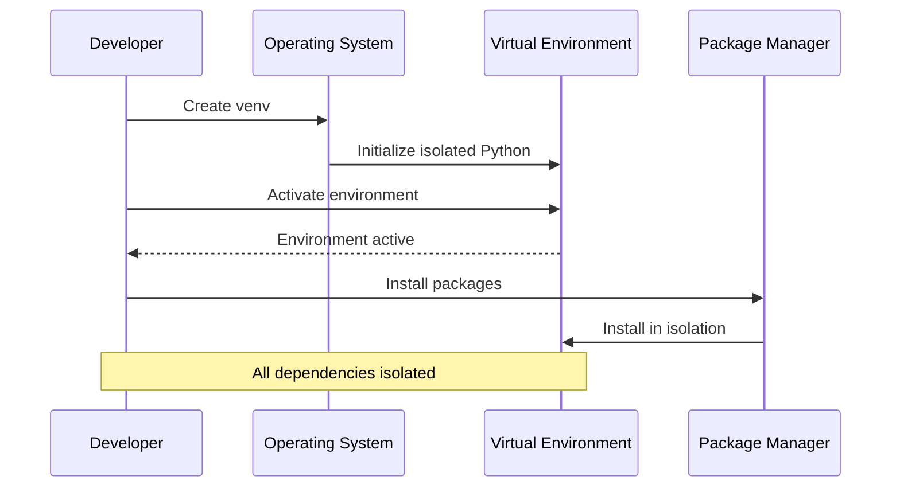
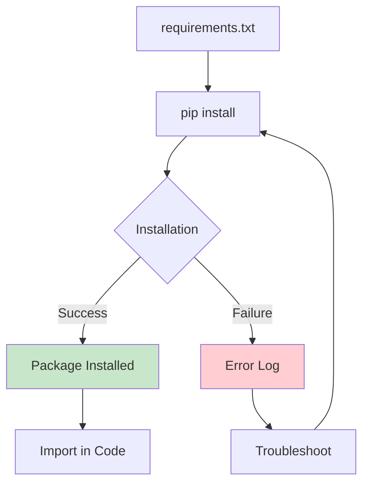
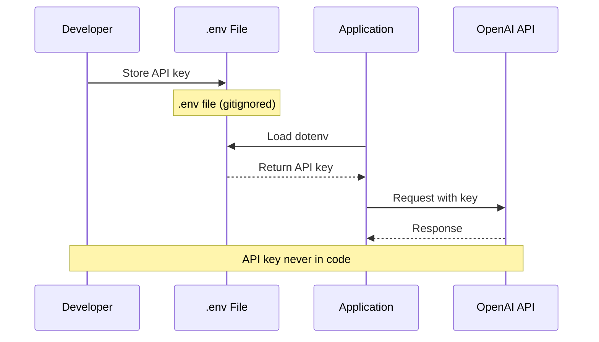
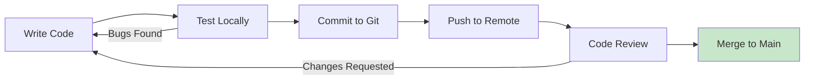

# Week 1 - Lesson 4: Development Setup

**Duration:** 60 minutes  
**Level:** Beginner  
**Prerequisites:** Basic Python knowledge, understanding of command line

---

## 🎯 Learning Objectives

By the end of this lesson, you will:
- [ ] Understand the development environment requirements for GenAI projects
- [ ] Be able to set up Python and virtual environments
- [ ] Apply API key management best practices
- [ ] Implement proper dependency management using pip and requirements.txt
- [ ] Configure development tools for efficient AI application development

---

## 📚 Table of Contents

1. [Introduction](#1-introduction)
2. [Python Environment Setup](#2-python-environment-setup)
3. [Virtual Environments](#3-virtual-environments)
4. [Installing Essential Libraries](#4-installing-essential-libraries)
5. [API Keys and Authentication](#5-api-keys-and-authentication)
6. [Development Tools](#6-development-tools)
7. [Making Your First API Call](#7-making-your-first-api-call)
8. [Troubleshooting](#8-troubleshooting)
9. [Summary](#9-summary)
10. [Further Reading](#10-further-reading)

---

## 1. Introduction

### What is Development Setup?

Development setup is the process of configuring your local machine with all necessary tools, libraries, and credentials to build and test GenAI applications efficiently. A proper setup ensures reproducibility, security, and productivity.

### Why Does It Matter?

- **Reproducibility**: Consistent environments across team members
- **Security**: Proper credential management prevents leaks
- **Efficiency**: Right tools make development faster
- **Debugging**: Proper setup makes troubleshooting easier

### Real-World Use Cases

1. **Team Collaboration**: Standardized setup ensures everyone works in the same environment
2. **Deployment**: Development setup mirrors production environment
3. **Testing**: Isolated environments prevent dependency conflicts

### Setup Overview



---

## 2. Python Environment Setup

### 2.1 Checking Python Installation

First, verify if Python is installed and check the version:

```bash
# Check Python version
python --version
# or
python3 --version

# Expected output: Python 3.9.x or higher
```

**Minimum Requirements:**
- Python 3.9 or higher
- pip (Python package installer)
- 4GB RAM minimum (8GB+ recommended)
- 5GB free disk space

### 2.2 Installing Python

#### macOS

**Option 1: Using Homebrew (Recommended)**
```bash
# Install Homebrew if not already installed
/bin/bash -c "$(curl -fsSL https://raw.githubusercontent.com/Homebrew/install/HEAD/install.sh)"

# Install Python
brew install python@3.11

# Verify installation
python3 --version
```

**Option 2: Official Installer**
- Download from [python.org](https://www.python.org/downloads/)
- Run the installer
- Check "Add Python to PATH"

#### Windows

**Option 1: Official Installer (Recommended)**
```powershell
# Download from python.org and run installer
# Important: Check "Add Python to PATH" during installation

# Verify installation
python --version
pip --version
```

**Option 2: Microsoft Store**
```powershell
# Search "Python 3.11" in Microsoft Store
# Click Install
```

#### Linux (Ubuntu/Debian)

```bash
# Update package list
sudo apt update

# Install Python 3.11
sudo apt install python3.11 python3.11-venv python3-pip

# Verify installation
python3 --version
pip3 --version
```

### 2.3 Verifying pip Installation

```bash
# Check pip version
pip --version
# or
pip3 --version

# Upgrade pip to latest version
pip install --upgrade pip
```

### System Architecture



---

## 3. Virtual Environments

### 3.1 Why Virtual Environments?

Virtual environments isolate project dependencies, preventing conflicts between different projects.

**Benefits:**
- 🔒 **Isolation**: Each project has its own dependencies
- 🔄 **Reproducibility**: Easy to recreate exact environment
- 🧪 **Testing**: Safe to experiment without breaking system
- 📦 **Deployment**: Clear list of required packages

### 3.2 Creating Virtual Environments

#### Using venv (Built-in)

```bash
# Navigate to your project directory
cd /path/to/your/project

# Create virtual environment
python -m venv genai-env

# Activate virtual environment

# macOS/Linux:
source genai-env/bin/activate

# Windows:
genai-env\Scripts\activate

# Your prompt should now show (genai-env)
```

#### Using conda (Alternative)

```bash
# Install Miniconda first: https://docs.conda.io/en/latest/miniconda.html

# Create environment with Python 3.11
conda create -n genai-env python=3.11

# Activate environment
conda activate genai-env
```

### 3.3 Virtual Environment Management

```python
"""
Virtual Environment Helper Script
Save as: setup_env.py
"""

import subprocess
import sys
import os
from pathlib import Path


def create_virtual_environment(env_name: str = "genai-env") -> bool:
    """
    Create a virtual environment.
    
    Args:
        env_name: Name of the virtual environment
        
    Returns:
        True if successful, False otherwise
    """
    try:
        print(f"Creating virtual environment: {env_name}")
        subprocess.run([sys.executable, "-m", "venv", env_name], check=True)
        print(f"✓ Virtual environment '{env_name}' created successfully")
        return True
    except subprocess.CalledProcessError as e:
        print(f"✗ Error creating virtual environment: {e}")
        return False


def get_activation_command(env_name: str = "genai-env") -> str:
    """
    Get the activation command for the current OS.
    
    Args:
        env_name: Name of the virtual environment
        
    Returns:
        Activation command string
    """
    if sys.platform == "win32":
        return f"{env_name}\\Scripts\\activate"
    else:
        return f"source {env_name}/bin/activate"


def check_virtual_env_active() -> bool:
    """Check if a virtual environment is currently active."""
    return hasattr(sys, 'real_prefix') or (
        hasattr(sys, 'base_prefix') and sys.base_prefix != sys.prefix
    )


# Usage
if __name__ == "__main__":
    print("GenAI Development Environment Setup")
    print("=" * 50)
    
    # Check if already in virtual environment
    if check_virtual_env_active():
        print("✓ Virtual environment is already active")
        print(f"  Location: {sys.prefix}")
    else:
        print("⚠ No virtual environment detected")
        create_env = input("Create new virtual environment? (y/n): ")
        
        if create_env.lower() == 'y':
            env_name = input("Environment name [genai-env]: ") or "genai-env"
            if create_virtual_environment(env_name):
                activation_cmd = get_activation_command(env_name)
                print(f"\nTo activate, run:")
                print(f"  {activation_cmd}")
```

### Virtual Environment Workflow



---

## 4. Installing Essential Libraries

### 4.1 Core Libraries for GenAI Development

Create a `requirements.txt` file:

```text
# requirements.txt
# Core OpenAI library
openai>=1.3.0

# Environment variable management
python-dotenv>=1.0.0

# Data manipulation
pandas>=2.0.0
numpy>=1.24.0

# HTTP requests (for API calls)
requests>=2.31.0

# Async support
aiohttp>=3.9.0

# Token counting
tiktoken>=0.5.0

# JSON handling
pydantic>=2.0.0

# Development tools
jupyter>=1.0.0
ipython>=8.12.0

# Testing
pytest>=7.4.0
pytest-asyncio>=0.21.0

# Code quality
black>=23.7.0
flake8>=6.1.0
mypy>=1.5.0
```

### 4.2 Installing Dependencies

```bash
# Make sure virtual environment is activated
# You should see (genai-env) in your prompt

# Install from requirements.txt
pip install -r requirements.txt

# Or install individually
pip install openai python-dotenv tiktoken jupyter

# Verify installation
pip list
```

### 4.3 Managing Dependencies

```python
"""
Dependency Management Helper
Save as: manage_dependencies.py
"""

import subprocess
import sys
from typing import List, Tuple


def install_package(package: str) -> bool:
    """
    Install a single package using pip.
    
    Args:
        package: Package name with optional version (e.g., 'openai>=1.3.0')
        
    Returns:
        True if successful, False otherwise
    """
    try:
        print(f"Installing {package}...")
        subprocess.run(
            [sys.executable, "-m", "pip", "install", package],
            check=True,
            capture_output=True,
            text=True
        )
        print(f"✓ {package} installed successfully")
        return True
    except subprocess.CalledProcessError as e:
        print(f"✗ Error installing {package}: {e.stderr}")
        return False


def install_from_requirements(file_path: str = "requirements.txt") -> Tuple[int, int]:
    """
    Install all packages from requirements file.
    
    Args:
        file_path: Path to requirements.txt
        
    Returns:
        Tuple of (successful_count, failed_count)
    """
    try:
        with open(file_path, 'r') as f:
            packages = [
                line.strip() 
                for line in f 
                if line.strip() and not line.startswith('#')
            ]
        
        successful = 0
        failed = 0
        
        for package in packages:
            if install_package(package):
                successful += 1
            else:
                failed += 1
        
        return successful, failed
        
    except FileNotFoundError:
        print(f"✗ Requirements file not found: {file_path}")
        return 0, 0


def check_installed_packages() -> List[str]:
    """
    Get list of installed packages.
    
    Returns:
        List of installed package names with versions
    """
    try:
        result = subprocess.run(
            [sys.executable, "-m", "pip", "list", "--format=freeze"],
            capture_output=True,
            text=True,
            check=True
        )
        return result.stdout.strip().split('\n')
    except subprocess.CalledProcessError:
        return []


def create_requirements_file(output_path: str = "requirements.txt") -> bool:
    """
    Generate requirements.txt from current environment.
    
    Args:
        output_path: Path to save requirements file
        
    Returns:
        True if successful
    """
    try:
        result = subprocess.run(
            [sys.executable, "-m", "pip", "freeze"],
            capture_output=True,
            text=True,
            check=True
        )
        
        with open(output_path, 'w') as f:
            f.write(result.stdout)
        
        print(f"✓ Requirements saved to {output_path}")
        return True
        
    except Exception as e:
        print(f"✗ Error creating requirements file: {e}")
        return False


# Usage
if __name__ == "__main__":
    print("Dependency Management Tool")
    print("=" * 50)
    
    # Check installed packages
    packages = check_installed_packages()
    print(f"\nCurrently installed: {len(packages)} packages")
    
    # Option to install from requirements
    install = input("\nInstall from requirements.txt? (y/n): ")
    if install.lower() == 'y':
        successful, failed = install_from_requirements()
        print(f"\n✓ Installed: {successful} packages")
        if failed > 0:
            print(f"✗ Failed: {failed} packages")
```

### Dependency Flow



---

## 5. API Keys and Authentication

### 5.1 Obtaining OpenAI API Key

1. **Create OpenAI Account**
   - Visit [platform.openai.com](https://platform.openai.com)
   - Sign up or log in

2. **Generate API Key**
   - Navigate to API Keys section
   - Click "Create new secret key"
   - Copy the key (you won't see it again!)

3. **Set Usage Limits** (Recommended)
   - Go to Billing settings
   - Set monthly spending limits
   - Add payment method

### 5.2 Secure API Key Management

**❌ NEVER do this:**
```python
# Bad: Hardcoding API key
api_key = "sk-proj-abc123..."  # NEVER DO THIS!
```

**✅ Best Practice: Using .env file**

Create a `.env` file in your project root:

```bash
# .env
OPENAI_API_KEY=sk-proj-your-actual-key-here
OPENAI_ORG_ID=org-your-org-id  # Optional
```

Add `.env` to `.gitignore`:

```bash
# .gitignore
.env
*.env
.env.local
venv/
genai-env/
__pycache__/
*.pyc
.DS_Store
```

### 5.3 Loading Environment Variables

```python
"""
Secure Configuration Management
Save as: config.py
"""

import os
from pathlib import Path
from typing import Optional
from dotenv import load_dotenv


class Config:
    """
    Application configuration management.
    
    Loads configuration from environment variables with validation.
    """
    
    def __init__(self, env_file: str = ".env"):
        """
        Initialize configuration.
        
        Args:
            env_file: Path to .env file
        """
        # Load environment variables from .env file
        env_path = Path(env_file)
        if env_path.exists():
            load_dotenv(env_path)
            print(f"✓ Loaded configuration from {env_file}")
        else:
            print(f"⚠ Warning: {env_file} not found, using environment variables")
        
        # Load and validate API key
        self.openai_api_key = self._get_required_env("OPENAI_API_KEY")
        self.openai_org_id = self._get_optional_env("OPENAI_ORG_ID")
        
        # Additional configuration
        self.environment = self._get_optional_env("ENVIRONMENT", "development")
        self.debug = self._get_optional_env("DEBUG", "False").lower() == "true"
    
    @staticmethod
    def _get_required_env(key: str) -> str:
        """
        Get required environment variable.
        
        Args:
            key: Environment variable name
            
        Returns:
            Environment variable value
            
        Raises:
            ValueError: If environment variable is not set
        """
        value = os.getenv(key)
        if not value:
            raise ValueError(
                f"Required environment variable '{key}' is not set. "
                f"Please add it to your .env file."
            )
        return value
    
    @staticmethod
    def _get_optional_env(key: str, default: str = "") -> str:
        """
        Get optional environment variable with default.
        
        Args:
            key: Environment variable name
            default: Default value if not set
            
        Returns:
            Environment variable value or default
        """
        return os.getenv(key, default)
    
    def validate(self) -> bool:
        """
        Validate configuration.
        
        Returns:
            True if configuration is valid
        """
        # Check API key format
        if not self.openai_api_key.startswith("sk-"):
            print("⚠ Warning: API key format looks incorrect")
            return False
        
        print("✓ Configuration validated successfully")
        return True
    
    def __repr__(self) -> str:
        """String representation (hiding sensitive data)."""
        masked_key = f"{self.openai_api_key[:10]}...{self.openai_api_key[-4:]}"
        return (
            f"Config(environment={self.environment}, "
            f"api_key={masked_key}, "
            f"debug={self.debug})"
        )


# Usage example
if __name__ == "__main__":
    try:
        config = Config()
        print(config)
        config.validate()
    except ValueError as e:
        print(f"✗ Configuration error: {e}")
```

### 5.4 Environment Configuration Template

Create a `.env.example` file for team sharing:

```bash
# .env.example
# Copy this file to .env and fill in your actual values

# OpenAI Configuration
OPENAI_API_KEY=sk-proj-your-key-here
OPENAI_ORG_ID=org-your-org-id

# Application Settings
ENVIRONMENT=development
DEBUG=True

# API Configuration
MAX_TOKENS=1000
TEMPERATURE=0.7
MODEL=gpt-3.5-turbo

# Optional: Other API Keys
ANTHROPIC_API_KEY=your-claude-key-here
```

### API Key Security Flow



---

## 6. Development Tools

### 6.1 Code Editors

**Recommended Options:**

1. **VS Code** (Most Popular)
   - Install: [code.visualstudio.com](https://code.visualstudio.com)
   - Extensions:
     - Python (Microsoft)
     - Pylance
     - Jupyter
     - GitLens
     - Python Docstring Generator

2. **PyCharm** (Professional IDE)
   - Community Edition (Free)
   - Professional Edition (Paid, more features)

3. **Jupyter Lab** (Interactive Development)
   ```bash
   pip install jupyterlab
   jupyter lab
   ```

### 6.2 Essential VS Code Extensions

```json
{
  "recommendations": [
    "ms-python.python",
    "ms-python.vscode-pylance",
    "ms-toolsai.jupyter",
    "ms-python.black-formatter",
    "ms-python.flake8",
    "eamodio.gitlens",
    "github.copilot"
  ]
}
```

### 6.3 Git Configuration

```bash
# Install Git
# macOS: brew install git
# Windows: Download from git-scm.com
# Linux: sudo apt install git

# Configure Git
git config --global user.name "Your Name"
git config --global user.email "your.email@example.com"

# Initialize repository
git init
git add .
git commit -m "Initial commit: Development environment setup"

# Create .gitignore
cat > .gitignore << EOF
.env
*.env
venv/
genai-env/
__pycache__/
*.pyc
.DS_Store
.vscode/
.idea/
*.log
EOF
```

### 6.4 Project Structure Template

```bash
# Create project structure
mkdir -p genai-project/{src,tests,notebooks,data,config,docs}
cd genai-project

# Create files
touch src/__init__.py
touch tests/__init__.py
touch config.py
touch README.md
touch requirements.txt
touch .env.example
touch .gitignore
```

**Recommended Structure:**
```
genai-project/
├── .env                    # Local environment variables (gitignored)
├── .env.example           # Template for environment variables
├── .gitignore             # Git ignore rules
├── requirements.txt       # Project dependencies
├── README.md              # Project documentation
├── config.py              # Configuration management
├── src/                   # Source code
│   ├── __init__.py
│   ├── main.py
│   └── utils.py
├── tests/                 # Unit tests
│   ├── __init__.py
│   └── test_main.py
├── notebooks/             # Jupyter notebooks
│   └── experiments.ipynb
├── data/                  # Data files (gitignored if large)
│   ├── raw/
│   └── processed/
├── config/                # Configuration files
│   └── prompts.json
└── docs/                  # Documentation
    └── api.md
```

### Development Workflow



---

## 7. Making Your First API Call

### 7.1 Basic OpenAI Client Setup

```python
"""
First OpenAI API Call
Save as: test_openai.py
"""

import os
from openai import OpenAI
from dotenv import load_dotenv

# Load environment variables
load_dotenv()

# Initialize client
client = OpenAI(api_key=os.getenv("OPENAI_API_KEY"))


def test_api_connection():
    """
    Test OpenAI API connection with a simple completion.
    
    Returns:
        Response from API or error message
    """
    try:
        print("Testing OpenAI API connection...")
        
        # Make a simple API call
        response = client.chat.completions.create(
            model="gpt-3.5-turbo",
            messages=[
                {"role": "system", "content": "You are a helpful assistant."},
                {"role": "user", "content": "Say 'Hello, World!' if you can hear me."}
            ],
            max_tokens=50
        )
        
        # Extract response
        message = response.choices[0].message.content
        
        print("✓ API connection successful!")
        print(f"Response: {message}")
        
        # Print usage information
        print(f"\nTokens used: {response.usage.total_tokens}")
        print(f"  - Prompt tokens: {response.usage.prompt_tokens}")
        print(f"  - Completion tokens: {response.usage.completion_tokens}")
        
        return message
        
    except Exception as e:
        print(f"✗ API connection failed: {e}")
        return None


def test_model_list():
    """List available models."""
    try:
        print("\nFetching available models...")
        models = client.models.list()
        
        # Filter for GPT models
        gpt_models = [m.id for m in models.data if 'gpt' in m.id.lower()]
        
        print(f"✓ Found {len(gpt_models)} GPT models:")
        for model in sorted(gpt_models)[:10]:  # Show first 10
            print(f"  - {model}")
        
        return gpt_models
        
    except Exception as e:
        print(f"✗ Error listing models: {e}")
        return []


# Run tests
if __name__ == "__main__":
    print("OpenAI API Test Suite")
    print("=" * 50)
    
    # Test 1: Basic connection
    test_api_connection()
    
    # Test 2: List models
    test_model_list()
    
    print("\n" + "=" * 50)
    print("Setup verification complete!")
```

### 7.2 Running the Test

```bash
# Activate virtual environment
source genai-env/bin/activate  # macOS/Linux
# or
genai-env\Scripts\activate  # Windows

# Run the test script
python test_openai.py
```

**Expected Output:**
```
OpenAI API Test Suite
==================================================
Testing OpenAI API connection...
✓ API connection successful!
Response: Hello, World!

Tokens used: 25
  - Prompt tokens: 20
  - Completion tokens: 5

Fetching available models...
✓ Found 8 GPT models:
  - gpt-3.5-turbo
  - gpt-3.5-turbo-16k
  - gpt-4
  - gpt-4-turbo-preview
  ...

==================================================
Setup verification complete!
```

### 7.3 Interactive Testing with Jupyter

```python
# In Jupyter notebook
# Cell 1: Setup
import os
from openai import OpenAI
from dotenv import load_dotenv

load_dotenv()
client = OpenAI(api_key=os.getenv("OPENAI_API_KEY"))

# Cell 2: Simple test
response = client.chat.completions.create(
    model="gpt-3.5-turbo",
    messages=[{"role": "user", "content": "What is 2+2?"}]
)

print(response.choices[0].message.content)

# Cell 3: Explore response object
print(f"Model: {response.model}")
print(f"Tokens: {response.usage.total_tokens}")
print(f"Finish reason: {response.choices[0].finish_reason}")
```

---

## 8. Troubleshooting

### 8.1 Common Issues and Solutions

#### Issue 1: "ModuleNotFoundError: No module named 'openai'"

**Problem:** OpenAI library not installed or wrong environment active

**Solution:**
```bash
# Make sure virtual environment is active
which python  # Should point to venv

# Install openai
pip install openai

# Verify installation
pip show openai
```

#### Issue 2: "AuthenticationError: Incorrect API key"

**Problem:** API key not set or incorrect

**Solution:**
```python
# Check if .env file exists
import os
from pathlib import Path

env_file = Path(".env")
if not env_file.exists():
    print("✗ .env file not found!")
    print("Create .env file with: OPENAI_API_KEY=your-key-here")
else:
    print("✓ .env file found")
    
# Check if key is loaded
from dotenv import load_dotenv
load_dotenv()

api_key = os.getenv("OPENAI_API_KEY")
if api_key:
    print(f"✓ API key loaded: {api_key[:10]}...")
else:
    print("✗ API key not found in environment")
```

#### Issue 3: "RateLimitError"

**Problem:** Too many requests to API

**Solution:**
```python
import time
from openai import OpenAI, RateLimitError

client = OpenAI()

def call_api_with_retry(prompt, max_retries=3):
    """Call API with exponential backoff."""
    for attempt in range(max_retries):
        try:
            response = client.chat.completions.create(
                model="gpt-3.5-turbo",
                messages=[{"role": "user", "content": prompt}]
            )
            return response
        except RateLimitError:
            if attempt < max_retries - 1:
                wait_time = 2 ** attempt  # Exponential backoff
                print(f"Rate limited. Waiting {wait_time}s...")
                time.sleep(wait_time)
            else:
                raise
```

#### Issue 4: Python Version Mismatch

**Problem:** Wrong Python version

**Solution:**
```bash
# Check version
python --version

# If wrong version, specify version when creating venv
python3.11 -m venv genai-env

# Or use pyenv to manage versions
# Install pyenv first, then:
pyenv install 3.11.0
pyenv local 3.11.0
```

### 8.2 Diagnostic Script

```python
"""
Environment Diagnostics
Save as: diagnose.py
"""

import sys
import os
import subprocess
from pathlib import Path


def check_python_version():
    """Check Python version."""
    version = sys.version_info
    print(f"Python Version: {version.major}.{version.minor}.{version.micro}")
    
    if version.major >= 3 and version.minor >= 9:
        print("✓ Python version is compatible")
        return True
    else:
        print("✗ Python 3.9+ required")
        return False


def check_virtual_env():
    """Check if virtual environment is active."""
    in_venv = hasattr(sys, 'real_prefix') or (
        hasattr(sys, 'base_prefix') and sys.base_prefix != sys.prefix
    )
    
    if in_venv:
        print(f"✓ Virtual environment active: {sys.prefix}")
        return True
    else:
        print("⚠ No virtual environment detected")
        return False


def check_package_installed(package_name):
    """Check if a package is installed."""
    try:
        __import__(package_name)
        print(f"✓ {package_name} is installed")
        return True
    except ImportError:
        print(f"✗ {package_name} is NOT installed")
        return False


def check_env_file():
    """Check if .env file exists."""
    env_path = Path(".env")
    if env_path.exists():
        print("✓ .env file found")
        return True
    else:
        print("✗ .env file not found")
        return False


def check_api_key():
    """Check if API key is set."""
    from dotenv import load_dotenv
    load_dotenv()
    
    api_key = os.getenv("OPENAI_API_KEY")
    if api_key:
        masked = f"{api_key[:10]}...{api_key[-4:]}"
        print(f"✓ API key found: {masked}")
        return True
    else:
        print("✗ API key not found")
        return False


def run_diagnostics():
    """Run all diagnostic checks."""
    print("=" * 50)
    print("Environment Diagnostics")
    print("=" * 50)
    
    checks = [
        ("Python Version", check_python_version),
        ("Virtual Environment", check_virtual_env),
        ("openai package", lambda: check_package_installed("openai")),
        ("dotenv package", lambda: check_package_installed("dotenv")),
        (".env file", check_env_file),
        ("API Key", check_api_key),
    ]
    
    results = []
    for name, check_func in checks:
        print(f"\n{name}:")
        try:
            result = check_func()
            results.append(result)
        except Exception as e:
            print(f"✗ Error: {e}")
            results.append(False)
    
    print("\n" + "=" * 50)
    passed = sum(results)
    total = len(results)
    print(f"Passed: {passed}/{total} checks")
    
    if passed == total:
        print("✓ Environment is properly configured!")
    else:
        print("⚠ Some issues found. Please fix them before proceeding.")


if __name__ == "__main__":
    run_diagnostics()
```

---

## 9. Summary

### Key Takeaways

1. **Python 3.9+** is required for modern GenAI development
2. **Virtual environments** isolate dependencies and prevent conflicts
3. **Secure API key management** using .env files is essential
4. **Proper project structure** makes development and collaboration easier
5. **Testing your setup** early prevents issues later

### Setup Checklist

- [ ] Python 3.9+ installed and verified
- [ ] Virtual environment created and activated
- [ ] Essential packages installed (openai, python-dotenv, etc.)
- [ ] .env file created with API key
- [ ] .gitignore configured to exclude sensitive files
- [ ] First API call successful
- [ ] Development tools configured (VS Code, Git)
- [ ] Project structure created

### Quick Reference

| Task | Command |
|------|---------|
| Create venv | `python -m venv genai-env` |
| Activate (macOS/Linux) | `source genai-env/bin/activate` |
| Activate (Windows) | `genai-env\Scripts\activate` |
| Install packages | `pip install -r requirements.txt` |
| Test API | `python test_openai.py` |
| Deactivate venv | `deactivate` |

### Next Steps

- [ ] Complete Lab 1: First Steps with OpenAI API
- [ ] Experiment with different models in Jupyter
- [ ] Set up your own project structure
- [ ] Join the OpenAI Developer Forum

---

## 10. Further Reading

### Official Documentation
- [Python Virtual Environments](https://docs.python.org/3/tutorial/venv.html) - Official Python docs
- [OpenAI Python Library](https://github.com/openai/openai-python) - GitHub repository
- [pip User Guide](https://pip.pypa.io/en/stable/user_guide/) - Package management

### Articles & Tutorials
- [Python Best Practices](https://docs.python-guide.org/) - The Hitchhiker's Guide to Python
- [Managing API Keys Securely](https://12factor.net/config) - The Twelve-Factor App methodology
- [Git Basics](https://git-scm.com/book/en/v2/Getting-Started-Git-Basics) - Pro Git book

### Tools & Resources
- [VS Code Python Tutorial](https://code.visualstudio.com/docs/python/python-tutorial)
- [Jupyter Documentation](https://jupyter.org/documentation)
- [pyenv](https://github.com/pyenv/pyenv) - Python version management

### Video Resources
- [Python Virtual Environments Explained](https://www.youtube.com/watch?v=APOPm01BVrk)
- [VS Code for Python Development](https://www.youtube.com/watch?v=7EXd4_ttIuw)

---

## 📝 Review Questions

Test your understanding:

1. Why should you use virtual environments instead of installing packages globally?
2. What's wrong with hardcoding API keys in your source code?
3. How do you check if a virtual environment is currently active?
4. What file should you use to share environment configuration templates with your team?
5. How do you verify that the OpenAI library is properly installed?

---

## 🔗 Related Content

- **Previous:** [Week 1 - Lesson 3: GenAI Applications](03-genai-applications.md)
- **Next:** [Week 1 - Lab 1: First Steps with OpenAI API](../labs/lab-01-first-steps-openai-api.ipynb)
- **Related Labs:** `labs/lab-01-first-steps-openai-api.ipynb`

---

**Author:** Training Team  
**Provided by:** ADC ENGINEERING & CONSULTING LTD  
**Last Updated:** November 2, 2025  
**Version:** 1.0
