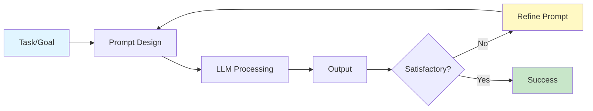
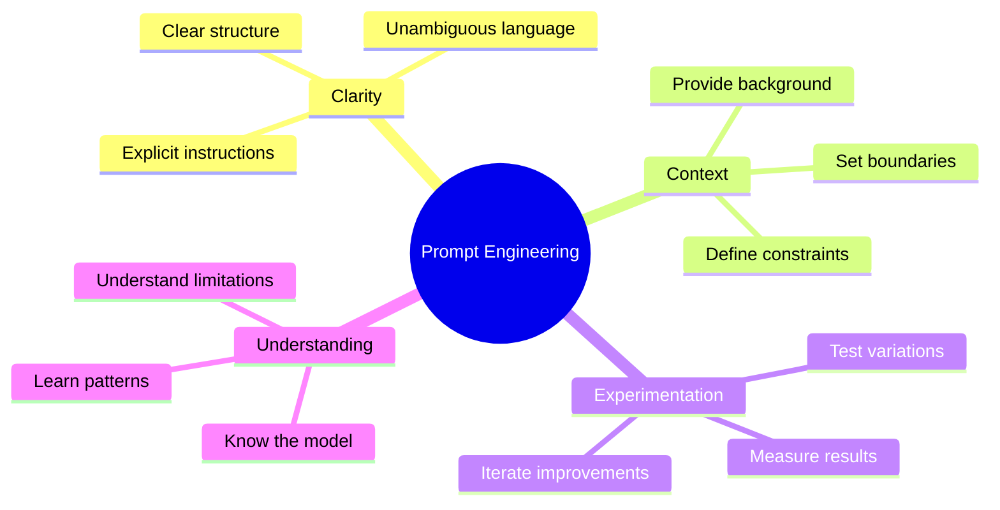
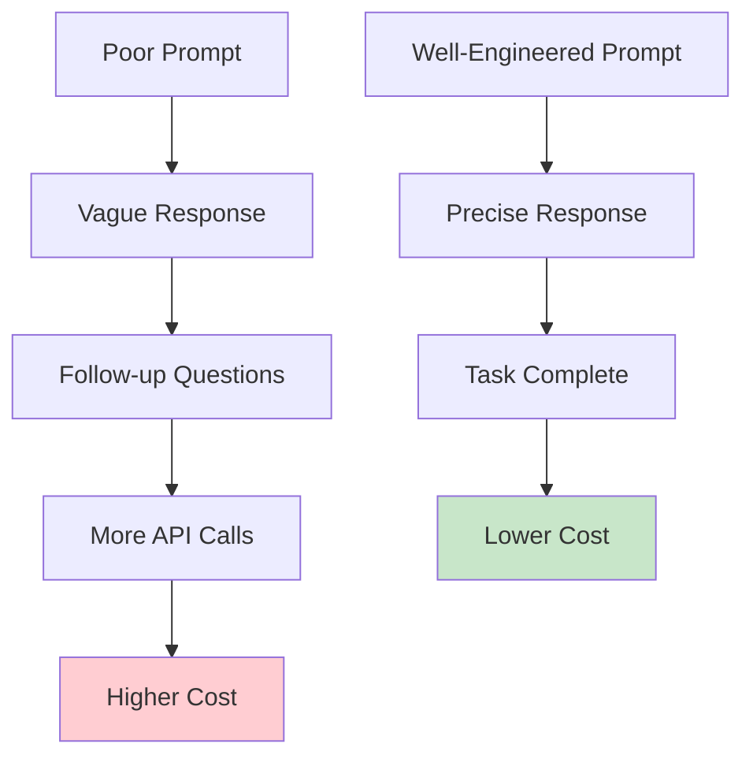
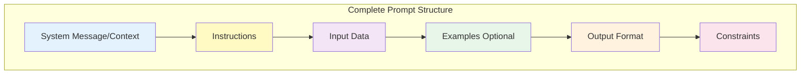
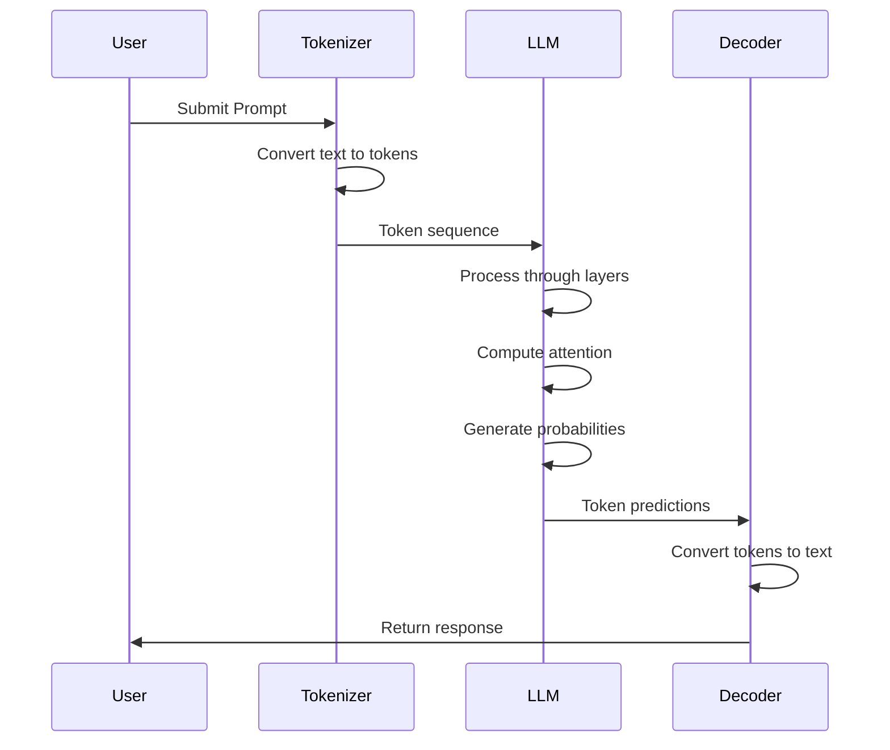
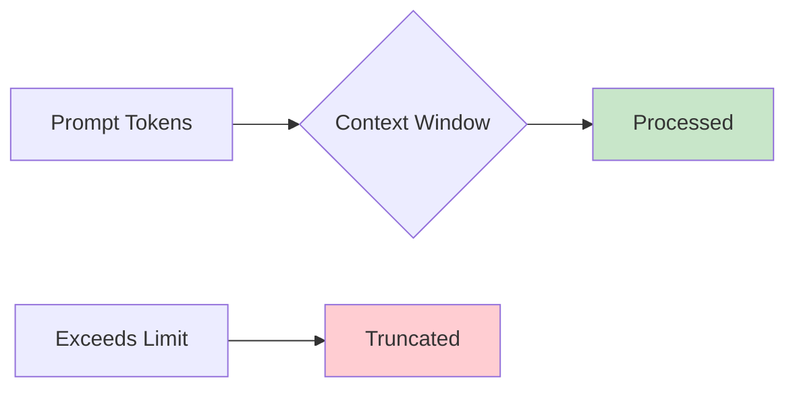
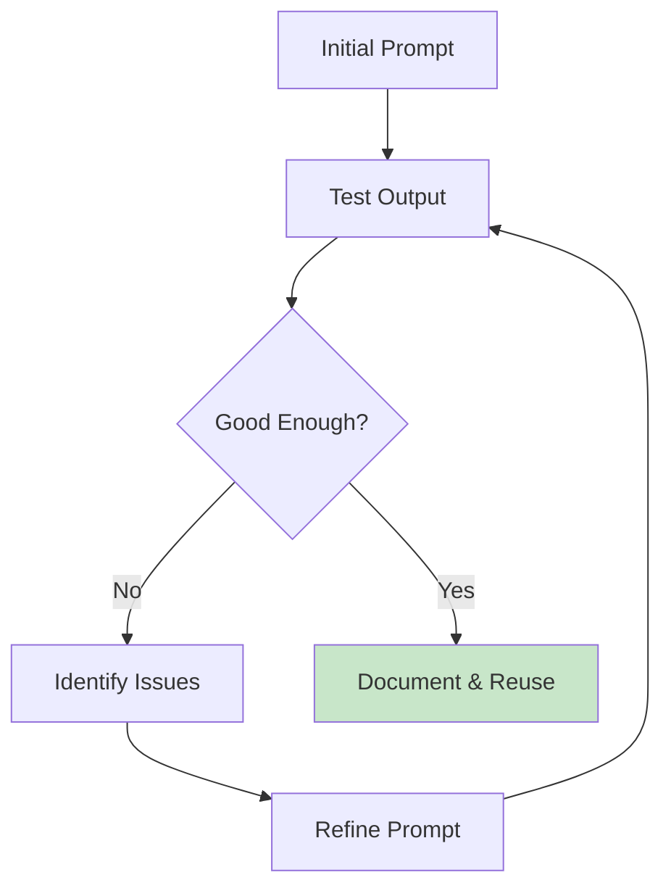
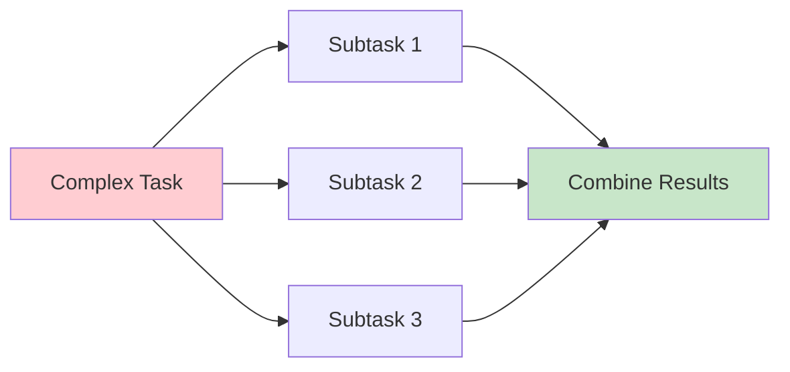
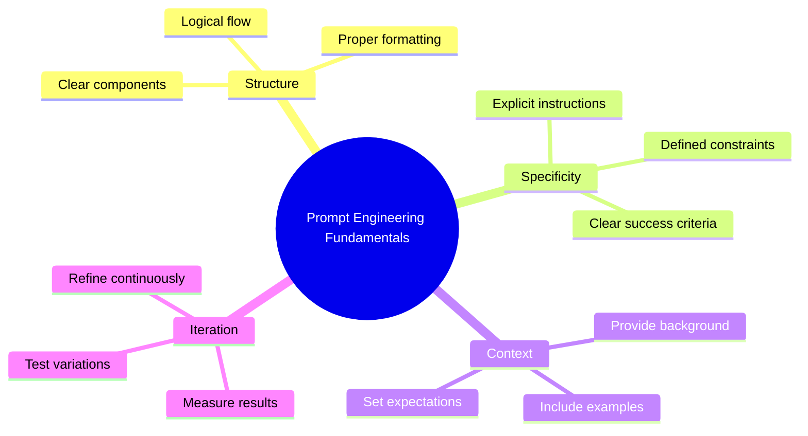

# Lesson 1: Introduction to Prompt Engineering

**Duration:** 90 minutes  
**Level:** Beginner to Intermediate

## Learning Objectives

By the end of this lesson, you will be able to:

- [ ] Define prompt engineering and explain its importance
- [ ] Identify the key components of an effective prompt
- [ ] Understand how LLMs interpret and respond to prompts
- [ ] Apply basic prompt optimization techniques
- [ ] Recognize common prompting pitfalls and how to avoid them

## Table of Contents

1. [What is Prompt Engineering?](#what-is-prompt-engineering)
2. [Why Prompt Engineering Matters](#why-prompt-engineering-matters)
3. [Anatomy of a Prompt](#anatomy-of-a-prompt)
4. [How LLMs Process Prompts](#how-llms-process-prompts)
5. [Basic Prompt Optimization](#basic-prompt-optimization)
6. [Common Pitfalls](#common-pitfalls)
7. [Hands-On Examples](#hands-on-examples)

---

## What is Prompt Engineering?

**Prompt Engineering** is the practice of designing and optimizing input text (prompts) to effectively communicate with Large Language Models to achieve desired outputs.



### Key Characteristics

**Art + Science:** Combines creativity with systematic testing and optimization

**Iterative Process:** Rarely perfect on the first try; requires refinement

**Context-Dependent:** What works for one model or task may not work for another

**Domain Knowledge:** Better prompts come from understanding both the subject matter and the LLM's capabilities

### The Prompt Engineering Mindset



---

## Why Prompt Engineering Matters

### 1. **Unlock Model Capabilities**

LLMs are incredibly powerful, but their capabilities must be accessed through well-designed prompts.

**Poor Prompt:**
```
tell me about AI
```

**Better Prompt:**
```
Explain artificial intelligence to a business executive who has no technical 
background. Focus on practical applications in enterprise settings and include 
3 specific examples from different industries. Keep the explanation under 300 words.
```

### 2. **Cost Efficiency**

Better prompts = fewer API calls = lower costs



### 3. **Consistency & Reliability**

Well-designed prompts produce more consistent and predictable outputs.

### 4. **Quality Control**

Proper prompting reduces hallucinations, biases, and off-topic responses.

### 5. **Competitive Advantage**

Organizations with strong prompt engineering capabilities can:
- Deploy AI solutions faster
- Achieve better results with the same models
- Reduce operational costs
- Deliver higher quality AI-powered products

---

## Anatomy of a Prompt

A well-structured prompt typically contains several key components:



### 1. System Message / Context

Sets the overall behavior and role for the AI.

```python
system_message = """
You are an expert Python developer with 10 years of experience in 
building production systems. You write clean, maintainable code and 
always include proper error handling and documentation.
"""
```

### 2. Instructions

Clear, specific directions about what you want the model to do.

**Components of Good Instructions:**
- Action verb (e.g., "Explain", "Summarize", "Create", "Analyze")
- Clear scope and boundaries
- Specific requirements
- Success criteria

```python
instructions = """
Analyze the following customer feedback and:
1. Identify the main issue or concern
2. Categorize the sentiment (positive, negative, neutral)
3. Suggest 2-3 actionable next steps for the support team
"""
```

### 3. Input Data

The actual content to be processed.

```python
input_data = """
Customer Feedback:
"I've been trying to reset my password for 3 days now. The reset link 
expires before I can even open it. This is extremely frustrating and 
is preventing me from accessing my account."
"""
```

### 4. Examples (Optional)

Demonstrations of the desired input-output pattern.

```python
examples = """
Example 1:
Input: "The product works great, but shipping took too long."
Output: Issue: Shipping delay | Sentiment: Mixed | Actions: Review logistics, 
expedite future orders, send courtesy email

Example 2:
Input: "Love the new features! The interface is much more intuitive."
Output: Issue: None (positive feedback) | Sentiment: Positive | Actions: Share 
with product team, request testimonial, thank customer
"""
```

### 5. Output Format

Specification of how the response should be structured.

```python
output_format = """
Format your response as:
Issue: [brief description]
Sentiment: [positive/negative/neutral]
Actions:
- [action 1]
- [action 2]
- [action 3]
"""
```

### 6. Constraints

Limitations and boundaries for the response.

```python
constraints = """
Constraints:
- Keep the issue description under 20 words
- Actions must be specific and actionable
- Use professional, empathetic language
- Do not speculate beyond the provided information
"""
```

### Complete Example

```python
from openai import OpenAI
client = OpenAI()

response = client.chat.completions.create(
    model="gpt-4",
    messages=[
        {
            "role": "system",
            "content": "You are a customer service analyst helping prioritize and categorize support tickets."
        },
        {
            "role": "user",
            "content": """
Analyze the following customer feedback and:
1. Identify the main issue or concern
2. Categorize the sentiment (positive, negative, neutral)
3. Suggest 2-3 actionable next steps for the support team

Customer Feedback:
"I've been trying to reset my password for 3 days now. The reset link 
expires before I can even open it. This is extremely frustrating and 
is preventing me from accessing my account."

Format your response as:
Issue: [brief description]
Sentiment: [positive/negative/neutral]
Actions:
- [action 1]
- [action 2]
- [action 3]

Constraints:
- Keep the issue description under 20 words
- Actions must be specific and actionable
- Use professional, empathetic language
"""
        }
    ],
    temperature=0.3
)

print(response.choices[0].message.content)
```

---

## How LLMs Process Prompts

Understanding how LLMs interpret prompts helps you write better ones.



### Key Concepts

#### 1. Tokenization

Prompts are broken into tokens before processing.

```python
import tiktoken

def analyze_prompt(text, model="gpt-4"):
    encoding = tiktoken.encoding_for_model(model)
    tokens = encoding.encode(text)
    
    print(f"Text length: {len(text)} characters")
    print(f"Token count: {len(tokens)} tokens")
    print(f"First 10 tokens: {tokens[:10]}")
    
    # Estimate cost (example rates)
    cost_per_1k = 0.03  # GPT-4 input cost
    estimated_cost = (len(tokens) / 1000) * cost_per_1k
    print(f"Estimated cost: ${estimated_cost:.4f}")

analyze_prompt("Explain machine learning in simple terms.")
```

#### 2. Context Window

The model can only "see" a limited number of tokens.



**Practical Implications:**
- Keep prompts concise when possible
- Prioritize most important information at the beginning
- Be aware of model-specific limits (e.g., GPT-4: 8K or 128K tokens)

#### 3. Attention Mechanism

The model focuses on relevant parts of the prompt.

**Best Practices:**
- Place critical instructions early and late in the prompt (primacy and recency effects)
- Use clear section breaks and formatting
- Repeat key requirements if necessary

#### 4. Probabilistic Generation

LLMs predict the most likely next token based on patterns learned during training.

```python
# Temperature affects randomness
response_deterministic = client.chat.completions.create(
    model="gpt-4",
    messages=[{"role": "user", "content": "What is 2+2?"}],
    temperature=0.0  # Most deterministic
)

response_creative = client.chat.completions.create(
    model="gpt-4",
    messages=[{"role": "user", "content": "Write a creative story opening."}],
    temperature=0.9  # More random/creative
)
```

---

## Basic Prompt Optimization

### Technique 1: Be Specific

**Vague:** "Write about dogs."

**Specific:** "Write a 200-word informative paragraph about Golden Retrievers, focusing on their temperament, exercise needs, and suitability as family pets."

### Technique 2: Provide Context

**Without Context:**
```
How do I fix this?
```

**With Context:**
```
I'm a beginner Python programmer. My script is throwing a "list index out of range" 
error when I try to access data[5], but I've checked and the list has 10 items. 
How do I debug this issue?
```

### Technique 3: Use Delimiters

Clearly separate different parts of your prompt.

```python
prompt = """
Task: Summarize the following article

Article:
\"\"\"
[article text here]
\"\"\"

Requirements:
- Maximum 3 sentences
- Focus on main findings
- Use bullet points

Format:
• [point 1]
• [point 2]
• [point 3]
"""
```

### Technique 4: Ask for Step-by-Step Reasoning

```python
prompt = """
Solve this problem step by step:

Problem: A store sells apples for $0.50 each and oranges for $0.75 each. 
If you have $10 and want to buy at least 5 apples, what's the maximum 
number of oranges you can buy?

Please show your reasoning at each step.
"""
```

### Technique 5: Specify Output Format

**Without Format:**
```
List programming languages.
```

**With Format:**
```
List 5 popular programming languages in this exact format:

Language: [name]
Primary Use: [description]
Difficulty: [Beginner/Intermediate/Advanced]

---
```

### Technique 6: Set the Right Temperature

```python
# For factual, consistent outputs
temperature = 0.0 to 0.3

# For balanced creativity and consistency
temperature = 0.5 to 0.7

# For creative, diverse outputs
temperature = 0.8 to 1.0
```

### Technique 7: Iterate and Refine



---

## Common Pitfalls

### Pitfall 1: Ambiguous Instructions

**Problem:**
```
Make it better.
```

**Solution:**
```
Improve the code by:
1. Adding error handling for file operations
2. Including docstrings for all functions
3. Optimizing the loop in the process_data() function
4. Adding type hints
```

### Pitfall 2: Overloading the Prompt

**Problem:** Trying to accomplish too many tasks in one prompt.

**Solution:** Break complex tasks into multiple, focused prompts.



### Pitfall 3: Assuming Too Much Context

**Problem:** Model doesn't have access to your screen, previous conversations (unless provided), or external information.

**Solution:** Include all necessary context explicitly.

### Pitfall 4: Ignoring Token Limits

**Problem:** Prompt + response exceeds model's context window.

**Solution:** Monitor token usage and trim content accordingly.

```python
import tiktoken

def check_token_count(text, model="gpt-4", max_tokens=8000):
    encoding = tiktoken.encoding_for_model(model)
    tokens = encoding.encode(text)
    
    if len(tokens) > max_tokens:
        print(f"⚠️  Warning: {len(tokens)} tokens exceeds limit of {max_tokens}")
        return False
    else:
        print(f"✓ Token count OK: {len(tokens)}/{max_tokens}")
        return True
```

### Pitfall 5: Not Testing Different Phrasings

**Problem:** Accepting the first result without exploring variations.

**Solution:** Test multiple versions and compare results.

```python
def test_prompt_variations(prompts, model="gpt-4"):
    """Test multiple prompt variations and compare results."""
    results = []
    
    for i, prompt in enumerate(prompts):
        response = client.chat.completions.create(
            model=model,
            messages=[{"role": "user", "content": prompt}],
            temperature=0.3
        )
        results.append({
            "prompt": prompt,
            "response": response.choices[0].message.content,
            "tokens": response.usage.total_tokens
        })
    
    return results
```

---

## Hands-On Examples

### Example 1: Information Extraction

**Task:** Extract structured data from unstructured text.

```python
from openai import OpenAI
import json

client = OpenAI()

prompt = """
Extract the following information from the text below and return it as JSON:
- Person's name
- Job title
- Company
- Email
- Phone number (if available)

Text:
\"\"\"
Hi, I'm Sarah Chen, Senior Data Scientist at TechCorp Industries. You can 
reach me at sarah.chen@techcorp.com or call me at (555) 123-4567 if you 
have any questions about our AI initiatives.
\"\"\"

Return only valid JSON, no additional text.
"""

response = client.chat.completions.create(
    model="gpt-4",
    messages=[{"role": "user", "content": prompt}],
    temperature=0.0
)

data = json.loads(response.choices[0].message.content)
print(json.dumps(data, indent=2))
```

### Example 2: Content Transformation

**Task:** Transform content style and format.

```python
prompt = """
Transform the following technical documentation into a beginner-friendly 
explanation suitable for a company blog post.

Original:
\"\"\"
The RESTful API implements OAuth 2.0 authentication with JWT tokens. Clients 
must include the bearer token in the Authorization header for all requests 
to protected endpoints. Token expiration is set to 3600 seconds.
\"\"\"

Requirements:
- Use simple language (explain technical terms)
- Keep it under 150 words
- Make it engaging and accessible
- Include a practical example
"""

response = client.chat.completions.create(
    model="gpt-4",
    messages=[{"role": "user", "content": prompt}],
    temperature=0.7
)

print(response.choices[0].message.content)
```

### Example 3: Classification

**Task:** Classify customer inquiries into categories.

```python
prompt = """
Classify the following customer message into one of these categories:
- BILLING
- TECHNICAL_SUPPORT
- PRODUCT_INQUIRY
- ACCOUNT_MANAGEMENT
- OTHER

Customer Message:
"I was charged twice for my last order. Can you help me get a refund for 
the duplicate charge?"

Respond with only the category name in uppercase.
"""

response = client.chat.completions.create(
    model="gpt-4",
    messages=[{"role": "user", "content": prompt}],
    temperature=0.0
)

category = response.choices[0].message.content.strip()
print(f"Category: {category}")
```

---

## Key Takeaways



### Best Practices Summary

1. **Be Explicit:** Don't assume the model knows what you want
2. **Provide Context:** Include all necessary background information
3. **Use Structure:** Organize prompts with clear sections
4. **Set Constraints:** Define boundaries and limitations
5. **Specify Format:** Tell the model exactly how to structure output
6. **Test and Iterate:** Continuously refine based on results
7. **Monitor Tokens:** Be aware of costs and context limits
8. **Document Success:** Save working prompts for reuse

---

## Practice Exercises

### Exercise 1: Prompt Improvement
Take this poor prompt and improve it using the techniques learned:
```
tell me about climate change
```

### Exercise 2: Structured Output
Write a prompt that extracts book information (title, author, genre, year) from natural language text and returns it as JSON.

### Exercise 3: Classification System
Design a prompt that classifies email urgency (High/Medium/Low) based on content and sender.

---

## Further Reading

- [OpenAI Prompt Engineering Guide](https://platform.openai.com/docs/guides/prompt-engineering)
- [Anthropic Prompt Engineering Documentation](https://docs.anthropic.com/claude/docs/prompt-engineering)
- "The Prompt Engineering Handbook" - Research compilation
- [Prompt Engineering Daily](https://www.promptingguide.ai/) - Community resources

---

## Repo Resources

- [Prompt Engineering Cheatsheet](../resources/prompt-cheatsheet.md)
- [Example Prompts (Copy & Adapt)](../resources/example-prompts.md)
- [References: Prompt Engineering & LLM Basics](../resources/references.md)
- [Tokenizer & Cost Tools](../resources/tokenizer-tools.md)
- [Reading List (Deep Dives)](../resources/reading-list.md)

---

## Review Questions

1. What are the six key components of a well-structured prompt?
2. Why is specificity important in prompt engineering?
3. How does temperature affect LLM outputs?
4. What is the difference between system messages and user messages?
5. Name three common prompting pitfalls and their solutions.
6. When should you use delimiters in your prompts?
7. How can you make prompts more cost-effective?
8. What role does iteration play in prompt engineering?

---

**Next Lesson:** [Zero-Shot and Few-Shot Learning](./02-zero-shot-and-few-shot-learning.md)

