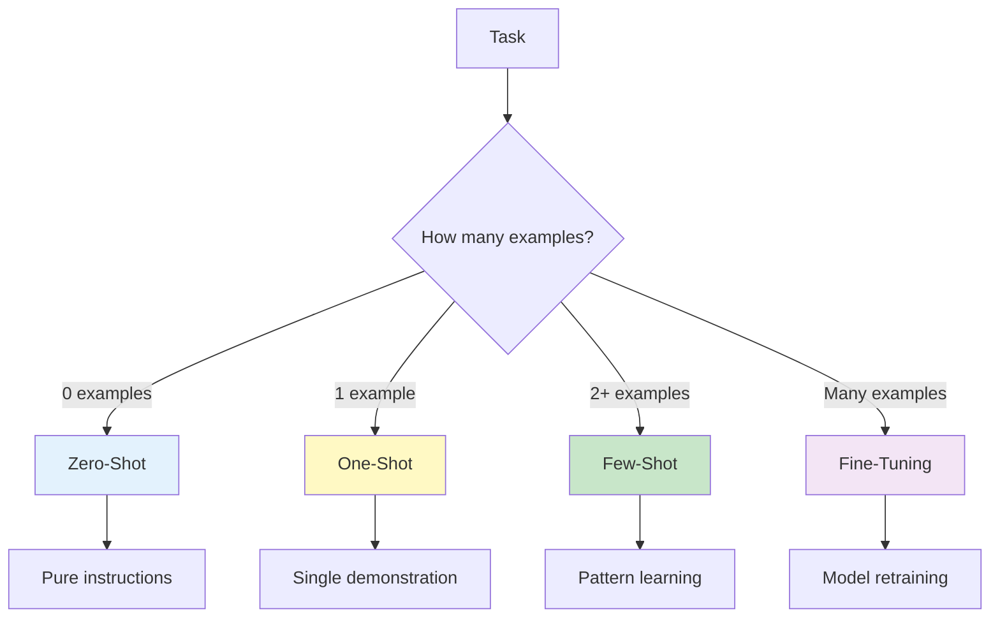
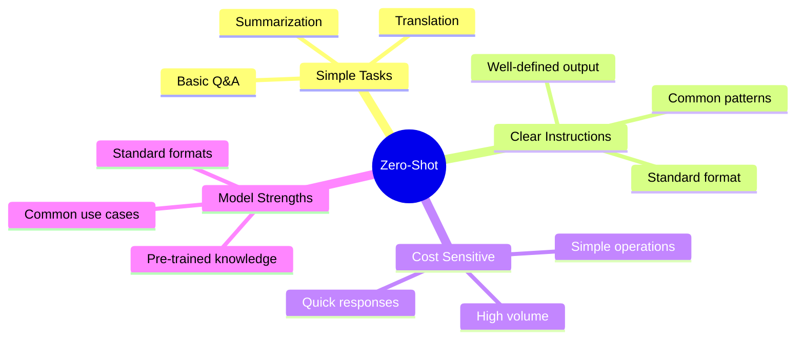
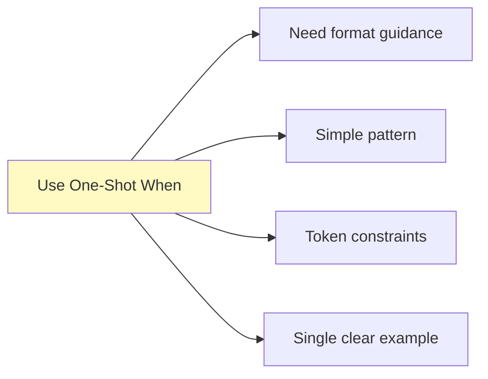
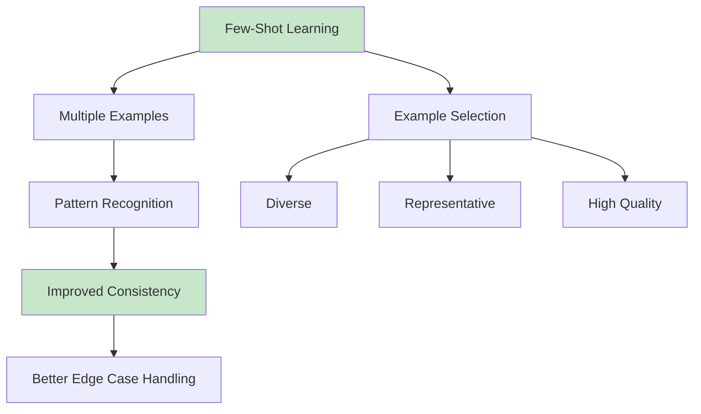
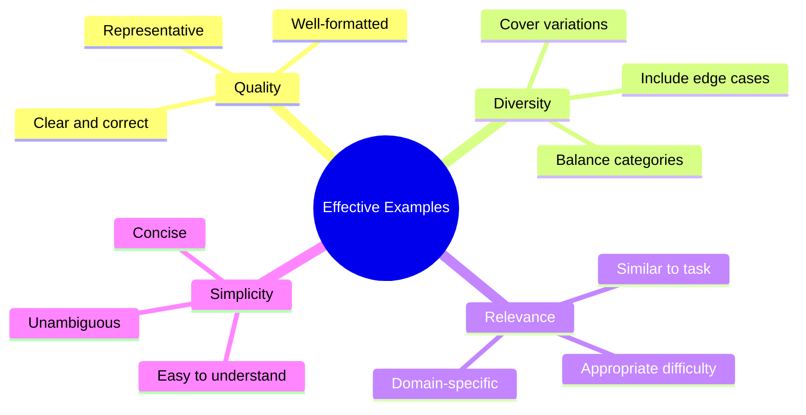
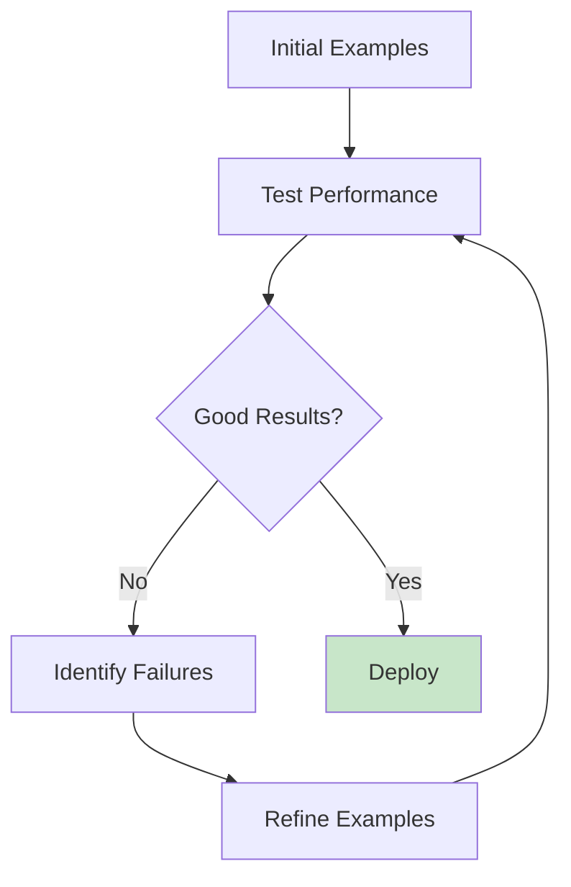
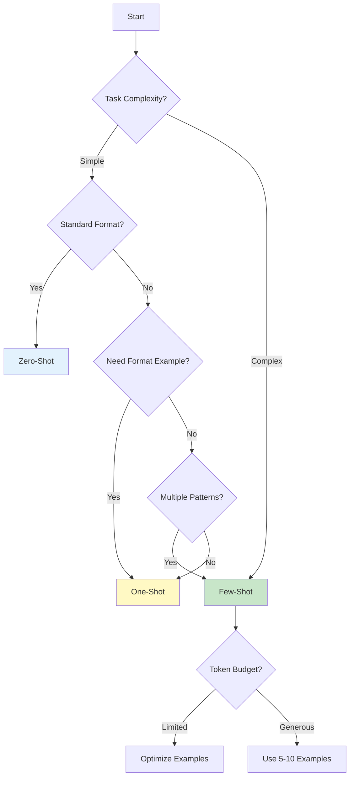

# Lesson 2: Zero-Shot and Few-Shot Learning

**Duration:** 90 minutes  
**Level:** Intermediate

## Learning Objectives

By the end of this lesson, you will be able to:

- [ ] Understand the concepts of zero-shot, one-shot, and few-shot learning
- [ ] Identify when to use each learning paradigm
- [ ] Design effective few-shot examples
- [ ] Apply few-shot learning to classification and generation tasks
- [ ] Evaluate and optimize few-shot prompt performance
- [ ] Understand the limitations and trade-offs of each approach

## Table of Contents

1. [Understanding Learning Paradigms](#understanding-learning-paradigms)
2. [Zero-Shot Learning](#zero-shot-learning)
3. [One-Shot Learning](#one-shot-learning)
4. [Few-Shot Learning](#few-shot-learning)
5. [Designing Effective Examples](#designing-effective-examples)
6. [Practical Applications](#practical-applications)
7. [Optimization Strategies](#optimization-strategies)

---

## Understanding Learning Paradigms

Large Language Models can perform tasks with varying amounts of training data provided in the prompt. This creates different "learning paradigms."



### Comparison Matrix

| Paradigm | Examples | Token Cost | Complexity | Best For |
|----------|----------|------------|------------|----------|
| **Zero-Shot** | 0 | Low | Simple | Well-defined, common tasks |
| **One-Shot** | 1 | Low-Medium | Medium | Tasks needing format guidance |
| **Few-Shot** | 2-10 | Medium-High | Medium | Pattern recognition, consistency |
| **Fine-Tuning** | 100+ | Training cost | High | Specialized, high-volume tasks |

---

## Zero-Shot Learning

Zero-shot learning means asking the model to perform a task without providing any examples.

### When to Use Zero-Shot



### Zero-Shot Examples

#### Example 1: Simple Translation

```python
from openai import OpenAI
client = OpenAI()

def zero_shot_translate(text, target_language):
    prompt = f"Translate the following text to {target_language}: {text}"
    
    response = client.chat.completions.create(
        model="gpt-4",
        messages=[{"role": "user", "content": prompt}],
        temperature=0.3
    )
    
    return response.choices[0].message.content

# Test
result = zero_shot_translate("Hello, how are you?", "Spanish")
print(result)  # "Hola, ¿cómo estás?"
```

#### Example 2: Sentiment Analysis

```python
def zero_shot_sentiment(text):
    prompt = f"""
Analyze the sentiment of the following text and respond with only one word: 
POSITIVE, NEGATIVE, or NEUTRAL.

Text: "{text}"
"""
    
    response = client.chat.completions.create(
        model="gpt-4",
        messages=[{"role": "user", "content": prompt}],
        temperature=0.0
    )
    
    return response.choices[0].message.content.strip()

# Test
print(zero_shot_sentiment("This product is amazing!"))  # POSITIVE
print(zero_shot_sentiment("Terrible experience, very disappointed."))  # NEGATIVE
```

#### Example 3: Information Extraction

```python
def zero_shot_extract_email(text):
    prompt = f"""
Extract the email address from the following text. 
If no email is found, respond with "NONE".

Text: "{text}"
"""
    
    response = client.chat.completions.create(
        model="gpt-4",
        messages=[{"role": "user", "content": prompt}],
        temperature=0.0
    )
    
    return response.choices[0].message.content.strip()

# Test
text = "Contact John at john.doe@company.com for more info"
print(zero_shot_extract_email(text))  # john.doe@company.com
```

### Advantages of Zero-Shot

✅ **Token Efficient:** Minimal prompt size  
✅ **Fast:** Less processing time  
✅ **Simple:** Easy to implement and maintain  
✅ **Flexible:** Works for many common tasks  

### Limitations of Zero-Shot

❌ **Inconsistent Format:** May not follow exact output structure  
❌ **Limited Patterns:** Can't learn custom formats or domain-specific patterns  
❌ **Variable Quality:** Performance varies with task complexity  
❌ **No Examples:** Can't show exactly what you want  

---

## One-Shot Learning

One-shot learning provides a single example to demonstrate the desired input-output pattern.

### When to Use One-Shot



### One-Shot Examples

#### Example 1: Custom Format

```python
def one_shot_format(product_name, price):
    prompt = f"""
Format product information in this style:

Example:
Input: Laptop, $999
Output: 🖥️ LAPTOP | Price: $999.00 | Status: Available

Now format this:
Input: {product_name}, ${price}
Output:
"""
    
    response = client.chat.completions.create(
        model="gpt-4",
        messages=[{"role": "user", "content": prompt}],
        temperature=0.0
    )
    
    return response.choices[0].message.content.strip()

# Test
print(one_shot_format("Keyboard", 79))
# 🎹 KEYBOARD | Price: $79.00 | Status: Available
```

#### Example 2: Custom Classification

```python
def one_shot_classify(text):
    prompt = f"""
Classify customer inquiries:

Example:
Input: "How do I reset my password?"
Output: TECHNICAL | Priority: MEDIUM | Department: IT Support

Now classify:
Input: "{text}"
Output:
"""
    
    response = client.chat.completions.create(
        model="gpt-4",
        messages=[{"role": "user", "content": prompt}],
        temperature=0.0
    )
    
    return response.choices[0].message.content.strip()

# Test
result = one_shot_classify("When will my order arrive?")
print(result)
# SHIPPING | Priority: LOW | Department: Logistics
```

### Advantages of One-Shot

✅ **Format Guidance:** Shows exact output structure  
✅ **Token Efficient:** Only one example needed  
✅ **Clear Expectations:** Demonstrates desired pattern  

### Limitations of One-Shot

❌ **Limited Pattern Learning:** One example may not cover variations  
❌ **Ambiguity:** Can't show edge cases or multiple patterns  
❌ **Consistency Issues:** May not handle diverse inputs well  

---

## Few-Shot Learning

Few-shot learning provides multiple examples (typically 2-10) to help the model learn patterns and consistency.



### When to Use Few-Shot

**Ideal For:**
- Custom classification schemes
- Domain-specific patterns
- Consistent formatting requirements
- Complex reasoning tasks
- Edge case handling
- Style matching

### Few-Shot Examples

#### Example 1: Custom Text Classification

```python
def few_shot_classify_email(text):
    prompt = f"""
Classify emails into categories based on these examples:

Example 1:
Input: "We need to schedule a meeting to discuss the Q4 budget."
Output: MEETING | Urgency: HIGH | Action Required: YES

Example 2:
Input: "FYI - The office will be closed next Monday for the holiday."
Output: ANNOUNCEMENT | Urgency: LOW | Action Required: NO

Example 3:
Input: "Please review and approve the attached proposal by EOD Friday."
Output: APPROVAL_REQUEST | Urgency: HIGH | Action Required: YES

Example 4:
Input: "Thanks for your help on the project! Great work everyone."
Output: ACKNOWLEDGMENT | Urgency: LOW | Action Required: NO

Now classify:
Input: "{text}"
Output:
"""
    
    response = client.chat.completions.create(
        model="gpt-4",
        messages=[{"role": "user", "content": prompt}],
        temperature=0.0
    )
    
    return response.choices[0].message.content.strip()

# Test
email = "Can someone update the client database before the demo tomorrow?"
print(few_shot_classify_email(email))
# REQUEST | Urgency: HIGH | Action Required: YES
```

#### Example 2: Structured Data Extraction

```python
def few_shot_extract_info(text):
    prompt = f"""
Extract information from product descriptions:

Example 1:
Input: "Sony WH-1000XM4 wireless headphones with 30hr battery - $349.99"
Output: {{"brand": "Sony", "model": "WH-1000XM4", "type": "wireless headphones", 
"battery": "30hr", "price": 349.99}}

Example 2:
Input: "Apple MacBook Pro 14-inch M3 chip with 16GB RAM - $1999"
Output: {{"brand": "Apple", "model": "MacBook Pro 14-inch", "type": "laptop", 
"processor": "M3", "ram": "16GB", "price": 1999.00}}

Example 3:
Input: "Samsung 55-inch QLED 4K Smart TV, 120Hz - $899"
Output: {{"brand": "Samsung", "model": "55-inch QLED", "type": "TV", 
"resolution": "4K", "refresh_rate": "120Hz", "price": 899.00}}

Now extract:
Input: "{text}"
Output:
"""
    
    response = client.chat.completions.create(
        model="gpt-4",
        messages=[{"role": "user", "content": prompt}],
        temperature=0.0
    )
    
    return response.choices[0].message.content.strip()

# Test
product = "Logitech MX Master 3S wireless mouse with 70-day battery - $99.99"
print(few_shot_extract_info(product))
```

#### Example 3: Style Matching

```python
def few_shot_style_matching(topic):
    prompt = f"""
Write product descriptions in this specific style:

Example 1:
Topic: Coffee Maker
Output: ☕ Brew perfection every morning | Smart temperature control keeps your 
coffee at optimal 195°F | 12-cup capacity for the whole family | Auto-shutoff 
for peace of mind

Example 2:
Topic: Running Shoes
Output: 🏃 Performance meets comfort | CloudFoam cushioning absorbs impact with 
every stride | Breathable mesh keeps feet cool for miles | Lightweight design 
at just 8oz

Example 3:
Topic: Desk Lamp
Output: 💡 Illuminate your workspace brilliantly | 5 brightness levels adapt 
to any task | USB charging port keeps devices powered | Adjustable arm reaches 
every corner

Now write for:
Topic: {topic}
Output:
"""
    
    response = client.chat.completions.create(
        model="gpt-4",
        messages=[{"role": "user", "content": prompt}],
        temperature=0.7
    )
    
    return response.choices[0].message.content.strip()

# Test
print(few_shot_style_matching("Wireless Earbuds"))
```

### Advanced Few-Shot: Dynamic Example Selection

```python
import numpy as np
from sklearn.metrics.pairwise import cosine_similarity

class FewShotPromptBuilder:
    def __init__(self, example_pool, num_examples=3):
        """
        Build few-shot prompts with dynamic example selection.
        
        Args:
            example_pool: List of (input, output) example tuples
            num_examples: Number of examples to include
        """
        self.example_pool = example_pool
        self.num_examples = num_examples
    
    def select_examples(self, query, method="random"):
        """
        Select examples using different strategies.
        
        Methods:
            - random: Randomly select examples
            - diverse: Select diverse examples
            - similar: Select examples similar to query (requires embeddings)
        """
        if method == "random":
            indices = np.random.choice(len(self.example_pool), 
                                      size=self.num_examples, 
                                      replace=False)
            return [self.example_pool[i] for i in indices]
        
        elif method == "diverse":
            # Select evenly spaced examples
            step = len(self.example_pool) // self.num_examples
            return self.example_pool[::step][:self.num_examples]
        
        # Add similarity-based selection if needed
        return self.example_pool[:self.num_examples]
    
    def build_prompt(self, query, task_description):
        """Build complete few-shot prompt."""
        examples = self.select_examples(query)
        
        prompt = f"{task_description}\n\n"
        
        for i, (input_text, output_text) in enumerate(examples, 1):
            prompt += f"Example {i}:\n"
            prompt += f"Input: {input_text}\n"
            prompt += f"Output: {output_text}\n\n"
        
        prompt += f"Now process:\nInput: {query}\nOutput:"
        
        return prompt

# Usage
examples = [
    ("Happy with the service!", "POSITIVE"),
    ("Terrible experience", "NEGATIVE"),
    ("It's okay, nothing special", "NEUTRAL"),
    ("Love it! Highly recommend", "POSITIVE"),
    ("Not what I expected", "NEGATIVE"),
]

builder = FewShotPromptBuilder(examples, num_examples=3)
prompt = builder.build_prompt(
    "This product exceeded my expectations",
    "Classify sentiment as POSITIVE, NEGATIVE, or NEUTRAL:"
)
print(prompt)
```

---

## Designing Effective Examples

### Principles of Good Examples



### 1. **Diversity is Key**

Include examples that cover different scenarios:

```python
# ❌ Poor: All similar examples
examples_poor = [
    ("The product is great!", "POSITIVE"),
    ("I love this item!", "POSITIVE"),
    ("Amazing quality!", "POSITIVE"),
]

# ✅ Good: Diverse examples
examples_good = [
    ("The product is great!", "POSITIVE"),
    ("Terrible quality, very disappointed", "NEGATIVE"),
    ("It's okay, nothing special", "NEUTRAL"),
    ("Love it! But shipping was slow", "MIXED"),
]
```

### 2. **Quality Over Quantity**

3-5 high-quality examples usually outperform 10+ mediocre ones.

```python
def evaluate_example_quality(example_input, example_output):
    """
    Checklist for example quality:
    1. Is the input realistic?
    2. Is the output correct and consistent?
    3. Is the format clear and unambiguous?
    4. Does it demonstrate the desired pattern?
    """
    criteria = {
        "realistic": True,  # Looks like real data
        "correct": True,    # Output is accurate
        "clear": True,      # Format is obvious
        "demonstrative": True  # Shows the pattern well
    }
    return all(criteria.values())
```

### 3. **Balanced Representation**

For classification tasks, balance classes:

```python
# ❌ Imbalanced
imbalanced = [
    ("text1", "CLASS_A"),
    ("text2", "CLASS_A"),
    ("text3", "CLASS_A"),
    ("text4", "CLASS_B"),  # Only 1 example
]

# ✅ Balanced
balanced = [
    ("text1", "CLASS_A"),
    ("text2", "CLASS_A"),
    ("text3", "CLASS_B"),
    ("text4", "CLASS_B"),
]
```

### 4. **Include Edge Cases**

Show how to handle unusual inputs:

```python
examples_with_edge_cases = [
    # Normal cases
    ("Great product!", "POSITIVE"),
    ("Poor quality", "NEGATIVE"),
    
    # Edge cases
    ("I love it but it broke after 1 day", "MIXED"),
    ("???", "UNCLEAR"),
    ("", "NO_INPUT"),
]
```

### 5. **Consistent Formatting**

Keep format identical across all examples:

```python
# ✅ Consistent
def format_example(input_text, output_text):
    return f"""
Input: {input_text}
Output: {output_text}
""".strip()

# All examples use the same format
example1 = format_example("Hello", "GREETING")
example2 = format_example("Goodbye", "FAREWELL")
```

---

## Practical Applications

### Application 1: Few-Shot Text Classification

```python
class FewShotClassifier:
    def __init__(self, examples, categories):
        """
        Few-shot text classifier.
        
        Args:
            examples: List of (text, category) tuples
            categories: List of valid categories
        """
        self.examples = examples
        self.categories = categories
        self.client = OpenAI()
    
    def classify(self, text):
        """Classify text using few-shot learning."""
        # Build prompt with examples
        prompt = "Classify text into these categories: " + ", ".join(self.categories) + "\n\n"
        
        for input_text, category in self.examples:
            prompt += f'Text: "{input_text}"\nCategory: {category}\n\n'
        
        prompt += f'Text: "{text}"\nCategory:'
        
        response = self.client.chat.completions.create(
            model="gpt-4",
            messages=[{"role": "user", "content": prompt}],
            temperature=0.0
        )
        
        return response.choices[0].message.content.strip()

# Usage
examples = [
    ("How do I reset my password?", "TECHNICAL"),
    ("What's the status of my order?", "SHIPPING"),
    ("I want to cancel my subscription", "BILLING"),
    ("Your product is amazing!", "FEEDBACK"),
]

classifier = FewShotClassifier(
    examples=examples,
    categories=["TECHNICAL", "SHIPPING", "BILLING", "FEEDBACK"]
)

result = classifier.classify("The app keeps crashing on my phone")
print(result)  # TECHNICAL
```

### Application 2: Few-Shot Data Transformation

```python
def few_shot_transform():
    """Transform data format using few-shot learning."""
    prompt = """
Transform customer data from text to structured JSON:

Example 1:
Input: "John Smith, age 35, lives in NYC, email: john@email.com"
Output: {"name": "John Smith", "age": 35, "city": "NYC", "email": "john@email.com"}

Example 2:
Input: "Sarah Johnson, 28 years old, Boston resident, sarah.j@company.com"
Output: {"name": "Sarah Johnson", "age": 28, "city": "Boston", "email": "sarah.j@company.com"}

Example 3:
Input: "Mike Chen (age: 42) from Seattle, contact: mike.chen@tech.com"
Output: {"name": "Mike Chen", "age": 42, "city": "Seattle", "email": "mike.chen@tech.com"}

Now transform:
Input: "Emma Wilson, 31, lives in Chicago, email is emma.w@gmail.com"
Output:
"""
    
    response = client.chat.completions.create(
        model="gpt-4",
        messages=[{"role": "user", "content": prompt}],
        temperature=0.0
    )
    
    return response.choices[0].message.content

result = few_shot_transform()
print(result)
```

### Application 3: Few-Shot Content Generation

```python
def few_shot_generate_title(article_text):
    """Generate article titles using few-shot learning."""
    prompt = """
Generate engaging article titles:

Example 1:
Article: "Recent studies show that regular exercise can improve cognitive 
function and reduce the risk of dementia in older adults..."
Title: "How Daily Exercise Can Boost Your Brain Health After 50"

Example 2:
Article: "The latest smartphone features AI-powered cameras that automatically 
adjust settings based on the scene..."
Title: "AI Camera Technology: Why Your Next Phone Will Be Smarter Than Ever"

Example 3:
Article: "Companies are increasingly adopting remote work policies, leading to 
changes in office space design and employee productivity..."
Title: "The Remote Work Revolution: How It's Reshaping Modern Offices"

Now generate:
Article: "{article_text}"
Title:
"""
    
    response = client.chat.completions.create(
        model="gpt-4",
        messages=[{"role": "user", "content": prompt}],
        temperature=0.7
    )
    
    return response.choices[0].message.content.strip()

# Test
article = """
Climate scientists have developed a new model that predicts weather patterns 
with unprecedented accuracy, potentially revolutionizing disaster preparedness.
"""
print(few_shot_generate_title(article))
```

---

## Optimization Strategies

### Strategy 1: Iterative Example Refinement



### Strategy 2: A/B Testing Different Example Sets

```python
def compare_example_sets(query, example_sets):
    """Compare performance of different example sets."""
    results = []
    
    for name, examples in example_sets.items():
        prompt = build_few_shot_prompt(query, examples)
        
        response = client.chat.completions.create(
            model="gpt-4",
            messages=[{"role": "user", "content": prompt}],
            temperature=0.0
        )
        
        results.append({
            "set_name": name,
            "result": response.choices[0].message.content,
            "tokens": response.usage.total_tokens
        })
    
    return results

# Usage
example_sets = {
    "set_a": [("ex1", "out1"), ("ex2", "out2")],
    "set_b": [("ex3", "out3"), ("ex4", "out4")],
}

comparison = compare_example_sets("test query", example_sets)
```

### Strategy 3: Token Optimization

```python
import tiktoken

def optimize_example_count(query, examples, max_tokens=4000):
    """Find optimal number of examples within token limit."""
    encoding = tiktoken.encoding_for_model("gpt-4")
    
    # Start with all examples
    for num_examples in range(len(examples), 0, -1):
        prompt = build_few_shot_prompt(query, examples[:num_examples])
        tokens = len(encoding.encode(prompt))
        
        if tokens <= max_tokens:
            return num_examples, tokens
    
    return 0, 0

# Usage
optimal_count, token_count = optimize_example_count(
    query="test",
    examples=large_example_list,
    max_tokens=4000
)
print(f"Use {optimal_count} examples ({token_count} tokens)")
```

### Strategy 4: Example Selection Based on Query

```python
def select_relevant_examples(query, example_pool, num_examples=3):
    """
    Select examples most relevant to the query.
    This is a simplified version - production systems would use
    embedding similarity.
    """
    # For demonstration, selecting based on keyword overlap
    def calculate_relevance(example, query):
        example_words = set(example[0].lower().split())
        query_words = set(query.lower().split())
        overlap = len(example_words & query_words)
        return overlap
    
    # Score and sort examples
    scored_examples = [
        (calculate_relevance(ex, query), ex) 
        for ex in example_pool
    ]
    scored_examples.sort(reverse=True, key=lambda x: x[0])
    
    # Return top N
    return [ex for score, ex in scored_examples[:num_examples]]
```

---

## Decision Framework

Use this flowchart to choose the right approach:



---

## Key Takeaways

### Comparison Summary

| Aspect | Zero-Shot | One-Shot | Few-Shot |
|--------|-----------|----------|----------|
| **Setup Time** | Minimal | Low | Medium |
| **Token Cost** | Lowest | Low | Higher |
| **Consistency** | Variable | Better | Best |
| **Flexibility** | High | Medium | Lower |
| **Learning Curve** | Easy | Easy | Medium |
| **Best Use Case** | Simple, common tasks | Format guidance | Pattern learning |

### Best Practices

1. **Start Simple:** Try zero-shot first, add examples if needed
2. **Quality Examples:** 3 great examples > 10 mediocre ones
3. **Diversity Matters:** Cover different scenarios and edge cases
4. **Test and Iterate:** Continuously evaluate and refine examples
5. **Monitor Tokens:** Balance example count with cost
6. **Document Success:** Save working example sets for reuse

---

## Practice Exercises

### Exercise 1: Zero to Few-Shot
Start with a zero-shot prompt for email classification. Add examples iteratively and measure improvement.

### Exercise 2: Example Design
Create a few-shot prompt for extracting restaurant information (name, cuisine, price range, rating) from reviews.

### Exercise 3: Optimization Challenge
Given 20 examples, select the optimal 5 for a sentiment classification task.

---

## Further Reading

- "Language Models are Few-Shot Learners" (GPT-3 paper)
- "Chain-of-Thought Prompting Elicits Reasoning in Large Language Models"
- OpenAI Few-Shot Learning Guide
- Prompt Engineering Best Practices

---

## Repo Resources

- [Prompt Engineering Cheatsheet](../resources/prompt-cheatsheet.md)
- [Example Prompts (Copy & Adapt)](../resources/example-prompts.md)
- [References: Prompt Engineering & LLM Basics](../resources/references.md)
- [Tokenizer & Cost Tools](../resources/tokenizer-tools.md)
- [Reading List (Deep Dives)](../resources/reading-list.md)

---

## Review Questions

1. What is the key difference between zero-shot and few-shot learning?
2. When should you use one-shot learning over few-shot?
3. What makes a good few-shot example?
4. How many examples are typically optimal for few-shot prompting?
5. How can you balance token cost with few-shot performance?
6. What are the trade-offs between zero-shot and few-shot approaches?

---

**Next Lesson:** [Advanced Prompting Techniques](./03-advanced-prompting-techniques.md)

