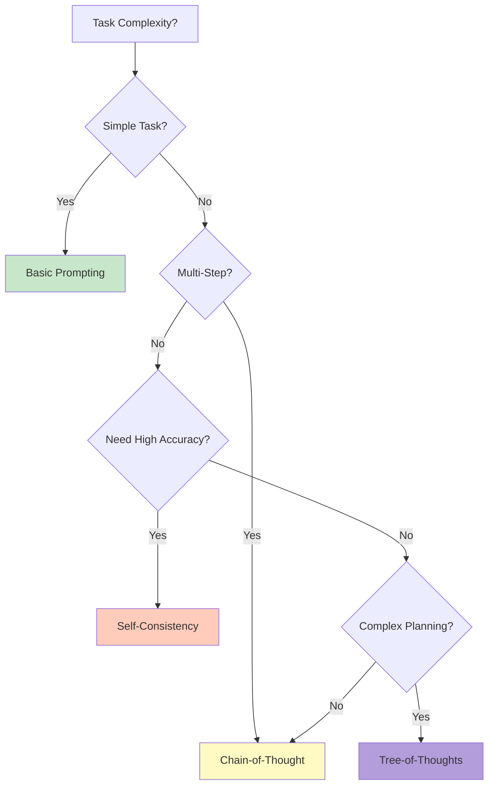
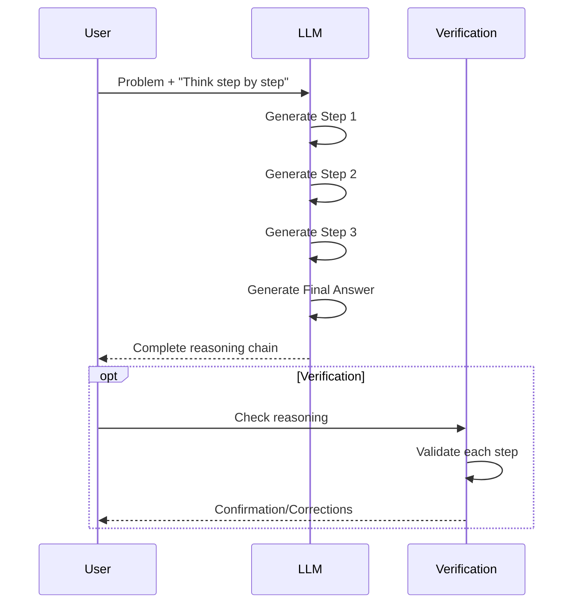
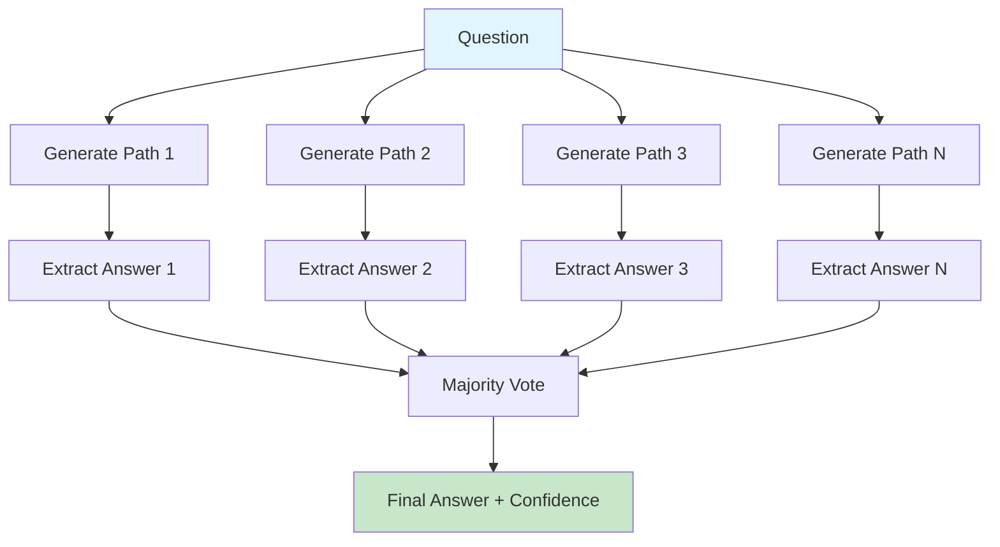
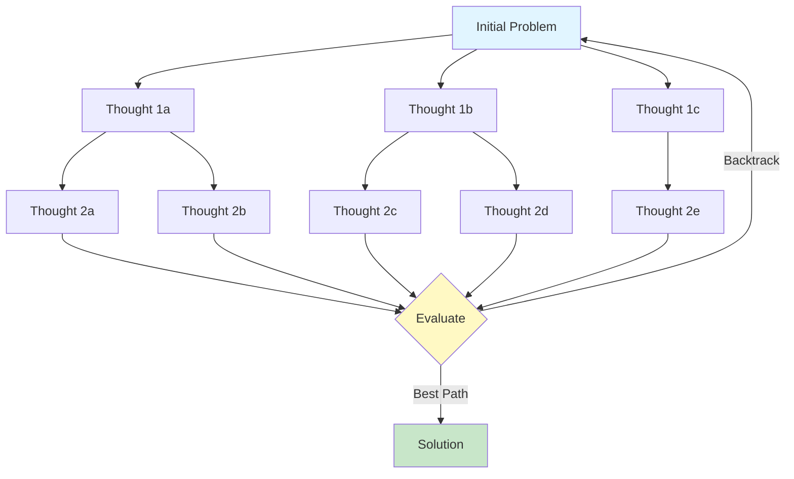
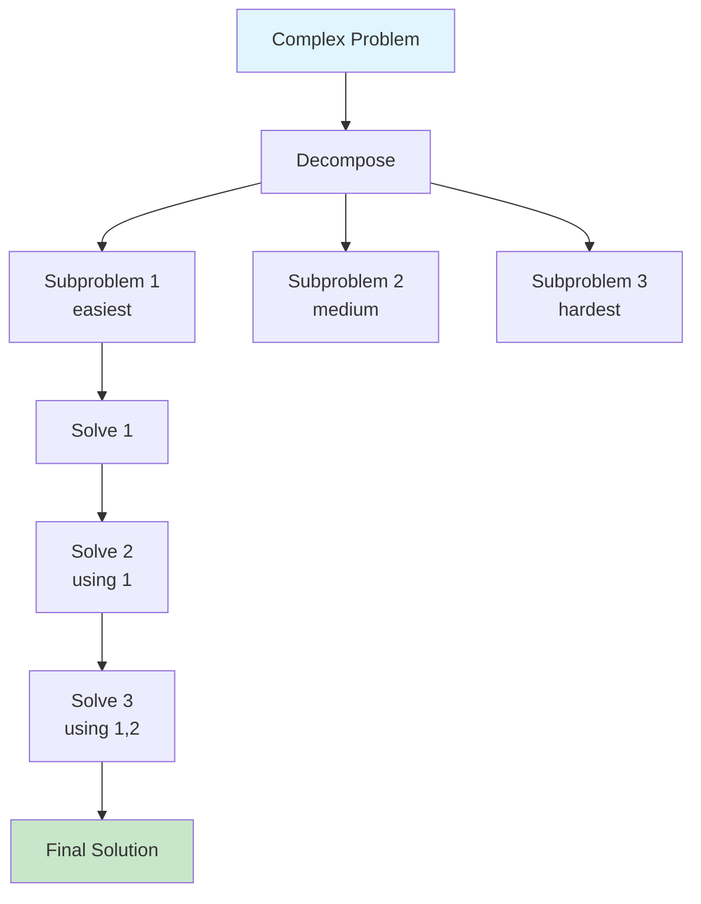
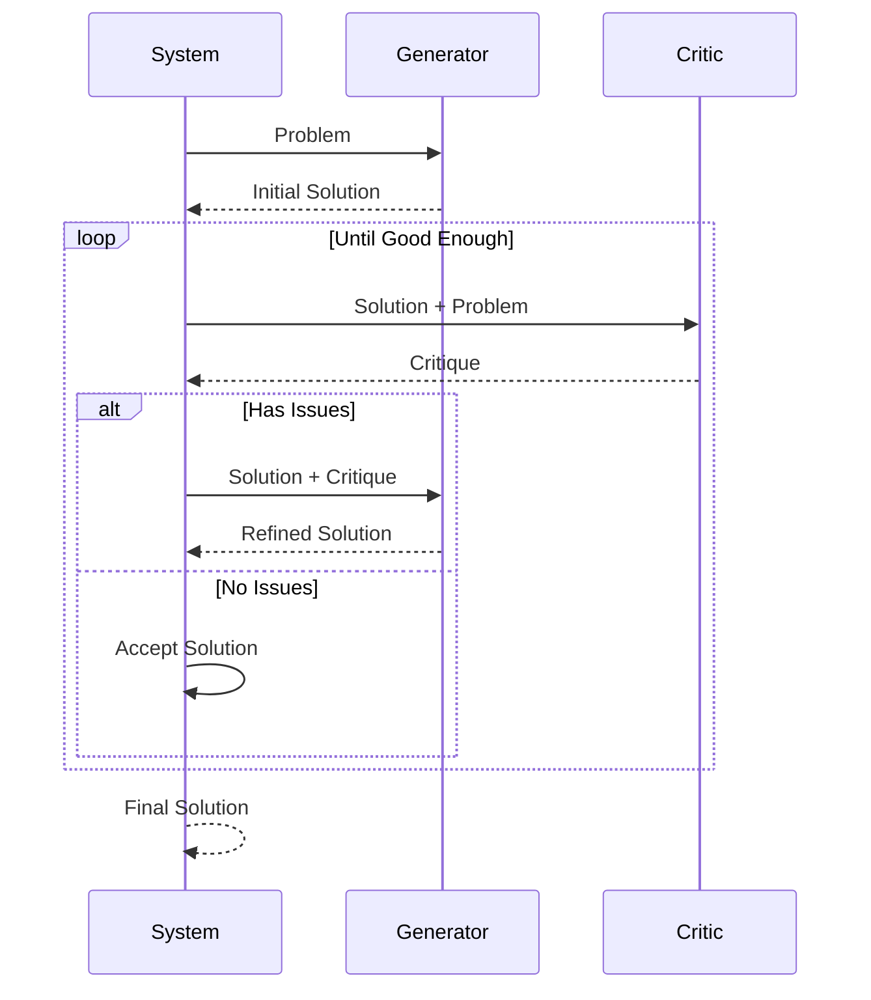
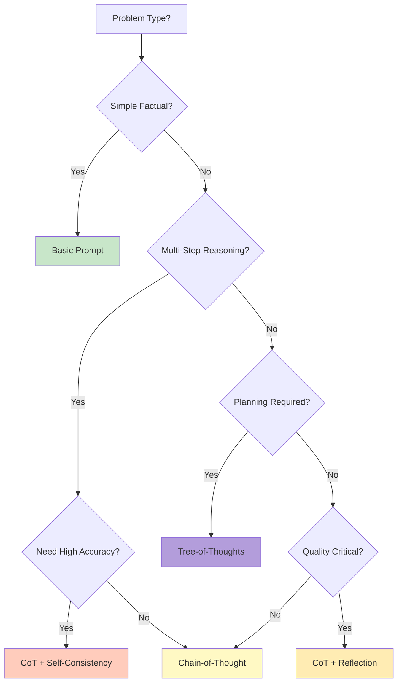

# Week 2 - Lesson 3: Advanced Prompting Techniques

**Duration:** 90 minutes  
**Level:** Intermediate  
**Prerequisites:** Week 2 Lessons 1-2, understanding of zero-shot and few-shot prompting

---

## 🎯 Learning Objectives

By the end of this lesson, you will:
- [ ] Understand chain-of-thought (CoT) prompting and when to use it
- [ ] Be able to implement self-consistency techniques
- [ ] Apply tree-of-thoughts for complex problem solving
- [ ] Implement reasoning decomposition strategies
- [ ] Use self-reflection and self-critique patterns
- [ ] Apply meta-prompting techniques
- [ ] Optimize prompts for complex reasoning tasks

---

## 📚 Table of Contents

1. [Introduction](#1-introduction)
2. [Chain-of-Thought Prompting](#2-chain-of-thought-prompting)
3. [Self-Consistency](#3-self-consistency)
4. [Tree-of-Thoughts](#4-tree-of-thoughts)
5. [Reasoning Decomposition](#5-reasoning-decomposition)
6. [Self-Reflection and Critique](#6-self-reflection-and-critique)
7. [Meta-Prompting](#7-meta-prompting)
8. [Advanced Optimization](#8-advanced-optimization)
9. [Summary](#9-summary)
10. [Further Reading](#10-further-reading)

---

## 1. Introduction

### What Are Advanced Prompting Techniques?

Advanced prompting techniques are sophisticated strategies that guide LLMs to produce more accurate, reliable, and complex outputs through structured reasoning processes.

### Why Do They Matter?

- **Accuracy**: Improve correctness on complex tasks
- **Reasoning**: Enable step-by-step logical thinking
- **Reliability**: Reduce hallucinations and errors
- **Complexity**: Solve multi-step problems effectively

### When to Use Advanced Techniques



### Technique Comparison

| Technique | Best For | Complexity | Accuracy Gain |
|-----------|----------|------------|---------------|
| Basic | Simple tasks | Low | Baseline |
| Few-Shot | Pattern matching | Medium | +10-20% |
| Chain-of-Thought | Reasoning | Medium | +20-40% |
| Self-Consistency | Critical decisions | High | +30-50% |
| Tree-of-Thoughts | Planning | Very High | +40-60% |

---

## 2. Chain-of-Thought Prompting

### 2.1 What is Chain-of-Thought?

Chain-of-Thought (CoT) prompting encourages the model to show its reasoning process step-by-step before arriving at a final answer.

**Key Principle:** Make implicit reasoning explicit.

### 2.2 Basic CoT Pattern

```python
"""
Chain-of-Thought Implementation
"""

from openai import OpenAI
from typing import Dict, List
import os
from dotenv import load_dotenv

load_dotenv()
client = OpenAI(api_key=os.getenv("OPENAI_API_KEY"))


def basic_prompt(question: str) -> str:
    """Basic prompt without reasoning."""
    response = client.chat.completions.create(
        model="gpt-3.5-turbo",
        messages=[
            {"role": "user", "content": question}
        ],
        temperature=0
    )
    return response.choices[0].message.content


def chain_of_thought_prompt(question: str) -> str:
    """Chain-of-thought prompt with explicit reasoning."""
    cot_prompt = f"""{question}

Let's think step by step:"""
    
    response = client.chat.completions.create(
        model="gpt-3.5-turbo",
        messages=[
            {"role": "user", "content": cot_prompt}
        ],
        temperature=0
    )
    return response.choices[0].message.content


# Example: Math problem
question = """A store has 15 apples. They sell 40% of them in the morning 
and then receive a delivery of 8 more apples. How many apples do they have now?"""

print("Basic Prompt:")
print(basic_prompt(question))
print("\n" + "="*80 + "\n")

print("Chain-of-Thought Prompt:")
print(chain_of_thought_prompt(question))
```

**Output Comparison:**

```
Basic Prompt:
The store has 17 apples.

================================================================================

Chain-of-Thought Prompt:
Let's think step by step:

1. The store starts with 15 apples
2. They sell 40% in the morning: 15 × 0.40 = 6 apples sold
3. Apples remaining after morning sales: 15 - 6 = 9 apples
4. They receive a delivery of 8 more apples: 9 + 8 = 17 apples

Therefore, the store now has 17 apples.
```

### 2.3 Zero-Shot vs Few-Shot CoT

```python
"""
Zero-Shot CoT vs Few-Shot CoT Comparison
"""


def zero_shot_cot(question: str) -> str:
    """
    Zero-shot CoT: Just add 'Let's think step by step'
    """
    prompt = f"{question}\n\nLet's think step by step:"
    
    response = client.chat.completions.create(
        model="gpt-3.5-turbo",
        messages=[{"role": "user", "content": prompt}],
        temperature=0
    )
    return response.choices[0].message.content


def few_shot_cot(question: str) -> str:
    """
    Few-shot CoT: Provide examples with reasoning
    """
    messages = [
        {"role": "system", "content": "You are a helpful assistant that shows detailed reasoning."},
        {"role": "user", "content": "If John has 5 apples and buys 3 more, how many does he have?"},
        {"role": "assistant", "content": """Let me solve this step by step:
1. John starts with 5 apples
2. He buys 3 more apples
3. Total = 5 + 3 = 8 apples

John has 8 apples."""},
        {"role": "user", "content": "A car travels 60 km in 1 hour. How far in 2.5 hours?"},
        {"role": "assistant", "content": """Let me solve this step by step:
1. Speed = 60 km/hour
2. Time = 2.5 hours
3. Distance = Speed × Time
4. Distance = 60 × 2.5 = 150 km

The car travels 150 km."""},
        {"role": "user", "content": question}
    ]
    
    response = client.chat.completions.create(
        model="gpt-3.5-turbo",
        messages=messages,
        temperature=0
    )
    return response.choices[0].message.content


# Test both approaches
test_question = """A rectangle has a length of 12 cm and width of 5 cm. 
If you increase both dimensions by 20%, what is the new area?"""

print("Zero-Shot CoT:")
print(zero_shot_cot(test_question))
print("\n" + "="*80 + "\n")

print("Few-Shot CoT:")
print(few_shot_cot(test_question))
```

### 2.4 Advanced CoT Patterns

```python
"""
Advanced Chain-of-Thought Patterns
"""


class ChainOfThoughtEngine:
    """
    Advanced CoT implementation with multiple strategies.
    """
    
    def __init__(self, model: str = "gpt-3.5-turbo"):
        self.model = model
        self.client = OpenAI(api_key=os.getenv("OPENAI_API_KEY"))
    
    def explicit_steps_cot(self, question: str, num_steps: int = None) -> str:
        """
        CoT with explicit step numbering.
        
        Args:
            question: Problem to solve
            num_steps: Expected number of steps (optional)
            
        Returns:
            Detailed step-by-step solution
        """
        if num_steps:
            prompt = f"""{question}

Please solve this in exactly {num_steps} clear steps:
Step 1:
Step 2:
...
Final Answer:"""
        else:
            prompt = f"""{question}

Please solve this step by step, numbering each step clearly."""
        
        response = self.client.chat.completions.create(
            model=self.model,
            messages=[{"role": "user", "content": prompt}],
            temperature=0
        )
        return response.choices[0].message.content
    
    def reasoning_verification_cot(self, question: str) -> Dict[str, str]:
        """
        CoT with self-verification of reasoning.
        
        Returns:
            Dictionary with reasoning, answer, and verification
        """
        # Step 1: Get initial reasoning
        prompt = f"""{question}

Let's solve this carefully step by step, showing all work."""
        
        response = self.client.chat.completions.create(
            model=self.model,
            messages=[{"role": "user", "content": prompt}],
            temperature=0
        )
        reasoning = response.choices[0].message.content
        
        # Step 2: Verify the reasoning
        verification_prompt = f"""Here is a solution to a problem:

Problem: {question}

Solution:
{reasoning}

Please verify if this solution is correct. Check each step carefully.
If you find any errors, explain what's wrong and provide the correct answer."""
        
        verification = self.client.chat.completions.create(
            model=self.model,
            messages=[{"role": "user", "content": verification_prompt}],
            temperature=0
        )
        
        return {
            "question": question,
            "reasoning": reasoning,
            "verification": verification.choices[0].message.content
        }
    
    def analogy_based_cot(self, question: str, domain: str = None) -> str:
        """
        CoT using analogies to familiar domains.
        
        Args:
            question: Problem to solve
            domain: Domain for analogy (e.g., "cooking", "sports")
            
        Returns:
            Solution using analogies
        """
        if domain:
            prompt = f"""{question}

Explain the solution using an analogy from {domain}, then solve step by step."""
        else:
            prompt = f"""{question}

First, think of a helpful analogy for this problem, then solve it step by step."""
        
        response = self.client.chat.completions.create(
            model=self.model,
            messages=[{"role": "user", "content": prompt}],
            temperature=0.3
        )
        return response.choices[0].message.content


# Usage examples
cot_engine = ChainOfThoughtEngine()

# Example 1: Explicit steps
problem1 = """Calculate the compound interest on $1000 invested for 2 years 
at 5% annual interest, compounded annually."""

print("Explicit Steps CoT:")
print(cot_engine.explicit_steps_cot(problem1, num_steps=4))
print("\n" + "="*80 + "\n")

# Example 2: With verification
problem2 = "If 3x + 7 = 22, what is x?"

print("CoT with Verification:")
result = cot_engine.reasoning_verification_cot(problem2)
print("Reasoning:")
print(result["reasoning"])
print("\nVerification:")
print(result["verification"])
```

### CoT Reasoning Flow



---

## 3. Self-Consistency

### 3.1 What is Self-Consistency?

Self-consistency generates multiple reasoning paths and selects the most consistent answer, improving reliability on complex reasoning tasks.

**Key Idea:** Wisdom of the internal crowd.

### 3.2 Self-Consistency Implementation

```python
"""
Self-Consistency Implementation
"""

from collections import Counter
from typing import List, Tuple
import re


class SelfConsistency:
    """
    Implement self-consistency for improved reasoning accuracy.
    """
    
    def __init__(self, model: str = "gpt-3.5-turbo", num_samples: int = 5):
        """
        Initialize self-consistency engine.
        
        Args:
            model: LLM model to use
            num_samples: Number of reasoning paths to generate
        """
        self.model = model
        self.num_samples = num_samples
        self.client = OpenAI(api_key=os.getenv("OPENAI_API_KEY"))
    
    def generate_reasoning_paths(
        self,
        question: str,
        temperature: float = 0.7
    ) -> List[str]:
        """
        Generate multiple independent reasoning paths.
        
        Args:
            question: Problem to solve
            temperature: Sampling temperature (higher = more diversity)
            
        Returns:
            List of complete reasoning attempts
        """
        prompt = f"""{question}

Let's think step by step:"""
        
        paths = []
        for i in range(self.num_samples):
            response = self.client.chat.completions.create(
                model=self.model,
                messages=[{"role": "user", "content": prompt}],
                temperature=temperature,
                max_tokens=500
            )
            paths.append(response.choices[0].message.content)
        
        return paths
    
    def extract_answer(self, reasoning: str) -> str:
        """
        Extract final answer from reasoning text.
        
        Args:
            reasoning: Complete reasoning text
            
        Returns:
            Extracted answer (simplified)
        """
        # Look for common answer patterns
        patterns = [
            r"(?:therefore|thus|so|answer is|final answer:?)\s*[:\-]?\s*(.+?)(?:\.|$)",
            r"(?:the answer is|equals?|=)\s*(.+?)(?:\.|$)",
            r"(?:total|result|sum) (?:is|=)\s*(.+?)(?:\.|$)"
        ]
        
        for pattern in patterns:
            match = re.search(pattern, reasoning.lower())
            if match:
                return match.group(1).strip()
        
        # Fallback: take last line
        lines = [l.strip() for l in reasoning.split('\n') if l.strip()]
        return lines[-1] if lines else reasoning
    
    def majority_vote(self, answers: List[str]) -> Tuple[str, float]:
        """
        Find most common answer.
        
        Args:
            answers: List of extracted answers
            
        Returns:
            Tuple of (most common answer, confidence score)
        """
        # Normalize answers for comparison
        normalized = [ans.lower().strip() for ans in answers]
        
        # Count occurrences
        counter = Counter(normalized)
        most_common, count = counter.most_common(1)[0]
        
        # Calculate confidence
        confidence = count / len(answers)
        
        # Return original form of most common answer
        for orig, norm in zip(answers, normalized):
            if norm == most_common:
                return orig, confidence
        
        return most_common, confidence
    
    def solve_with_consistency(
        self,
        question: str,
        temperature: float = 0.7,
        verbose: bool = True
    ) -> Dict:
        """
        Solve problem using self-consistency.
        
        Args:
            question: Problem to solve
            temperature: Sampling temperature
            verbose: Print intermediate results
            
        Returns:
            Dictionary with answer, confidence, and reasoning paths
        """
        if verbose:
            print(f"Generating {self.num_samples} reasoning paths...")
        
        # Generate multiple reasoning paths
        paths = self.generate_reasoning_paths(question, temperature)
        
        # Extract answers from each path
        answers = [self.extract_answer(path) for path in paths]
        
        if verbose:
            print("\nExtracted Answers:")
            for i, ans in enumerate(answers, 1):
                print(f"  Path {i}: {ans}")
        
        # Find consensus answer
        final_answer, confidence = self.majority_vote(answers)
        
        if verbose:
            print(f"\nFinal Answer: {final_answer}")
            print(f"Confidence: {confidence:.1%} ({int(confidence * self.num_samples)}/{self.num_samples} agreement)")
        
        return {
            "question": question,
            "answer": final_answer,
            "confidence": confidence,
            "all_paths": paths,
            "all_answers": answers
        }


# Test self-consistency
sc_engine = SelfConsistency(num_samples=5)

problem = """A farmer has 17 sheep. All but 9 die. How many sheep are left?"""

print("Self-Consistency Solution:")
print("="*80)
result = sc_engine.solve_with_consistency(problem, verbose=True)

print("\n" + "="*80)
print("\nDetailed Reasoning Paths:")
for i, path in enumerate(result["all_paths"], 1):
    print(f"\nPath {i}:")
    print(path[:200] + "..." if len(path) > 200 else path)
```

### Self-Consistency Flow



---

## 4. Tree-of-Thoughts

### 4.1 What is Tree-of-Thoughts?

Tree-of-Thoughts (ToT) explores multiple reasoning branches, evaluates them, and backtracks when needed—similar to how humans explore problem spaces.

**Key Idea:** Deliberate search through reasoning space.

### 4.2 ToT Components



### 4.3 Basic ToT Implementation

```python
"""
Tree-of-Thoughts Implementation
"""

from typing import List, Dict, Optional
from dataclasses import dataclass, field


@dataclass
class ThoughtNode:
    """Represents a thought in the reasoning tree."""
    content: str
    depth: int
    score: float = 0.0
    parent: Optional['ThoughtNode'] = None
    children: List['ThoughtNode'] = field(default_factory=list)
    
    def __repr__(self):
        return f"ThoughtNode(depth={self.depth}, score={self.score:.2f})"


class TreeOfThoughts:
    """
    Implement Tree-of-Thoughts reasoning.
    """
    
    def __init__(
        self,
        model: str = "gpt-3.5-turbo",
        num_thoughts_per_step: int = 3,
        max_depth: int = 3
    ):
        """
        Initialize ToT engine.
        
        Args:
            model: LLM model to use
            num_thoughts_per_step: Breadth of tree
            max_depth: Maximum depth of tree
        """
        self.model = model
        self.num_thoughts_per_step = num_thoughts_per_step
        self.max_depth = max_depth
        self.client = OpenAI(api_key=os.getenv("OPENAI_API_KEY"))
    
    def generate_thoughts(
        self,
        problem: str,
        current_path: List[str],
        num_thoughts: int
    ) -> List[str]:
        """
        Generate possible next thoughts.
        
        Args:
            problem: Original problem
            current_path: Thoughts so far
            num_thoughts: Number of thoughts to generate
            
        Returns:
            List of possible next thoughts
        """
        context = "\n".join([f"Step {i+1}: {thought}" 
                            for i, thought in enumerate(current_path)])
        
        prompt = f"""Problem: {problem}

Progress so far:
{context if context else "No steps yet"}

Generate {num_thoughts} different possible next steps to solve this problem.
Each should explore a different approach or aspect.

Next steps:"""
        
        response = self.client.chat.completions.create(
            model=self.model,
            messages=[{"role": "user", "content": prompt}],
            temperature=0.8,
            max_tokens=300
        )
        
        # Parse response into individual thoughts
        text = response.choices[0].message.content
        thoughts = [t.strip() for t in text.split('\n') if t.strip() and len(t.strip()) > 10]
        
        return thoughts[:num_thoughts]
    
    def evaluate_thought(
        self,
        problem: str,
        thought_path: List[str],
        thought: str
    ) -> float:
        """
        Evaluate how promising a thought is.
        
        Args:
            problem: Original problem
            thought_path: Path leading to this thought
            thought: Current thought to evaluate
            
        Returns:
            Score from 0-1 (higher is better)
        """
        context = "\n".join([f"Step {i+1}: {t}" 
                            for i, t in enumerate(thought_path + [thought])])
        
        prompt = f"""Problem: {problem}

Reasoning path:
{context}

Evaluate how promising this reasoning path is for solving the problem.
Rate from 0-10 where:
- 0-3: Wrong direction, unlikely to solve
- 4-6: Potentially useful, needs work
- 7-8: Good progress, promising
- 9-10: Excellent, likely to solve

Provide only a number:"""
        
        response = self.client.chat.completions.create(
            model=self.model,
            messages=[{"role": "user", "content": prompt}],
            temperature=0,
            max_tokens=5
        )
        
        try:
            score = float(response.choices[0].message.content.strip())
            return score / 10.0  # Normalize to 0-1
        except:
            return 0.5  # Default middle score
    
    def solve(
        self,
        problem: str,
        verbose: bool = True
    ) -> Dict:
        """
        Solve problem using Tree-of-Thoughts.
        
        Args:
            problem: Problem to solve
            verbose: Print progress
            
        Returns:
            Dictionary with solution and search info
        """
        # Initialize root
        root = ThoughtNode(content=problem, depth=0, score=1.0)
        best_path = []
        best_score = 0.0
        
        def explore(node: ThoughtNode, path: List[str]):
            nonlocal best_path, best_score
            
            if verbose:
                print(f"\n{'  ' * node.depth}Depth {node.depth}: Exploring...")
            
            # Check if we've reached max depth
            if node.depth >= self.max_depth:
                # Evaluate final path
                final_score = node.score
                if final_score > best_score:
                    best_score = final_score
                    best_path = path.copy()
                    if verbose:
                        print(f"{'  ' * node.depth}→ New best path (score: {final_score:.2f})")
                return
            
            # Generate possible next thoughts
            thoughts = self.generate_thoughts(
                problem,
                path,
                self.num_thoughts_per_step
            )
            
            # Evaluate and explore each thought
            for thought in thoughts:
                score = self.evaluate_thought(problem, path, thought)
                
                if verbose:
                    print(f"{'  ' * (node.depth + 1)}Thought: {thought[:60]}... (score: {score:.2f})")
                
                # Create child node
                child = ThoughtNode(
                    content=thought,
                    depth=node.depth + 1,
                    score=score,
                    parent=node
                )
                node.children.append(child)
                
                # Prune low-scoring branches
                if score > 0.4:  # Threshold for exploration
                    explore(child, path + [thought])
        
        # Start exploration
        if verbose:
            print("Starting Tree-of-Thoughts search...")
            print("="*80)
        
        explore(root, [])
        
        if verbose:
            print("\n" + "="*80)
            print(f"\nBest reasoning path found (score: {best_score:.2f}):")
            for i, step in enumerate(best_path, 1):
                print(f"\nStep {i}: {step}")
        
        return {
            "problem": problem,
            "best_path": best_path,
            "best_score": best_score,
            "tree_root": root
        }


# Test Tree-of-Thoughts
tot_engine = TreeOfThoughts(num_thoughts_per_step=3, max_depth=3)

problem = """You have a 3-gallon jug and a 5-gallon jug. 
How can you measure exactly 4 gallons of water?"""

print("Tree-of-Thoughts Solution:")
print("="*80)
result = tot_engine.solve(problem, verbose=True)
```

---

## 5. Reasoning Decomposition

### 5.1 Least-to-Most Prompting

Break complex problems into simpler subproblems.

```python
"""
Least-to-Most Prompting
"""


class LeastToMostPrompting:
    """
    Decompose complex problems into simpler subproblems.
    """
    
    def __init__(self, model: str = "gpt-3.5-turbo"):
        self.model = model
        self.client = OpenAI(api_key=os.getenv("OPENAI_API_KEY"))
    
    def decompose_problem(self, problem: str) -> List[str]:
        """
        Break problem into subproblems.
        
        Args:
            problem: Complex problem
            
        Returns:
            List of subproblems from simple to complex
        """
        prompt = f"""Problem: {problem}

Break this problem down into smaller, simpler subproblems.
List them from easiest to hardest:

1."""
        
        response = self.client.chat.completions.create(
            model=self.model,
            messages=[{"role": "user", "content": prompt}],
            temperature=0
        )
        
        text = response.choices[0].message.content
        subproblems = [
            line.strip() 
            for line in text.split('\n') 
            if line.strip() and any(c.isalpha() for c in line)
        ]
        
        return subproblems
    
    def solve_subproblem(
        self,
        subproblem: str,
        previous_solutions: List[str]
    ) -> str:
        """
        Solve a subproblem using previous solutions.
        
        Args:
            subproblem: Current subproblem
            previous_solutions: Solutions to previous subproblems
            
        Returns:
            Solution to current subproblem
        """
        context = ""
        if previous_solutions:
            context = "\n\nPrevious solutions:\n" + "\n".join([
                f"{i+1}. {sol}" for i, sol in enumerate(previous_solutions)
            ])
        
        prompt = f"""Subproblem: {subproblem}{context}

Solve this subproblem step by step:"""
        
        response = self.client.chat.completions.create(
            model=self.model,
            messages=[{"role": "user", "content": prompt}],
            temperature=0
        )
        
        return response.choices[0].message.content
    
    def solve(self, problem: str, verbose: bool = True) -> Dict:
        """
        Solve problem using least-to-most approach.
        
        Args:
            problem: Complex problem
            verbose: Print progress
            
        Returns:
            Dictionary with solution and subproblems
        """
        if verbose:
            print("Decomposing problem...")
        
        # Decompose
        subproblems = self.decompose_problem(problem)
        
        if verbose:
            print(f"\nFound {len(subproblems)} subproblems:")
            for i, sp in enumerate(subproblems, 1):
                print(f"  {i}. {sp}")
            print("\nSolving subproblems...")
        
        # Solve each subproblem
        solutions = []
        for i, subproblem in enumerate(subproblems):
            if verbose:
                print(f"\n{'='*60}")
                print(f"Subproblem {i+1}: {subproblem}")
                print('='*60)
            
            solution = self.solve_subproblem(subproblem, solutions)
            solutions.append(solution)
            
            if verbose:
                print(f"\nSolution:\n{solution}")
        
        return {
            "problem": problem,
            "subproblems": subproblems,
            "solutions": solutions
        }


# Test Least-to-Most
ltm_engine = LeastToMostPrompting()

complex_problem = """Write a Python function that finds all prime numbers 
between 1 and 1000, calculates their sum, and determines if that sum is 
also a prime number."""

print("Least-to-Most Solution:")
print("="*80)
result = ltm_engine.solve(complex_problem, verbose=True)
```

### Decomposition Flow



---

## 6. Self-Reflection and Critique

### 6.1 Self-Critique Pattern

```python
"""
Self-Reflection and Critique
"""


class SelfReflectionEngine:
    """
    Implement self-reflection and critique for improved outputs.
    """
    
    def __init__(self, model: str = "gpt-3.5-turbo", max_iterations: int = 3):
        self.model = model
        self.max_iterations = max_iterations
        self.client = OpenAI(api_key=os.getenv("OPENAI_API_KEY"))
    
    def generate_initial_solution(self, problem: str) -> str:
        """Generate initial solution."""
        response = self.client.chat.completions.create(
            model=self.model,
            messages=[{
                "role": "user",
                "content": f"{problem}\n\nProvide a detailed solution:"
            }],
            temperature=0.7
        )
        return response.choices[0].message.content
    
    def critique_solution(self, problem: str, solution: str) -> str:
        """Critique the solution."""
        prompt = f"""Problem: {problem}

Proposed solution:
{solution}

Carefully critique this solution. Identify:
1. Any errors or mistakes
2. Missing steps or considerations
3. Areas that could be improved
4. Alternative approaches

Critique:"""
        
        response = self.client.chat.completions.create(
            model=self.model,
            messages=[{"role": "user", "content": prompt}],
            temperature=0.3
        )
        return response.choices[0].message.content
    
    def refine_solution(
        self,
        problem: str,
        solution: str,
        critique: str
    ) -> str:
        """Refine solution based on critique."""
        prompt = f"""Problem: {problem}

Current solution:
{solution}

Critique of this solution:
{critique}

Based on the critique, provide an improved solution:"""
        
        response = self.client.chat.completions.create(
            model=self.model,
            messages=[{"role": "user", "content": prompt}],
            temperature=0.7
        )
        return response.choices[0].message.content
    
    def solve_with_reflection(
        self,
        problem: str,
        verbose: bool = True
    ) -> Dict:
        """
        Solve problem with iterative self-reflection.
        
        Args:
            problem: Problem to solve
            verbose: Print progress
            
        Returns:
            Dictionary with solution history
        """
        history = []
        
        # Initial solution
        if verbose:
            print("Generating initial solution...")
        solution = self.generate_initial_solution(problem)
        history.append({"iteration": 0, "solution": solution})
        
        if verbose:
            print(f"\nInitial Solution:\n{solution}\n")
        
        # Iterative refinement
        for i in range(self.max_iterations):
            if verbose:
                print(f"{'='*60}")
                print(f"Iteration {i+1}: Critique and Refine")
                print('='*60)
            
            # Critique
            critique = self.critique_solution(problem, solution)
            
            if verbose:
                print(f"\nCritique:\n{critique}\n")
            
            # Check if solution is good enough
            if "no significant issues" in critique.lower() or "looks good" in critique.lower():
                if verbose:
                    print("Solution accepted!")
                break
            
            # Refine
            solution = self.refine_solution(problem, solution, critique)
            history.append({
                "iteration": i + 1,
                "critique": critique,
                "solution": solution
            })
            
            if verbose:
                print(f"\nRefined Solution:\n{solution}\n")
        
        return {
            "problem": problem,
            "final_solution": solution,
            "history": history,
            "iterations": len(history) - 1
        }


# Test Self-Reflection
reflection_engine = SelfReflectionEngine(max_iterations=2)

problem = """Design a database schema for a library management system 
that tracks books, members, and borrowing history."""

print("Self-Reflection Solution:")
print("="*80)
result = reflection_engine.solve_with_reflection(problem, verbose=True)
```

### Reflection Flow



---

## 7. Meta-Prompting

### 7.1 What is Meta-Prompting?

Meta-prompting uses the LLM to generate or improve prompts themselves.

```python
"""
Meta-Prompting Implementation
"""


class MetaPrompter:
    """
    Generate and optimize prompts using LLM.
    """
    
    def __init__(self, model: str = "gpt-3.5-turbo"):
        self.model = model
        self.client = OpenAI(api_key=os.getenv("OPENAI_API_KEY"))
    
    def generate_prompt(
        self,
        task_description: str,
        examples: List[Dict] = None
    ) -> str:
        """
        Generate an effective prompt for a task.
        
        Args:
            task_description: Description of what the prompt should do
            examples: Optional example inputs/outputs
            
        Returns:
            Generated prompt
        """
        examples_text = ""
        if examples:
            examples_text = "\n\nExample inputs/outputs:\n" + "\n".join([
                f"Input: {ex['input']}\nExpected output: {ex['output']}"
                for ex in examples
            ])
        
        meta_prompt = f"""I need to create an effective prompt for the following task:
{task_description}{examples_text}

Generate a clear, detailed prompt that will work well with GPT models.
The prompt should:
1. Clearly specify the task
2. Provide necessary context
3. Include formatting instructions
4. Give examples if helpful

Generated prompt:"""
        
        response = self.client.chat.completions.create(
            model=self.model,
            messages=[{"role": "user", "content": meta_prompt}],
            temperature=0.7
        )
        return response.choices[0].message.content
    
    def optimize_prompt(
        self,
        original_prompt: str,
        test_cases: List[Dict],
        improvement_focus: str = "clarity and accuracy"
    ) -> str:
        """
        Optimize an existing prompt.
        
        Args:
            original_prompt: Prompt to improve
            test_cases: Test cases to validate against
            improvement_focus: What to optimize for
            
        Returns:
            Improved prompt
        """
        test_text = "\n".join([
            f"Input: {tc['input']} | Expected: {tc['expected']}"
            for tc in test_cases
        ])
        
        optimization_prompt = f"""Here is a prompt that needs improvement:

Original prompt:
{original_prompt}

Test cases it should handle:
{test_text}

Improve this prompt focusing on: {improvement_focus}

Provide an improved version that:
1. Is more precise and clear
2. Handles edge cases better
3. Produces more consistent outputs
4. Maintains the original intent

Improved prompt:"""
        
        response = self.client.chat.completions.create(
            model=self.model,
            messages=[{"role": "user", "content": optimization_prompt}],
            temperature=0.5
        )
        return response.choices[0].message.content


# Test Meta-Prompting
meta_prompter = MetaPrompter()

print("Meta-Prompting Example:")
print("="*80)

# Generate a prompt
task = """Extract structured information from product reviews including:
- Sentiment (positive/negative/neutral)
- Key features mentioned
- Pros and cons
- Rating if mentioned"""

examples = [
    {
        "input": "Great phone! Battery lasts all day and camera is amazing. A bit pricey though. 4/5 stars.",
        "output": "Sentiment: Positive\nFeatures: battery, camera\nPros: long battery life, great camera\nCons: expensive\nRating: 4/5"
    }
]

generated_prompt = meta_prompter.generate_prompt(task, examples)
print("Generated Prompt:")
print(generated_prompt)
```

---

## 8. Advanced Optimization

### 8.1 Combining Techniques

```python
"""
Hybrid Advanced Prompting System
"""


class HybridReasoningEngine:
    """
    Combine multiple advanced techniques for optimal results.
    """
    
    def __init__(self, model: str = "gpt-3.5-turbo"):
        self.model = model
        self.client = OpenAI(api_key=os.getenv("OPENAI_API_KEY"))
    
    def solve_with_hybrid_approach(
        self,
        problem: str,
        use_cot: bool = True,
        use_self_consistency: bool = False,
        use_reflection: bool = False,
        verbose: bool = True
    ) -> Dict:
        """
        Solve problem using combination of techniques.
        
        Args:
            problem: Problem to solve
            use_cot: Use chain-of-thought
            use_self_consistency: Use multiple paths
            use_reflection: Use self-critique
            verbose: Print progress
            
        Returns:
            Solution with metadata
        """
        if verbose:
            print(f"Solving with: CoT={use_cot}, SC={use_self_consistency}, Reflection={use_reflection}")
            print("="*80)
        
        # Build prompt
        prompt = problem
        if use_cot:
            prompt += "\n\nLet's solve this step by step:"
        
        # Generate solution(s)
        if use_self_consistency:
            # Generate multiple solutions
            solutions = []
            for i in range(3):
                response = self.client.chat.completions.create(
                    model=self.model,
                    messages=[{"role": "user", "content": prompt}],
                    temperature=0.7
                )
                solutions.append(response.choices[0].message.content)
            
            # Use the most common or best-scored
            solution = solutions[0]  # Simplified - would use voting
        else:
            # Single solution
            response = self.client.chat.completions.create(
                model=self.model,
                messages=[{"role": "user", "content": prompt}],
                temperature=0
            )
            solution = response.choices[0].message.content
        
        # Reflection
        if use_reflection:
            critique_prompt = f"""Problem: {problem}

Solution:
{solution}

Is this solution correct and complete? If not, provide corrections:"""
            
            response = self.client.chat.completions.create(
                model=self.model,
                messages=[{"role": "user", "content": critique_prompt}],
                temperature=0.3
            )
            critique = response.choices[0].message.content
            
            # Refine if needed
            if "correct" not in critique.lower():
                refine_prompt = f"""Original problem: {problem}

Current solution:
{solution}

Critique:
{critique}

Provide improved solution:"""
                
                response = self.client.chat.completions.create(
                    model=self.model,
                    messages=[{"role": "user", "content": refine_prompt}],
                    temperature=0.7
                )
                solution = response.choices[0].message.content
        
        if verbose:
            print(f"\nFinal Solution:\n{solution}")
        
        return {
            "problem": problem,
            "solution": solution,
            "techniques_used": {
                "chain_of_thought": use_cot,
                "self_consistency": use_self_consistency,
                "self_reflection": use_reflection
            }
        }


# Test hybrid approach
hybrid_engine = HybridReasoningEngine()

problem = """A bat and a ball together cost $1.10. The bat costs $1.00 more 
than the ball. How much does the ball cost?"""

print("Hybrid Approach Test:")
print("="*80)

result = hybrid_engine.solve_with_hybrid_approach(
    problem,
    use_cot=True,
    use_self_consistency=False,
    use_reflection=True,
    verbose=True
)
```

### Technique Selection Guide



---

## 9. Summary

### Key Takeaways

1. **Chain-of-Thought** enables step-by-step reasoning for complex problems
2. **Self-Consistency** improves accuracy through multiple reasoning paths
3. **Tree-of-Thoughts** explores and evaluates multiple solution strategies
4. **Decomposition** breaks complex problems into manageable subproblems
5. **Self-Reflection** iteratively improves solutions through critique
6. **Meta-Prompting** uses LLMs to optimize prompts themselves
7. **Hybrid Approaches** combine techniques for optimal results

### Technique Comparison

| Technique | Complexity | Cost | Accuracy Gain | Best For |
|-----------|------------|------|---------------|----------|
| CoT | Medium | 1-2x tokens | +20-40% | Multi-step problems |
| Self-Consistency | High | 5-10x tokens | +30-50% | Critical decisions |
| Tree-of-Thoughts | Very High | 10-20x tokens | +40-60% | Complex planning |
| Reflection | High | 3-5x tokens | +25-35% | Quality improvement |

### When to Use Each Technique

**Use CoT when:**
- Problem requires multiple logical steps
- Intermediate reasoning helps understanding
- Transparency is important

**Use Self-Consistency when:**
- Accuracy is critical
- Cost is acceptable
- Problem has clear correct answer

**Use Tree-of-Thoughts when:**
- Multiple solution paths exist
- Planning and exploration needed
- Complex decision-making required

**Use Reflection when:**
- Output quality is paramount
- Iterative improvement helps
- Self-critique is valuable

### Quick Reference Commands

```python
# Chain-of-Thought
prompt = f"{question}\n\nLet's think step by step:"

# Self-Consistency
# Generate N solutions with temperature > 0, pick most common

# Tree-of-Thoughts
# Generate thoughts → Evaluate → Explore best → Backtrack if needed

# Reflection
# Generate → Critique → Refine → Repeat
```

### Next Steps

- [ ] Complete Lab 3: Chain-of-Thought Implementation
- [ ] Experiment with different techniques on same problem
- [ ] Compare accuracy vs cost trade-offs
- [ ] Practice combining techniques
- [ ] Move to Lesson 4: Prompt Patterns & Best Practices

---

## 10. Further Reading

### Research Papers
- [Chain-of-Thought Prompting](https://arxiv.org/abs/2201.11903) - Wei et al., 2022
- [Self-Consistency](https://arxiv.org/abs/2203.11171) - Wang et al., 2022
- [Tree-of-Thoughts](https://arxiv.org/abs/2305.10601) - Yao et al., 2023
- [Least-to-Most](https://arxiv.org/abs/2205.10625) - Zhou et al., 2022

### Practical Guides
- [OpenAI Prompt Engineering Guide](https://platform.openai.com/docs/guides/prompt-engineering)
- [Anthropic Prompting Guide](https://docs.anthropic.com/claude/docs/prompt-engineering)
- [DAIR.AI Prompt Engineering](https://www.promptingguide.ai/)

### Tools & Libraries
- [LangChain](https://python.langchain.com/) - Framework for LLM applications
- [Guidance](https://github.com/microsoft/guidance) - Control LLM generation
- [DSPy](https://github.com/stanfordnlp/dspy) - Programming for LLMs

---

## Repo Resources

- [Prompt Engineering Cheatsheet](../resources/prompt-cheatsheet.md)
- [Example Prompts (Copy & Adapt)](../resources/example-prompts.md)
- [References: Prompt Engineering & LLM Basics](../resources/references.md)
- [Tokenizer & Cost Tools](../resources/tokenizer-tools.md)
- [Reading List (Deep Dives)](../resources/reading-list.md)

---

## 📝 Review Questions

1. What is the key difference between zero-shot and few-shot CoT?
2. Why does self-consistency improve accuracy?
3. When would you choose Tree-of-Thoughts over simple CoT?
4. How does self-reflection differ from self-consistency?
5. What are the cost implications of using advanced techniques?

---

## 🔗 Related Content

- **Previous:** [Week 2 - Lesson 2: Zero-Shot and Few-Shot Learning](02-zero-shot-and-few-shot-learning.md)
- **Next:** [Week 2 - Lesson 4: Prompt Patterns & Best Practices](04-prompt-patterns-best-practices.md)
- **Related Lab:** `labs/lab-03-chain-of-thought.ipynb`

---

**Author:** Training Team  
**Provided by:** ADC ENGINEERING & CONSULTING LTD  
**Last Updated:** November 2, 2025  
**Version:** 1.0
