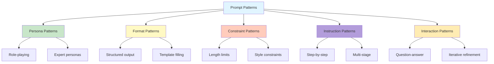
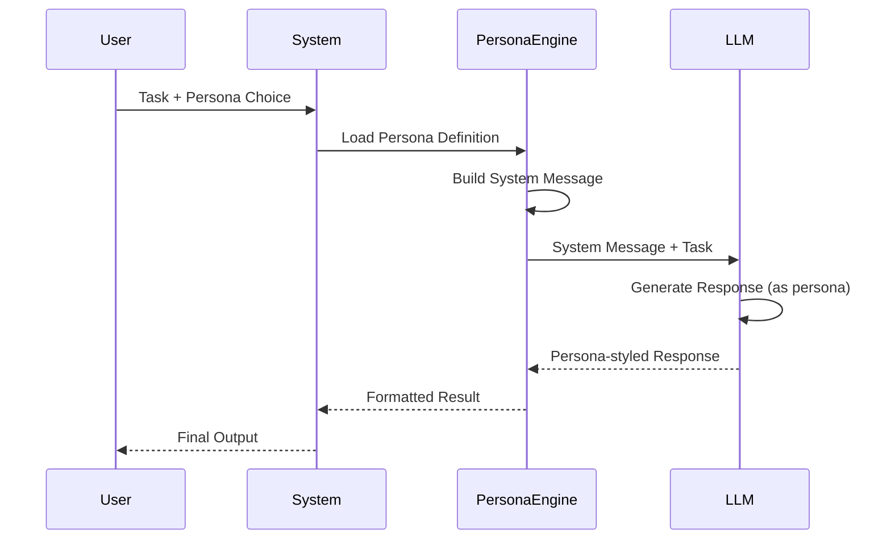
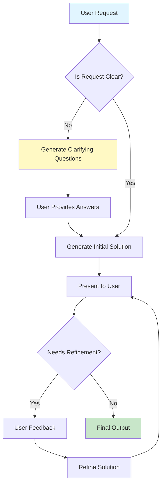
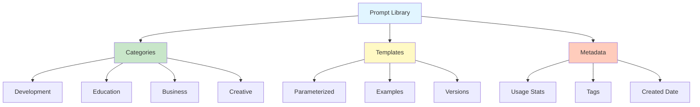

# Week 2 - Lesson 4: Prompt Patterns & Best Practices

**Duration:** 90 minutes  
**Level:** Intermediate  
**Prerequisites:** Week 2 Lessons 1-3, understanding of advanced prompting techniques

---

## 🎯 Learning Objectives

By the end of this lesson, you will:
- [ ] Master reusable prompt patterns and templates
- [ ] Apply persona and role-based prompting techniques
- [ ] Implement format control and output structuring
- [ ] Use constraint patterns for controlled generation
- [ ] Apply meta-prompting and self-improvement patterns
- [ ] Handle edge cases and error scenarios
- [ ] Build a personal prompt pattern library
- [ ] Evaluate and iterate on prompt effectiveness

---

## 📚 Table of Contents

1. [Introduction](#1-introduction)
2. [Persona Patterns](#2-persona-patterns)
3. [Format Control Patterns](#3-format-control-patterns)
4. [Constraint Patterns](#4-constraint-patterns)
5. [Instruction Patterns](#5-instruction-patterns)
6. [Interaction Patterns](#6-interaction-patterns)
7. [Error Handling & Edge Cases](#7-error-handling--edge-cases)
8. [Prompt Library & Management](#8-prompt-library--management)
9. [Summary](#9-summary)
10. [Further Reading](#10-further-reading)

---

## 1. Introduction

### What Are Prompt Patterns?

Prompt patterns are reusable templates and design principles that solve common prompting challenges. Like software design patterns, they provide proven solutions to recurring problems.

### Why Use Patterns?

- **Consistency**: Reproducible results across different use cases
- **Efficiency**: Save time with proven templates
- **Quality**: Avoid common pitfalls and mistakes
- **Scalability**: Build systems on reliable foundations
- **Maintainability**: Easier to update and improve

### Pattern Categories



---

## 2. Persona Patterns

### 2.1 Role-Based Prompting

Assign a specific role or persona to guide the model's behavior and expertise.

```python
"""
Persona Pattern Implementation
"""

from openai import OpenAI
from typing import Dict, List
import os
from dotenv import load_dotenv

load_dotenv()
client = OpenAI(api_key=os.getenv("OPENAI_API_KEY"))


class PersonaPromptEngine:
    """
    Implement persona-based prompting patterns.
    """
    
    def __init__(self, model: str = "gpt-3.5-turbo"):
        self.model = model
        self.client = client
    
    # Persona Library
    PERSONAS = {
        "expert_programmer": """You are an expert software engineer with 15 years of experience.
You write clean, efficient, well-documented code following best practices.
You explain complex concepts clearly and provide practical examples.""",
        
        "business_analyst": """You are a senior business analyst with expertise in data analysis 
and strategic planning. You translate technical information into business insights 
and focus on ROI and practical impact.""",
        
        "teacher": """You are a patient, experienced teacher who excels at breaking down 
complex topics into simple, understandable parts. You use analogies, examples, 
and check for understanding.""",
        
        "technical_writer": """You are a professional technical writer who creates clear, 
concise documentation. You organize information logically and use appropriate 
formatting and structure.""",
        
        "creative_writer": """You are a creative writer known for engaging storytelling,
vivid descriptions, and compelling narratives. You adapt your style to the audience 
and purpose.""",
        
        "data_scientist": """You are an experienced data scientist specializing in machine 
learning and statistical analysis. You provide data-driven insights with rigorous 
methodology.""",
        
        "security_expert": """You are a cybersecurity expert focused on identifying 
vulnerabilities and recommending secure solutions. You think like an attacker 
to better defend systems.""",
        
        "architect": """You are a solutions architect who designs scalable, maintainable 
systems. You consider trade-offs, best practices, and long-term implications."""
    }
    
    def prompt_with_persona(
        self,
        task: str,
        persona: str,
        additional_context: str = ""
    ) -> str:
        """
        Execute task with specific persona.
        
        Args:
            task: The task to perform
            persona: Persona key from PERSONAS dict or custom persona
            additional_context: Extra context or constraints
            
        Returns:
            Model response with persona applied
        """
        # Get persona description
        persona_desc = self.PERSONAS.get(persona, persona)
        
        # Build system message
        system_message = persona_desc
        if additional_context:
            system_message += f"\n\n{additional_context}"
        
        # Make API call
        response = self.client.chat.completions.create(
            model=self.model,
            messages=[
                {"role": "system", "content": system_message},
                {"role": "user", "content": task}
            ],
            temperature=0.7
        )
        
        return response.choices[0].message.content
    
    def compare_personas(
        self,
        task: str,
        personas: List[str]
    ) -> Dict[str, str]:
        """
        Compare same task across different personas.
        
        Args:
            task: Task to perform
            personas: List of persona keys
            
        Returns:
            Dictionary mapping persona to response
        """
        results = {}
        
        for persona in personas:
            response = self.prompt_with_persona(task, persona)
            results[persona] = response
        
        return results


# Usage Examples
persona_engine = PersonaPromptEngine()

task = """Explain what a binary search algorithm is and when to use it."""

print("Persona Pattern Examples:")
print("="*80)

# Example 1: Expert Programmer
print("\n1. EXPERT PROGRAMMER PERSONA:")
print("-"*80)
response = persona_engine.prompt_with_persona(task, "expert_programmer")
print(response)

print("\n" + "="*80)

# Example 2: Teacher
print("\n2. TEACHER PERSONA:")
print("-"*80)
response = persona_engine.prompt_with_persona(task, "teacher")
print(response)

print("\n" + "="*80)

# Example 3: Comparing Multiple Personas
print("\n3. PERSONA COMPARISON:")
print("-"*80)

comparison_task = "Should we use microservices or a monolith architecture?"
personas_to_compare = ["architect", "business_analyst", "expert_programmer"]

results = persona_engine.compare_personas(comparison_task, personas_to_compare)

for persona, response in results.items():
    print(f"\n{persona.upper()}:")
    print(response[:300] + "..." if len(response) > 300 else response)
    print("-"*80)
```

### 2.2 Expert Panel Pattern

Simulate multiple experts discussing a problem.

```python
"""
Expert Panel Pattern
"""


class ExpertPanelPattern:
    """
    Simulate multiple expert perspectives on a problem.
    """
    
    def __init__(self, model: str = "gpt-3.5-turbo"):
        self.model = model
        self.client = client
    
    def expert_panel_discussion(
        self,
        problem: str,
        experts: List[Dict[str, str]],
        rounds: int = 1
    ) -> Dict:
        """
        Conduct expert panel discussion.
        
        Args:
            problem: Problem to discuss
            experts: List of expert definitions (role, description)
            rounds: Number of discussion rounds
            
        Returns:
            Discussion transcript and synthesis
        """
        discussion = []
        
        for round_num in range(rounds):
            print(f"\n{'='*60}")
            print(f"Round {round_num + 1}")
            print('='*60)
            
            # Each expert provides their perspective
            for expert in experts:
                # Build context from previous comments
                context = ""
                if discussion:
                    context = "\n\nPrevious expert opinions:\n"
                    for comment in discussion[-len(experts):]:
                        context += f"- {comment['expert']}: {comment['comment'][:100]}...\n"
                
                prompt = f"""You are {expert['description']}

Problem to discuss:
{problem}{context}

Provide your expert perspective in 2-3 sentences:"""
                
                response = self.client.chat.completions.create(
                    model=self.model,
                    messages=[{"role": "user", "content": prompt}],
                    temperature=0.7,
                    max_tokens=200
                )
                
                comment = response.choices[0].message.content
                discussion.append({
                    "round": round_num + 1,
                    "expert": expert["role"],
                    "comment": comment
                })
                
                print(f"\n{expert['role']}:")
                print(comment)
        
        # Synthesize discussion
        all_comments = "\n\n".join([
            f"{d['expert']}: {d['comment']}" for d in discussion
        ])
        
        synthesis_prompt = f"""Review this expert panel discussion and provide a 
balanced synthesis of the key insights and recommendations:

{all_comments}

Synthesis:"""
        
        synthesis = self.client.chat.completions.create(
            model=self.model,
            messages=[{"role": "user", "content": synthesis_prompt}],
            temperature=0.5
        )
        
        print(f"\n{'='*60}")
        print("SYNTHESIS:")
        print('='*60)
        print(synthesis.choices[0].message.content)
        
        return {
            "problem": problem,
            "discussion": discussion,
            "synthesis": synthesis.choices[0].message.content
        }


# Test Expert Panel
panel = ExpertPanelPattern()

problem = """Should our company invest in building a custom LLM or use 
existing commercial APIs?"""

experts = [
    {
        "role": "CTO",
        "description": "a CTO focused on technical feasibility and innovation"
    },
    {
        "role": "CFO",
        "description": "a CFO concerned with costs and ROI"
    },
    {
        "role": "Data Science Lead",
        "description": "a Data Science Lead who understands ML capabilities"
    }
]

result = panel.expert_panel_discussion(problem, experts, rounds=1)
```

### Persona Pattern Architecture



---

## 3. Format Control Patterns

### 3.1 Structured Output Pattern

Control the format and structure of model outputs.

```python
"""
Format Control Patterns
"""

import json
from typing import Any, Dict, List


class FormatControlEngine:
    """
    Implement format control patterns for structured outputs.
    """
    
    def __init__(self, model: str = "gpt-3.5-turbo"):
        self.model = model
        self.client = client
    
    def json_format(
        self,
        prompt: str,
        schema: Dict[str, Any],
        validate: bool = True
    ) -> Dict:
        """
        Get response in JSON format following schema.
        
        Args:
            prompt: Input prompt
            schema: Expected JSON schema
            validate: Whether to validate output
            
        Returns:
            Parsed JSON response
        """
        schema_str = json.dumps(schema, indent=2)
        
        format_prompt = f"""{prompt}

Provide your response as a JSON object following this exact schema:

{schema_str}

JSON Response:"""
        
        response = self.client.chat.completions.create(
            model=self.model,
            messages=[{"role": "user", "content": format_prompt}],
            temperature=0.3
        )
        
        text = response.choices[0].message.content
        
        # Extract JSON from markdown code blocks if present
        if "```json" in text:
            text = text.split("```json")[1].split("```")[0].strip()
        elif "```" in text:
            text = text.split("```")[1].split("```")[0].strip()
        
        try:
            result = json.loads(text)
            
            if validate:
                # Basic validation: check required keys
                if isinstance(schema, dict):
                    required_keys = schema.keys()
                    missing = set(required_keys) - set(result.keys())
                    if missing:
                        print(f"Warning: Missing keys in response: {missing}")
            
            return result
        except json.JSONDecodeError as e:
            print(f"Failed to parse JSON: {e}")
            print(f"Raw response: {text}")
            return {"error": "Invalid JSON", "raw": text}
    
    def table_format(
        self,
        prompt: str,
        columns: List[str],
        format_type: str = "markdown"
    ) -> str:
        """
        Get response as a formatted table.
        
        Args:
            prompt: Input prompt
            columns: Table column names
            format_type: 'markdown', 'csv', or 'ascii'
            
        Returns:
            Formatted table string
        """
        columns_str = ", ".join(columns)
        
        if format_type == "markdown":
            format_instruction = f"""Create a Markdown table with columns: {columns_str}

Format:
| Column1 | Column2 | ... |
|---------|---------|-----|
| value   | value   | ... |"""
        elif format_type == "csv":
            format_instruction = f"""Create a CSV with columns: {columns_str}

Format:
Column1,Column2,...
value,value,..."""
        else:  # ascii
            format_instruction = f"""Create an ASCII table with columns: {columns_str}"""
        
        table_prompt = f"""{prompt}

{format_instruction}"""
        
        response = self.client.chat.completions.create(
            model=self.model,
            messages=[{"role": "user", "content": table_prompt}],
            temperature=0.3
        )
        
        return response.choices[0].message.content
    
    def template_fill(
        self,
        template: str,
        context: Dict[str, Any]
    ) -> str:
        """
        Fill a template with generated content.
        
        Args:
            template: Template string with {{placeholders}}
            context: Context for generation
            
        Returns:
            Filled template
        """
        # Find all placeholders
        import re
        placeholders = re.findall(r'\{\{(\w+)\}\}', template)
        
        # Generate content for each placeholder
        filled = template
        for placeholder in placeholders:
            prompt = f"""Given this context:
{json.dumps(context, indent=2)}

Generate appropriate content for: {placeholder}

Content (be concise):"""
            
            response = self.client.chat.completions.create(
                model=self.model,
                messages=[{"role": "user", "content": prompt}],
                temperature=0.7,
                max_tokens=150
            )
            
            content = response.choices[0].message.content.strip()
            filled = filled.replace(f"{{{{{placeholder}}}}}", content)
        
        return filled


# Usage Examples
format_engine = FormatControlEngine()

print("Format Control Examples:")
print("="*80)

# Example 1: JSON Format
print("\n1. JSON FORMAT:")
print("-"*80)

schema = {
    "product_name": "string",
    "category": "string",
    "pros": ["string"],
    "cons": ["string"],
    "rating": "number (1-5)"
}

review_prompt = """Analyze this product review:
"Great laptop! Fast processor and beautiful screen. Battery life could be better."
"""

result = format_engine.json_format(review_prompt, schema)
print(json.dumps(result, indent=2))

print("\n" + "="*80)

# Example 2: Table Format
print("\n2. TABLE FORMAT:")
print("-"*80)

table_prompt = """List the top 5 programming languages in 2025 with their 
primary use cases and difficulty level."""

columns = ["Language", "Primary Use", "Difficulty"]
table = format_engine.table_format(table_prompt, columns, format_type="markdown")
print(table)

print("\n" + "="*80)

# Example 3: Template Fill
print("\n3. TEMPLATE FILL:")
print("-"*80)

email_template = """Subject: {{subject}}

Dear {{recipient_name}},

{{opening_paragraph}}

{{main_content}}

{{closing_paragraph}}

Best regards,
{{sender_name}}"""

context = {
    "purpose": "Thank a customer for their recent purchase",
    "product": "Premium Wireless Headphones",
    "customer_name": "John Smith",
    "company": "TechGear Inc"
}

filled = format_engine.template_fill(email_template, context)
print(filled)
```

### 3.2 XML/HTML Format Pattern

```python
"""
XML/HTML Format Pattern
"""


def xml_format_pattern(prompt: str, xml_structure: str) -> str:
    """
    Get response in XML format.
    
    Args:
        prompt: Input prompt
        xml_structure: Expected XML structure
        
    Returns:
        XML formatted response
    """
    xml_prompt = f"""{prompt}

Provide your response in this XML format:

{xml_structure}

XML Response:"""
    
    response = client.chat.completions.create(
        model="gpt-3.5-turbo",
        messages=[{"role": "user", "content": xml_prompt}],
        temperature=0.3
    )
    
    return response.choices[0].message.content


# Example
xml_structure = """<article>
    <title>...</title>
    <author>...</author>
    <content>
        <section>
            <heading>...</heading>
            <paragraph>...</paragraph>
        </section>
    </content>
    <metadata>
        <category>...</category>
        <tags>...</tags>
    </metadata>
</article>"""

article_prompt = "Write a short article about quantum computing basics"
xml_result = xml_format_pattern(article_prompt, xml_structure)
print("\nXML Format Example:")
print(xml_result)
```

---

## 4. Constraint Patterns

### 4.1 Length and Style Constraints

```python
"""
Constraint Patterns
"""


class ConstraintEngine:
    """
    Implement constraint patterns for controlled generation.
    """
    
    def __init__(self, model: str = "gpt-3.5-turbo"):
        self.model = model
        self.client = client
    
    def length_constraint(
        self,
        prompt: str,
        constraint: Dict[str, Any]
    ) -> str:
        """
        Apply length constraints to output.
        
        Args:
            prompt: Input prompt
            constraint: Dict with 'type' and 'limit'
                       type: 'words', 'sentences', 'paragraphs', 'characters'
                       limit: number or 'exactly', 'at_most', 'at_least'
            
        Returns:
            Constrained response
        """
        constraint_type = constraint.get("type", "words")
        limit = constraint.get("limit", 100)
        mode = constraint.get("mode", "at_most")
        
        if mode == "exactly":
            length_instruction = f"in exactly {limit} {constraint_type}"
        elif mode == "at_most":
            length_instruction = f"in at most {limit} {constraint_type}"
        elif mode == "at_least":
            length_instruction = f"in at least {limit} {constraint_type}"
        else:
            length_instruction = f"in approximately {limit} {constraint_type}"
        
        constrained_prompt = f"""{prompt}

IMPORTANT: Provide your answer {length_instruction}."""
        
        response = self.client.chat.completions.create(
            model=self.model,
            messages=[{"role": "user", "content": constrained_prompt}],
            temperature=0.5
        )
        
        return response.choices[0].message.content
    
    def style_constraint(
        self,
        prompt: str,
        style_rules: List[str]
    ) -> str:
        """
        Apply style constraints to output.
        
        Args:
            prompt: Input prompt
            style_rules: List of style requirements
            
        Returns:
            Style-constrained response
        """
        rules_text = "\n".join([f"- {rule}" for rule in style_rules])
        
        styled_prompt = f"""{prompt}

Style Requirements:
{rules_text}

Response:"""
        
        response = self.client.chat.completions.create(
            model=self.model,
            messages=[{"role": "user", "content": styled_prompt}],
            temperature=0.7
        )
        
        return response.choices[0].message.content
    
    def audience_constraint(
        self,
        prompt: str,
        audience: str,
        additional_constraints: Dict[str, Any] = None
    ) -> str:
        """
        Tailor output for specific audience.
        
        Args:
            prompt: Input prompt
            audience: Target audience description
            additional_constraints: Extra constraints
            
        Returns:
            Audience-appropriate response
        """
        audience_instruction = f"Target audience: {audience}"
        
        extra = ""
        if additional_constraints:
            if "reading_level" in additional_constraints:
                extra += f"\nReading level: {additional_constraints['reading_level']}"
            if "avoid_jargon" in additional_constraints:
                extra += f"\nAvoid technical jargon: {additional_constraints['avoid_jargon']}"
            if "tone" in additional_constraints:
                extra += f"\nTone: {additional_constraints['tone']}"
        
        audience_prompt = f"""{prompt}

{audience_instruction}{extra}

Response:"""
        
        response = self.client.chat.completions.create(
            model=self.model,
            messages=[{"role": "user", "content": audience_prompt}],
            temperature=0.7
        )
        
        return response.choices[0].message.content
    
    def forbidden_content(
        self,
        prompt: str,
        forbidden: List[str]
    ) -> str:
        """
        Generate content avoiding forbidden topics/words.
        
        Args:
            prompt: Input prompt
            forbidden: List of forbidden content
            
        Returns:
            Response avoiding forbidden content
        """
        forbidden_text = ", ".join(forbidden)
        
        constrained_prompt = f"""{prompt}

IMPORTANT: Do not mention or discuss: {forbidden_text}

Response:"""
        
        response = self.client.chat.completions.create(
            model=self.model,
            messages=[{"role": "user", "content": constrained_prompt}],
            temperature=0.5
        )
        
        return response.choices[0].message.content


# Usage Examples
constraint_engine = ConstraintEngine()

print("Constraint Pattern Examples:")
print("="*80)

# Example 1: Length Constraint
print("\n1. LENGTH CONSTRAINT:")
print("-"*80)

task = "Explain machine learning"
length_result = constraint_engine.length_constraint(
    task,
    {"type": "sentences", "limit": 3, "mode": "exactly"}
)
print(length_result)

print("\n" + "="*80)

# Example 2: Style Constraint
print("\n2. STYLE CONSTRAINT:")
print("-"*80)

task = "Explain blockchain technology"
style_rules = [
    "Use simple, everyday language",
    "Include a real-world analogy",
    "Avoid technical jargon",
    "Use active voice"
]
style_result = constraint_engine.style_constraint(task, style_rules)
print(style_result)

print("\n" + "="*80)

# Example 3: Audience Constraint
print("\n3. AUDIENCE CONSTRAINT:")
print("-"*80)

task = "Explain how vaccines work"
audience_result = constraint_engine.audience_constraint(
    task,
    audience="10-year-old children",
    additional_constraints={
        "reading_level": "5th grade",
        "avoid_jargon": True,
        "tone": "friendly and encouraging"
    }
)
print(audience_result)
```

---

## 5. Instruction Patterns

### 5.1 Step-by-Step Pattern

```python
"""
Instruction Patterns
"""


class InstructionPatternEngine:
    """
    Implement instruction-based prompt patterns.
    """
    
    def __init__(self, model: str = "gpt-3.5-turbo"):
        self.model = model
        self.client = client
    
    def step_by_step_pattern(
        self,
        task: str,
        num_steps: int = None,
        show_reasoning: bool = True
    ) -> str:
        """
        Execute task with explicit step-by-step instructions.
        
        Args:
            task: Task to complete
            num_steps: Expected number of steps (optional)
            show_reasoning: Show reasoning for each step
            
        Returns:
            Step-by-step solution
        """
        if num_steps:
            step_instruction = f"in exactly {num_steps} clear steps"
        else:
            step_instruction = "step by step, numbering each step"
        
        reasoning_instruction = ""
        if show_reasoning:
            reasoning_instruction = " For each step, briefly explain why it's necessary."
        
        prompt = f"""{task}

Please complete this task {step_instruction}.{reasoning_instruction}

Solution:"""
        
        response = self.client.chat.completions.create(
            model=self.model,
            messages=[{"role": "user", "content": prompt}],
            temperature=0.3
        )
        
        return response.choices[0].message.content
    
    def checklist_pattern(
        self,
        task: str,
        requirements: List[str] = None
    ) -> str:
        """
        Generate solution with checklist validation.
        
        Args:
            task: Task to complete
            requirements: List of requirements to verify
            
        Returns:
            Solution with verification checklist
        """
        if requirements:
            req_text = "\n".join([f"- [ ] {req}" for req in requirements])
            checklist_instruction = f"""

Before finalizing, verify these requirements:
{req_text}

Include a checklist showing which requirements are met."""
        else:
            checklist_instruction = """

After your solution, provide a checklist of what was accomplished."""
        
        prompt = f"""{task}{checklist_instruction}

Solution:"""
        
        response = self.client.chat.completions.create(
            model=self.model,
            messages=[{"role": "user", "content": prompt}],
            temperature=0.5
        )
        
        return response.choices[0].message.content
    
    def recipe_pattern(
        self,
        goal: str,
        include_explanation: bool = True
    ) -> str:
        """
        Generate instructions in recipe format.
        
        Args:
            goal: Desired outcome
            include_explanation: Include explanations for each step
            
        Returns:
            Recipe-style instructions
        """
        explanation_note = ""
        if include_explanation:
            explanation_note = " Include brief explanations for key steps."
        
        prompt = f"""Goal: {goal}

Provide instructions in recipe format with:
1. Prerequisites/Materials needed
2. Step-by-step instructions
3. Tips and variations
4. Expected outcome{explanation_note}

Instructions:"""
        
        response = self.client.chat.completions.create(
            model=self.model,
            messages=[{"role": "user", "content": prompt}],
            temperature=0.6
        )
        
        return response.choices[0].message.content


# Usage Examples
instruction_engine = InstructionPatternEngine()

print("Instruction Pattern Examples:")
print("="*80)

# Example 1: Step-by-Step
print("\n1. STEP-BY-STEP PATTERN:")
print("-"*80)
task = "Set up a Python virtual environment for a data science project"
result = instruction_engine.step_by_step_pattern(task, num_steps=5)
print(result)

print("\n" + "="*80)

# Example 2: Checklist Pattern
print("\n2. CHECKLIST PATTERN:")
print("-"*80)
task = "Write a function to validate email addresses"
requirements = [
    "Function accepts a string parameter",
    "Returns boolean value",
    "Checks for @ symbol",
    "Validates domain format",
    "Includes docstring",
    "Has example usage"
]
result = instruction_engine.checklist_pattern(task, requirements)
print(result)
```

---

## 6. Interaction Patterns

### 6.1 Question-Answer Pattern

```python
"""
Interaction Patterns
"""


class InteractionPatternEngine:
    """
    Implement interactive prompt patterns.
    """
    
    def __init__(self, model: str = "gpt-3.5-turbo"):
        self.model = model
        self.client = client
    
    def clarifying_questions_pattern(
        self,
        ambiguous_request: str,
        max_questions: int = 5
    ) -> Dict[str, Any]:
        """
        Generate clarifying questions before proceeding.
        
        Args:
            ambiguous_request: Unclear or incomplete request
            max_questions: Maximum number of questions to ask
            
        Returns:
            Dictionary with questions and guidance
        """
        prompt = f"""User request: {ambiguous_request}

This request is ambiguous or lacks details. Generate up to {max_questions} 
clarifying questions that would help provide a better solution.

For each question, explain why it's important.

Format:
Question 1: [question]
Why: [explanation]

Questions:"""
        
        response = self.client.chat.completions.create(
            model=self.model,
            messages=[{"role": "user", "content": prompt}],
            temperature=0.5
        )
        
        return {
            "original_request": ambiguous_request,
            "clarifying_questions": response.choices[0].message.content
        }
    
    def iterative_refinement_pattern(
        self,
        initial_input: str,
        iterations: int = 3
    ) -> List[Dict[str, str]]:
        """
        Iteratively refine output with feedback loop.
        
        Args:
            initial_input: Starting input
            iterations: Number of refinement iterations
            
        Returns:
            List of iteration results
        """
        conversation_history = []
        current_output = None
        
        for i in range(iterations):
            if i == 0:
                # Initial generation
                prompt = f"{initial_input}\n\nProvide an initial solution:"
            else:
                # Refinement
                prompt = f"""Previous version:
{current_output}

Analyze this and provide an improved version addressing any weaknesses 
or gaps. Explain what you improved.

Improved version:"""
            
            response = self.client.chat.completions.create(
                model=self.model,
                messages=[{"role": "user", "content": prompt}],
                temperature=0.6
            )
            
            current_output = response.choices[0].message.content
            
            conversation_history.append({
                "iteration": i + 1,
                "prompt": prompt,
                "output": current_output
            })
        
        return conversation_history
    
    def socratic_pattern(
        self,
        topic: str,
        num_questions: int = 5
    ) -> List[str]:
        """
        Generate Socratic questions to guide learning.
        
        Args:
            topic: Topic to explore
            num_questions: Number of questions to generate
            
        Returns:
            List of progressive Socratic questions
        """
        prompt = f"""Topic: {topic}

Generate {num_questions} Socratic questions that progressively deepen 
understanding of this topic. Each question should:
1. Build on previous questions
2. Encourage critical thinking
3. Reveal important concepts
4. Guide toward deeper insights

Questions:"""
        
        response = self.client.chat.completions.create(
            model=self.model,
            messages=[{"role": "user", "content": prompt}],
            temperature=0.7
        )
        
        text = response.choices[0].message.content
        questions = [q.strip() for q in text.split('\n') if q.strip() and any(c.isalpha() for c in q)]
        
        return questions[:num_questions]


# Usage Examples
interaction_engine = InteractionPatternEngine()

print("Interaction Pattern Examples:")
print("="*80)

# Example 1: Clarifying Questions
print("\n1. CLARIFYING QUESTIONS PATTERN:")
print("-"*80)
ambiguous = "Build me a website"
result = interaction_engine.clarifying_questions_pattern(ambiguous, max_questions=5)
print(result["clarifying_questions"])

print("\n" + "="*80)

# Example 2: Socratic Pattern
print("\n2. SOCRATIC PATTERN:")
print("-"*80)
questions = interaction_engine.socratic_pattern("Machine Learning", num_questions=5)
for i, q in enumerate(questions, 1):
    print(f"{i}. {q}")
```

### Interaction Pattern Flow



---

## 7. Error Handling & Edge Cases

### 7.1 Defensive Prompt Patterns

```python
"""
Error Handling & Edge Case Patterns
"""


class ErrorHandlingPatterns:
    """
    Implement robust error handling in prompts.
    """
    
    def __init__(self, model: str = "gpt-3.5-turbo"):
        self.model = model
        self.client = client
    
    def fallback_pattern(
        self,
        task: str,
        primary_approach: str,
        fallback_approaches: List[str]
    ) -> str:
        """
        Include fallback strategies in prompt.
        
        Args:
            task: Task to complete
            primary_approach: Preferred method
            fallback_approaches: Alternative methods
            
        Returns:
            Solution with fallback handling
        """
        fallbacks = "\n".join([f"{i+1}. {fb}" for i, fb in enumerate(fallback_approaches)])
        
        prompt = f"""{task}

Primary approach: {primary_approach}

If the primary approach is not applicable or fails, try these alternatives in order:
{fallbacks}

Explain which approach you used and why.

Solution:"""
        
        response = self.client.chat.completions.create(
            model=self.model,
            messages=[{"role": "user", "content": prompt}],
            temperature=0.5
        )
        
        return response.choices[0].message.content
    
    def uncertainty_acknowledgment(
        self,
        question: str
    ) -> str:
        """
        Encourage acknowledgment of uncertainty.
        
        Args:
            question: Question to answer
            
        Returns:
            Answer with uncertainty handling
        """
        prompt = f"""{question}

If you're uncertain about any part of your answer:
1. Clearly state what you're uncertain about
2. Explain why there's uncertainty
3. Provide the most likely answer with caveats
4. Suggest how to get a definitive answer

Answer:"""
        
        response = self.client.chat.completions.create(
            model=self.model,
            messages=[{"role": "user", "content": prompt}],
            temperature=0.3
        )
        
        return response.choices[0].message.content
    
    def edge_case_handling(
        self,
        task: str,
        known_edge_cases: List[str] = None
    ) -> str:
        """
        Explicitly handle edge cases.
        
        Args:
            task: Task to complete
            known_edge_cases: List of known edge cases
            
        Returns:
            Solution with edge case handling
        """
        edge_case_instruction = ""
        if known_edge_cases:
            cases = "\n".join([f"- {case}" for case in known_edge_cases])
            edge_case_instruction = f"""

Consider these specific edge cases:
{cases}"""
        else:
            edge_case_instruction = """

Identify potential edge cases and explain how to handle them."""
        
        prompt = f"""{task}{edge_case_instruction}

Provide a robust solution that handles edge cases gracefully.

Solution:"""
        
        response = self.client.chat.completions.create(
            model=self.model,
            messages=[{"role": "user", "content": prompt}],
            temperature=0.4
        )
        
        return response.choices[0].message.content
    
    def validation_pattern(
        self,
        task: str,
        validation_criteria: List[str]
    ) -> str:
        """
        Include validation in solution.
        
        Args:
            task: Task to complete
            validation_criteria: What to validate
            
        Returns:
            Solution with validation
        """
        criteria = "\n".join([f"- {c}" for c in validation_criteria])
        
        prompt = f"""{task}

After providing your solution, validate it against these criteria:
{criteria}

Include the validation results and any necessary corrections.

Solution with Validation:"""
        
        response = self.client.chat.completions.create(
            model=self.model,
            messages=[{"role": "user", "content": prompt}],
            temperature=0.4
        )
        
        return response.choices[0].message.content


# Usage Examples
error_handler = ErrorHandlingPatterns()

print("Error Handling Pattern Examples:")
print("="*80)

# Example 1: Uncertainty Acknowledgment
print("\n1. UNCERTAINTY ACKNOWLEDGMENT:")
print("-"*80)
question = "What will the price of Bitcoin be in 2026?"
result = error_handler.uncertainty_acknowledgment(question)
print(result)

print("\n" + "="*80)

# Example 2: Edge Case Handling
print("\n2. EDGE CASE HANDLING:")
print("-"*80)
task = "Write a function to calculate the average of a list of numbers"
edge_cases = [
    "Empty list",
    "List with None values",
    "List with non-numeric values",
    "Single element list"
]
result = error_handler.edge_case_handling(task, edge_cases)
print(result)
```

---

## 8. Prompt Library & Management

### 8.1 Building a Prompt Library

```python
"""
Prompt Library Management System
"""

import json
from datetime import datetime
from typing import Optional


class PromptLibrary:
    """
    Manage and organize reusable prompt patterns.
    """
    
    def __init__(self, library_file: str = "prompt_library.json"):
        """
        Initialize prompt library.
        
        Args:
            library_file: JSON file to store prompts
        """
        self.library_file = library_file
        self.prompts = self._load_library()
    
    def _load_library(self) -> Dict:
        """Load existing library or create new one."""
        try:
            with open(self.library_file, 'r') as f:
                return json.load(f)
        except FileNotFoundError:
            return {
                "metadata": {
                    "created": datetime.now().isoformat(),
                    "version": "1.0"
                },
                "prompts": {}
            }
    
    def _save_library(self):
        """Save library to file."""
        with open(self.library_file, 'w') as f:
            json.dump(self.prompts, f, indent=2)
    
    def add_prompt(
        self,
        name: str,
        template: str,
        category: str,
        description: str,
        tags: List[str] = None,
        parameters: List[str] = None,
        examples: List[Dict] = None
    ):
        """
        Add prompt to library.
        
        Args:
            name: Unique prompt name
            template: Prompt template with {{placeholders}}
            category: Prompt category
            description: What the prompt does
            tags: Search tags
            parameters: List of required parameters
            examples: Example usages
        """
        prompt_entry = {
            "template": template,
            "category": category,
            "description": description,
            "tags": tags or [],
            "parameters": parameters or [],
            "examples": examples or [],
            "created": datetime.now().isoformat(),
            "usage_count": 0
        }
        
        self.prompts["prompts"][name] = prompt_entry
        self._save_library()
        print(f"✓ Added prompt: {name}")
    
    def get_prompt(
        self,
        name: str,
        params: Dict[str, Any] = None
    ) -> str:
        """
        Get and optionally fill prompt template.
        
        Args:
            name: Prompt name
            params: Parameters to fill template
            
        Returns:
            Prompt text (filled if params provided)
        """
        if name not in self.prompts["prompts"]:
            raise ValueError(f"Prompt '{name}' not found in library")
        
        prompt_data = self.prompts["prompts"][name]
        template = prompt_data["template"]
        
        # Update usage count
        prompt_data["usage_count"] += 1
        self._save_library()
        
        # Fill template if params provided
        if params:
            for key, value in params.items():
                template = template.replace(f"{{{{{key}}}}}", str(value))
        
        return template
    
    def search_prompts(
        self,
        query: str = None,
        category: str = None,
        tags: List[str] = None
    ) -> List[Dict]:
        """
        Search prompts by criteria.
        
        Args:
            query: Text search in name/description
            category: Filter by category
            tags: Filter by tags
            
        Returns:
            List of matching prompts
        """
        results = []
        
        for name, data in self.prompts["prompts"].items():
            match = True
            
            # Text search
            if query:
                query_lower = query.lower()
                if query_lower not in name.lower() and query_lower not in data["description"].lower():
                    match = False
            
            # Category filter
            if category and data["category"] != category:
                match = False
            
            # Tags filter
            if tags:
                if not any(tag in data["tags"] for tag in tags):
                    match = False
            
            if match:
                results.append({
                    "name": name,
                    "category": data["category"],
                    "description": data["description"],
                    "tags": data["tags"],
                    "usage_count": data["usage_count"]
                })
        
        return results
    
    def list_categories(self) -> List[str]:
        """Get all categories."""
        return list(set(
            data["category"] 
            for data in self.prompts["prompts"].values()
        ))
    
    def get_statistics(self) -> Dict:
        """Get library statistics."""
        total_prompts = len(self.prompts["prompts"])
        total_usage = sum(
            data["usage_count"]
            for data in self.prompts["prompts"].values()
        )
        
        most_used = max(
            self.prompts["prompts"].items(),
            key=lambda x: x[1]["usage_count"],
            default=(None, {"usage_count": 0})
        )
        
        return {
            "total_prompts": total_prompts,
            "total_usage": total_usage,
            "categories": len(self.list_categories()),
            "most_used": most_used[0] if most_used[0] else "None"
        }


# Usage Example
library = PromptLibrary("my_prompt_library.json")

# Add some prompts
library.add_prompt(
    name="code_review",
    template="""Review this {{language}} code for:
- Code quality and best practices
- Potential bugs or issues
- Performance optimization opportunities
- Security concerns

Code:
{{code}}

Provide detailed feedback:""",
    category="development",
    description="Comprehensive code review prompt",
    tags=["code", "review", "quality"],
    parameters=["language", "code"],
    examples=[{
        "language": "Python",
        "code": "def add(a, b): return a + b"
    }]
)

library.add_prompt(
    name="explain_to_child",
    template="""Explain {{topic}} to a {{age}}-year-old child.
Use simple words, fun examples, and maybe an analogy they can relate to.

Explanation:""",
    category="education",
    description="Explain complex topics to children",
    tags=["education", "simplify", "children"],
    parameters=["topic", "age"]
)

# Search prompts
print("\nSearch Results for 'code':")
results = library.search_prompts(query="code")
for result in results:
    print(f"- {result['name']}: {result['description']}")

# Get and use a prompt
print("\nUsing 'explain_to_child' prompt:")
filled_prompt = library.get_prompt(
    "explain_to_child",
    params={"topic": "artificial intelligence", "age": "8"}
)
print(filled_prompt)

# Statistics
print("\nLibrary Statistics:")
stats = library.get_statistics()
print(json.dumps(stats, indent=2))
```

### Prompt Library Architecture



---

## 9. Summary

### Key Takeaways

1. **Persona Patterns** enable role-based responses and expert simulations
2. **Format Control** ensures structured, parseable outputs
3. **Constraint Patterns** control length, style, and content boundaries
4. **Instruction Patterns** provide clear, step-by-step guidance
5. **Interaction Patterns** enable iterative refinement and clarification
6. **Error Handling** makes prompts robust and reliable
7. **Prompt Libraries** organize and scale prompt engineering efforts

### Pattern Selection Guide

| Use Case | Recommended Pattern | Complexity | Effectiveness |
|----------|-------------------|------------|---------------|
| Expert advice | Persona | Low | High |
| Structured data | Format Control | Medium | Very High |
| Controlled output | Constraint | Low | High |
| Complex tasks | Instruction | Medium | High |
| Unclear requirements | Interaction | Medium | Very High |
| Critical applications | Error Handling | High | Very High |

### Best Practices Checklist

- [ ] Choose appropriate pattern for your use case
- [ ] Start with simple patterns, combine as needed
- [ ] Test patterns with edge cases
- [ ] Document successful patterns in your library
- [ ] Iterate and refine based on results
- [ ] Version your prompts for tracking improvements
- [ ] Share effective patterns with your team
- [ ] Monitor prompt performance over time

### Quick Reference

```python
# Persona Pattern
system_message = "You are an expert {role} who {expertise}"

# Format Pattern
prompt = f"{task}\n\nProvide response as JSON following this schema:\n{schema}"

# Constraint Pattern
prompt = f"{task}\n\nRequirements:\n- {constraint1}\n- {constraint2}"

# Instruction Pattern
prompt = f"{task}\n\nSolve this step by step, numbering each step."

# Interaction Pattern
prompt = f"{task}\n\nBefore answering, ask clarifying questions if needed."

# Error Handling Pattern
prompt = f"{task}\n\nIf uncertain, explain what's unclear and provide best answer."
```

### Next Steps

- [ ] Complete Lab 4: Building Your Prompt Pattern Library
- [ ] Experiment with combining multiple patterns
- [ ] Create domain-specific patterns for your use cases
- [ ] Document effective patterns you discover
- [ ] Move to Week 3: Advanced Prompting & OpenAI API

---

## 10. Further Reading

### Books & Articles
- "The Prompt Engineering Guide" - Comprehensive patterns and techniques
- "Design Patterns for LLM Applications" - Software engineering perspective
- "Effective Prompting Strategies" - Research-based approaches

### Research Papers
- [Prompt Pattern Catalog](https://arxiv.org/abs/2302.11382) - White et al., 2023
- [Constitutional AI](https://arxiv.org/abs/2212.08073) - Bai et al., 2022
- [Principled Instructions](https://arxiv.org/abs/2312.16171) - Bsharat et al., 2023

### Practical Resources
- [OpenAI Best Practices](https://platform.openai.com/docs/guides/prompt-engineering)
- [Anthropic Prompt Library](https://docs.anthropic.com/claude/prompt-library)
- [DAIR.AI Prompting Guide](https://www.promptingguide.ai/)
- [LangChain Prompt Templates](https://python.langchain.com/docs/modules/model_io/prompts/)

### Tools & Frameworks
- [LangChain](https://python.langchain.com/) - Prompt templates and chains
- [Semantic Kernel](https://learn.microsoft.com/en-us/semantic-kernel/) - Microsoft's prompt engineering framework
- [Promptify](https://github.com/promptslab/Promptify) - Prompt engineering toolkit
- [Guidance](https://github.com/microsoft/guidance) - Control LLM generation

---

## 📝 Review Questions

1. When should you use a persona pattern vs. a format control pattern?
2. How do constraint patterns improve output reliability?
3. What are the benefits of maintaining a prompt library?
4. How would you combine persona, format, and constraint patterns?
5. What makes an effective clarifying question?
6. How do you handle uncertainty in LLM responses?
7. What's the difference between instruction patterns and interaction patterns?

---

## 🔗 Related Content

- **Previous:** [Week 2 - Lesson 3: Advanced Prompting Techniques](03-advanced-prompting-techniques.md)
- **Next:** [Week 3 - Lesson 1: Chain-of-Thought & Advanced Reasoning](../../week-03/lessons/01-chain-of-thought-advanced-reasoning.md)
- **Related Labs:** 
  - `labs/lab-02-few-shot-learning.ipynb`
  - `labs/lab-03-chain-of-thought.ipynb`

---

**Author:** Training Team  
**Provided by:** ADC ENGINEERING & CONSULTING LTD  
**Last Updated:** November 5, 2025  
**Version:** 1.0
