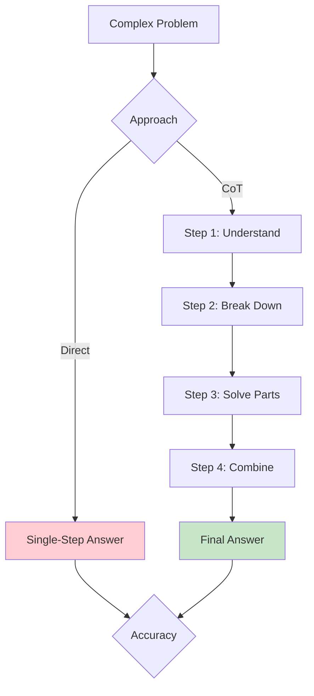
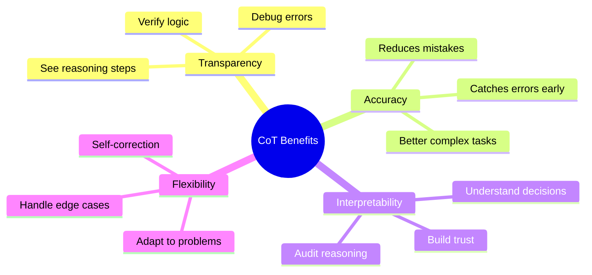
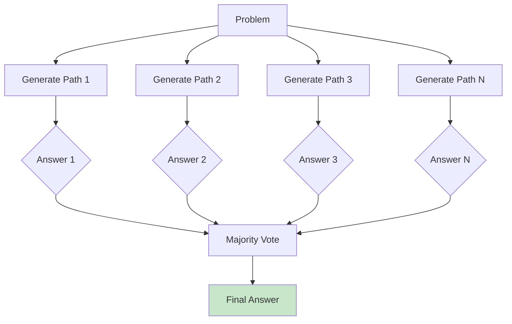
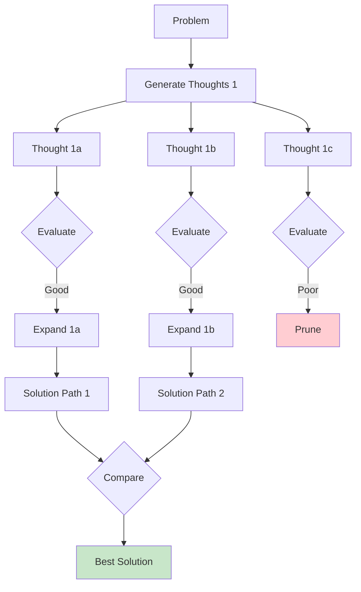
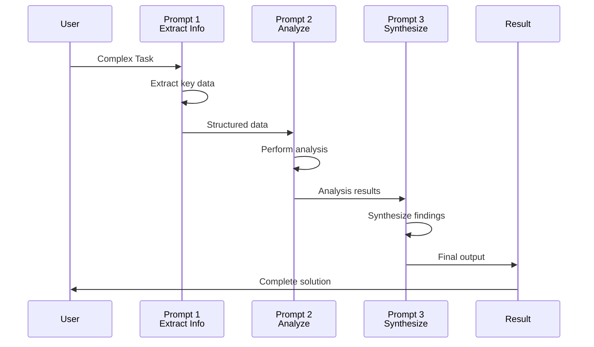
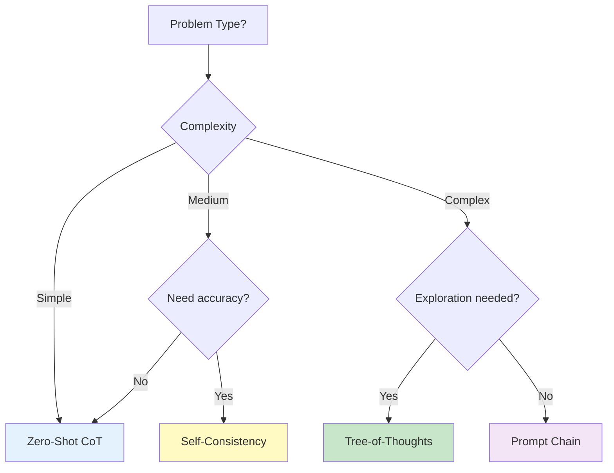

# Lesson 1: Chain-of-Thought & Advanced Reasoning

**Duration:** 90 minutes  
**Level:** Advanced

## Learning Objectives

By the end of this lesson, you will be able to:

- [ ] Understand chain-of-thought (CoT) prompting and its benefits
- [ ] Implement zero-shot and few-shot CoT techniques
- [ ] Apply self-consistency for improved accuracy
- [ ] Use tree-of-thoughts for complex problem-solving
- [ ] Design effective reasoning prompts
- [ ] Recognize when to use advanced reasoning techniques
- [ ] Measure and improve reasoning quality

## Table of Contents

1. [Introduction to Chain-of-Thought](#introduction-to-chain-of-thought)
2. [Zero-Shot Chain-of-Thought](#zero-shot-chain-of-thought)
3. [Few-Shot Chain-of-Thought](#few-shot-chain-of-thought)
4. [Self-Consistency](#self-consistency)
5. [Tree-of-Thoughts](#tree-of-thoughts)
6. [Prompt Chaining](#prompt-chaining)
7. [Best Practices](#best-practices)

---

## Introduction to Chain-of-Thought

**Chain-of-Thought (CoT) Prompting** is a technique that encourages LLMs to break down complex reasoning tasks into intermediate steps, similar to how humans solve problems.



### Why Chain-of-Thought Works



### When to Use CoT

**Best For:**
- Mathematical reasoning
- Logical deduction
- Multi-step problem solving
- Complex analysis
- Planning and strategy
- Debugging and troubleshooting

**Not Needed For:**
- Simple factual queries
- Direct translations
- Basic classifications
- Information retrieval

---

## Zero-Shot Chain-of-Thought

The simplest CoT approach: add "Let's think step by step" to your prompt.

### Basic Implementation

```python
from openai import OpenAI
client = OpenAI()

def zero_shot_cot(problem, model="gpt-4"):
    """
    Zero-shot chain-of-thought prompting.
    Simply add "Let's think step by step" to encourage reasoning.
    """
    prompt = f"{problem}\n\nLet's think step by step."
    
    response = client.chat.completions.create(
        model=model,
        messages=[
            {"role": "user", "content": prompt}
        ],
        temperature=0.3
    )
    
    return response.choices[0].message.content

# Example: Math problem
problem = """
A store sells apples for $0.50 each and oranges for $0.75 each.
If you have $10 and want to buy at least 5 apples, what's the
maximum number of oranges you can buy?
"""

result = zero_shot_cot(problem)
print(result)
```

**Expected Output:**
```
Let's think step by step:

1. First, I need to buy at least 5 apples
   - Cost of 5 apples: 5 × $0.50 = $2.50

2. Calculate remaining budget
   - Total budget: $10.00
   - After apples: $10.00 - $2.50 = $7.50

3. Calculate maximum oranges
   - Cost per orange: $0.75
   - Maximum oranges: $7.50 ÷ $0.75 = 10 oranges

Answer: You can buy a maximum of 10 oranges.
```

### Variations of Zero-Shot CoT

```python
def cot_variations(problem):
    """Different ways to trigger chain-of-thought reasoning."""
    
    variations = [
        # Standard
        f"{problem}\n\nLet's think step by step.",
        
        # Explicit
        f"{problem}\n\nSolve this step by step, showing your work:",
        
        # Structured
        f"{problem}\n\nAnalyze this problem by:\n1. Identifying what we know\n2. Determining what we need to find\n3. Solving step by step\n4. Checking the answer",
        
        # Reasoning focus
        f"{problem}\n\nExplain your reasoning process as you solve this:",
        
        # First principles
        f"{problem}\n\nApproach this from first principles, breaking it down completely:"
    ]
    
    return variations
```

### Zero-Shot CoT Examples

#### Example 1: Logical Reasoning

```python
problem = """
All birds can fly. Penguins are birds. Can penguins fly?
"""

prompt = f"{problem}\n\nLet's think step by step and check our assumptions."

response = client.chat.completions.create(
    model="gpt-4",
    messages=[{"role": "user", "content": prompt}],
    temperature=0.3
)

print(response.choices[0].message.content)
# Model will identify the faulty premise and explain correctly
```

#### Example 2: Code Debugging

```python
code_problem = """
This Python function should return the sum of even numbers in a list,
but it's not working correctly:

def sum_evens(numbers):
    total = 0
    for num in numbers:
        if num % 2:
            total += num
    return total

What's wrong and how to fix it?
"""

result = zero_shot_cot(code_problem)
print(result)
# Model will step through the logic and identify the bug (should be == 0, not just % 2)
```

---

## Few-Shot Chain-of-Thought

Provide examples that demonstrate step-by-step reasoning to teach the model the desired reasoning pattern.

### Implementation

```python
def few_shot_cot(problem, examples, model="gpt-4"):
    """
    Few-shot chain-of-thought with reasoning examples.
    """
    # Build prompt with examples
    prompt = "Solve the following problems step by step:\n\n"
    
    for i, (ex_problem, ex_reasoning) in enumerate(examples, 1):
        prompt += f"Example {i}:\n"
        prompt += f"Problem: {ex_problem}\n"
        prompt += f"Reasoning: {ex_reasoning}\n\n"
    
    prompt += f"Now solve:\nProblem: {problem}\nReasoning:"
    
    response = client.chat.completions.create(
        model=model,
        messages=[{"role": "user", "content": prompt}],
        temperature=0.3
    )
    
    return response.choices[0].message.content

# Example usage
examples = [
    (
        "If there are 3 cars in the parking lot and 2 more arrive, how many cars are there?",
        """
Step 1: Identify initial quantity: 3 cars
Step 2: Identify change: 2 more cars arrive
Step 3: Apply operation: 3 + 2 = 5
Answer: 5 cars
        """
    ),
    (
        "A pizza is cut into 8 slices. If you eat 3 slices, what fraction remains?",
        """
Step 1: Total slices: 8
Step 2: Slices eaten: 3
Step 3: Slices remaining: 8 - 3 = 5
Step 4: Fraction: 5/8
Answer: 5/8 of the pizza remains
        """
    )
]

new_problem = "A library has 150 books. If 45 are checked out and 12 are returned, how many books are in the library?"
result = few_shot_cot(new_problem, examples)
print(result)
```

### Complex Reasoning with Few-Shot CoT

```python
def complex_reasoning_cot():
    """Few-shot CoT for complex multi-step reasoning."""
    
    examples = [
        (
            "Is it possible for someone to be their own grandfather?",
            """
Step 1: Understand the relationships
- To be someone's grandfather, you must be the father of one of their parents

Step 2: Consider biological constraints
- You cannot be born before your own parents
- Time flows in one direction

Step 3: Analyze logical possibility
- For X to be their own grandfather, X would need to be their own ancestor
- This creates a time paradox

Step 4: Consider alternative interpretations
- In family law (adoption, remarriage), complex relationships can occur
- But biologically, it's impossible

Answer: Biologically impossible, though complex family relationships through 
marriage might create this relationship legally in rare cases.
            """
        )
    ]
    
    problem = "Can a set contain itself as a member?"
    return few_shot_cot(problem, examples)
```

---

## Self-Consistency

Self-consistency improves accuracy by generating multiple reasoning paths and selecting the most consistent answer.



### Implementation

```python
from collections import Counter

def self_consistency_cot(problem, num_samples=5, model="gpt-4"):
    """
    Generate multiple reasoning paths and select most consistent answer.
    """
    prompt = f"{problem}\n\nLet's think step by step."
    
    responses = []
    answers = []
    
    # Generate multiple reasoning paths
    for i in range(num_samples):
        response = client.chat.completions.create(
            model=model,
            messages=[{"role": "user", "content": prompt}],
            temperature=0.7,  # Higher temperature for diversity
            n=1
        )
        
        content = response.choices[0].message.content
        responses.append(content)
        
        # Extract final answer (simple extraction - improve as needed)
        answer = extract_final_answer(content)
        answers.append(answer)
    
    # Find most common answer
    answer_counts = Counter(answers)
    most_common_answer, count = answer_counts.most_common(1)[0]
    
    return {
        "final_answer": most_common_answer,
        "confidence": count / num_samples,
        "all_responses": responses,
        "answer_distribution": dict(answer_counts)
    }

def extract_final_answer(text):
    """Extract the final answer from reasoning text."""
    # Look for "Answer:" or similar patterns
    import re
    
    patterns = [
        r'(?:Answer|Final answer|Therefore|Thus|So):\s*(.+?)(?:\n|$)',
        r'(?:is|equals?)\s+(\d+)',
        r'(\d+)\s+(?:is the answer|is correct)'
    ]
    
    for pattern in patterns:
        match = re.search(pattern, text, re.IGNORECASE)
        if match:
            return match.group(1).strip()
    
    # Fallback: return last line
    return text.strip().split('\n')[-1]

# Example usage
problem = """
A farmer has 17 sheep. All but 9 die. How many sheep are left?
"""

result = self_consistency_cot(problem, num_samples=5)
print(f"Final Answer: {result['final_answer']}")
print(f"Confidence: {result['confidence']:.0%}")
print(f"Distribution: {result['answer_distribution']}")
```

### Advanced Self-Consistency

```python
def weighted_self_consistency(problem, num_samples=5):
    """
    Self-consistency with confidence scoring.
    Weight answers by the quality of reasoning.
    """
    responses = []
    
    for _ in range(num_samples):
        # Generate reasoning
        response = client.chat.completions.create(
            model="gpt-4",
            messages=[{"role": "user", "content": f"{problem}\n\nLet's think step by step."}],
            temperature=0.7
        )
        
        reasoning = response.choices[0].message.content
        
        # Score reasoning quality
        score_prompt = f"""
Rate the quality of this reasoning on a scale of 1-10:

Problem: {problem}

Reasoning: {reasoning}

Provide only a number from 1-10:
"""
        
        score_response = client.chat.completions.create(
            model="gpt-4",
            messages=[{"role": "user", "content": score_prompt}],
            temperature=0.0
        )
        
        try:
            quality_score = float(score_response.choices[0].message.content.strip())
        except:
            quality_score = 5.0  # Default score
        
        answer = extract_final_answer(reasoning)
        responses.append({
            "answer": answer,
            "reasoning": reasoning,
            "quality_score": quality_score
        })
    
    # Weighted voting
    from collections import defaultdict
    weighted_votes = defaultdict(float)
    
    for resp in responses:
        weighted_votes[resp["answer"]] += resp["quality_score"]
    
    best_answer = max(weighted_votes.items(), key=lambda x: x[1])[0]
    
    return {
        "final_answer": best_answer,
        "responses": responses,
        "weighted_votes": dict(weighted_votes)
    }
```

---

## Tree-of-Thoughts

Tree-of-Thoughts (ToT) explores multiple solution paths systematically, evaluating and pruning as needed.



### Implementation

```python
def tree_of_thoughts(problem, max_depth=3, branches_per_level=3):
    """
    Tree-of-Thoughts implementation for complex problem solving.
    """
    class ThoughtNode:
        def __init__(self, content, parent=None):
            self.content = content
            self.parent = parent
            self.children = []
            self.score = 0.0
    
    # Generate initial thoughts
    def generate_thoughts(current_state, problem, num_thoughts=3):
        prompt = f"""
Given this problem and current thinking:

Problem: {problem}
Current thought: {current_state}

Generate {num_thoughts} different next steps or approaches to solve this.
List them as:
1. [first approach]
2. [second approach]
3. [third approach]
"""
        
        response = client.chat.completions.create(
            model="gpt-4",
            messages=[{"role": "user", "content": prompt}],
            temperature=0.8
        )
        
        content = response.choices[0].message.content
        # Parse numbered list
        import re
        thoughts = re.findall(r'\d+\.\s*(.+?)(?=\n\d+\.|\Z)', content, re.DOTALL)
        return [t.strip() for t in thoughts]
    
    # Evaluate thought quality
    def evaluate_thought(thought, problem):
        prompt = f"""
Evaluate how promising this approach is for solving the problem (scale 1-10):

Problem: {problem}
Approach: {thought}

Rate only with a number 1-10:
"""
        
        response = client.chat.completions.create(
            model="gpt-4",
            messages=[{"role": "user", "content": prompt}],
            temperature=0.0
        )
        
        try:
            score = float(response.choices[0].message.content.strip())
        except:
            score = 5.0
        
        return score
    
    # Build tree
    root = ThoughtNode("Initial problem analysis")
    current_level = [root]
    
    for depth in range(max_depth):
        next_level = []
        
        for node in current_level:
            # Generate possible next thoughts
            thoughts = generate_thoughts(node.content, problem, branches_per_level)
            
            for thought in thoughts:
                # Create and evaluate child node
                child = ThoughtNode(thought, parent=node)
                child.score = evaluate_thought(thought, problem)
                node.children.append(child)
                
                # Keep only promising paths (score >= 7)
                if child.score >= 7.0:
                    next_level.append(child)
        
        current_level = next_level
        
        if not current_level:
            break
    
    # Find best path
    def get_path_score(node):
        score = node.score
        current = node.parent
        while current and current.parent:  # Exclude root
            score += current.score
            current = current.parent
        return score
    
    # Get all leaf nodes
    def get_leaves(node):
        if not node.children:
            return [node]
        leaves = []
        for child in node.children:
            leaves.extend(get_leaves(child))
        return leaves
    
    all_leaves = get_leaves(root)
    
    if not all_leaves:
        return {"error": "No solution paths found"}
    
    best_leaf = max(all_leaves, key=get_path_score)
    
    # Reconstruct path
    path = []
    current = best_leaf
    while current.parent:
        path.append({
            "thought": current.content,
            "score": current.score
        })
        current = current.parent
    path.reverse()
    
    return {
        "solution_path": path,
        "total_score": get_path_score(best_leaf),
        "explored_nodes": len(all_leaves)
    }

# Example usage
problem = """
Design a system to reduce traffic congestion in a major city.
Consider multiple approaches and evaluate their feasibility.
"""

result = tree_of_thoughts(problem, max_depth=2, branches_per_level=3)
print("Best solution path:")
for i, step in enumerate(result["solution_path"], 1):
    print(f"{i}. {step['thought']} (score: {step['score']})")
```

---

## Prompt Chaining

Break complex tasks into a series of simpler prompts, passing outputs as inputs to subsequent steps.



### Implementation

```python
class PromptChain:
    """
    Build and execute chains of prompts.
    """
    def __init__(self, model="gpt-4"):
        self.model = model
        self.client = OpenAI()
        self.history = []
    
    def add_step(self, prompt_template, extract_fn=None):
        """
        Add a step to the chain.
        
        Args:
            prompt_template: Template string with {placeholders}
            extract_fn: Function to extract relevant data from response
        """
        self.history.append({
            "template": prompt_template,
            "extract_fn": extract_fn or (lambda x: x)
        })
        return self
    
    def execute(self, initial_input, temperature=0.3):
        """Execute the prompt chain."""
        current_input = initial_input
        results = []
        
        for step_num, step in enumerate(self.history, 1):
            # Format prompt with current input
            if isinstance(current_input, dict):
                prompt = step["template"].format(**current_input)
            else:
                prompt = step["template"].format(input=current_input)
            
            # Execute prompt
            response = self.client.chat.completions.create(
                model=self.model,
                messages=[{"role": "user", "content": prompt}],
                temperature=temperature
            )
            
            output = response.choices[0].message.content
            
            # Extract relevant data for next step
            extracted = step["extract_fn"](output)
            
            results.append({
                "step": step_num,
                "prompt": prompt,
                "output": output,
                "extracted": extracted
            })
            
            current_input = extracted
        
        return {
            "final_output": current_input,
            "steps": results
        }

# Example: Research paper analysis chain
def analyze_paper():
    chain = PromptChain()
    
    # Step 1: Extract key information
    chain.add_step(
        """
Extract the following from this research paper abstract:
- Main research question
- Methodology
- Key findings
- Limitations

Abstract: {input}

Provide structured output.
        """,
        extract_fn=lambda x: x  # Pass full output
    )
    
    # Step 2: Analyze implications
    chain.add_step(
        """
Based on this paper summary:

{input}

Analyze:
1. Significance of findings
2. Potential applications
3. Future research directions

Provide detailed analysis.
        """,
        extract_fn=lambda x: x
    )
    
    # Step 3: Generate summary
    chain.add_step(
        """
Create a 200-word executive summary based on:

{input}

Focus on practical implications for industry professionals.
        """
    )
    
    # Execute chain
    abstract = """
This study investigates the impact of transformer architectures on natural
language understanding tasks. Using a dataset of 10,000 documents, we
demonstrate that attention mechanisms significantly improve performance
on complex reasoning tasks. However, computational costs remain a limitation
for real-time applications.
    """
    
    result = chain.execute(abstract)
    return result

# Usage
result = analyze_paper()
print("Final Summary:")
print(result["final_output"])
```

---

## Best Practices

### 1. Be Explicit About Steps

```python
# ❌ Vague
"Solve this problem: ..."

# ✅ Explicit
"""
Solve this problem step by step:
1. First, identify what information we have
2. Then, determine what we need to find
3. Next, choose the appropriate method
4. Finally, calculate and verify the answer
"""
```

### 2. Use Appropriate Temperature

```python
# For reasoning tasks
temperature = 0.3  # More deterministic, consistent logic

# For self-consistency (need diversity)
temperature = 0.7  # More varied reasoning paths
```

### 3. Verify Intermediate Steps

```python
def verify_reasoning_steps(problem, reasoning):
    """Verify each step in the reasoning process."""
    prompt = f"""
Problem: {problem}

Reasoning provided:
{reasoning}

Check each step:
1. Is the logic sound?
2. Are calculations correct?
3. Are there any logical gaps?
4. Is the final answer supported by the reasoning?

Provide verification for each step.
"""
    
    response = client.chat.completions.create(
        model="gpt-4",
        messages=[{"role": "user", "content": prompt}],
        temperature=0.3
    )
    
    return response.choices[0].message.content
```

### 4. Handle Edge Cases

```python
def robust_cot(problem):
    """CoT with edge case handling."""
    prompt = f"""
{problem}

Solve step by step, and:
- Check for edge cases or special conditions
- Verify assumptions
- Consider alternative interpretations
- Validate the final answer
"""
    
    response = client.chat.completions.create(
        model="gpt-4",
        messages=[{"role": "user", "content": prompt}],
        temperature=0.3
    )
    
    return response.choices[0].message.content
```

### 5. Choose the Right Technique



---

## Key Takeaways

### Summary Table

| Technique | Use Case | Complexity | Accuracy | Cost |
|-----------|----------|------------|----------|------|
| **Zero-Shot CoT** | General reasoning | Low | Good | Low |
| **Few-Shot CoT** | Domain-specific | Medium | Better | Medium |
| **Self-Consistency** | High accuracy needs | Medium | Best | High |
| **Tree-of-Thoughts** | Complex exploration | High | Very Good | Very High |
| **Prompt Chaining** | Multi-stage tasks | Medium | Good | Medium |

### Best Practices

1. **Start Simple:** Try zero-shot CoT before more complex approaches
2. **Be Explicit:** Clearly request step-by-step reasoning
3. **Verify Steps:** Check intermediate reasoning for errors
4. **Use Self-Consistency:** For important decisions requiring high accuracy
5. **Chain Prompts:** Break very complex tasks into manageable steps
6. **Monitor Costs:** Advanced techniques use more tokens
7. **Test and Iterate:** Different problems may need different approaches

---

## Practice Exercises

### Exercise 1: Zero-Shot CoT
Implement zero-shot CoT for a logic puzzle. Compare results with and without CoT.

### Exercise 2: Self-Consistency
Use self-consistency to solve a challenging math problem. Analyze the distribution of answers.

### Exercise 3: Prompt Chain
Build a 3-step prompt chain for analyzing customer feedback (extract → categorize → recommend actions).

---

## Further Reading

- "Chain-of-Thought Prompting Elicits Reasoning in Large Language Models" (Wei et al., 2022)
- "Self-Consistency Improves Chain of Thought Reasoning in Language Models" (Wang et al., 2022)
- "Tree of Thoughts: Deliberate Problem Solving with Large Language Models" (Yao et al., 2023)
- OpenAI Prompting Guide - Advanced Techniques

---

## Review Questions

1. What is chain-of-thought prompting and why does it work?
2. When should you use few-shot CoT vs zero-shot CoT?
3. How does self-consistency improve accuracy?
4. What problems are best suited for tree-of-thoughts?
5. When should you use prompt chaining?
6. What are the cost trade-offs of advanced reasoning techniques?

---

**Next Lesson:** [OpenAI API Mastery](./02-openai-api-mastery.md)
