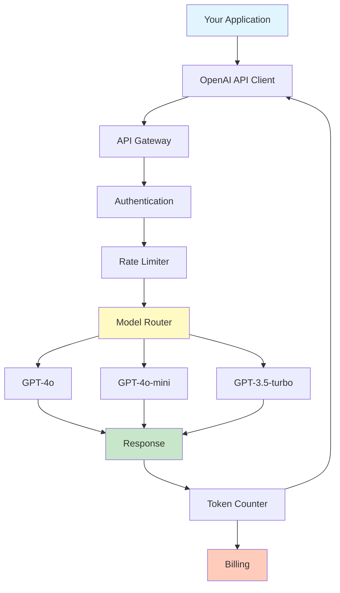
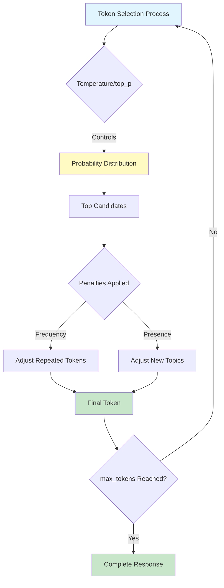
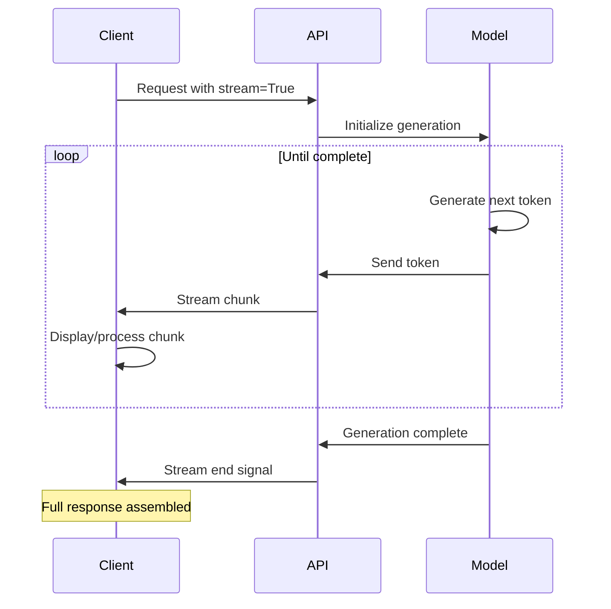
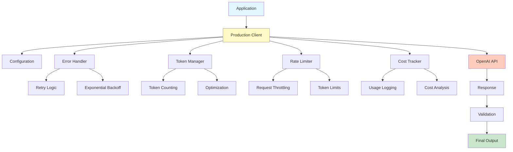

# Week 3 - Lesson 2: OpenAI API Mastery

**Duration:** 90 minutes  
**Level:** Intermediate  
**Prerequisites:** Week 1-2 completion, Python proficiency, active OpenAI API key

---

## 🎯 Learning Objectives

By the end of this lesson, you will:
- [ ] Master all core OpenAI API parameters and their effects
- [ ] Implement proper error handling and retry logic
- [ ] Manage rate limits and token optimization
- [ ] Use streaming for real-time responses
- [ ] Implement cost optimization strategies
- [ ] Apply best practices for production deployments
- [ ] Monitor and log API usage effectively
- [ ] Handle edge cases and error scenarios

---

## 📚 Table of Contents

1. [Introduction](#1-introduction)
2. [API Architecture & Models](#2-api-architecture--models)
3. [Core Parameters Deep Dive](#3-core-parameters-deep-dive)
4. [Error Handling & Retries](#4-error-handling--retries)
5. [Rate Limiting & Token Management](#5-rate-limiting--token-management)
6. [Streaming Responses](#6-streaming-responses)
7. [Cost Optimization](#7-cost-optimization)
8. [Production Best Practices](#8-production-best-practices)
9. [Summary](#9-summary)
10. [Further Reading](#10-further-reading)

---

## 1. Introduction

### What is the OpenAI API?

The OpenAI API provides programmatic access to powerful language models like GPT-4, enabling integration of AI capabilities into applications.

### API Ecosystem Overview



### Key Capabilities

- **Chat Completions**: Conversational AI interactions
- **Embeddings**: Semantic search and similarity
- **Fine-tuning**: Custom model training
- **Vision**: Image understanding (GPT-4 Vision)
- **Audio**: Speech-to-text and text-to-speech
- **Moderation**: Content filtering

---

## 2. API Architecture & Models

### 2.1 Available Models

```python
"""
OpenAI Models Overview and Selection
"""

from openai import OpenAI
from typing import Dict, List
import os
from dotenv import load_dotenv

load_dotenv()
client = OpenAI(api_key=os.getenv("OPENAI_API_KEY"))


class ModelSelector:
    """
    Helper class for selecting appropriate OpenAI models.
    """
    
    # Model specifications (as of November 2025)
    MODELS = {
        "gpt-4o": {
            "context_window": 128000,
            "training_data": "Up to Oct 2023",
            "input_cost_per_1k": 0.005,
            "output_cost_per_1k": 0.015,
            "best_for": ["Complex reasoning", "Creative writing", "Code generation"],
            "capabilities": ["text", "vision", "function_calling"]
        },
        "gpt-4o-mini": {
            "context_window": 128000,
            "training_data": "Up to Oct 2023",
            "input_cost_per_1k": 0.00015,
            "output_cost_per_1k": 0.0006,
            "best_for": ["Fast responses", "Simple tasks", "High volume"],
            "capabilities": ["text", "vision", "function_calling"]
        },
        "gpt-3.5-turbo": {
            "context_window": 16385,
            "training_data": "Up to Sep 2021",
            "input_cost_per_1k": 0.0005,
            "output_cost_per_1k": 0.0015,
            "best_for": ["Simple conversations", "Basic tasks", "Cost-sensitive"],
            "capabilities": ["text", "function_calling"]
        },
        "gpt-4-turbo": {
            "context_window": 128000,
            "training_data": "Up to Dec 2023",
            "input_cost_per_1k": 0.01,
            "output_cost_per_1k": 0.03,
            "best_for": ["Complex tasks", "Latest knowledge", "Vision tasks"],
            "capabilities": ["text", "vision", "function_calling", "json_mode"]
        }
    }
    
    @classmethod
    def list_models(cls) -> None:
        """Display available models and their specs."""
        print("Available OpenAI Models:")
        print("="*80)
        
        for model_name, specs in cls.MODELS.items():
            print(f"\n{model_name}")
            print("-"*80)
            for key, value in specs.items():
                if isinstance(value, list):
                    value = ", ".join(value)
                print(f"  {key.replace('_', ' ').title()}: {value}")
    
    @classmethod
    def recommend_model(
        cls,
        task_complexity: str = "medium",
        budget: str = "medium",
        needs_vision: bool = False,
        context_size: int = 4000
    ) -> str:
        """
        Recommend a model based on requirements.
        
        Args:
            task_complexity: 'low', 'medium', 'high'
            budget: 'low', 'medium', 'high'
            needs_vision: Whether vision capability is needed
            context_size: Required context window size
            
        Returns:
            Recommended model name
        """
        # Filter by context size
        candidates = {
            name: specs for name, specs in cls.MODELS.items()
            if specs["context_window"] >= context_size
        }
        
        # Filter by vision if needed
        if needs_vision:
            candidates = {
                name: specs for name, specs in candidates.items()
                if "vision" in specs["capabilities"]
            }
        
        # Select based on complexity and budget
        if task_complexity == "high":
            if budget == "high":
                return "gpt-4-turbo"
            else:
                return "gpt-4o"
        elif task_complexity == "medium":
            if budget == "low":
                return "gpt-4o-mini"
            else:
                return "gpt-4o"
        else:  # low complexity
            if budget == "low":
                return "gpt-3.5-turbo"
            else:
                return "gpt-4o-mini"
    
    @classmethod
    def estimate_cost(
        cls,
        model: str,
        input_tokens: int,
        output_tokens: int
    ) -> float:
        """
        Estimate API call cost.
        
        Args:
            model: Model name
            input_tokens: Number of input tokens
            output_tokens: Number of output tokens
            
        Returns:
            Estimated cost in USD
        """
        if model not in cls.MODELS:
            raise ValueError(f"Unknown model: {model}")
        
        specs = cls.MODELS[model]
        input_cost = (input_tokens / 1000) * specs["input_cost_per_1k"]
        output_cost = (output_tokens / 1000) * specs["output_cost_per_1k"]
        
        return input_cost + output_cost


# Usage Examples
print("Model Selection Examples:")
print("="*80)

# List all models
ModelSelector.list_models()

print("\n" + "="*80)
print("\nModel Recommendations:")
print("-"*80)

# Example recommendations
scenarios = [
    {
        "name": "High-volume chatbot",
        "complexity": "low",
        "budget": "low",
        "vision": False,
        "context": 4000
    },
    {
        "name": "Complex reasoning task",
        "complexity": "high",
        "budget": "medium",
        "vision": False,
        "context": 8000
    },
    {
        "name": "Image analysis with text",
        "complexity": "medium",
        "budget": "medium",
        "vision": True,
        "context": 4000
    }
]

for scenario in scenarios:
    model = ModelSelector.recommend_model(
        task_complexity=scenario["complexity"],
        budget=scenario["budget"],
        needs_vision=scenario["vision"],
        context_size=scenario["context"]
    )
    print(f"\n{scenario['name']}: {model}")

# Cost estimation
print("\n" + "="*80)
print("\nCost Estimation Example:")
print("-"*80)

input_tokens = 1000
output_tokens = 500

for model in ["gpt-4o", "gpt-4o-mini", "gpt-3.5-turbo"]:
    cost = ModelSelector.estimate_cost(model, input_tokens, output_tokens)
    print(f"{model}: ${cost:.6f}")
```

### 2.2 API Request Structure

```python
"""
Understanding API Request Structure
"""

from typing import Optional, List, Dict, Any


def basic_chat_completion(
    messages: List[Dict[str, str]],
    model: str = "gpt-4o-mini",
    **kwargs
) -> str:
    """
    Basic chat completion with all parameters.
    
    Args:
        messages: List of message dictionaries
        model: Model to use
        **kwargs: Additional parameters
        
    Returns:
        Model response text
    """
    response = client.chat.completions.create(
        model=model,
        messages=messages,
        **kwargs
    )
    return response.choices[0].message.content


# Message roles and structure
messages_example = [
    {
        "role": "system",
        "content": "You are a helpful assistant specialized in Python programming."
    },
    {
        "role": "user",
        "content": "How do I read a CSV file in Python?"
    },
    {
        "role": "assistant",
        "content": "You can use the pandas library: `import pandas as pd; df = pd.read_csv('file.csv')`"
    },
    {
        "role": "user",
        "content": "What if the CSV has custom delimiters?"
    }
]

print("API Request Structure Example:")
print("="*80)
print("\nMessages structure:")
for msg in messages_example:
    print(f"\nRole: {msg['role']}")
    print(f"Content: {msg['content'][:60]}...")

# Make request
response = basic_chat_completion(messages_example)
print("\n" + "="*80)
print(f"\nResponse:\n{response}")
```

---

## 3. Core Parameters Deep Dive

### 3.1 Temperature

Controls randomness in output generation.

```python
"""
Temperature Parameter Exploration
"""


def explore_temperature(prompt: str, temperatures: List[float]) -> Dict[float, str]:
    """
    Compare outputs at different temperatures.
    
    Args:
        prompt: Input prompt
        temperatures: List of temperature values to test
        
    Returns:
        Dictionary mapping temperature to response
    """
    results = {}
    
    for temp in temperatures:
        response = client.chat.completions.create(
            model="gpt-4o-mini",
            messages=[{"role": "user", "content": prompt}],
            temperature=temp,
            max_tokens=100
        )
        results[temp] = response.choices[0].message.content
    
    return results


# Test different temperatures
prompt = "Write a creative tagline for a coffee shop."

print("Temperature Parameter Examples:")
print("="*80)

temperatures = [0.0, 0.5, 1.0, 1.5, 2.0]
results = explore_temperature(prompt, temperatures)

for temp, response in results.items():
    print(f"\nTemperature: {temp}")
    print(f"Response: {response}")
    print("-"*80)
```

**Temperature Guide:**
- `0.0`: Deterministic, focused, factual (best for code, analysis)
- `0.3-0.5`: Balanced creativity and consistency (default for most tasks)
- `0.7-1.0`: More creative and diverse (brainstorming, creative writing)
- `1.5-2.0`: Very random and unpredictable (experimental)

### 3.2 max_tokens

Controls the maximum length of generated output.

```python
"""
max_tokens Parameter
"""


def test_max_tokens(prompt: str, token_limits: List[int]) -> Dict[int, Dict]:
    """
    Test different max_tokens values.
    
    Args:
        prompt: Input prompt
        token_limits: List of max_tokens values
        
    Returns:
        Results for each token limit
    """
    results = {}
    
    for max_tok in token_limits:
        response = client.chat.completions.create(
            model="gpt-4o-mini",
            messages=[{"role": "user", "content": prompt}],
            max_tokens=max_tok,
            temperature=0.5
        )
        
        results[max_tok] = {
            "content": response.choices[0].message.content,
            "finish_reason": response.choices[0].finish_reason,
            "tokens_used": response.usage.completion_tokens
        }
    
    return results


# Test token limits
prompt = "Explain quantum computing in detail with examples."

print("\nmax_tokens Parameter Examples:")
print("="*80)

token_limits = [50, 100, 200, 500]
results = test_max_tokens(prompt, token_limits)

for limit, result in results.items():
    print(f"\nmax_tokens: {limit}")
    print(f"Actual tokens: {result['tokens_used']}")
    print(f"Finish reason: {result['finish_reason']}")
    print(f"Content: {result['content'][:100]}...")
    print("-"*80)
```

**Finish Reasons:**
- `stop`: Natural completion
- `length`: Hit max_tokens limit
- `content_filter`: Filtered by moderation
- `function_call`: Function call generated

### 3.3 top_p (Nucleus Sampling)

Alternative to temperature for controlling randomness.

```python
"""
top_p Parameter (Nucleus Sampling)
"""


def compare_top_p(prompt: str, top_p_values: List[float]) -> Dict[float, str]:
    """
    Compare outputs with different top_p values.
    
    Args:
        prompt: Input prompt
        top_p_values: List of top_p values (0.0 to 1.0)
        
    Returns:
        Dictionary mapping top_p to response
    """
    results = {}
    
    for top_p in top_p_values:
        response = client.chat.completions.create(
            model="gpt-4o-mini",
            messages=[{"role": "user", "content": prompt}],
            top_p=top_p,
            temperature=1.0,  # Keep temperature constant
            max_tokens=100
        )
        results[top_p] = response.choices[0].message.content
    
    return results


# Test top_p values
prompt = "Suggest a unique name for a tech startup."

print("\ntop_p Parameter Examples:")
print("="*80)

top_p_values = [0.1, 0.5, 0.9, 1.0]
results = compare_top_p(prompt, top_p_values)

for top_p, response in results.items():
    print(f"\ntop_p: {top_p}")
    print(f"Response: {response}")
    print("-"*80)
```

**Note:** OpenAI recommends altering either `temperature` OR `top_p`, not both.

### 3.4 Frequency and Presence Penalties

Control repetition in generated text.

```python
"""
Frequency and Presence Penalty Parameters
"""


def test_penalties(
    prompt: str,
    frequency_penalty: float = 0.0,
    presence_penalty: float = 0.0
) -> str:
    """
    Test penalty parameters.
    
    Args:
        prompt: Input prompt
        frequency_penalty: -2.0 to 2.0 (penalize based on frequency)
        presence_penalty: -2.0 to 2.0 (penalize based on presence)
        
    Returns:
        Generated response
    """
    response = client.chat.completions.create(
        model="gpt-4o-mini",
        messages=[{"role": "user", "content": prompt}],
        frequency_penalty=frequency_penalty,
        presence_penalty=presence_penalty,
        temperature=0.7,
        max_tokens=200
    )
    return response.choices[0].message.content


# Test different penalty combinations
prompt = "Write a paragraph about the importance of exercise."

print("\nPenalty Parameters Examples:")
print("="*80)

penalty_configs = [
    {"freq": 0.0, "pres": 0.0, "name": "No penalties"},
    {"freq": 1.0, "pres": 0.0, "name": "High frequency penalty"},
    {"freq": 0.0, "pres": 1.0, "name": "High presence penalty"},
    {"freq": 0.5, "pres": 0.5, "name": "Balanced penalties"}
]

for config in penalty_configs:
    print(f"\n{config['name']}:")
    print(f"  frequency_penalty: {config['freq']}, presence_penalty: {config['pres']}")
    response = test_penalties(prompt, config['freq'], config['pres'])
    print(f"  Response: {response[:150]}...")
    print("-"*80)
```

**Penalty Guidelines:**
- **Frequency Penalty**: Reduces likelihood of repeating tokens based on frequency
  - Positive values: Encourage diversity
  - Use for: Reducing repetitive phrases
- **Presence Penalty**: Reduces likelihood of repeating any token
  - Positive values: Encourage new topics
  - Use for: Maintaining topic variety

### Parameter Interaction Diagram



---

## 4. Error Handling & Retries

### 4.1 Common API Errors

```python
"""
Comprehensive Error Handling
"""

from openai import (
    APIError,
    RateLimitError,
    APIConnectionError,
    AuthenticationError,
    Timeout
)
import time
from typing import Callable, Any
import logging

# Setup logging
logging.basicConfig(level=logging.INFO)
logger = logging.getLogger(__name__)


class OpenAIErrorHandler:
    """
    Robust error handling for OpenAI API calls.
    """
    
    def __init__(
        self,
        max_retries: int = 3,
        base_delay: float = 1.0,
        max_delay: float = 60.0
    ):
        """
        Initialize error handler.
        
        Args:
            max_retries: Maximum number of retry attempts
            base_delay: Initial delay between retries (seconds)
            max_delay: Maximum delay between retries (seconds)
        """
        self.max_retries = max_retries
        self.base_delay = base_delay
        self.max_delay = max_delay
    
    def exponential_backoff(self, attempt: int) -> float:
        """
        Calculate exponential backoff delay.
        
        Args:
            attempt: Current retry attempt (0-indexed)
            
        Returns:
            Delay in seconds
        """
        delay = min(self.base_delay * (2 ** attempt), self.max_delay)
        # Add jitter to avoid thundering herd
        import random
        jitter = random.uniform(0, 0.1 * delay)
        return delay + jitter
    
    def handle_api_call(
        self,
        api_func: Callable,
        *args,
        **kwargs
    ) -> Any:
        """
        Execute API call with error handling and retries.
        
        Args:
            api_func: API function to call
            *args: Positional arguments for api_func
            **kwargs: Keyword arguments for api_func
            
        Returns:
            API response
            
        Raises:
            Exception: If all retries exhausted
        """
        last_exception = None
        
        for attempt in range(self.max_retries):
            try:
                logger.info(f"Attempt {attempt + 1}/{self.max_retries}")
                return api_func(*args, **kwargs)
            
            except AuthenticationError as e:
                # Don't retry authentication errors
                logger.error(f"Authentication failed: {e}")
                raise
            
            except RateLimitError as e:
                logger.warning(f"Rate limit hit: {e}")
                if attempt < self.max_retries - 1:
                    delay = self.exponential_backoff(attempt)
                    logger.info(f"Retrying in {delay:.2f} seconds...")
                    time.sleep(delay)
                last_exception = e
            
            except APIConnectionError as e:
                logger.warning(f"Connection error: {e}")
                if attempt < self.max_retries - 1:
                    delay = self.exponential_backoff(attempt)
                    logger.info(f"Retrying in {delay:.2f} seconds...")
                    time.sleep(delay)
                last_exception = e
            
            except Timeout as e:
                logger.warning(f"Request timeout: {e}")
                if attempt < self.max_retries - 1:
                    delay = self.exponential_backoff(attempt)
                    logger.info(f"Retrying in {delay:.2f} seconds...")
                    time.sleep(delay)
                last_exception = e
            
            except APIError as e:
                logger.error(f"API error: {e}")
                # Check if error is retryable
                if hasattr(e, 'status_code') and e.status_code >= 500:
                    # Server error - retry
                    if attempt < self.max_retries - 1:
                        delay = self.exponential_backoff(attempt)
                        logger.info(f"Retrying in {delay:.2f} seconds...")
                        time.sleep(delay)
                    last_exception = e
                else:
                    # Client error - don't retry
                    raise
            
            except Exception as e:
                logger.error(f"Unexpected error: {e}")
                raise
        
        # All retries exhausted
        logger.error(f"All {self.max_retries} retries exhausted")
        raise last_exception


# Usage Example
error_handler = OpenAIErrorHandler(max_retries=3, base_delay=1.0)

def make_completion(prompt: str) -> str:
    """Wrapper function for API call."""
    response = client.chat.completions.create(
        model="gpt-4o-mini",
        messages=[{"role": "user", "content": prompt}],
        temperature=0.7
    )
    return response.choices[0].message.content

print("\nError Handling Example:")
print("="*80)

try:
    result = error_handler.handle_api_call(
        make_completion,
        "Explain error handling best practices in Python."
    )
    print(f"\nSuccess! Response:\n{result}")
except Exception as e:
    print(f"\nFailed after all retries: {e}")
```

### 4.2 Retry Strategy Pattern

```python
"""
Advanced Retry Strategies
"""

from functools import wraps
from typing import Optional, Type, Tuple


def retry_with_exponential_backoff(
    max_retries: int = 3,
    base_delay: float = 1.0,
    max_delay: float = 60.0,
    exceptions: Tuple[Type[Exception], ...] = (RateLimitError, APIConnectionError, Timeout)
):
    """
    Decorator for automatic retry with exponential backoff.
    
    Args:
        max_retries: Maximum retry attempts
        base_delay: Initial delay between retries
        max_delay: Maximum delay cap
        exceptions: Tuple of exceptions to catch and retry
        
    Returns:
        Decorated function
    """
    def decorator(func: Callable):
        @wraps(func)
        def wrapper(*args, **kwargs):
            import random
            
            for attempt in range(max_retries):
                try:
                    return func(*args, **kwargs)
                except exceptions as e:
                    if attempt == max_retries - 1:
                        raise
                    
                    # Calculate delay with exponential backoff and jitter
                    delay = min(base_delay * (2 ** attempt), max_delay)
                    jitter = random.uniform(0, 0.1 * delay)
                    total_delay = delay + jitter
                    
                    logger.warning(
                        f"Attempt {attempt + 1} failed: {e}. "
                        f"Retrying in {total_delay:.2f}s..."
                    )
                    time.sleep(total_delay)
            
        return wrapper
    return decorator


# Usage with decorator
@retry_with_exponential_backoff(max_retries=3)
def generate_text(prompt: str, model: str = "gpt-4o-mini") -> str:
    """Generate text with automatic retry."""
    response = client.chat.completions.create(
        model=model,
        messages=[{"role": "user", "content": prompt}],
        temperature=0.7
    )
    return response.choices[0].message.content


# Test the decorated function
print("\nRetry Decorator Example:")
print("="*80)

try:
    result = generate_text("Explain retry strategies for API calls.")
    print(f"\nResult:\n{result}")
except Exception as e:
    print(f"\nFailed: {e}")
```

---

## 5. Rate Limiting & Token Management

### 5.1 Rate Limit Handling

```python
"""
Rate Limit Management
"""

import tiktoken
from collections import deque
from datetime import datetime, timedelta


class RateLimiter:
    """
    Token bucket rate limiter for API calls.
    """
    
    def __init__(
        self,
        requests_per_minute: int = 60,
        tokens_per_minute: int = 90000
    ):
        """
        Initialize rate limiter.
        
        Args:
            requests_per_minute: Request rate limit
            tokens_per_minute: Token rate limit
        """
        self.requests_per_minute = requests_per_minute
        self.tokens_per_minute = tokens_per_minute
        
        self.request_times = deque()
        self.token_usage = deque()
    
    def _clean_old_entries(self):
        """Remove entries older than 1 minute."""
        cutoff = datetime.now() - timedelta(minutes=1)
        
        while self.request_times and self.request_times[0] < cutoff:
            self.request_times.popleft()
        
        while self.token_usage and self.token_usage[0][0] < cutoff:
            self.token_usage.popleft()
    
    def can_make_request(self, estimated_tokens: int = 0) -> Tuple[bool, Optional[float]]:
        """
        Check if request can be made within rate limits.
        
        Args:
            estimated_tokens: Estimated tokens for request
            
        Returns:
            Tuple of (can_proceed, wait_time_seconds)
        """
        self._clean_old_entries()
        
        # Check request rate
        if len(self.request_times) >= self.requests_per_minute:
            oldest_request = self.request_times[0]
            wait_time = (oldest_request + timedelta(minutes=1) - datetime.now()).total_seconds()
            return False, max(0, wait_time)
        
        # Check token rate
        current_tokens = sum(tokens for _, tokens in self.token_usage)
        if current_tokens + estimated_tokens > self.tokens_per_minute:
            oldest_usage = self.token_usage[0][0]
            wait_time = (oldest_usage + timedelta(minutes=1) - datetime.now()).total_seconds()
            return False, max(0, wait_time)
        
        return True, None
    
    def record_request(self, tokens_used: int):
        """Record a successful request."""
        now = datetime.now()
        self.request_times.append(now)
        self.token_usage.append((now, tokens_used))
    
    def wait_if_needed(self, estimated_tokens: int = 0):
        """Wait if rate limit would be exceeded."""
        can_proceed, wait_time = self.can_make_request(estimated_tokens)
        
        if not can_proceed and wait_time:
            logger.info(f"Rate limit approaching. Waiting {wait_time:.2f}s...")
            time.sleep(wait_time + 0.1)  # Add small buffer


# Usage Example
rate_limiter = RateLimiter(requests_per_minute=60, tokens_per_minute=90000)

def rate_limited_completion(prompt: str) -> str:
    """Make API call with rate limiting."""
    # Estimate tokens (rough approximation)
    estimated_tokens = len(prompt.split()) * 1.3
    
    # Wait if needed
    rate_limiter.wait_if_needed(int(estimated_tokens))
    
    # Make request
    response = client.chat.completions.create(
        model="gpt-4o-mini",
        messages=[{"role": "user", "content": prompt}],
        temperature=0.7
    )
    
    # Record usage
    tokens_used = response.usage.total_tokens
    rate_limiter.record_request(tokens_used)
    
    return response.choices[0].message.content

print("\nRate Limiting Example:")
print("="*80)
result = rate_limited_completion("Explain rate limiting strategies.")
print(f"Result: {result[:100]}...")
```

### 5.2 Token Counting and Optimization

```python
"""
Token Management and Optimization
"""


class TokenManager:
    """
    Manage token counting and optimization.
    """
    
    def __init__(self, model: str = "gpt-4o-mini"):
        """
        Initialize token manager.
        
        Args:
            model: Model name for token encoding
        """
        self.model = model
        self.encoding = tiktoken.encoding_for_model(model)
    
    def count_tokens(self, text: str) -> int:
        """
        Count tokens in text.
        
        Args:
            text: Text to count
            
        Returns:
            Number of tokens
        """
        return len(self.encoding.encode(text))
    
    def count_message_tokens(self, messages: List[Dict[str, str]]) -> int:
        """
        Count tokens in message list.
        
        Args:
            messages: List of message dictionaries
            
        Returns:
            Total token count
        """
        tokens = 0
        
        for message in messages:
            # Every message follows <|start|>{role/name}\n{content}<|end|>\n
            tokens += 4  # Message overhead
            for key, value in message.items():
                tokens += self.count_tokens(str(value))
        
        tokens += 2  # Conversation overhead
        
        return tokens
    
    def truncate_to_token_limit(
        self,
        text: str,
        max_tokens: int,
        preserve: str = "start"
    ) -> str:
        """
        Truncate text to fit within token limit.
        
        Args:
            text: Text to truncate
            max_tokens: Maximum tokens allowed
            preserve: 'start', 'end', or 'middle'
            
        Returns:
            Truncated text
        """
        tokens = self.encoding.encode(text)
        
        if len(tokens) <= max_tokens:
            return text
        
        if preserve == "start":
            truncated = tokens[:max_tokens]
        elif preserve == "end":
            truncated = tokens[-max_tokens:]
        else:  # middle
            half = max_tokens // 2
            truncated = tokens[:half] + tokens[-half:]
        
        return self.encoding.decode(truncated)
    
    def optimize_messages(
        self,
        messages: List[Dict[str, str]],
        max_tokens: int
    ) -> List[Dict[str, str]]:
        """
        Optimize message list to fit within token limit.
        
        Args:
            messages: Original messages
            max_tokens: Maximum total tokens
            
        Returns:
            Optimized message list
        """
        optimized = []
        current_tokens = 0
        
        # Always keep system message if present
        if messages and messages[0]["role"] == "system":
            system_msg = messages[0]
            system_tokens = self.count_message_tokens([system_msg])
            optimized.append(system_msg)
            current_tokens += system_tokens
            messages = messages[1:]
        
        # Keep most recent messages that fit
        for message in reversed(messages):
            msg_tokens = self.count_message_tokens([message])
            if current_tokens + msg_tokens <= max_tokens:
                optimized.insert(1 if optimized and optimized[0]["role"] == "system" else 0, message)
                current_tokens += msg_tokens
            else:
                break
        
        return optimized


# Usage Examples
token_manager = TokenManager("gpt-4o-mini")

print("\nToken Management Examples:")
print("="*80)

# Count tokens
text = "The quick brown fox jumps over the lazy dog."
token_count = token_manager.count_tokens(text)
print(f"\nText: {text}")
print(f"Tokens: {token_count}")

# Count message tokens
messages = [
    {"role": "system", "content": "You are a helpful assistant."},
    {"role": "user", "content": "Hello!"},
    {"role": "assistant", "content": "Hi! How can I help you today?"},
    {"role": "user", "content": "What's the weather like?"}
]

total_tokens = token_manager.count_message_tokens(messages)
print(f"\nMessage tokens: {total_tokens}")

# Truncate text
long_text = "This is a very long text. " * 100
truncated = token_manager.truncate_to_token_limit(long_text, max_tokens=50)
print(f"\nOriginal tokens: {token_manager.count_tokens(long_text)}")
print(f"Truncated tokens: {token_manager.count_tokens(truncated)}")
print(f"Truncated text: {truncated[:100]}...")
```

---

## 6. Streaming Responses

### 6.1 Basic Streaming

```python
"""
Streaming API Responses
"""


def stream_completion(prompt: str, model: str = "gpt-4o-mini"):
    """
    Stream completion in real-time.
    
    Args:
        prompt: Input prompt
        model: Model to use
    """
    print("\nStreaming response:")
    print("-"*80)
    
    stream = client.chat.completions.create(
        model=model,
        messages=[{"role": "user", "content": prompt}],
        stream=True,
        temperature=0.7
    )
    
    full_response = ""
    
    for chunk in stream:
        if chunk.choices[0].delta.content is not None:
            content = chunk.choices[0].delta.content
            print(content, end="", flush=True)
            full_response += content
    
    print("\n" + "-"*80)
    return full_response


# Test streaming
print("\nStreaming Example:")
print("="*80)

prompt = "Explain the benefits of streaming API responses in 3 sentences."
response = stream_completion(prompt)
```

### 6.2 Advanced Streaming with Progress

```python
"""
Advanced Streaming Implementation
"""

from typing import Generator, Optional


class StreamingManager:
    """
    Manage streaming responses with progress tracking.
    """
    
    def __init__(self):
        self.client = client
    
    def stream_with_progress(
        self,
        messages: List[Dict[str, str]],
        model: str = "gpt-4o-mini",
        on_chunk: Optional[Callable[[str], None]] = None,
        on_complete: Optional[Callable[[str, Dict], None]] = None
    ) -> str:
        """
        Stream with progress callbacks.
        
        Args:
            messages: Message list
            model: Model to use
            on_chunk: Callback for each chunk (chunk_text)
            on_complete: Callback on completion (full_text, metadata)
            
        Returns:
            Complete response text
        """
        stream = self.client.chat.completions.create(
            model=model,
            messages=messages,
            stream=True,
            temperature=0.7
        )
        
        full_response = ""
        chunk_count = 0
        start_time = time.time()
        
        for chunk in stream:
            if chunk.choices[0].delta.content is not None:
                content = chunk.choices[0].delta.content
                full_response += content
                chunk_count += 1
                
                if on_chunk:
                    on_chunk(content)
        
        elapsed_time = time.time() - start_time
        
        metadata = {
            "chunks": chunk_count,
            "elapsed_time": elapsed_time,
            "chars_per_second": len(full_response) / elapsed_time if elapsed_time > 0 else 0
        }
        
        if on_complete:
            on_complete(full_response, metadata)
        
        return full_response
    
    def stream_to_generator(
        self,
        messages: List[Dict[str, str]],
        model: str = "gpt-4o-mini"
    ) -> Generator[str, None, None]:
        """
        Stream as Python generator.
        
        Args:
            messages: Message list
            model: Model to use
            
        Yields:
            Content chunks
        """
        stream = self.client.chat.completions.create(
            model=model,
            messages=messages,
            stream=True,
            temperature=0.7
        )
        
        for chunk in stream:
            if chunk.choices[0].delta.content is not None:
                yield chunk.choices[0].delta.content


# Usage Examples
streamer = StreamingManager()

print("\nAdvanced Streaming Example:")
print("="*80)

# With callbacks
def on_chunk(text: str):
    """Called for each chunk."""
    print(text, end="", flush=True)

def on_complete(full_text: str, metadata: Dict):
    """Called when complete."""
    print(f"\n\nMetadata:")
    print(f"  Chunks: {metadata['chunks']}")
    print(f"  Time: {metadata['elapsed_time']:.2f}s")
    print(f"  Speed: {metadata['chars_per_second']:.0f} chars/sec")

messages = [{"role": "user", "content": "Write a short poem about streaming data."}]

response = streamer.stream_with_progress(
    messages,
    on_chunk=on_chunk,
    on_complete=on_complete
)

# As generator
print("\n" + "="*80)
print("\nGenerator Example:")
print("-"*80)

for chunk in streamer.stream_to_generator(messages):
    print(chunk, end="", flush=True)
print()
```

### Streaming Architecture



---

## 7. Cost Optimization

### 7.1 Cost Tracking

```python
"""
Cost Tracking and Optimization
"""


class CostTracker:
    """
    Track and analyze API costs.
    """
    
    def __init__(self):
        self.calls = []
        self.model_costs = ModelSelector.MODELS
    
    def log_call(
        self,
        model: str,
        input_tokens: int,
        output_tokens: int,
        purpose: str = "general"
    ):
        """
        Log an API call.
        
        Args:
            model: Model used
            input_tokens: Input token count
            output_tokens: Output token count
            purpose: Purpose/category of call
        """
        cost = ModelSelector.estimate_cost(model, input_tokens, output_tokens)
        
        self.calls.append({
            "timestamp": datetime.now(),
            "model": model,
            "input_tokens": input_tokens,
            "output_tokens": output_tokens,
            "total_tokens": input_tokens + output_tokens,
            "cost": cost,
            "purpose": purpose
        })
    
    def get_statistics(self) -> Dict[str, Any]:
        """Get usage statistics."""
        if not self.calls:
            return {"message": "No calls logged"}
        
        total_cost = sum(call["cost"] for call in self.calls)
        total_tokens = sum(call["total_tokens"] for call in self.calls)
        
        # Group by model
        by_model = {}
        for call in self.calls:
            model = call["model"]
            if model not in by_model:
                by_model[model] = {"calls": 0, "tokens": 0, "cost": 0.0}
            by_model[model]["calls"] += 1
            by_model[model]["tokens"] += call["total_tokens"]
            by_model[model]["cost"] += call["cost"]
        
        # Group by purpose
        by_purpose = {}
        for call in self.calls:
            purpose = call["purpose"]
            if purpose not in by_purpose:
                by_purpose[purpose] = {"calls": 0, "tokens": 0, "cost": 0.0}
            by_purpose[purpose]["calls"] += 1
            by_purpose[purpose]["tokens"] += call["total_tokens"]
            by_purpose[purpose]["cost"] += call["cost"]
        
        return {
            "total_calls": len(self.calls),
            "total_tokens": total_tokens,
            "total_cost": total_cost,
            "by_model": by_model,
            "by_purpose": by_purpose,
            "average_cost_per_call": total_cost / len(self.calls)
        }
    
    def recommend_optimizations(self) -> List[str]:
        """Suggest cost optimization strategies."""
        stats = self.get_statistics()
        recommendations = []
        
        if "by_model" in stats:
            # Check if expensive models used for simple tasks
            if "gpt-4-turbo" in stats["by_model"]:
                gpt4_calls = stats["by_model"]["gpt-4-turbo"]["calls"]
                if gpt4_calls > len(self.calls) * 0.5:
                    recommendations.append(
                        "Consider using gpt-4o-mini for simple tasks to reduce costs by ~95%"
                    )
        
        if "total_tokens" in stats:
            avg_tokens = stats["total_tokens"] / stats["total_calls"]
            if avg_tokens > 2000:
                recommendations.append(
                    "High average token usage detected. Consider: "
                    "1) Summarizing context, 2) Using more concise prompts, "
                    "3) Implementing prompt caching"
                )
        
        return recommendations


# Usage Example
tracker = CostTracker()

print("\nCost Tracking Example:")
print("="*80)

# Simulate some API calls
tracker.log_call("gpt-4o", 1000, 500, "code_generation")
tracker.log_call("gpt-4o-mini", 500, 200, "simple_query")
tracker.log_call("gpt-3.5-turbo", 800, 300, "chatbot")
tracker.log_call("gpt-4o", 1500, 800, "analysis")

# Get statistics
stats = tracker.get_statistics()
print("\nUsage Statistics:")
print(f"  Total calls: {stats['total_calls']}")
print(f"  Total tokens: {stats['total_tokens']:,}")
print(f"  Total cost: ${stats['total_cost']:.4f}")
print(f"  Average cost/call: ${stats['average_cost_per_call']:.4f}")

print("\nBy Model:")
for model, data in stats["by_model"].items():
    print(f"  {model}:")
    print(f"    Calls: {data['calls']}")
    print(f"    Cost: ${data['cost']:.4f}")

print("\nOptimization Recommendations:")
for rec in tracker.recommend_optimizations():
    print(f"  • {rec}")
```

### 7.2 Optimization Strategies

```python
"""
Cost Optimization Strategies
"""


class CostOptimizer:
    """
    Implement cost optimization strategies.
    """
    
    @staticmethod
    def use_cheaper_model_when_possible(
        task_description: str,
        complexity_threshold: float = 0.5
    ) -> str:
        """
        Recommend cheapest appropriate model.
        
        Args:
            task_description: Description of task
            complexity_threshold: Complexity score 0-1
            
        Returns:
            Recommended model
        """
        # Simple heuristic based on keywords
        complex_keywords = [
            "analyze", "complex", "detailed", "reasoning",
            "multi-step", "creative", "novel"
        ]
        
        simple_keywords = [
            "summarize", "extract", "classify", "simple",
            "yes/no", "basic"
        ]
        
        task_lower = task_description.lower()
        
        complexity = 0.5  # Default
        if any(kw in task_lower for kw in complex_keywords):
            complexity = 0.8
        elif any(kw in task_lower for kw in simple_keywords):
            complexity = 0.2
        
        if complexity < 0.3:
            return "gpt-3.5-turbo"
        elif complexity < 0.6:
            return "gpt-4o-mini"
        else:
            return "gpt-4o"
    
    @staticmethod
    def batch_similar_requests(
        requests: List[str],
        max_batch_size: int = 10
    ) -> List[List[str]]:
        """
        Batch similar requests to reduce overhead.
        
        Args:
            requests: List of request strings
            max_batch_size: Maximum requests per batch
            
        Returns:
            List of batches
        """
        # Simple batching by splitting into chunks
        batches = []
        for i in range(0, len(requests), max_batch_size):
            batches.append(requests[i:i + max_batch_size])
        return batches
    
    @staticmethod
    def implement_prompt_caching(
        system_message: str,
        user_messages: List[str]
    ) -> List[Dict]:
        """
        Structure messages for optimal caching.
        
        Args:
            system_message: Static system message
            user_messages: List of user queries
            
        Returns:
            Optimized message structure
        """
        # Keep system message constant for caching
        return [
            {"role": "system", "content": system_message}
        ] + [
            {"role": "user", "content": msg}
            for msg in user_messages
        ]


# Usage Examples
optimizer = CostOptimizer()

print("\nCost Optimization Examples:")
print("="*80)

# Model selection
tasks = [
    "Classify this email as spam or not spam",
    "Write a detailed analysis of market trends with predictions",
    "Extract the date from this text"
]

print("\nModel Recommendations:")
for task in tasks:
    model = optimizer.use_cheaper_model_when_possible(task)
    print(f"\nTask: {task[:50]}...")
    print(f"Recommended: {model}")

# Batching
requests = [f"Summarize: Document {i}" for i in range(25)]
batches = optimizer.batch_similar_requests(requests, max_batch_size=10)
print(f"\n\nBatching: {len(requests)} requests → {len(batches)} batches")
```

---

## 8. Production Best Practices

### 8.1 Complete Production-Ready Client

```python
"""
Production-Ready OpenAI API Client
"""

from dataclasses import dataclass
from typing import Dict, List, Optional, Any, Callable
import json


@dataclass
class APIConfig:
    """Configuration for API client."""
    model: str = "gpt-4o-mini"
    temperature: float = 0.7
    max_tokens: Optional[int] = None
    top_p: float = 1.0
    frequency_penalty: float = 0.0
    presence_penalty: float = 0.0
    timeout: int = 30
    max_retries: int = 3


class ProductionOpenAIClient:
    """
    Production-ready OpenAI API client with all best practices.
    """
    
    def __init__(
        self,
        api_key: Optional[str] = None,
        config: Optional[APIConfig] = None
    ):
        """
        Initialize production client.
        
        Args:
            api_key: OpenAI API key (or from environment)
            config: API configuration
        """
        self.client = OpenAI(api_key=api_key or os.getenv("OPENAI_API_KEY"))
        self.config = config or APIConfig()
        
        self.error_handler = OpenAIErrorHandler(
            max_retries=self.config.max_retries
        )
        self.token_manager = TokenManager(self.config.model)
        self.cost_tracker = CostTracker()
        self.rate_limiter = RateLimiter()
        
        self.logger = logging.getLogger(__name__)
    
    def chat_completion(
        self,
        messages: List[Dict[str, str]],
        stream: bool = False,
        **kwargs
    ) -> Dict[str, Any]:
        """
        Execute chat completion with all best practices.
        
        Args:
            messages: Message list
            stream: Whether to stream response
            **kwargs: Override config parameters
            
        Returns:
            Response dictionary with content and metadata
        """
        # Merge config with kwargs
        params = {
            "model": kwargs.get("model", self.config.model),
            "temperature": kwargs.get("temperature", self.config.temperature),
            "max_tokens": kwargs.get("max_tokens", self.config.max_tokens),
            "top_p": kwargs.get("top_p", self.config.top_p),
            "frequency_penalty": kwargs.get("frequency_penalty", self.config.frequency_penalty),
            "presence_penalty": kwargs.get("presence_penalty", self.config.presence_penalty),
            "stream": stream
        }
        
        # Remove None values
        params = {k: v for k, v in params.items() if v is not None}
        
        # Count input tokens
        input_tokens = self.token_manager.count_message_tokens(messages)
        
        # Check rate limits
        self.rate_limiter.wait_if_needed(input_tokens)
        
        # Make API call with error handling
        def api_call():
            return self.client.chat.completions.create(
                messages=messages,
                **params
            )
        
        try:
            start_time = time.time()
            response = self.error_handler.handle_api_call(api_call)
            elapsed_time = time.time() - start_time
            
            # Extract response
            content = response.choices[0].message.content
            finish_reason = response.choices[0].finish_reason
            
            # Track usage
            output_tokens = response.usage.completion_tokens
            self.rate_limiter.record_request(response.usage.total_tokens)
            self.cost_tracker.log_call(
                params["model"],
                input_tokens,
                output_tokens
            )
            
            # Return structured response
            return {
                "content": content,
                "finish_reason": finish_reason,
                "usage": {
                    "prompt_tokens": input_tokens,
                    "completion_tokens": output_tokens,
                    "total_tokens": response.usage.total_tokens
                },
                "model": params["model"],
                "elapsed_time": elapsed_time
            }
            
        except Exception as e:
            self.logger.error(f"API call failed: {e}")
            raise
    
    def get_usage_stats(self) -> Dict[str, Any]:
        """Get usage statistics."""
        return self.cost_tracker.get_statistics()
    
    def get_optimization_recommendations(self) -> List[str]:
        """Get cost optimization recommendations."""
        return self.cost_tracker.recommend_optimizations()


# Usage Example
print("\nProduction Client Example:")
print("="*80)

# Initialize client
prod_client = ProductionOpenAIClient(
    config=APIConfig(
        model="gpt-4o-mini",
        temperature=0.7,
        max_retries=3
    )
)

# Make request
messages = [
    {"role": "system", "content": "You are a helpful assistant."},
    {"role": "user", "content": "Explain production best practices for API integration."}
]

try:
    result = prod_client.chat_completion(messages)
    
    print(f"\nResponse: {result['content'][:200]}...")
    print(f"\nMetadata:")
    print(f"  Model: {result['model']}")
    print(f"  Tokens: {result['usage']['total_tokens']}")
    print(f"  Time: {result['elapsed_time']:.2f}s")
    print(f"  Finish reason: {result['finish_reason']}")
    
    # Get stats
    print("\n" + "="*80)
    stats = prod_client.get_usage_stats()
    print(f"\nTotal cost: ${stats['total_cost']:.6f}")
    
except Exception as e:
    print(f"Error: {e}")
```

### Production Architecture



---

## 9. Summary

### Key Takeaways

1. **Model Selection** matters for cost and performance
2. **Parameters** control output quality and style
3. **Error Handling** is essential for production reliability
4. **Rate Limiting** prevents API throttling
5. **Token Management** optimizes costs
6. **Streaming** enables real-time user experiences
7. **Cost Tracking** identifies optimization opportunities
8. **Production Practices** ensure robust deployments

### Parameter Quick Reference

| Parameter | Range | Effect | Best For |
|-----------|-------|--------|----------|
| temperature | 0.0-2.0 | Randomness | 0 = factual, 2 = creative |
| max_tokens | 1-128000 | Output length | Limit response size |
| top_p | 0.0-1.0 | Nucleus sampling | Alternative to temperature |
| frequency_penalty | -2.0-2.0 | Repetition | Reduce repeated phrases |
| presence_penalty | -2.0-2.0 | Topic diversity | Encourage new topics |

### Cost Optimization Checklist

- [ ] Use appropriate model for task complexity
- [ ] Implement token counting and limits
- [ ] Cache static system messages
- [ ] Batch similar requests when possible
- [ ] Monitor usage and costs
- [ ] Set max_tokens to prevent overruns
- [ ] Use streaming for better UX
- [ ] Implement retry logic with backoff

### Production Checklist

- [ ] Proper error handling with retries
- [ ] Rate limiting implementation
- [ ] Token management and optimization
- [ ] Cost tracking and monitoring
- [ ] Logging for debugging
- [ ] Timeout configuration
- [ ] API key security
- [ ] Usage analytics

### Next Steps

- [ ] Complete Lab 2: OpenAI API Deep Dive
- [ ] Implement production client for your use case
- [ ] Set up cost monitoring
- [ ] Practice with different parameters
- [ ] Move to Lesson 3: Function Calling & Tool Use

---

## 10. Further Reading

### Official Documentation
- [OpenAI API Reference](https://platform.openai.com/docs/api-reference)
- [OpenAI Cookbook](https://github.com/openai/openai-cookbook)
- [Best Practices Guide](https://platform.openai.com/docs/guides/production-best-practices)
- [Rate Limits](https://platform.openai.com/docs/guides/rate-limits)

### Libraries & Tools
- [openai-python](https://github.com/openai/openai-python) - Official Python client
- [tiktoken](https://github.com/openai/tiktoken) - Token counting
- [LangChain](https://python.langchain.com/) - LLM framework
- [LiteLLM](https://github.com/BerriAI/litellm) - Unified API interface

### Advanced Topics
- [Function Calling Guide](https://platform.openai.com/docs/guides/function-calling)
- [Prompt Engineering](https://platform.openai.com/docs/guides/prompt-engineering)
- [Fine-tuning](https://platform.openai.com/docs/guides/fine-tuning)
- [Embeddings](https://platform.openai.com/docs/guides/embeddings)

### Community Resources
- [OpenAI Community Forum](https://community.openai.com/)
- [OpenAI Discord](https://discord.gg/openai)
- [Awesome OpenAI](https://github.com/humanloop/awesome-chatgpt)

---

## 📝 Review Questions

1. What's the difference between temperature and top_p?
2. When should you use streaming vs. standard completion?
3. How do you calculate the cost of an API call?
4. What's the purpose of exponential backoff in retry logic?
5. How does token counting affect API usage?
6. What are the three main types of rate limits?
7. When should you use gpt-4o vs gpt-4o-mini?

---

## 🔗 Related Content

- **Previous:** [Week 3 - Lesson 1: Chain-of-Thought & Advanced Reasoning](01-chain-of-thought-advanced-reasoning.md)
- **Next:** [Week 3 - Lesson 3: Function Calling & Tool Use](03-function-calling-tool-use.md)
- **Related Lab:** `labs/lab-02-openai-api-deep-dive.ipynb`

---

**Author:** Training Team  
**Provided by:** ADC ENGINEERING & CONSULTING LTD  
**Last Updated:** November 5, 2025  
**Version:** 1.0
