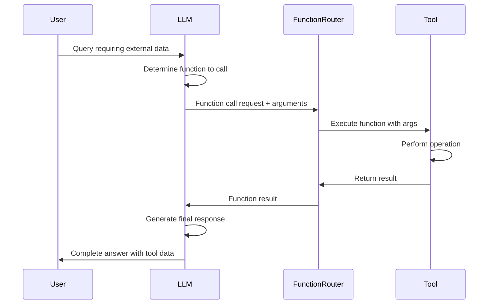
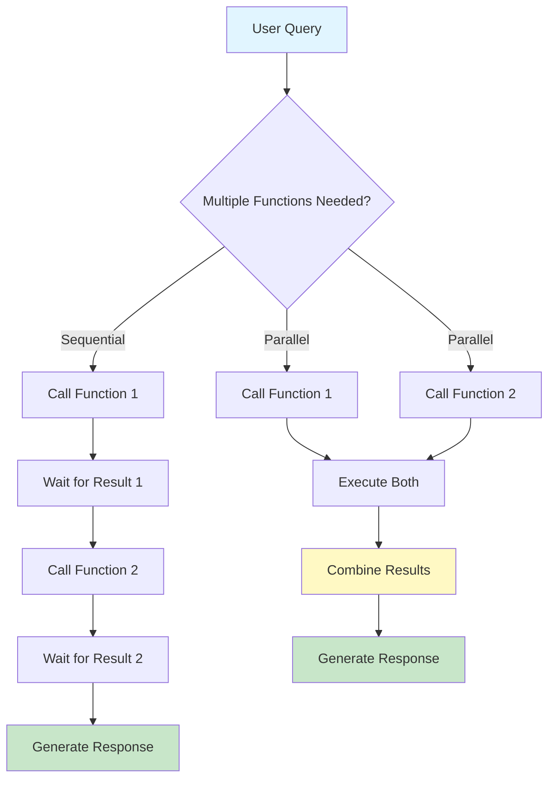
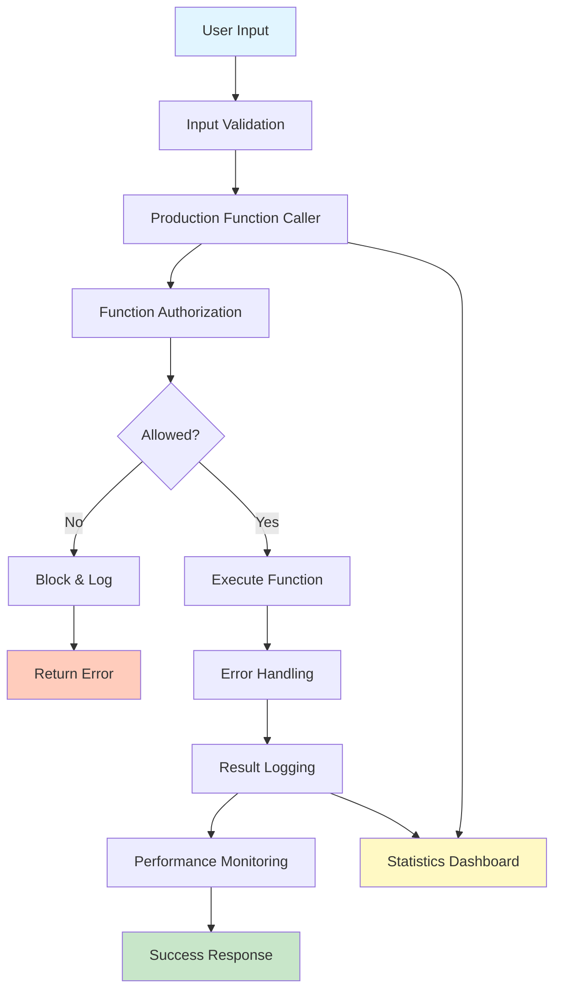

# Week 3 - Lesson 3: Function Calling & Tool Use

**Duration:** 90 minutes  
**Level:** Intermediate to Advanced  
**Prerequisites:** Week 3 Lessons 1-2, OpenAI API experience, Python proficiency

---

## 🎯 Learning Objectives

By the end of this lesson, you will:
- [ ] Understand function calling and its use cases
- [ ] Define function schemas with JSON Schema
- [ ] Implement single and parallel function calling
- [ ] Build tool-augmented LLM applications
- [ ] Handle function execution and response integration
- [ ] Implement multi-turn conversations with tools
- [ ] Apply error handling for function calls
- [ ] Create production-ready tool systems

---

## 📚 Table of Contents

1. [Introduction](#1-introduction)
2. [Function Calling Basics](#2-function-calling-basics)
3. [Function Schema Definition](#3-function-schema-definition)
4. [Executing Functions](#4-executing-functions)
5. [Parallel Function Calling](#5-parallel-function-calling)
6. [Multi-Turn Conversations](#6-multi-turn-conversations)
7. [Tool Integration Patterns](#7-tool-integration-patterns)
8. [Production Best Practices](#8-production-best-practices)
9. [Summary](#9-summary)
10. [Further Reading](#10-further-reading)

---

## 1. Introduction

### What is Function Calling?

Function calling allows LLMs to intelligently invoke external tools and functions, extending their capabilities beyond text generation.

### Why Function Calling Matters

- **Real-time Data**: Access current information (weather, stock prices, etc.)
- **Actions**: Perform operations (send emails, update databases)
- **Computations**: Use precise calculations instead of approximations
- **Integration**: Connect LLMs with existing systems and APIs
- **Reliability**: Structured outputs for downstream processing

### Function Calling Flow



### When to Use Function Calling

**Good Use Cases:**
- Querying databases for current data
- Performing calculations
- Accessing external APIs
- Triggering workflows
- Validating structured data

**Not Ideal For:**
- Simple text generation
- Tasks requiring reasoning only
- When latency is critical
- Unstructured exploration

---

## 2. Function Calling Basics

### 2.1 Simple Function Call

```python
"""
Basic Function Calling Example
"""

from openai import OpenAI
import json
import os
from dotenv import load_dotenv
from typing import Dict, List, Any

load_dotenv()
client = OpenAI(api_key=os.getenv("OPENAI_API_KEY"))


def get_current_weather(location: str, unit: str = "celsius") -> Dict[str, Any]:
    """
    Get the current weather for a location.
    
    Args:
        location: City and country (e.g., "London, UK")
        unit: Temperature unit ("celsius" or "fahrenheit")
        
    Returns:
        Weather information dictionary
    """
    # Simulated weather data (in production, call real API)
    weather_data = {
        "London, UK": {"temperature": 15, "condition": "Cloudy", "humidity": 65},
        "New York, USA": {"temperature": 22, "condition": "Sunny", "humidity": 45},
        "Tokyo, Japan": {"temperature": 18, "condition": "Rainy", "humidity": 80}
    }
    
    location_data = weather_data.get(location, {
        "temperature": 20,
        "condition": "Clear",
        "humidity": 50
    })
    
    # Convert to fahrenheit if needed
    if unit == "fahrenheit":
        location_data["temperature"] = (location_data["temperature"] * 9/5) + 32
    
    return {
        "location": location,
        "temperature": location_data["temperature"],
        "unit": unit,
        "condition": location_data["condition"],
        "humidity": location_data["humidity"]
    }


# Define function for the model
tools = [
    {
        "type": "function",
        "function": {
            "name": "get_current_weather",
            "description": "Get the current weather in a given location",
            "parameters": {
                "type": "object",
                "properties": {
                    "location": {
                        "type": "string",
                        "description": "The city and country, e.g. London, UK"
                    },
                    "unit": {
                        "type": "string",
                        "enum": ["celsius", "fahrenheit"],
                        "description": "The temperature unit"
                    }
                },
                "required": ["location"]
            }
        }
    }
]


def run_conversation(user_message: str) -> str:
    """
    Run a conversation with function calling.
    
    Args:
        user_message: User's question
        
    Returns:
        Final response
    """
    messages = [{"role": "user", "content": user_message}]
    
    # First API call
    response = client.chat.completions.create(
        model="gpt-4o-mini",
        messages=messages,
        tools=tools,
        tool_choice="auto"  # Let model decide whether to call function
    )
    
    response_message = response.choices[0].message
    
    # Check if model wants to call a function
    if response_message.tool_calls:
        # Add model's response to messages
        messages.append(response_message)
        
        # Execute each function call
        for tool_call in response_message.tool_calls:
            function_name = tool_call.function.name
            function_args = json.loads(tool_call.function.arguments)
            
            print(f"\n🔧 Calling function: {function_name}")
            print(f"   Arguments: {function_args}")
            
            # Execute the function
            if function_name == "get_current_weather":
                function_response = get_current_weather(**function_args)
            else:
                function_response = {"error": "Unknown function"}
            
            print(f"   Result: {function_response}")
            
            # Add function response to messages
            messages.append({
                "role": "tool",
                "tool_call_id": tool_call.id,
                "content": json.dumps(function_response)
            })
        
        # Second API call with function results
        second_response = client.chat.completions.create(
            model="gpt-4o-mini",
            messages=messages
        )
        
        return second_response.choices[0].message.content
    
    # No function call needed
    return response_message.content


# Test the function calling
print("Function Calling Example:")
print("="*80)

queries = [
    "What's the weather like in London?",
    "How's the weather in New York in fahrenheit?",
    "Tell me about the weather in Tokyo"
]

for query in queries:
    print(f"\nUser: {query}")
    response = run_conversation(query)
    print(f"Assistant: {response}")
    print("-"*80)
```

### 2.2 Understanding Tool Choice

```python
"""
Tool Choice Options
"""


def demonstrate_tool_choice(query: str, tool_choice_setting: str):
    """
    Demonstrate different tool_choice settings.
    
    Args:
        query: User query
        tool_choice_setting: "auto", "none", or specific function
    """
    print(f"\nQuery: {query}")
    print(f"Tool choice: {tool_choice_setting}")
    print("-"*60)
    
    messages = [{"role": "user", "content": query}]
    
    # Handle specific function choice
    if tool_choice_setting not in ["auto", "none"]:
        tool_choice = {
            "type": "function",
            "function": {"name": tool_choice_setting}
        }
    else:
        tool_choice = tool_choice_setting
    
    response = client.chat.completions.create(
        model="gpt-4o-mini",
        messages=messages,
        tools=tools,
        tool_choice=tool_choice
    )
    
    response_message = response.choices[0].message
    
    if response_message.tool_calls:
        print("✓ Function call triggered")
        for tool_call in response_message.tool_calls:
            print(f"  Function: {tool_call.function.name}")
            print(f"  Arguments: {tool_call.function.arguments}")
    else:
        print("✗ No function call")
        print(f"  Response: {response_message.content}")


print("\nTool Choice Options:")
print("="*80)

# Test different tool_choice settings
test_cases = [
    ("What's the weather in London?", "auto"),
    ("What's the weather in London?", "none"),
    ("What's the weather in London?", "get_current_weather"),
    ("Hello! How are you?", "auto"),
    ("Hello! How are you?", "get_current_weather")  # Force function call
]

for query, choice in test_cases:
    demonstrate_tool_choice(query, choice)
```

**Tool Choice Options:**
- `auto`: Model decides whether to call a function
- `none`: Model will not call any functions
- `required`: Model must call at least one function
- `{"type": "function", "function": {"name": "..."}}`: Force specific function

---

## 3. Function Schema Definition

### 3.1 JSON Schema for Functions

```python
"""
Comprehensive Function Schema Examples
"""


class FunctionSchemaBuilder:
    """
    Helper for building function schemas.
    """
    
    @staticmethod
    def build_schema(
        name: str,
        description: str,
        parameters: Dict[str, Any],
        required: List[str] = None
    ) -> Dict[str, Any]:
        """
        Build a function schema.
        
        Args:
            name: Function name
            description: What the function does
            parameters: Parameter definitions
            required: List of required parameter names
            
        Returns:
            Complete function schema
        """
        return {
            "type": "function",
            "function": {
                "name": name,
                "description": description,
                "parameters": {
                    "type": "object",
                    "properties": parameters,
                    "required": required or []
                }
            }
        }
    
    @staticmethod
    def string_param(description: str, enum: List[str] = None) -> Dict:
        """Define a string parameter."""
        param = {
            "type": "string",
            "description": description
        }
        if enum:
            param["enum"] = enum
        return param
    
    @staticmethod
    def number_param(description: str, minimum: float = None, maximum: float = None) -> Dict:
        """Define a number parameter."""
        param = {
            "type": "number",
            "description": description
        }
        if minimum is not None:
            param["minimum"] = minimum
        if maximum is not None:
            param["maximum"] = maximum
        return param
    
    @staticmethod
    def boolean_param(description: str) -> Dict:
        """Define a boolean parameter."""
        return {
            "type": "boolean",
            "description": description
        }
    
    @staticmethod
    def array_param(description: str, items_type: str = "string") -> Dict:
        """Define an array parameter."""
        return {
            "type": "array",
            "description": description,
            "items": {"type": items_type}
        }
    
    @staticmethod
    def object_param(description: str, properties: Dict[str, Any]) -> Dict:
        """Define an object parameter."""
        return {
            "type": "object",
            "description": description,
            "properties": properties
        }


# Example schemas
builder = FunctionSchemaBuilder()

# Example 1: Database query function
db_query_schema = builder.build_schema(
    name="query_database",
    description="Query the sales database to retrieve information",
    parameters={
        "table": builder.string_param(
            "The database table to query",
            enum=["customers", "orders", "products"]
        ),
        "filters": builder.object_param(
            "Filter conditions for the query",
            properties={
                "column": builder.string_param("Column name to filter on"),
                "operator": builder.string_param("Comparison operator", enum=["=", ">", "<", "LIKE"]),
                "value": builder.string_param("Value to compare against")
            }
        ),
        "limit": builder.number_param(
            "Maximum number of results to return",
            minimum=1,
            maximum=1000
        )
    },
    required=["table"]
)

# Example 2: Email sending function
send_email_schema = builder.build_schema(
    name="send_email",
    description="Send an email to one or more recipients",
    parameters={
        "to": builder.array_param("List of recipient email addresses"),
        "subject": builder.string_param("Email subject line"),
        "body": builder.string_param("Email body content"),
        "cc": builder.array_param("List of CC email addresses"),
        "urgent": builder.boolean_param("Whether the email is urgent")
    },
    required=["to", "subject", "body"]
)

# Example 3: Calculator function
calculate_schema = builder.build_schema(
    name="calculate",
    description="Perform mathematical calculations",
    parameters={
        "expression": builder.string_param("Mathematical expression to evaluate (e.g., '2 + 2', 'sqrt(16)')"),
        "precision": builder.number_param("Number of decimal places for result", minimum=0, maximum=10)
    },
    required=["expression"]
)

print("Function Schema Examples:")
print("="*80)

for schema in [db_query_schema, send_email_schema, calculate_schema]:
    print(f"\n{schema['function']['name']}:")
    print(json.dumps(schema, indent=2))
    print("-"*80)
```

### 3.2 Schema Best Practices

```python
"""
Best Practices for Function Schemas
"""


def good_schema_example():
    """Example of a well-defined schema."""
    return {
        "type": "function",
        "function": {
            "name": "get_stock_price",  # Clear, descriptive name
            "description": "Get the current stock price for a given ticker symbol. Returns real-time price data from the stock exchange.",  # Detailed description
            "parameters": {
                "type": "object",
                "properties": {
                    "symbol": {
                        "type": "string",
                        "description": "Stock ticker symbol (e.g., AAPL for Apple, GOOGL for Google)"  # Clear with examples
                    },
                    "currency": {
                        "type": "string",
                        "enum": ["USD", "EUR", "GBP"],  # Use enums for limited options
                        "description": "Currency for price display"
                    }
                },
                "required": ["symbol"]  # Only require essential parameters
            }
        }
    }


def poor_schema_example():
    """Example of a poorly-defined schema."""
    return {
        "type": "function",
        "function": {
            "name": "get_data",  # Too vague
            "description": "Gets data",  # Not helpful
            "parameters": {
                "type": "object",
                "properties": {
                    "param1": {  # Non-descriptive name
                        "type": "string",
                        "description": "A parameter"  # Vague description
                    },
                    "param2": {
                        "type": "string"  # Missing description
                    }
                },
                "required": ["param1", "param2"]  # Everything required
            }
        }
    }


print("\nSchema Best Practices:")
print("="*80)

print("\n✓ GOOD SCHEMA:")
print(json.dumps(good_schema_example(), indent=2))

print("\n✗ POOR SCHEMA:")
print(json.dumps(poor_schema_example(), indent=2))

print("\n📋 Best Practices:")
print("""
1. Use descriptive function names (verb + noun)
2. Write detailed descriptions with examples
3. Provide clear parameter descriptions
4. Use enums for limited option sets
5. Only mark truly required parameters as required
6. Add validation constraints (min, max, patterns)
7. Use appropriate data types
8. Include units in descriptions (e.g., "temperature in celsius")
9. Document expected formats (e.g., "ISO 8601 date")
10. Keep schemas focused - one function, one purpose
""")
```

---

## 4. Executing Functions

### 4.1 Function Executor Pattern

```python
"""
Function Execution Framework
"""

from typing import Callable, Dict, Any, Optional
import traceback


class FunctionExecutor:
    """
    Manages function registration and execution.
    """
    
    def __init__(self):
        self.functions: Dict[str, Callable] = {}
        self.schemas: List[Dict[str, Any]] = []
    
    def register(
        self,
        func: Callable,
        schema: Dict[str, Any]
    ):
        """
        Register a function with its schema.
        
        Args:
            func: The actual function to execute
            schema: The function's schema for the API
        """
        function_name = schema["function"]["name"]
        self.functions[function_name] = func
        self.schemas.append(schema)
        print(f"✓ Registered function: {function_name}")
    
    def execute(
        self,
        function_name: str,
        arguments: Dict[str, Any]
    ) -> Dict[str, Any]:
        """
        Execute a function with given arguments.
        
        Args:
            function_name: Name of function to execute
            arguments: Function arguments
            
        Returns:
            Function result or error
        """
        if function_name not in self.functions:
            return {
                "error": f"Unknown function: {function_name}",
                "available_functions": list(self.functions.keys())
            }
        
        try:
            func = self.functions[function_name]
            result = func(**arguments)
            return {
                "success": True,
                "result": result
            }
        except TypeError as e:
            return {
                "error": f"Invalid arguments: {str(e)}",
                "function": function_name,
                "provided_arguments": arguments
            }
        except Exception as e:
            return {
                "error": f"Execution failed: {str(e)}",
                "function": function_name,
                "traceback": traceback.format_exc()
            }
    
    def get_schemas(self) -> List[Dict[str, Any]]:
        """Get all registered function schemas."""
        return self.schemas


# Create executor and register functions
executor = FunctionExecutor()


# Define some example functions
def search_products(query: str, category: str = None, max_results: int = 10) -> Dict:
    """Search for products in catalog."""
    # Simulated product search
    products = [
        {"id": 1, "name": "Laptop", "category": "Electronics", "price": 999},
        {"id": 2, "name": "Mouse", "category": "Electronics", "price": 29},
        {"id": 3, "name": "Desk", "category": "Furniture", "price": 299}
    ]
    
    # Filter by query and category
    results = [
        p for p in products
        if query.lower() in p["name"].lower()
        and (category is None or p["category"] == category)
    ]
    
    return {
        "query": query,
        "category": category,
        "count": len(results[:max_results]),
        "products": results[:max_results]
    }


def calculate_shipping(weight: float, destination: str, express: bool = False) -> Dict:
    """Calculate shipping cost."""
    base_rate = 5.00
    per_kg_rate = 2.50
    express_multiplier = 2.0
    
    cost = base_rate + (weight * per_kg_rate)
    if express:
        cost *= express_multiplier
    
    return {
        "weight_kg": weight,
        "destination": destination,
        "express": express,
        "cost_usd": round(cost, 2),
        "estimated_days": 1 if express else 5
    }


# Register functions with schemas
search_schema = builder.build_schema(
    name="search_products",
    description="Search for products in the catalog",
    parameters={
        "query": builder.string_param("Search query (product name or keywords)"),
        "category": builder.string_param("Product category filter", enum=["Electronics", "Furniture", "Clothing"]),
        "max_results": builder.number_param("Maximum number of results", minimum=1, maximum=50)
    },
    required=["query"]
)

shipping_schema = builder.build_schema(
    name="calculate_shipping",
    description="Calculate shipping cost for an order",
    parameters={
        "weight": builder.number_param("Package weight in kilograms", minimum=0.1),
        "destination": builder.string_param("Destination country code (e.g., US, UK, DE)"),
        "express": builder.boolean_param("Whether to use express shipping")
    },
    required=["weight", "destination"]
)

executor.register(search_products, search_schema)
executor.register(calculate_shipping, shipping_schema)


# Test function execution
print("\nFunction Execution Examples:")
print("="*80)

test_executions = [
    ("search_products", {"query": "laptop"}),
    ("search_products", {"query": "mouse", "category": "Electronics", "max_results": 5}),
    ("calculate_shipping", {"weight": 2.5, "destination": "US"}),
    ("calculate_shipping", {"weight": 1.0, "destination": "UK", "express": True}),
    ("unknown_function", {}),  # Error case
]

for func_name, args in test_executions:
    print(f"\nExecuting: {func_name}({args})")
    result = executor.execute(func_name, args)
    print(f"Result: {json.dumps(result, indent=2)}")
    print("-"*80)
```

### 4.2 Complete Conversation Flow

```python
"""
Complete Function Calling Conversation
"""


class FunctionCallingAgent:
    """
    Agent that handles function calling conversations.
    """
    
    def __init__(
        self,
        executor: FunctionExecutor,
        model: str = "gpt-4o-mini"
    ):
        self.executor = executor
        self.model = model
        self.client = client
    
    def run(
        self,
        user_message: str,
        max_iterations: int = 5
    ) -> Dict[str, Any]:
        """
        Run a conversation with function calling.
        
        Args:
            user_message: User's message
            max_iterations: Maximum function calling iterations
            
        Returns:
            Conversation result
        """
        messages = [{"role": "user", "content": user_message}]
        iterations = 0
        
        print(f"\n{'='*80}")
        print(f"User: {user_message}")
        print(f"{'='*80}")
        
        while iterations < max_iterations:
            iterations += 1
            print(f"\nIteration {iterations}:")
            
            # Call API
            response = self.client.chat.completions.create(
                model=self.model,
                messages=messages,
                tools=self.executor.get_schemas(),
                tool_choice="auto"
            )
            
            response_message = response.choices[0].message
            
            # Check if done
            if not response_message.tool_calls:
                print(f"✓ Final response: {response_message.content}")
                return {
                    "success": True,
                    "response": response_message.content,
                    "iterations": iterations,
                    "messages": messages
                }
            
            # Process function calls
            messages.append(response_message)
            
            for tool_call in response_message.tool_calls:
                function_name = tool_call.function.name
                function_args = json.loads(tool_call.function.arguments)
                
                print(f"  → Calling: {function_name}({function_args})")
                
                # Execute function
                result = self.executor.execute(function_name, function_args)
                
                print(f"  ← Result: {result}")
                
                # Add result to messages
                messages.append({
                    "role": "tool",
                    "tool_call_id": tool_call.id,
                    "content": json.dumps(result)
                })
        
        return {
            "success": False,
            "error": "Max iterations reached",
            "iterations": iterations,
            "messages": messages
        }


# Create and test agent
agent = FunctionCallingAgent(executor)

print("\nFunction Calling Agent Examples:")
print("="*80)

test_queries = [
    "Find me a laptop",
    "Search for electronics under mouse, and calculate shipping to US for 1kg",
    "How much would it cost to ship a 3kg package to the UK with express shipping?"
]

for query in test_queries:
    result = agent.run(query)
    print(f"\n{'='*80}")
    print(f"Status: {'Success' if result['success'] else 'Failed'}")
    print(f"Iterations: {result['iterations']}")
    if result.get('response'):
        print(f"Response: {result['response']}")
```

---

## 5. Parallel Function Calling

### 5.1 Multiple Functions at Once

```python
"""
Parallel Function Calling
"""


def demonstrate_parallel_calls(query: str):
    """
    Demonstrate parallel function calling.
    
    Args:
        query: User query that requires multiple function calls
    """
    print(f"\nQuery: {query}")
    print("="*80)
    
    messages = [{"role": "user", "content": query}]
    
    # First API call
    response = client.chat.completions.create(
        model="gpt-4o",  # GPT-4o supports parallel function calling
        messages=messages,
        tools=executor.get_schemas(),
        tool_choice="auto"
    )
    
    response_message = response.choices[0].message
    
    if response_message.tool_calls:
        print(f"\n✓ Model requested {len(response_message.tool_calls)} function calls:")
        
        messages.append(response_message)
        
        # Execute all function calls
        for i, tool_call in enumerate(response_message.tool_calls, 1):
            function_name = tool_call.function.name
            function_args = json.loads(tool_call.function.arguments)
            
            print(f"\n{i}. {function_name}")
            print(f"   Args: {function_args}")
            
            # Execute
            result = executor.execute(function_name, function_args)
            print(f"   Result: {json.dumps(result, indent=2)}")
            
            # Add to messages
            messages.append({
                "role": "tool",
                "tool_call_id": tool_call.id,
                "content": json.dumps(result)
            })
        
        # Get final response
        print("\n" + "-"*80)
        print("Getting final response...")
        
        final_response = client.chat.completions.create(
            model="gpt-4o",
            messages=messages
        )
        
        print(f"\nFinal Response:")
        print(final_response.choices[0].message.content)
    else:
        print("\n✗ No function calls needed")
        print(f"Response: {response_message.content}")


# Test parallel function calling
print("\nParallel Function Calling Examples:")
print("="*80)

parallel_queries = [
    "Find laptops and calculate shipping to US for 2kg",
    "Search for mouse in Electronics category and calculate express shipping to UK for 0.5kg"
]

for query in parallel_queries:
    demonstrate_parallel_calls(query)
    print("\n" + "="*80)
```

### Parallel vs Sequential Function Calling



---

## 6. Multi-Turn Conversations

### 6.1 Stateful Conversations with Tools

```python
"""
Multi-Turn Conversations with Function Calling
"""


class ConversationManager:
    """
    Manage multi-turn conversations with function calling.
    """
    
    def __init__(
        self,
        executor: FunctionExecutor,
        system_message: str = None
    ):
        self.executor = executor
        self.messages = []
        
        if system_message:
            self.messages.append({
                "role": "system",
                "content": system_message
            })
        
        self.client = client
        self.model = "gpt-4o-mini"
    
    def send_message(self, user_message: str) -> str:
        """
        Send a message and get response.
        
        Args:
            user_message: User's message
            
        Returns:
            Assistant's response
        """
        # Add user message
        self.messages.append({
            "role": "user",
            "content": user_message
        })
        
        print(f"\nUser: {user_message}")
        
        # Process with function calling
        while True:
            response = self.client.chat.completions.create(
                model=self.model,
                messages=self.messages,
                tools=self.executor.get_schemas(),
                tool_choice="auto"
            )
            
            response_message = response.choices[0].message
            
            # If no function calls, we're done
            if not response_message.tool_calls:
                self.messages.append({
                    "role": "assistant",
                    "content": response_message.content
                })
                print(f"Assistant: {response_message.content}")
                return response_message.content
            
            # Execute function calls
            self.messages.append(response_message)
            
            for tool_call in response_message.tool_calls:
                function_name = tool_call.function.name
                function_args = json.loads(tool_call.function.arguments)
                
                print(f"  [Calling {function_name}...]")
                
                result = self.executor.execute(function_name, function_args)
                
                self.messages.append({
                    "role": "tool",
                    "tool_call_id": tool_call.id,
                    "content": json.dumps(result)
                })
    
    def get_history(self) -> List[Dict[str, str]]:
        """Get conversation history."""
        return self.messages
    
    def clear_history(self):
        """Clear conversation history (keeps system message)."""
        system_messages = [m for m in self.messages if m["role"] == "system"]
        self.messages = system_messages


# Test multi-turn conversation
print("\nMulti-Turn Conversation Example:")
print("="*80)

conversation = ConversationManager(
    executor,
    system_message="You are a helpful shopping assistant. Help users find products and calculate shipping costs."
)

# Simulate conversation
turns = [
    "Hello! I'm looking for a laptop.",
    "That looks good. How much would shipping cost to the US if it weighs 2kg?",
    "What about express shipping?",
    "Thanks! Can you also search for a mouse?"
]

for turn in turns:
    response = conversation.send_message(turn)
    print("-"*80)

print(f"\n\nTotal messages in conversation: {len(conversation.get_history())}")
```

---

## 7. Tool Integration Patterns

### 7.1 Common Tool Patterns

```python
"""
Common Tool Integration Patterns
"""


class ToolPatterns:
    """
    Common patterns for tool integration.
    """
    
    @staticmethod
    def api_wrapper_tool(api_endpoint: str, api_key: str) -> Callable:
        """
        Pattern: Wrap external API as a tool.
        
        Args:
            api_endpoint: API base URL
            api_key: API authentication key
            
        Returns:
            Function that calls the API
        """
        def call_api(endpoint: str, params: Dict = None) -> Dict:
            """Call external API."""
            import requests
            
            headers = {"Authorization": f"Bearer {api_key}"}
            url = f"{api_endpoint}/{endpoint}"
            
            try:
                response = requests.get(url, params=params, headers=headers, timeout=10)
                response.raise_for_status()
                return response.json()
            except Exception as e:
                return {"error": str(e)}
        
        return call_api
    
    @staticmethod
    def database_tool(connection_string: str) -> Callable:
        """
        Pattern: Database query tool.
        
        Args:
            connection_string: Database connection string
            
        Returns:
            Function that queries database
        """
        def query_db(sql: str, params: List = None) -> Dict:
            """Execute database query."""
            # In production, use proper DB library
            # This is a simplified example
            return {
                "success": True,
                "rows": [],
                "message": f"Would execute: {sql}"
            }
        
        return query_db
    
    @staticmethod
    def file_operation_tool(base_path: str) -> Dict[str, Callable]:
        """
        Pattern: File system operations.
        
        Args:
            base_path: Base directory for operations
            
        Returns:
            Dictionary of file operation functions
        """
        def read_file(filename: str) -> Dict:
            """Read file contents."""
            import os
            
            filepath = os.path.join(base_path, filename)
            
            # Security: validate path
            if not os.path.abspath(filepath).startswith(os.path.abspath(base_path)):
                return {"error": "Invalid path"}
            
            try:
                with open(filepath, 'r') as f:
                    return {"success": True, "content": f.read()}
            except Exception as e:
                return {"error": str(e)}
        
        def write_file(filename: str, content: str) -> Dict:
            """Write file contents."""
            import os
            
            filepath = os.path.join(base_path, filename)
            
            # Security: validate path
            if not os.path.abspath(filepath).startswith(os.path.abspath(base_path)):
                return {"error": "Invalid path"}
            
            try:
                with open(filepath, 'w') as f:
                    f.write(content)
                return {"success": True, "message": f"Wrote to {filename}"}
            except Exception as e:
                return {"error": str(e)}
        
        def list_files() -> Dict:
            """List files in directory."""
            import os
            
            try:
                files = os.listdir(base_path)
                return {"success": True, "files": files}
            except Exception as e:
                return {"error": str(e)}
        
        return {
            "read_file": read_file,
            "write_file": write_file,
            "list_files": list_files
        }
    
    @staticmethod
    def computation_tool() -> Dict[str, Callable]:
        """
        Pattern: Mathematical/computational tools.
        
        Returns:
            Dictionary of computation functions
        """
        def calculate(expression: str) -> Dict:
            """Safely evaluate mathematical expression."""
            import ast
            import operator
            
            # Safe operators
            operators = {
                ast.Add: operator.add,
                ast.Sub: operator.sub,
                ast.Mult: operator.mul,
                ast.Div: operator.truediv,
                ast.Pow: operator.pow
            }
            
            def eval_expr(node):
                if isinstance(node, ast.Num):
                    return node.n
                elif isinstance(node, ast.BinOp):
                    return operators[type(node.op)](
                        eval_expr(node.left),
                        eval_expr(node.right)
                    )
                else:
                    raise ValueError("Unsupported operation")
            
            try:
                tree = ast.parse(expression, mode='eval')
                result = eval_expr(tree.body)
                return {"success": True, "result": result}
            except Exception as e:
                return {"error": str(e)}
        
        def statistics(numbers: List[float], operation: str) -> Dict:
            """Calculate statistics on numbers."""
            import statistics as stats
            
            ops = {
                "mean": stats.mean,
                "median": stats.median,
                "stdev": stats.stdev,
                "variance": stats.variance
            }
            
            if operation not in ops:
                return {"error": f"Unknown operation: {operation}"}
            
            try:
                result = ops[operation](numbers)
                return {"success": True, "result": result}
            except Exception as e:
                return {"error": str(e)}
        
        return {
            "calculate": calculate,
            "statistics": statistics
        }


print("\nTool Integration Patterns:")
print("="*80)

# Demonstrate patterns
patterns = ToolPatterns()

# API wrapper example
print("\n1. API Wrapper Pattern:")
api_tool = patterns.api_wrapper_tool("https://api.example.com", "fake-key")
print(f"   Created API wrapper tool")

# Database tool example
print("\n2. Database Tool Pattern:")
db_tool = patterns.database_tool("postgresql://localhost/mydb")
result = db_tool("SELECT * FROM users WHERE id = ?", [1])
print(f"   Result: {result}")

# File operations example
print("\n3. File Operations Pattern:")
file_tools = patterns.file_operation_tool("/tmp/safe_dir")
print(f"   Created {len(file_tools)} file operation tools")

# Computation tools example
print("\n4. Computation Tools Pattern:")
comp_tools = patterns.computation_tool()
calc_result = comp_tools["calculate"]("2 + 3 * 4")
print(f"   Calculate result: {calc_result}")
```

---

## 8. Production Best Practices

### 8.1 Complete Production System

```python
"""
Production-Ready Function Calling System
"""

from dataclasses import dataclass
from datetime import datetime
import logging

logging.basicConfig(level=logging.INFO)
logger = logging.getLogger(__name__)


@dataclass
class FunctionCallLog:
    """Log entry for function call."""
    timestamp: datetime
    function_name: str
    arguments: Dict[str, Any]
    result: Any
    success: bool
    error: Optional[str] = None
    execution_time: float = 0.0


class ProductionFunctionCaller:
    """
    Production-ready function calling system.
    """
    
    def __init__(
        self,
        executor: FunctionExecutor,
        model: str = "gpt-4o-mini",
        max_iterations: int = 5,
        timeout: int = 30
    ):
        self.executor = executor
        self.model = model
        self.max_iterations = max_iterations
        self.timeout = timeout
        self.client = client
        
        self.call_logs: List[FunctionCallLog] = []
    
    def _execute_with_logging(
        self,
        function_name: str,
        arguments: Dict[str, Any]
    ) -> Dict[str, Any]:
        """
        Execute function with logging and error handling.
        
        Args:
            function_name: Function to execute
            arguments: Function arguments
            
        Returns:
            Execution result
        """
        start_time = datetime.now()
        
        try:
            result = self.executor.execute(function_name, arguments)
            execution_time = (datetime.now() - start_time).total_seconds()
            
            # Log call
            log_entry = FunctionCallLog(
                timestamp=start_time,
                function_name=function_name,
                arguments=arguments,
                result=result,
                success=result.get("success", False),
                execution_time=execution_time
            )
            self.call_logs.append(log_entry)
            
            logger.info(
                f"Function call: {function_name} - "
                f"Success: {log_entry.success} - "
                f"Time: {execution_time:.3f}s"
            )
            
            return result
            
        except Exception as e:
            execution_time = (datetime.now() - start_time).total_seconds()
            error_msg = str(e)
            
            log_entry = FunctionCallLog(
                timestamp=start_time,
                function_name=function_name,
                arguments=arguments,
                result=None,
                success=False,
                error=error_msg,
                execution_time=execution_time
            )
            self.call_logs.append(log_entry)
            
            logger.error(f"Function call failed: {function_name} - {error_msg}")
            
            return {"error": error_msg}
    
    def execute_with_validation(
        self,
        user_message: str,
        allowed_functions: List[str] = None
    ) -> Dict[str, Any]:
        """
        Execute with function whitelisting.
        
        Args:
            user_message: User's message
            allowed_functions: List of allowed function names (None = all allowed)
            
        Returns:
            Execution result
        """
        messages = [{"role": "user", "content": user_message}]
        iterations = 0
        
        while iterations < self.max_iterations:
            iterations += 1
            
            # Get response
            response = self.client.chat.completions.create(
                model=self.model,
                messages=messages,
                tools=self.executor.get_schemas(),
                tool_choice="auto",
                timeout=self.timeout
            )
            
            response_message = response.choices[0].message
            
            # Check if done
            if not response_message.tool_calls:
                return {
                    "success": True,
                    "response": response_message.content,
                    "iterations": iterations
                }
            
            # Validate and execute function calls
            messages.append(response_message)
            
            for tool_call in response_message.tool_calls:
                function_name = tool_call.function.name
                
                # Validate function is allowed
                if allowed_functions and function_name not in allowed_functions:
                    result = {
                        "error": f"Function '{function_name}' is not allowed",
                        "allowed_functions": allowed_functions
                    }
                    logger.warning(f"Blocked unauthorized function call: {function_name}")
                else:
                    function_args = json.loads(tool_call.function.arguments)
                    result = self._execute_with_logging(function_name, function_args)
                
                messages.append({
                    "role": "tool",
                    "tool_call_id": tool_call.id,
                    "content": json.dumps(result)
                })
        
        return {
            "success": False,
            "error": "Max iterations reached",
            "iterations": iterations
        }
    
    def get_statistics(self) -> Dict[str, Any]:
        """Get execution statistics."""
        if not self.call_logs:
            return {"message": "No function calls logged"}
        
        total_calls = len(self.call_logs)
        successful_calls = sum(1 for log in self.call_logs if log.success)
        failed_calls = total_calls - successful_calls
        
        avg_execution_time = sum(log.execution_time for log in self.call_logs) / total_calls
        
        # Group by function
        by_function = {}
        for log in self.call_logs:
            func = log.function_name
            if func not in by_function:
                by_function[func] = {"calls": 0, "successes": 0, "failures": 0}
            by_function[func]["calls"] += 1
            if log.success:
                by_function[func]["successes"] += 1
            else:
                by_function[func]["failures"] += 1
        
        return {
            "total_calls": total_calls,
            "successful_calls": successful_calls,
            "failed_calls": failed_calls,
            "success_rate": (successful_calls / total_calls) * 100,
            "average_execution_time": avg_execution_time,
            "by_function": by_function
        }


# Test production system
print("\nProduction Function Calling System:")
print("="*80)

prod_caller = ProductionFunctionCaller(executor, max_iterations=3)

# Test with whitelisting
test_cases = [
    ("Find a laptop", ["search_products"]),  # Only allow search
    ("Calculate shipping for 2kg to US", ["calculate_shipping"]),  # Only allow shipping
    ("Find a mouse and calculate shipping to UK for 1kg", None)  # Allow all
]

for query, allowed in test_cases:
    print(f"\nQuery: {query}")
    print(f"Allowed functions: {allowed or 'All'}")
    print("-"*60)
    
    result = prod_caller.execute_with_validation(query, allowed)
    print(f"Result: {result.get('response', result.get('error'))}")

# Print statistics
print("\n" + "="*80)
print("\nExecution Statistics:")
stats = prod_caller.get_statistics()
print(json.dumps(stats, indent=2))
```

### Production Architecture



---

## 9. Summary

### Key Takeaways

1. **Function calling** extends LLMs with external tools and real-time data
2. **JSON schemas** define function interfaces clearly
3. **Parallel calls** improve efficiency for multiple operations
4. **Multi-turn conversations** maintain context across function calls
5. **Production systems** require logging, validation, and error handling
6. **Security** is critical - validate and whitelist functions
7. **Tool patterns** solve common integration challenges

### Function Calling Checklist

- [ ] Define clear, descriptive function schemas
- [ ] Implement robust error handling
- [ ] Log all function calls and results
- [ ] Validate function arguments
- [ ] Whitelist allowed functions
- [ ] Set appropriate timeout values
- [ ] Monitor performance and costs
- [ ] Test edge cases thoroughly

### Best Practices

**Schema Design:**
- Use descriptive names and descriptions
- Provide examples in descriptions
- Use enums for constrained values
- Only require essential parameters
- Document expected formats

**Execution:**
- Always validate function arguments
- Implement proper error handling
- Log all function calls
- Set reasonable timeouts
- Handle partial failures gracefully

**Security:**
- Whitelist allowed functions
- Validate all inputs
- Sanitize function outputs
- Use least privilege principle
- Audit function usage

### Next Steps

- [ ] Complete Lab 3: Function Calling System
- [ ] Build your own tool integrations
- [ ] Implement production error handling
- [ ] Create function call monitoring
- [ ] Move to Lesson 4: Structured Outputs & Production

---

## 10. Further Reading

### Official Documentation
- [Function Calling Guide](https://platform.openai.com/docs/guides/function-calling)
- [Function Calling Examples](https://cookbook.openai.com/examples/how_to_call_functions_with_chat_models)
- [JSON Schema Reference](https://json-schema.org/)

### Advanced Topics
- [Parallel Function Calling](https://platform.openai.com/docs/guides/function-calling/parallel-function-calling)
- [Tool Use Best Practices](https://platform.openai.com/docs/guides/function-calling/best-practices)
- [Function Calling with Streaming](https://cookbook.openai.com/examples/how_to_stream_completions)

### Libraries & Tools
- [Pydantic](https://docs.pydantic.dev/) - Data validation
- [LangChain Tools](https://python.langchain.com/docs/modules/agents/tools/)
- [OpenAI Cookbook](https://github.com/openai/openai-cookbook)

### Security Resources
- [OWASP API Security](https://owasp.org/www-project-api-security/)
- [Function Calling Security](https://platform.openai.com/docs/guides/safety-best-practices)

---

## 📝 Review Questions

1. What is the purpose of function calling in LLMs?
2. How do you define a function schema for the OpenAI API?
3. What's the difference between parallel and sequential function calling?
4. How do you handle errors in function execution?
5. What security considerations are important for function calling?
6. When should you use tool_choice="required"?
7. How do you implement multi-turn conversations with tools?

---

## 🔗 Related Content

- **Previous:** [Week 3 - Lesson 2: OpenAI API Mastery](02-openai-api-mastery.md)
- **Next:** [Week 3 - Lesson 4: Structured Outputs & Production](04-structured-outputs-production.md)
- **Related Lab:** `labs/lab-03-function-calling-system.ipynb`

---

**Author:** Training Team  
**Provided by:** ADC ENGINEERING & CONSULTING LTD  
**Last Updated:** November 5, 2025  
**Version:** 1.0
