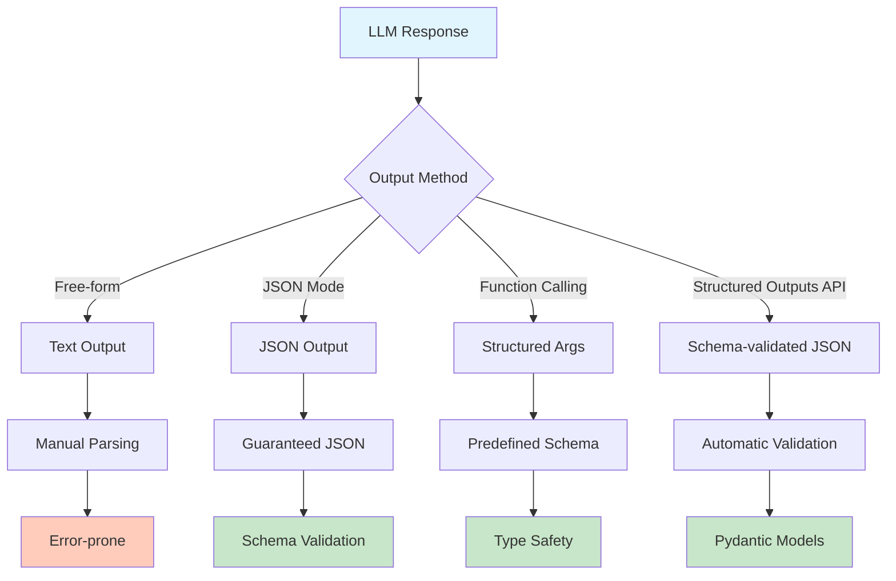

# Week 3 - Lesson 4: Structured Outputs & Production Patterns

**Duration:** 90 minutes  
**Level:** Advanced  
**Prerequisites:** Week 3 Lessons 1-3, JSON Schema knowledge, Pydantic experience helpful

---

## 🎯 Learning Objectives

By the end of this lesson, you will:
- [ ] Use JSON mode for guaranteed structured outputs
- [ ] Implement schema validation with JSON Schema
- [ ] Use Pydantic for type-safe data models
- [ ] Handle malformed outputs gracefully
- [ ] Build production-ready output pipelines
- [ ] Implement retry strategies for validation failures
- [ ] Optimize structured output generation
- [ ] Apply monitoring and logging best practices

---

## 📚 Table of Contents

1. [Introduction](#1-introduction)
2. [JSON Mode Basics](#2-json-mode-basics)
3. [Schema Validation](#3-schema-validation)
4. [Pydantic Integration](#4-pydantic-integration)
5. [Error Handling & Recovery](#5-error-handling--recovery)
6. [Production Patterns](#6-production-patterns)
7. [Performance Optimization](#7-performance-optimization)
8. [Monitoring & Observability](#8-monitoring--observability)
9. [Summary](#9-summary)
10. [Further Reading](#10-further-reading)

---

## 1. Introduction

### Why Structured Outputs Matter

LLMs naturally generate free-form text, but production systems often need:
- **Predictable formats** for downstream processing
- **Type safety** for application logic
- **Validation** to ensure data quality
- **Consistency** across multiple generations
- **Reliability** for critical business processes

### Challenges with Unstructured Outputs

```python
"""
Problems with Unstructured LLM Outputs
"""

from openai import OpenAI
import os
from dotenv import load_dotenv

load_dotenv()
client = OpenAI(api_key=os.getenv("OPENAI_API_KEY"))


def problematic_extraction():
    """Example of unreliable extraction without structure."""
    
    prompt = """
    Extract the following information from the text:
    - Name
    - Age
    - Email
    - City
    
    Text: "John Smith is 35 years old and lives in New York. Contact him at john@example.com"
    """
    
    response = client.chat.completions.create(
        model="gpt-4o-mini",
        messages=[{"role": "user", "content": prompt}]
    )
    
    output = response.choices[0].message.content
    print("Unstructured output:")
    print(output)
    print("\n⚠️ Issues:")
    print("- Format varies between requests")
    print("- Requires string parsing")
    print("- No validation")
    print("- Hard to handle missing fields")
    
    return output


# Demonstrate the problem
problematic_extraction()
```

### Benefits of Structured Outputs

- **Reliability:** Guaranteed format compliance
- **Type Safety:** Strong typing for applications
- **Validation:** Automatic schema validation
- **Parsing:** Direct object deserialization
- **Testing:** Easier to test and verify
- **Integration:** Seamless API integration

### Structured Output Approaches



---

## 2. JSON Mode Basics

### 2.1 Enabling JSON Mode

```python
"""
JSON Mode with OpenAI API
"""

import json
from typing import Dict, Any


def basic_json_mode_example():
    """
    Use JSON mode to ensure valid JSON output.
    """
    
    response = client.chat.completions.create(
        model="gpt-4o-mini",
        messages=[
            {
                "role": "system",
                "content": "You are a helpful assistant that outputs JSON."
            },
            {
                "role": "user",
                "content": """
                Extract person information from this text and return as JSON:
                
                "Sarah Johnson is a 28-year-old software engineer living in San Francisco. 
                She can be reached at sarah.j@techcorp.com or 555-0123."
                
                Return JSON with fields: name, age, occupation, city, email, phone
                """
            }
        ],
        response_format={"type": "json_object"}  # Enable JSON mode
    )
    
    # Output is guaranteed to be valid JSON
    json_output = response.choices[0].message.content
    print("Raw JSON output:")
    print(json_output)
    
    # Parse JSON safely
    data = json.loads(json_output)
    print("\nParsed data:")
    for key, value in data.items():
        print(f"  {key}: {value}")
    
    return data


print("JSON Mode Example:")
print("="*80)
result = basic_json_mode_example()
```

### 2.2 JSON Mode Best Practices

```python
"""
JSON Mode Best Practices
"""


class JSONModeHandler:
    """
    Handler for JSON mode interactions.
    """
    
    def __init__(self, model: str = "gpt-4o-mini"):
        self.model = model
        self.client = client
    
    def generate_json(
        self,
        prompt: str,
        system_message: str = "You are a helpful assistant that outputs valid JSON.",
        max_retries: int = 3
    ) -> Dict[str, Any]:
        """
        Generate JSON with retries.
        
        Args:
            prompt: User prompt requesting JSON
            system_message: System message (must mention JSON)
            max_retries: Maximum retry attempts
            
        Returns:
            Parsed JSON dictionary
        """
        for attempt in range(max_retries):
            try:
                response = self.client.chat.completions.create(
                    model=self.model,
                    messages=[
                        {"role": "system", "content": system_message},
                        {"role": "user", "content": prompt}
                    ],
                    response_format={"type": "json_object"}
                )
                
                json_str = response.choices[0].message.content
                data = json.loads(json_str)
                
                print(f"✓ Successfully generated JSON (attempt {attempt + 1})")
                return data
                
            except json.JSONDecodeError as e:
                print(f"✗ JSON decode error (attempt {attempt + 1}): {e}")
                if attempt == max_retries - 1:
                    raise
                continue
            except Exception as e:
                print(f"✗ Error (attempt {attempt + 1}): {e}")
                if attempt == max_retries - 1:
                    raise
                continue
        
        raise ValueError("Failed to generate valid JSON after retries")


# Test JSON mode handler
handler = JSONModeHandler()

print("\nJSON Mode Handler Example:")
print("="*80)

test_prompts = [
    """
    Create a product listing with:
    - name: "Premium Laptop"
    - price: 1299.99
    - category: "Electronics"
    - in_stock: true
    - tags: ["laptop", "premium", "business"]
    """,
    """
    Generate user profile:
    - username: "johndoe"
    - full_name: "John Doe"
    - age: 30
    - interests: ["coding", "hiking", "photography"]
    - premium_member: false
    """
]

for i, prompt in enumerate(test_prompts, 1):
    print(f"\nTest {i}:")
    result = handler.generate_json(prompt)
    print(json.dumps(result, indent=2))
    print("-"*80)
```

### 2.3 JSON Mode Limitations

```python
"""
Understanding JSON Mode Limitations
"""


def demonstrate_json_mode_limitations():
    """
    Show what JSON mode can and cannot do.
    """
    
    print("\n✓ JSON Mode Guarantees:")
    print("  - Output will be valid JSON")
    print("  - Can parse with json.loads()")
    print("  - No syntax errors")
    
    print("\n✗ JSON Mode Does NOT Guarantee:")
    print("  - Specific schema/structure")
    print("  - Required fields present")
    print("  - Correct data types")
    print("  - Field names you expect")
    print("  - Value constraints (min/max, etc.)")
    
    # Example: JSON mode gives valid JSON but wrong structure
    response = client.chat.completions.create(
        model="gpt-4o-mini",
        messages=[
            {"role": "system", "content": "Output JSON."},
            {"role": "user", "content": "Tell me about Paris."}
        ],
        response_format={"type": "json_object"}
    )
    
    result = json.loads(response.choices[0].message.content)
    print("\n📋 Example - Asked about Paris:")
    print(json.dumps(result, indent=2))
    print("\n⚠️ Valid JSON, but structure is unpredictable!")


demonstrate_json_mode_limitations()
```

---

## 3. Schema Validation

### 3.1 JSON Schema Basics

```python
"""
JSON Schema Validation
"""

from jsonschema import validate, ValidationError, Draft7Validator
from typing import Dict, Any


class SchemaValidator:
    """
    Validate JSON outputs against schemas.
    """
    
    @staticmethod
    def create_schema(
        title: str,
        required_fields: list,
        properties: Dict[str, Dict]
    ) -> Dict[str, Any]:
        """
        Create a JSON schema.
        
        Args:
            title: Schema title
            required_fields: List of required field names
            properties: Field definitions
            
        Returns:
            JSON Schema dictionary
        """
        return {
            "$schema": "http://json-schema.org/draft-07/schema#",
            "title": title,
            "type": "object",
            "required": required_fields,
            "properties": properties,
            "additionalProperties": False
        }
    
    @staticmethod
    def validate_json(data: Dict[str, Any], schema: Dict[str, Any]) -> tuple[bool, str]:
        """
        Validate JSON data against schema.
        
        Args:
            data: JSON data to validate
            schema: JSON schema
            
        Returns:
            Tuple of (is_valid, error_message)
        """
        try:
            validate(instance=data, schema=schema)
            return True, ""
        except ValidationError as e:
            return False, str(e)


# Example schemas
PERSON_SCHEMA = SchemaValidator.create_schema(
    title="Person",
    required_fields=["name", "age", "email"],
    properties={
        "name": {
            "type": "string",
            "minLength": 1,
            "maxLength": 100
        },
        "age": {
            "type": "integer",
            "minimum": 0,
            "maximum": 150
        },
        "email": {
            "type": "string",
            "format": "email"
        },
        "city": {
            "type": "string"
        },
        "phone": {
            "type": "string",
            "pattern": "^[0-9-]+$"
        }
    }
)

PRODUCT_SCHEMA = SchemaValidator.create_schema(
    title="Product",
    required_fields=["name", "price", "category"],
    properties={
        "name": {
            "type": "string",
            "minLength": 1
        },
        "price": {
            "type": "number",
            "minimum": 0
        },
        "category": {
            "type": "string",
            "enum": ["Electronics", "Clothing", "Food", "Books"]
        },
        "in_stock": {
            "type": "boolean"
        },
        "tags": {
            "type": "array",
            "items": {"type": "string"},
            "minItems": 0
        }
    }
)


print("\nJSON Schema Examples:")
print("="*80)

print("\nPerson Schema:")
print(json.dumps(PERSON_SCHEMA, indent=2))

print("\n\nProduct Schema:")
print(json.dumps(PRODUCT_SCHEMA, indent=2))


# Test validation
test_data = [
    (
        {"name": "John", "age": 30, "email": "john@example.com"},
        PERSON_SCHEMA,
        "Valid person"
    ),
    (
        {"name": "Jane", "age": -5, "email": "jane@example.com"},
        PERSON_SCHEMA,
        "Invalid age"
    ),
    (
        {"name": "Bob"},
        PERSON_SCHEMA,
        "Missing required fields"
    )
]

print("\n\nValidation Tests:")
print("-"*80)

for data, schema, description in test_data:
    is_valid, error = SchemaValidator.validate_json(data, schema)
    status = "✓" if is_valid else "✗"
    print(f"{status} {description}")
    print(f"   Data: {data}")
    if not is_valid:
        print(f"   Error: {error}")
    print()
```

### 3.2 Schema-Guided Generation

```python
"""
Generate JSON with Schema Guidance
"""


class SchemaGuidedGenerator:
    """
    Generate JSON outputs conforming to specific schemas.
    """
    
    def __init__(self, model: str = "gpt-4o-mini"):
        self.model = model
        self.client = client
        self.validator = SchemaValidator()
    
    def generate_with_schema(
        self,
        prompt: str,
        schema: Dict[str, Any],
        max_retries: int = 3
    ) -> Dict[str, Any]:
        """
        Generate JSON that conforms to schema.
        
        Args:
            prompt: Generation prompt
            schema: JSON schema to conform to
            max_retries: Maximum retry attempts
            
        Returns:
            Valid JSON data
        """
        # Create enhanced prompt with schema
        schema_description = self._schema_to_description(schema)
        
        enhanced_prompt = f"""
        {prompt}
        
        Output must be valid JSON matching this structure:
        {schema_description}
        
        Required fields: {', '.join(schema.get('required', []))}
        """
        
        for attempt in range(max_retries):
            try:
                response = self.client.chat.completions.create(
                    model=self.model,
                    messages=[
                        {
                            "role": "system",
                            "content": "You are a helpful assistant that generates valid JSON conforming to specified schemas."
                        },
                        {
                            "role": "user",
                            "content": enhanced_prompt
                        }
                    ],
                    response_format={"type": "json_object"}
                )
                
                data = json.loads(response.choices[0].message.content)
                
                # Validate against schema
                is_valid, error = self.validator.validate_json(data, schema)
                
                if is_valid:
                    print(f"✓ Generated valid data (attempt {attempt + 1})")
                    return data
                else:
                    print(f"✗ Validation failed (attempt {attempt + 1}): {error}")
                    if attempt < max_retries - 1:
                        # Add error feedback to next attempt
                        enhanced_prompt += f"\n\nPrevious attempt failed validation: {error}"
                    continue
                    
            except Exception as e:
                print(f"✗ Generation error (attempt {attempt + 1}): {e}")
                if attempt == max_retries - 1:
                    raise
        
        raise ValueError(f"Failed to generate valid data after {max_retries} attempts")
    
    def _schema_to_description(self, schema: Dict[str, Any]) -> str:
        """Convert schema to human-readable description."""
        props = schema.get("properties", {})
        desc_lines = []
        
        for field, spec in props.items():
            field_type = spec.get("type", "any")
            required = field in schema.get("required", [])
            req_marker = " (required)" if required else " (optional)"
            
            desc = f"- {field}: {field_type}{req_marker}"
            
            # Add constraints
            if "enum" in spec:
                desc += f" - one of {spec['enum']}"
            if "minimum" in spec:
                desc += f" - min: {spec['minimum']}"
            if "maximum" in spec:
                desc += f" - max: {spec['maximum']}"
            
            desc_lines.append(desc)
        
        return "\n".join(desc_lines)


# Test schema-guided generation
generator = SchemaGuidedGenerator()

print("\nSchema-Guided Generation:")
print("="*80)

test_cases = [
    ("Generate a person profile for a software engineer named Alice who is 32", PERSON_SCHEMA),
    ("Create a product for a laptop priced at $999 in Electronics category", PRODUCT_SCHEMA)
]

for prompt, schema in test_cases:
    print(f"\nPrompt: {prompt}")
    print("-"*60)
    result = generator.generate_with_schema(prompt, schema)
    print("Generated:")
    print(json.dumps(result, indent=2))
    print()
```

---

## 4. Pydantic Integration

### 4.1 Pydantic Models for Type Safety

```python
"""
Pydantic Models for Structured Outputs
"""

from pydantic import BaseModel, Field, EmailStr, validator, field_validator
from typing import List, Optional
from datetime import datetime
from enum import Enum


class Category(str, Enum):
    """Product categories."""
    ELECTRONICS = "Electronics"
    CLOTHING = "Clothing"
    FOOD = "Food"
    BOOKS = "Books"


class Person(BaseModel):
    """Person model with validation."""
    name: str = Field(..., min_length=1, max_length=100, description="Person's full name")
    age: int = Field(..., ge=0, le=150, description="Person's age in years")
    email: EmailStr = Field(..., description="Valid email address")
    city: Optional[str] = Field(None, description="City of residence")
    phone: Optional[str] = Field(None, pattern=r"^[0-9-]+$", description="Phone number")
    
    @field_validator('name')
    @classmethod
    def name_must_not_be_empty(cls, v):
        if not v.strip():
            raise ValueError('Name cannot be empty or whitespace')
        return v.strip()


class Product(BaseModel):
    """Product model with validation."""
    name: str = Field(..., min_length=1, description="Product name")
    price: float = Field(..., gt=0, description="Product price (must be positive)")
    category: Category = Field(..., description="Product category")
    in_stock: bool = Field(default=True, description="Availability status")
    tags: List[str] = Field(default_factory=list, description="Product tags")
    description: Optional[str] = Field(None, description="Product description")
    
    @field_validator('price')
    @classmethod
    def price_must_be_reasonable(cls, v):
        if v > 1000000:
            raise ValueError('Price seems unreasonably high')
        return round(v, 2)


class Order(BaseModel):
    """Order model with nested validation."""
    order_id: str = Field(..., description="Unique order identifier")
    customer: Person = Field(..., description="Customer information")
    items: List[Product] = Field(..., min_length=1, description="Ordered products")
    total: float = Field(..., gt=0, description="Order total")
    created_at: datetime = Field(default_factory=datetime.now, description="Order creation time")
    
    @field_validator('total')
    @classmethod
    def validate_total(cls, v, info):
        """Validate total matches sum of item prices."""
        items = info.data.get('items', [])
        if items:
            calculated_total = sum(item.price for item in items)
            if abs(calculated_total - v) > 0.01:
                raise ValueError(f'Total {v} does not match sum of items {calculated_total}')
        return v


print("\nPydantic Models:")
print("="*80)

# Test Pydantic validation
print("\n✓ Valid Person:")
person = Person(
    name="Alice Johnson",
    age=30,
    email="alice@example.com",
    city="Seattle"
)
print(person.model_dump_json(indent=2))

print("\n✓ Valid Product:")
product = Product(
    name="Laptop",
    price=999.99,
    category=Category.ELECTRONICS,
    tags=["computer", "portable"]
)
print(product.model_dump_json(indent=2))

# Test validation errors
print("\n✗ Validation Errors:")

try:
    invalid_person = Person(name="", age=30, email="invalid-email")
except Exception as e:
    print(f"Person validation error: {e}")

try:
    invalid_product = Product(name="Widget", price=-10, category="InvalidCategory")
except Exception as e:
    print(f"Product validation error: {e}")
```

### 4.2 LLM Output to Pydantic

```python
"""
Convert LLM Outputs to Pydantic Models
"""


class PydanticOutputParser:
    """
    Parse LLM outputs into Pydantic models.
    """
    
    def __init__(self, model: str = "gpt-4o-mini"):
        self.model = model
        self.client = client
    
    def generate_model(
        self,
        prompt: str,
        model_class: type[BaseModel],
        max_retries: int = 3
    ) -> BaseModel:
        """
        Generate a Pydantic model instance from LLM.
        
        Args:
            prompt: Generation prompt
            model_class: Pydantic model class
            max_retries: Maximum retry attempts
            
        Returns:
            Validated model instance
        """
        # Get schema from Pydantic model
        schema = model_class.model_json_schema()
        
        # Create schema description
        schema_desc = self._describe_schema(schema)
        
        enhanced_prompt = f"""
        {prompt}
        
        Generate JSON matching this structure:
        {schema_desc}
        
        Ensure all required fields are present and have correct types.
        """
        
        for attempt in range(max_retries):
            try:
                response = self.client.chat.completions.create(
                    model=self.model,
                    messages=[
                        {
                            "role": "system",
                            "content": "You are a helpful assistant that generates valid JSON for data models."
                        },
                        {
                            "role": "user",
                            "content": enhanced_prompt
                        }
                    ],
                    response_format={"type": "json_object"}
                )
                
                json_str = response.choices[0].message.content
                data = json.loads(json_str)
                
                # Parse into Pydantic model (validates automatically)
                instance = model_class.model_validate(data)
                
                print(f"✓ Generated valid {model_class.__name__} (attempt {attempt + 1})")
                return instance
                
            except Exception as e:
                print(f"✗ Error (attempt {attempt + 1}): {e}")
                if attempt < max_retries - 1:
                    enhanced_prompt += f"\n\nPrevious attempt failed: {str(e)[:200]}"
                else:
                    raise
        
        raise ValueError(f"Failed to generate valid {model_class.__name__}")
    
    def _describe_schema(self, schema: Dict[str, Any]) -> str:
        """Generate human-readable schema description."""
        props = schema.get("properties", {})
        required = schema.get("required", [])
        
        lines = []
        for field, spec in props.items():
            field_type = spec.get("type", "any")
            is_required = field in required
            req_marker = " (required)" if is_required else " (optional)"
            
            desc = f"- {field}: {field_type}{req_marker}"
            if "description" in spec:
                desc += f" - {spec['description']}"
            
            lines.append(desc)
        
        return "\n".join(lines)


# Test Pydantic output parser
parser = PydanticOutputParser()

print("\nPydantic Output Parser:")
print("="*80)

# Generate Person
print("\nGenerating Person:")
person_prompt = "Create a person profile for a data scientist named Bob Chen, age 35, living in Boston"
person = parser.generate_model(person_prompt, Person)
print(person.model_dump_json(indent=2))

# Generate Product
print("\n\nGenerating Product:")
product_prompt = "Create a product for a premium wireless headphones priced at $299 in Electronics"
product = parser.generate_model(product_prompt, Product)
print(product.model_dump_json(indent=2))
```

### 4.3 Nested Models and Complex Structures

```python
"""
Complex Pydantic Models with Nesting
"""


class Address(BaseModel):
    """Address model."""
    street: str
    city: str
    state: str
    zip_code: str = Field(..., pattern=r"^\d{5}(-\d{4})?$")
    country: str = "USA"


class Company(BaseModel):
    """Company model."""
    name: str
    industry: str
    employee_count: int = Field(..., gt=0)
    founded_year: int = Field(..., ge=1800, le=2025)
    website: Optional[str] = None


class Employee(BaseModel):
    """Employee with nested models."""
    id: str
    personal_info: Person
    address: Address
    company: Company
    position: str
    salary: float = Field(..., gt=0)
    start_date: str
    skills: List[str] = Field(default_factory=list)


# Generate complex nested structure
print("\nComplex Nested Model Generation:")
print("="*80)

complex_prompt = """
Create an employee record:
- ID: EMP001
- Person: Sarah Martinez, age 28, email sarah.m@techcorp.com
- Address: 123 Main St, San Francisco, CA, 94105
- Company: TechCorp Inc, Software industry, 500 employees, founded 2010
- Position: Senior Software Engineer
- Salary: $150,000
- Start date: 2023-01-15
- Skills: Python, JavaScript, React, AWS
"""

employee = parser.generate_model(complex_prompt, Employee)
print("Generated Employee:")
print(employee.model_dump_json(indent=2))
```

---

## 5. Error Handling & Recovery

### 5.1 Comprehensive Error Handling

```python
"""
Error Handling for Structured Outputs
"""

from typing import Union, TypeVar
import time

T = TypeVar('T', bound=BaseModel)


class StructuredOutputError(Exception):
    """Base exception for structured output errors."""
    pass


class ValidationError(StructuredOutputError):
    """Validation failed."""
    pass


class GenerationError(StructuredOutputError):
    """Generation failed."""
    pass


class RobustStructuredGenerator:
    """
    Robust generator with comprehensive error handling.
    """
    
    def __init__(
        self,
        model: str = "gpt-4o-mini",
        max_retries: int = 3,
        retry_delay: float = 1.0
    ):
        self.model = model
        self.max_retries = max_retries
        self.retry_delay = retry_delay
        self.client = client
    
    def generate_with_recovery(
        self,
        prompt: str,
        model_class: type[T],
        fallback_value: Optional[T] = None
    ) -> Union[T, None]:
        """
        Generate with error recovery strategies.
        
        Args:
            prompt: Generation prompt
            model_class: Target Pydantic model
            fallback_value: Value to return if all retries fail
            
        Returns:
            Model instance or fallback value
        """
        last_error = None
        
        for attempt in range(self.max_retries):
            try:
                # Attempt generation
                result = self._attempt_generation(prompt, model_class, attempt)
                return result
                
            except ValidationError as e:
                last_error = e
                print(f"✗ Validation error (attempt {attempt + 1}): {e}")
                
                # Add validation feedback to prompt
                prompt = self._add_error_feedback(prompt, str(e))
                
                if attempt < self.max_retries - 1:
                    time.sleep(self.retry_delay * (attempt + 1))
                    continue
                    
            except GenerationError as e:
                last_error = e
                print(f"✗ Generation error (attempt {attempt + 1}): {e}")
                
                if attempt < self.max_retries - 1:
                    time.sleep(self.retry_delay * (attempt + 1))
                    continue
                    
            except Exception as e:
                last_error = e
                print(f"✗ Unexpected error (attempt {attempt + 1}): {e}")
                
                if attempt < self.max_retries - 1:
                    time.sleep(self.retry_delay * (attempt + 1))
                    continue
        
        # All retries failed
        print(f"✗ All {self.max_retries} attempts failed. Last error: {last_error}")
        
        if fallback_value is not None:
            print(f"↻ Returning fallback value")
            return fallback_value
        
        raise StructuredOutputError(f"Failed to generate {model_class.__name__}: {last_error}")
    
    def _attempt_generation(
        self,
        prompt: str,
        model_class: type[T],
        attempt: int
    ) -> T:
        """Attempt to generate and validate."""
        try:
            response = self.client.chat.completions.create(
                model=self.model,
                messages=[
                    {
                        "role": "system",
                        "content": "You are a helpful assistant that generates valid JSON."
                    },
                    {
                        "role": "user",
                        "content": prompt
                    }
                ],
                response_format={"type": "json_object"},
                temperature=0.3 + (attempt * 0.2)  # Increase temperature on retries
            )
            
            json_str = response.choices[0].message.content
            data = json.loads(json_str)
            
            # Validate with Pydantic
            instance = model_class.model_validate(data)
            
            print(f"✓ Successfully generated {model_class.__name__} (attempt {attempt + 1})")
            return instance
            
        except json.JSONDecodeError as e:
            raise GenerationError(f"Invalid JSON: {e}")
        except Exception as e:
            raise ValidationError(f"Validation failed: {e}")
    
    def _add_error_feedback(self, prompt: str, error: str) -> str:
        """Add error feedback to prompt."""
        feedback = f"""

Previous attempt had this error:
{error}

Please correct the issue and try again.
"""
        return prompt + feedback


# Test robust generation
robust_gen = RobustStructuredGenerator(max_retries=3, retry_delay=0.5)

print("\nRobust Structured Generation:")
print("="*80)

# Test with intentionally challenging prompt
challenging_prompt = "Create a person named X with email test@test and age unknown"

print("\nAttempting challenging generation:")
try:
    result = robust_gen.generate_with_recovery(
        challenging_prompt,
        Person,
        fallback_value=None
    )
    if result:
        print("Success!")
        print(result.model_dump_json(indent=2))
except Exception as e:
    print(f"Failed with error: {e}")
```

### 5.2 Partial Output Recovery

```python
"""
Recover partial data from failed outputs.
"""


class PartialOutputRecovery:
    """
    Attempt to recover partial data from malformed outputs.
    """
    
    @staticmethod
    def recover_partial(
        json_str: str,
        model_class: type[T]
    ) -> tuple[Optional[Dict], List[str]]:
        """
        Try to recover partial data from malformed JSON.
        
        Args:
            json_str: Potentially malformed JSON string
            model_class: Target model class
            
        Returns:
            Tuple of (recovered_data, missing_fields)
        """
        schema = model_class.model_json_schema()
        required_fields = schema.get("required", [])
        
        try:
            # Try direct parsing first
            data = json.loads(json_str)
            missing = [f for f in required_fields if f not in data]
            return data, missing
        except json.JSONDecodeError:
            pass
        
        # Try to extract partial JSON
        try:
            # Find JSON object boundaries
            start = json_str.find('{')
            end = json_str.rfind('}')
            
            if start != -1 and end != -1:
                partial_json = json_str[start:end+1]
                data = json.loads(partial_json)
                missing = [f for f in required_fields if f not in data]
                
                print(f"⚠️ Recovered partial data. Missing fields: {missing}")
                return data, missing
        except:
            pass
        
        print("✗ Could not recover any data")
        return None, required_fields


# Test partial recovery
print("\nPartial Output Recovery:")
print("="*80)

test_cases = [
    '{"name": "Alice", "age": 30, "email": "alice@test.com"}',  # Valid
    '{"name": "Bob", "age": 25}',  # Missing email
    'Here is the data: {"name": "Charlie", "email": "charlie@test.com"} and more text',  # Embedded
    '{"name": "Dave", "age": 40, "email": "dave@test.com"'  # Malformed
]

recovery = PartialOutputRecovery()

for i, test_json in enumerate(test_cases, 1):
    print(f"\nTest {i}: {test_json[:50]}...")
    data, missing = recovery.recover_partial(test_json, Person)
    if data:
        print(f"✓ Recovered: {data}")
        print(f"  Missing: {missing if missing else 'None'}")
    else:
        print("✗ Recovery failed")
```

---

## 6. Production Patterns

### 6.1 Complete Production System

```python
"""
Production-Ready Structured Output System
"""

from dataclasses import dataclass
from datetime import datetime
import logging
from typing import Generic

logging.basicConfig(level=logging.INFO)
logger = logging.getLogger(__name__)


@dataclass
class GenerationMetrics:
    """Metrics for generation attempt."""
    timestamp: datetime
    model_class: str
    success: bool
    attempts: int
    total_time: float
    error: Optional[str] = None


class ProductionStructuredOutputSystem(Generic[T]):
    """
    Production-ready structured output generation system.
    """
    
    def __init__(
        self,
        model: str = "gpt-4o-mini",
        max_retries: int = 3,
        retry_delay: float = 1.0,
        enable_metrics: bool = True
    ):
        self.model = model
        self.max_retries = max_retries
        self.retry_delay = retry_delay
        self.enable_metrics = enable_metrics
        
        self.client = client
        self.metrics: List[GenerationMetrics] = []
    
    def generate(
        self,
        prompt: str,
        model_class: type[T],
        system_message: Optional[str] = None,
        temperature: float = 0.3,
        validate_extra: Optional[callable] = None
    ) -> T:
        """
        Generate structured output with production features.
        
        Args:
            prompt: Generation prompt
            model_class: Target Pydantic model
            system_message: Optional system message
            temperature: Generation temperature
            validate_extra: Optional additional validation function
            
        Returns:
            Validated model instance
        """
        start_time = datetime.now()
        attempts = 0
        last_error = None
        
        # Default system message
        if system_message is None:
            system_message = "You are a helpful assistant that generates valid, structured JSON data."
        
        # Get schema description
        schema = model_class.model_json_schema()
        schema_desc = self._format_schema(schema)
        
        enhanced_prompt = f"""
{prompt}

Generate valid JSON matching this exact structure:
{schema_desc}

Ensure all required fields are present with correct types.
"""
        
        for attempt in range(self.max_retries):
            attempts = attempt + 1
            
            try:
                logger.info(f"Generation attempt {attempts}/{self.max_retries} for {model_class.__name__}")
                
                # Generate
                response = self.client.chat.completions.create(
                    model=self.model,
                    messages=[
                        {"role": "system", "content": system_message},
                        {"role": "user", "content": enhanced_prompt}
                    ],
                    response_format={"type": "json_object"},
                    temperature=temperature
                )
                
                # Parse and validate
                json_str = response.choices[0].message.content
                data = json.loads(json_str)
                instance = model_class.model_validate(data)
                
                # Extra validation if provided
                if validate_extra:
                    validation_error = validate_extra(instance)
                    if validation_error:
                        raise ValueError(f"Extra validation failed: {validation_error}")
                
                # Success!
                total_time = (datetime.now() - start_time).total_seconds()
                
                logger.info(
                    f"✓ Successfully generated {model_class.__name__} "
                    f"in {attempts} attempt(s), {total_time:.2f}s"
                )
                
                if self.enable_metrics:
                    self._record_success(model_class, attempts, total_time)
                
                return instance
                
            except Exception as e:
                last_error = str(e)
                logger.warning(f"Attempt {attempts} failed: {e}")
                
                if attempt < self.max_retries - 1:
                    # Add error feedback for next attempt
                    enhanced_prompt += f"\n\nPrevious attempt failed: {str(e)[:200]}"
                    time.sleep(self.retry_delay * (attempt + 1))
                else:
                    # Final attempt failed
                    total_time = (datetime.now() - start_time).total_seconds()
                    
                    if self.enable_metrics:
                        self._record_failure(model_class, attempts, total_time, last_error)
                    
                    logger.error(
                        f"✗ Failed to generate {model_class.__name__} "
                        f"after {attempts} attempts: {last_error}"
                    )
                    
                    raise StructuredOutputError(
                        f"Failed to generate {model_class.__name__} after {attempts} attempts: {last_error}"
                    )
    
    def batch_generate(
        self,
        prompts: List[str],
        model_class: type[T],
        continue_on_error: bool = True
    ) -> List[Optional[T]]:
        """
        Generate multiple outputs in batch.
        
        Args:
            prompts: List of prompts
            model_class: Target model class
            continue_on_error: Continue if one fails
            
        Returns:
            List of generated instances (None for failures)
        """
        results = []
        
        for i, prompt in enumerate(prompts, 1):
            logger.info(f"Batch generation {i}/{len(prompts)}")
            
            try:
                instance = self.generate(prompt, model_class)
                results.append(instance)
            except Exception as e:
                logger.error(f"Batch item {i} failed: {e}")
                
                if continue_on_error:
                    results.append(None)
                else:
                    raise
        
        success_count = sum(1 for r in results if r is not None)
        logger.info(f"Batch complete: {success_count}/{len(prompts)} successful")
        
        return results
    
    def _format_schema(self, schema: Dict[str, Any]) -> str:
        """Format schema for prompt."""
        props = schema.get("properties", {})
        required = schema.get("required", [])
        
        lines = []
        for field, spec in props.items():
            field_type = spec.get("type", "any")
            req = " (REQUIRED)" if field in required else ""
            desc = spec.get("description", "")
            
            line = f"  {field}: {field_type}{req}"
            if desc:
                line += f" - {desc}"
            
            lines.append(line)
        
        return "{\n" + "\n".join(lines) + "\n}"
    
    def _record_success(self, model_class: type, attempts: int, total_time: float):
        """Record successful generation metrics."""
        metric = GenerationMetrics(
            timestamp=datetime.now(),
            model_class=model_class.__name__,
            success=True,
            attempts=attempts,
            total_time=total_time
        )
        self.metrics.append(metric)
    
    def _record_failure(self, model_class: type, attempts: int, total_time: float, error: str):
        """Record failed generation metrics."""
        metric = GenerationMetrics(
            timestamp=datetime.now(),
            model_class=model_class.__name__,
            success=False,
            attempts=attempts,
            total_time=total_time,
            error=error
        )
        self.metrics.append(metric)
    
    def get_metrics_summary(self) -> Dict[str, Any]:
        """Get metrics summary."""
        if not self.metrics:
            return {"message": "No metrics recorded"}
        
        total = len(self.metrics)
        successful = sum(1 for m in self.metrics if m.success)
        failed = total - successful
        
        avg_time = sum(m.total_time for m in self.metrics) / total
        avg_attempts = sum(m.attempts for m in self.metrics) / total
        
        by_model = {}
        for metric in self.metrics:
            model = metric.model_class
            if model not in by_model:
                by_model[model] = {"total": 0, "success": 0, "failed": 0}
            by_model[model]["total"] += 1
            if metric.success:
                by_model[model]["success"] += 1
            else:
                by_model[model]["failed"] += 1
        
        return {
            "total_generations": total,
            "successful": successful,
            "failed": failed,
            "success_rate": (successful / total) * 100,
            "average_time": avg_time,
            "average_attempts": avg_attempts,
            "by_model": by_model
        }


# Test production system
print("\nProduction Structured Output System:")
print("="*80)

prod_system = ProductionStructuredOutputSystem(max_retries=2)

# Single generation
print("\n1. Single Generation:")
person_result = prod_system.generate(
    "Create a profile for a teacher named Emma Wilson, age 35, email emma.w@school.edu",
    Person
)
print(person_result.model_dump_json(indent=2))

# Batch generation
print("\n2. Batch Generation:")
batch_prompts = [
    "Create product: Wireless Mouse, $29.99, Electronics",
    "Create product: Python Book, $49.99, Books",
    "Create product: T-Shirt, $19.99, Clothing"
]

batch_results = prod_system.batch_generate(batch_prompts, Product)
for i, result in enumerate(batch_results, 1):
    if result:
        print(f"\n  {i}. {result.name} - ${result.price}")

# Show metrics
print("\n3. Metrics Summary:")
print(json.dumps(prod_system.get_metrics_summary(), indent=2))
```

---

## 7. Performance Optimization

### 7.1 Caching and Memoization

```python
"""
Performance Optimization with Caching
"""

from functools import lru_cache
import hashlib


class CachedStructuredGenerator:
    """
    Generator with caching for repeated requests.
    """
    
    def __init__(self, base_generator: ProductionStructuredOutputSystem):
        self.base_generator = base_generator
        self.cache: Dict[str, BaseModel] = {}
        self.cache_hits = 0
        self.cache_misses = 0
    
    def generate_cached(
        self,
        prompt: str,
        model_class: type[T],
        use_cache: bool = True
    ) -> T:
        """
        Generate with caching.
        
        Args:
            prompt: Generation prompt
            model_class: Target model class
            use_cache: Whether to use cache
            
        Returns:
            Model instance (from cache or fresh)
        """
        if not use_cache:
            return self.base_generator.generate(prompt, model_class)
        
        # Create cache key
        cache_key = self._create_cache_key(prompt, model_class)
        
        # Check cache
        if cache_key in self.cache:
            self.cache_hits += 1
            logger.info(f"✓ Cache hit for {model_class.__name__}")
            return self.cache[cache_key]
        
        # Cache miss - generate
        self.cache_misses += 1
        logger.info(f"✗ Cache miss for {model_class.__name__} - generating")
        
        result = self.base_generator.generate(prompt, model_class)
        
        # Store in cache
        self.cache[cache_key] = result
        
        return result
    
    def _create_cache_key(self, prompt: str, model_class: type) -> str:
        """Create cache key from prompt and model class."""
        key_str = f"{model_class.__name__}:{prompt}"
        return hashlib.md5(key_str.encode()).hexdigest()
    
    def get_cache_stats(self) -> Dict[str, Any]:
        """Get cache statistics."""
        total = self.cache_hits + self.cache_misses
        hit_rate = (self.cache_hits / total * 100) if total > 0 else 0
        
        return {
            "cache_size": len(self.cache),
            "cache_hits": self.cache_hits,
            "cache_misses": self.cache_misses,
            "hit_rate": hit_rate,
            "total_requests": total
        }
    
    def clear_cache(self):
        """Clear the cache."""
        self.cache.clear()
        logger.info("Cache cleared")


# Test caching
print("\nCached Generation:")
print("="*80)

base_gen = ProductionStructuredOutputSystem()
cached_gen = CachedStructuredGenerator(base_gen)

# First request - cache miss
print("\n1. First request (cache miss expected):")
result1 = cached_gen.generate_cached(
    "Create person: John Doe, age 30, john@test.com",
    Person
)

# Second identical request - cache hit
print("\n2. Identical request (cache hit expected):")
result2 = cached_gen.generate_cached(
    "Create person: John Doe, age 30, john@test.com",
    Person
)

# Different request - cache miss
print("\n3. Different request (cache miss expected):")
result3 = cached_gen.generate_cached(
    "Create person: Jane Smith, age 25, jane@test.com",
    Person
)

# Show cache stats
print("\n4. Cache Statistics:")
print(json.dumps(cached_gen.get_cache_stats(), indent=2))
```

### 7.2 Prompt Optimization

```python
"""
Optimize Prompts for Structured Output
"""


class PromptOptimizer:
    """
    Optimize prompts for better structured output generation.
    """
    
    @staticmethod
    def optimize_for_structure(
        base_prompt: str,
        model_class: type[BaseModel],
        include_examples: bool = True
    ) -> str:
        """
        Optimize prompt for structured output.
        
        Args:
            base_prompt: Original prompt
            model_class: Target model class
            include_examples: Whether to include examples
            
        Returns:
            Optimized prompt
        """
        schema = model_class.model_json_schema()
        required = schema.get("required", [])
        properties = schema.get("properties", {})
        
        optimized = f"{base_prompt}\n\n"
        optimized += "Generate valid JSON with these REQUIRED fields:\n"
        
        for field in required:
            spec = properties.get(field, {})
            field_type = spec.get("type", "any")
            desc = spec.get("description", "")
            optimized += f"- {field} ({field_type}): {desc}\n"
        
        if include_examples:
            example = PromptOptimizer._create_example(model_class)
            if example:
                optimized += f"\nExample format:\n{example}\n"
        
        optimized += "\nProvide ONLY the JSON output, no additional text."
        
        return optimized
    
    @staticmethod
    def _create_example(model_class: type[BaseModel]) -> str:
        """Create example JSON for model class."""
        try:
            # Get schema and create minimal example
            schema = model_class.model_json_schema()
            properties = schema.get("properties", {})
            required = schema.get("required", [])
            
            example_data = {}
            for field in required:
                spec = properties.get(field, {})
                field_type = spec.get("type")
                
                if field_type == "string":
                    example_data[field] = "example_value"
                elif field_type == "integer":
                    example_data[field] = 0
                elif field_type == "number":
                    example_data[field] = 0.0
                elif field_type == "boolean":
                    example_data[field] = True
                elif field_type == "array":
                    example_data[field] = []
                else:
                    example_data[field] = None
            
            return json.dumps(example_data, indent=2)
        except:
            return ""


# Test prompt optimization
print("\nPrompt Optimization:")
print("="*80)

optimizer = PromptOptimizer()

base_prompt = "Create a person profile"
optimized = optimizer.optimize_for_structure(base_prompt, Person, include_examples=True)

print("\nBase prompt:")
print(base_prompt)
print("\nOptimized prompt:")
print(optimized)
```

---

## 8. Monitoring & Observability

### 8.1 Production Monitoring

```python
"""
Monitoring and Observability for Structured Outputs
"""

from collections import defaultdict


class StructuredOutputMonitor:
    """
    Monitor structured output generation in production.
    """
    
    def __init__(self):
        self.events: List[Dict[str, Any]] = []
        self.error_counts = defaultdict(int)
        self.latency_by_model = defaultdict(list)
    
    def log_generation(
        self,
        model_class: str,
        success: bool,
        latency: float,
        attempts: int,
        error: Optional[str] = None
    ):
        """Log a generation event."""
        event = {
            "timestamp": datetime.now().isoformat(),
            "model_class": model_class,
            "success": success,
            "latency_ms": latency * 1000,
            "attempts": attempts,
            "error": error
        }
        
        self.events.append(event)
        
        if not success and error:
            self.error_counts[error] += 1
        
        self.latency_by_model[model_class].append(latency)
    
    def get_dashboard(self) -> Dict[str, Any]:
        """Get monitoring dashboard data."""
        if not self.events:
            return {"message": "No events logged"}
        
        total_events = len(self.events)
        successful = sum(1 for e in self.events if e["success"])
        failed = total_events - successful
        
        # Calculate latency statistics
        all_latencies = [e["latency_ms"] for e in self.events]
        avg_latency = sum(all_latencies) / len(all_latencies)
        max_latency = max(all_latencies)
        min_latency = min(all_latencies)
        
        # Latency percentiles
        sorted_latencies = sorted(all_latencies)
        p50 = sorted_latencies[len(sorted_latencies) // 2]
        p95 = sorted_latencies[int(len(sorted_latencies) * 0.95)]
        p99 = sorted_latencies[int(len(sorted_latencies) * 0.99)]
        
        # By model statistics
        by_model = {}
        for model in self.latency_by_model:
            latencies = self.latency_by_model[model]
            by_model[model] = {
                "count": len(latencies),
                "avg_latency_ms": sum(latencies) / len(latencies) * 1000,
                "max_latency_ms": max(latencies) * 1000
            }
        
        # Top errors
        top_errors = sorted(
            self.error_counts.items(),
            key=lambda x: x[1],
            reverse=True
        )[:5]
        
        return {
            "summary": {
                "total_requests": total_events,
                "successful": successful,
                "failed": failed,
                "success_rate": (successful / total_events) * 100
            },
            "latency": {
                "average_ms": avg_latency,
                "min_ms": min_latency,
                "max_ms": max_latency,
                "p50_ms": p50,
                "p95_ms": p95,
                "p99_ms": p99
            },
            "by_model": by_model,
            "top_errors": [{"error": err, "count": cnt} for err, cnt in top_errors]
        }
    
    def export_metrics(self, filepath: str):
        """Export metrics to JSON file."""
        dashboard = self.get_dashboard()
        
        with open(filepath, 'w') as f:
            json.dump(dashboard, f, indent=2)
        
        logger.info(f"Metrics exported to {filepath}")


# Test monitoring
print("\nProduction Monitoring:")
print("="*80)

monitor = StructuredOutputMonitor()

# Simulate some events
import random

for i in range(20):
    model_class = random.choice(["Person", "Product", "Order"])
    success = random.random() > 0.1  # 90% success rate
    latency = random.uniform(0.5, 3.0)
    attempts = 1 if success else random.randint(1, 3)
    error = None if success else random.choice([
        "ValidationError: Invalid email",
        "ValidationError: Age out of range",
        "GenerationError: Invalid JSON"
    ])
    
    monitor.log_generation(model_class, success, latency, attempts, error)

# Show dashboard
print("\nMonitoring Dashboard:")
dashboard = monitor.get_dashboard()
print(json.dumps(dashboard, indent=2))
```

---

## 9. Summary

### Key Takeaways

1. **JSON Mode** guarantees valid JSON but not specific schemas
2. **Schema validation** ensures outputs match expected structure
3. **Pydantic** provides type safety and automatic validation
4. **Error handling** with retries improves reliability
5. **Production patterns** include logging, metrics, and monitoring
6. **Caching** reduces costs and improves performance
7. **Prompt optimization** increases success rates
8. **Monitoring** enables production observability

### Production Checklist

- [ ] Use JSON mode for all structured outputs
- [ ] Define Pydantic models for all output types
- [ ] Implement retry logic with exponential backoff
- [ ] Add comprehensive error handling
- [ ] Log all generation attempts and results
- [ ] Monitor success rates and latency
- [ ] Cache repeated requests when appropriate
- [ ] Optimize prompts with schema descriptions
- [ ] Validate outputs before using in application
- [ ] Set up alerts for high failure rates

### Best Practices

**Schema Design:**
- Keep models focused and simple
- Use appropriate field types
- Add validation constraints
- Provide clear descriptions
- Mark truly required fields only

**Generation:**
- Start with clear, detailed prompts
- Include schema information in prompts
- Use appropriate temperature (0.3-0.7)
- Implement retry logic
- Add validation feedback to retries

**Error Handling:**
- Catch and log all errors
- Implement graceful degradation
- Provide fallback values when possible
- Add error context for debugging
- Monitor error rates

**Performance:**
- Cache identical requests
- Batch when possible
- Optimize prompt length
- Use appropriate models (gpt-4o-mini for simple structures)
- Monitor and optimize slow operations

### Common Pitfalls

1. **Assuming JSON mode validates schemas** - It only ensures valid JSON
2. **Not handling validation errors** - Always implement retry logic
3. **Ignoring partial failures in batches** - Check each result individually
4. **Over-complicating schemas** - Keep models simple and focused
5. **Not monitoring production** - Implement observability from day one

### Next Steps

- [ ] Complete Lab: Build production structured output system
- [ ] Implement monitoring dashboard
- [ ] Create reusable Pydantic models library
- [ ] Set up error alerting
- [ ] Review Week 3 content
- [ ] Prepare for Week 4: RAG Fundamentals

---

## 10. Further Reading

### Official Documentation
- [JSON Mode](https://platform.openai.com/docs/guides/text-generation/json-mode)
- [Structured Outputs](https://platform.openai.com/docs/guides/structured-outputs)
- [Pydantic Documentation](https://docs.pydantic.dev/)
- [JSON Schema](https://json-schema.org/)

### Advanced Topics
- [Pydantic Best Practices](https://docs.pydantic.dev/latest/concepts/models/)
- [Error Handling Patterns](https://platform.openai.com/docs/guides/error-codes)
- [Production Deployment](https://platform.openai.com/docs/guides/production-best-practices)

### Libraries & Tools
- [Pydantic](https://docs.pydantic.dev/) - Data validation
- [jsonschema](https://python-jsonschema.readthedocs.io/) - JSON Schema validation
- [instructor](https://github.com/jxnl/instructor) - Structured outputs library
- [LangChain Output Parsers](https://python.langchain.com/docs/modules/model_io/output_parsers/)

### Case Studies
- [Production LLM Systems](https://platform.openai.com/docs/guides/production-best-practices)
- [Structured Output Patterns](https://cookbook.openai.com/examples/structured_outputs_intro)

---

## 📝 Review Questions

1. What's the difference between JSON mode and structured outputs?
2. How does Pydantic validation work with LLM outputs?
3. What strategies can improve structured output reliability?
4. How do you handle validation failures in production?
5. What metrics should you monitor for structured outputs?
6. When should you use caching for generated outputs?
7. How do you optimize prompts for better structure compliance?

---

## 🔗 Related Content

- **Previous:** [Week 3 - Lesson 3: Function Calling & Tool Use](03-function-calling-tool-use.md)
- **Next:** [Week 4 - Lesson 1: Introduction to RAG](../../week-04/lessons/01-introduction-to-rag.md)
- **Related Lab:** `labs/lab-02-openai-api-deep-dive.ipynb`

---

**Author:** Training Team  
**Provided by:** ADC ENGINEERING & CONSULTING LTD  
**Last Updated:** November 5, 2025  
**Version:** 1.0
