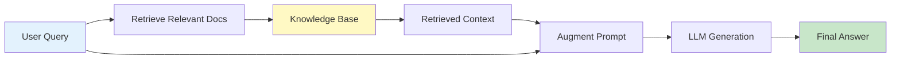
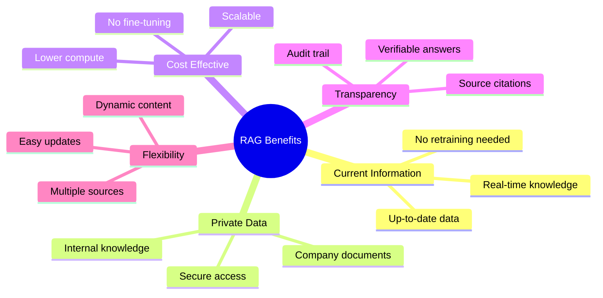
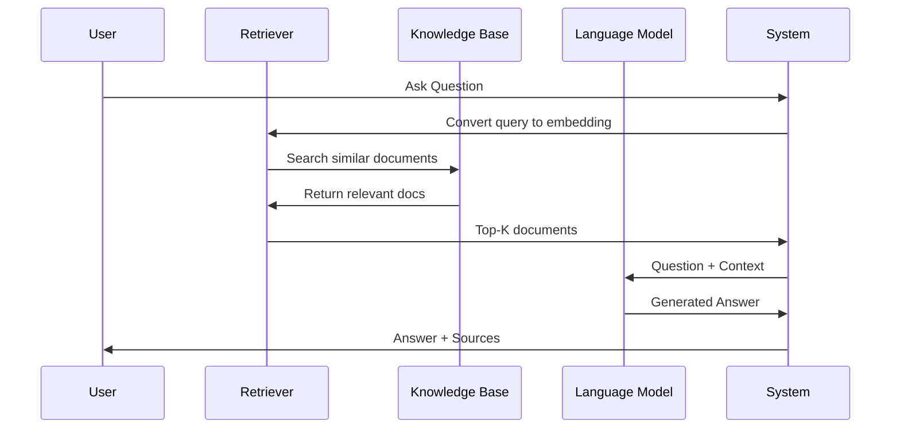
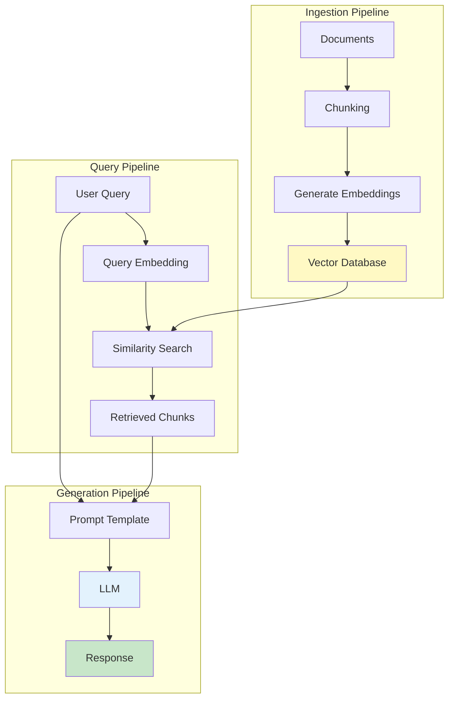
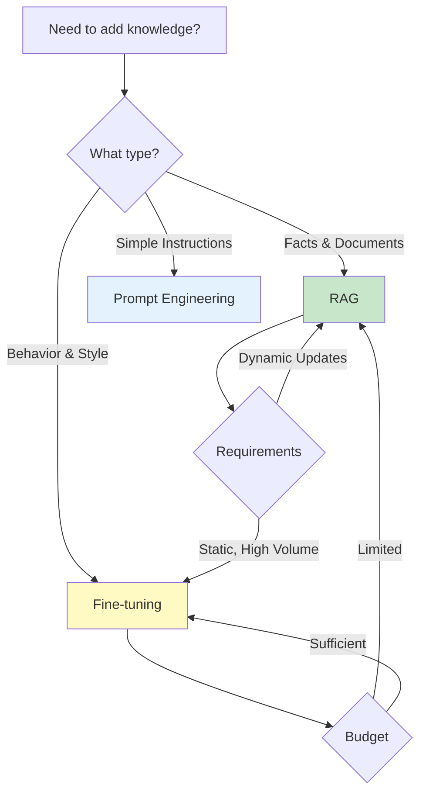
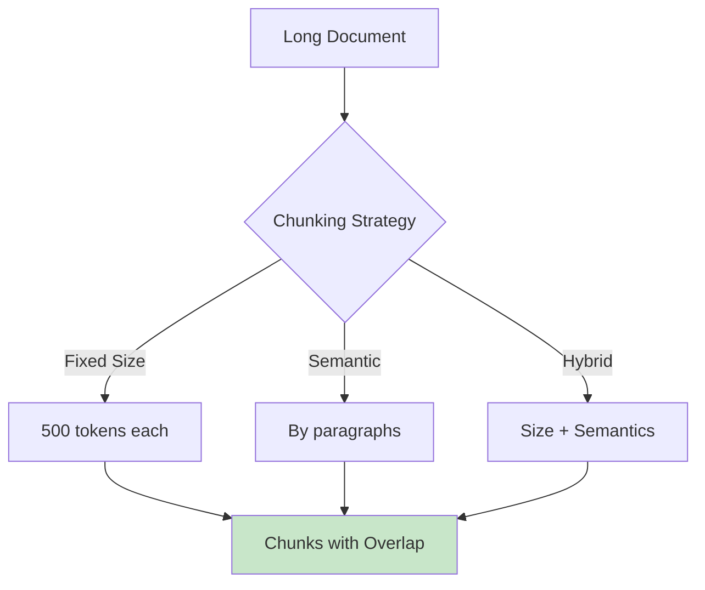
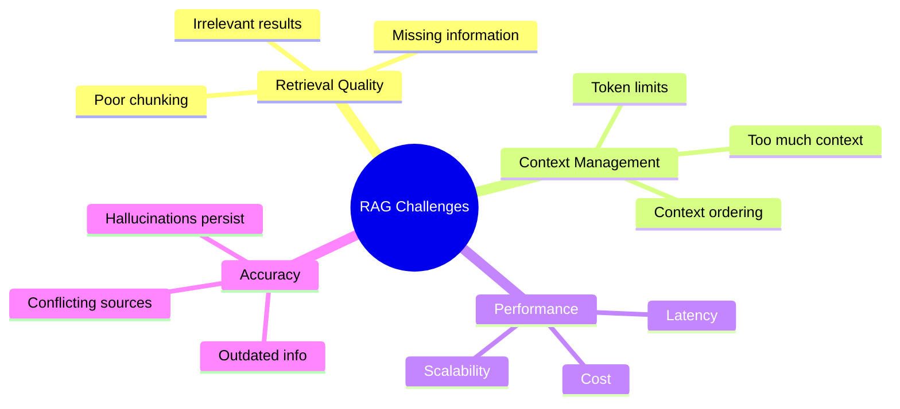

# Lesson 1: Introduction to RAG (Retrieval-Augmented Generation)

**Duration:** 90 minutes  
**Level:** Intermediate to Advanced

## Learning Objectives

By the end of this lesson, you will be able to:

- [ ] Understand what RAG is and why it's important
- [ ] Explain the RAG architecture and flow
- [ ] Identify use cases where RAG provides value
- [ ] Understand the components of a RAG system
- [ ] Recognize RAG limitations and trade-offs
- [ ] Compare RAG with fine-tuning and other approaches
- [ ] Design high-level RAG architectures

## Table of Contents

1. [What is RAG?](#what-is-rag)
2. [Why RAG Matters](#why-rag-matters)
3. [RAG Architecture](#rag-architecture)
4. [RAG vs Alternatives](#rag-vs-alternatives)
5. [Use Cases](#use-cases)
6. [Components Deep Dive](#components-deep-dive)
7. [Limitations & Challenges](#limitations--challenges)

---

## What is RAG?

**Retrieval-Augmented Generation (RAG)** is a technique that enhances Large Language Models by providing them with relevant external information retrieved from a knowledge base before generating a response.



### The Problem RAG Solves

**Without RAG:**
- LLMs only know what they learned during training
- Knowledge cutoff dates limit information
- Can't access private/proprietary data
- May hallucinate or provide outdated information

**With RAG:**
- Dynamically provides current, relevant information
- Access to private knowledge bases
- Reduces hallucinations with grounded responses
- No need to retrain models for new information

### Simple RAG Example

```python
# Without RAG - Limited knowledge
query = "What was our Q3 2024 revenue?"
response = llm(query)
# Result: "I don't have access to your company's financial data"

# With RAG - Access to company documents
query = "What was our Q3 2024 revenue?"
relevant_docs = retrieve_from_knowledge_base(query)
# Found: "Q3 2024 Financial Report: Revenue was $2.5M..."

augmented_prompt = f"""
Based on this context:
{relevant_docs}

Answer: {query}
"""
response = llm(augmented_prompt)
# Result: "According to the Q3 2024 Financial Report, revenue was $2.5M"
```

---

## Why RAG Matters



### Key Benefits

#### 1. **Access to Current Information**

```python
# Traditional LLM (trained until April 2023)
query = "What happened in the 2024 Olympics?"
# Can't answer - training cutoff

# With RAG (accesses recent news)
knowledge_base = load_recent_news()
# Can answer with up-to-date information
```

#### 2. **Private Knowledge Access**

```python
# Company-specific RAG
documents = [
    "employee_handbook.pdf",
    "project_docs/",
    "meeting_notes/",
    "technical_specs/"
]

# LLM can now answer questions about internal data
query = "What is our remote work policy?"
# Retrieves and uses relevant sections from handbook
```

#### 3. **Reduced Hallucinations**

```python
# Without grounding
query = "What are the side effects of medication X?"
# Risk: Model might generate plausible but incorrect information

# With RAG grounding
medical_database = load_fda_approved_info()
# Answer based on verified medical documents
# Less risk of hallucination
```

#### 4. **Source Attribution**

```python
# RAG provides citations
response = {
    "answer": "The policy allows 2 days remote work per week.",
    "sources": [
        {"document": "Employee Handbook v2.3", "page": 15},
        {"document": "Remote Work Policy Update", "date": "2024-03-15"}
    ]
}
# Users can verify information
```

---

## RAG Architecture

### High-Level Flow



### Core Components



### Component Breakdown

#### 1. **Document Ingestion**

```python
def ingest_documents(documents):
    """Process and store documents for retrieval."""
    
    # Step 1: Load documents
    docs = load_documents(documents)
    
    # Step 2: Chunk documents
    chunks = chunk_documents(docs, chunk_size=500, overlap=50)
    
    # Step 3: Generate embeddings
    embeddings = generate_embeddings(chunks)
    
    # Step 4: Store in vector database
    vector_db.add(
        embeddings=embeddings,
        documents=chunks,
        metadata=[{"source": doc.source, "page": doc.page} 
                  for doc in docs]
    )
    
    return vector_db
```

#### 2. **Retrieval**

```python
def retrieve_relevant_context(query, top_k=3):
    """Find most relevant documents for query."""
    
    # Convert query to embedding
    query_embedding = generate_embedding(query)
    
    # Search vector database
    results = vector_db.similarity_search(
        query_embedding,
        top_k=top_k
    )
    
    return results
```

#### 3. **Augmentation**

```python
def augment_prompt(query, retrieved_docs):
    """Combine query with retrieved context."""
    
    context = "\n\n".join([doc.content for doc in retrieved_docs])
    
    prompt = f"""
Use the following context to answer the question. If the answer is not
in the context, say "I don't have enough information to answer that."

Context:
{context}

Question: {query}

Answer:"""
    
    return prompt
```

#### 4. **Generation**

```python
def generate_answer(augmented_prompt):
    """Generate final answer using LLM."""
    
    response = client.chat.completions.create(
        model="gpt-4",
        messages=[
            {"role": "system", "content": "You are a helpful assistant that answers questions based on provided context."},
            {"role": "user", "content": augmented_prompt}
        ],
        temperature=0.3
    )
    
    return response.choices[0].message.content
```

### Complete RAG System

```python
class SimpleRAG:
    """Basic RAG implementation."""
    
    def __init__(self, documents):
        self.vector_db = ingest_documents(documents)
    
    def query(self, question, top_k=3):
        """Answer question using RAG."""
        
        # 1. Retrieve relevant documents
        relevant_docs = retrieve_relevant_context(question, top_k)
        
        # 2. Augment prompt with context
        augmented_prompt = augment_prompt(question, relevant_docs)
        
        # 3. Generate answer
        answer = generate_answer(augmented_prompt)
        
        # 4. Return answer with sources
        return {
            "answer": answer,
            "sources": [doc.metadata for doc in relevant_docs]
        }

# Usage
rag_system = SimpleRAG(documents=["company_docs/", "policies/"])
result = rag_system.query("What is the vacation policy?")
print(result["answer"])
print(f"Sources: {result['sources']}")
```

---

## RAG vs Alternatives

### Comparison Matrix

| Approach | Use Case | Cost | Latency | Flexibility | Expertise Required |
|----------|----------|------|---------|-------------|-------------------|
| **RAG** | Dynamic knowledge, private data | Low | Low | High | Medium |
| **Fine-tuning** | Task-specific behavior, style | High | Low | Low | High |
| **Prompt Engineering** | Quick prototypes, simple tasks | Very Low | Very Low | Very High | Low |
| **Pre-training** | Foundation models | Very High | Low | Very Low | Expert |



### When to Use RAG

✅ **Use RAG for:**
- Answering questions from documents
- Company knowledge bases
- Customer support with documentation
- Research assistants
- Frequently updated information
- Private/sensitive data that can't be in training

❌ **Don't use RAG for:**
- Changing model's writing style (use fine-tuning)
- Teaching completely new formats (use fine-tuning)
- Simple tasks solvable with prompts alone
- When latency is critical and knowledge is static

### Hybrid Approaches

Often, the best solution combines multiple techniques:

```python
class HybridSystem:
    """Combine RAG with fine-tuned model."""
    
    def __init__(self, fine_tuned_model, knowledge_base):
        self.model = fine_tuned_model  # Fine-tuned for style/tone
        self.rag = RAG(knowledge_base)  # RAG for facts
    
    def answer(self, query):
        # Use RAG for factual context
        context = self.rag.retrieve(query)
        
        # Use fine-tuned model for generation
        # (with learned style/tone)
        response = self.model.generate(
            query=query,
            context=context
        )
        
        return response
```

---

## Use Cases

### 1. Enterprise Knowledge Management

```python
# Internal documentation Q&A
company_rag = RAG(documents=[
    "employee_handbook.pdf",
    "engineering_docs/",
    "product_specs/",
    "meeting_notes/"
])

# Employees can ask questions
query = "What is the process for requesting time off?"
answer = company_rag.query(query)
# Returns policy with handbook citation
```

### 2. Customer Support

```python
# Support chatbot with product documentation
support_rag = RAG(documents=[
    "user_manual.pdf",
    "faq.md",
    "troubleshooting_guide.pdf",
    "knowledge_base/"
])

# Handle customer questions
query = "How do I reset my password?"
answer = support_rag.query(query)
# Provides step-by-step instructions from manual
```

### 3. Legal Document Analysis

```python
# Legal research assistant
legal_rag = RAG(documents=[
    "case_law/",
    "statutes/",
    "regulations/",
    "precedents/"
])

query = "What are the requirements for filing a motion to dismiss?"
answer = legal_rag.query(query)
# Cites relevant case law and procedures
```

### 4. Medical Information

```python
# Medical research assistant
medical_rag = RAG(documents=[
    "medical_journals/",
    "clinical_trials/",
    "treatment_guidelines/",
    "drug_information/"
])

query = "What are the latest treatment options for condition X?"
answer = medical_rag.query(query)
# Provides evidence-based information with citations
```

### 5. Code Documentation

```python
# Developer documentation assistant
code_rag = RAG(documents=[
    "api_docs/",
    "codebase/",
    "architecture_docs/",
    "examples/"
])

query = "How do I implement authentication in the API?"
answer = code_rag.query(query)
# Returns relevant code examples and documentation
```

---

## Components Deep Dive

### 1. Document Chunking

**Why Chunk?**
- LLMs have token limits
- Smaller chunks = better precision
- Larger chunks = better context



**Strategies:**

```python
# Fixed-size chunking
def chunk_fixed(text, size=500, overlap=50):
    chunks = []
    start = 0
    while start < len(text):
        end = start + size
        chunks.append(text[start:end])
        start = end - overlap
    return chunks

# Semantic chunking (by paragraph)
def chunk_semantic(text):
    return text.split('\n\n')

# Hybrid approach
def chunk_hybrid(text, max_size=1000):
    paragraphs = text.split('\n\n')
    chunks = []
    current_chunk = ""
    
    for para in paragraphs:
        if len(current_chunk) + len(para) < max_size:
            current_chunk += para + "\n\n"
        else:
            chunks.append(current_chunk)
            current_chunk = para + "\n\n"
    
    if current_chunk:
        chunks.append(current_chunk)
    
    return chunks
```

### 2. Embeddings

**What are embeddings?**
- Vector representations of text
- Semantically similar text → similar vectors
- Enable semantic search

```python
from openai import OpenAI
client = OpenAI()

def get_embedding(text, model="text-embedding-3-small"):
    """Generate embedding for text."""
    response = client.embeddings.create(
        model=model,
        input=text
    )
    return response.data[0].embedding

# Example
text1 = "The cat sat on the mat"
text2 = "A feline rested on the rug"
text3 = "Python programming language"

emb1 = get_embedding(text1)
emb2 = get_embedding(text2)
emb3 = get_embedding(text3)

# emb1 and emb2 will be similar (same meaning)
# emb3 will be different (different topic)
```

### 3. Vector Databases

**Why specialized databases?**
- Efficient similarity search
- Scale to millions of vectors
- Fast retrieval (milliseconds)

```python
import chromadb

# Initialize vector database
client = chromadb.Client()
collection = client.create_collection("my_docs")

# Add documents
collection.add(
    documents=["Document 1 text", "Document 2 text"],
    embeddings=[embedding1, embedding2],
    ids=["doc1", "doc2"],
    metadatas=[
        {"source": "file1.pdf", "page": 1},
        {"source": "file2.pdf", "page": 1}
    ]
)

# Query
results = collection.query(
    query_embeddings=[query_embedding],
    n_results=3
)
```

---

## Limitations & Challenges

### Common Issues



### 1. **Retrieval Quality**

**Problem:** System retrieves irrelevant documents

**Solutions:**
```python
# Better embeddings
model = "text-embedding-3-large"  # More accurate

# Hybrid search (keyword + semantic)
results = hybrid_search(query, alpha=0.5)

# Metadata filtering
results = vector_db.search(
    query,
    filter={"date": {"$gte": "2024-01-01"}}
)

# Re-ranking
retrieved = initial_retrieval(query, top_k=20)
re_ranked = rerank_results(query, retrieved, top_k=5)
```

### 2. **Context Window Limits**

**Problem:** Retrieved documents exceed token limits

**Solutions:**
```python
# Smarter chunking
chunks = create_smaller_chunks(docs, max_size=300)

# Summarization
summaries = [summarize(doc) for doc in retrieved_docs]

# Selective retrieval
most_relevant = rank_and_select(retrieved_docs, max_tokens=3000)
```

### 3. **Hallucinations Still Occur**

**Problem:** Model generates info not in context

**Solutions:**
```python
# Stronger system prompt
system_msg = """
Answer ONLY based on the provided context.
If the information is not in the context, say
"I don't have enough information to answer that."
Do NOT make up information.
"""

# Citation requirement
prompt += "\n\nProvide citations for all facts."

# Post-generation verification
answer = verify_against_sources(generated_answer, sources)
```

### 4. **Cost and Performance**

**Problem:** Too slow or expensive for production

**Solutions:**
```python
# Cache embeddings
embedding_cache = load_cache("embeddings.pkl")

# Batch processing
embeddings = generate_embeddings_batch(chunks)

# Optimize index
vector_db.build_index(
    index_type="HNSW",  # Faster approximate search
    ef_construction=200
)

# Use smaller models when appropriate
model = "gpt-3.5-turbo"  # Faster, cheaper
```

---

## Key Takeaways

### RAG in a Nutshell

1. **Retrieve** relevant information from knowledge base
2. **Augment** prompt with retrieved context
3. **Generate** answer using LLM with context

### When to Use RAG

✅ **Yes:**
- Private/company data
- Frequently updated information
- Need for source citations
- Cost-effective knowledge access

❌ **No:**
- Changing model behavior/style (fine-tune)
- Static, rarely changing knowledge
- Ultra-low latency requirements
- Simple prompting suffices

### Success Factors

1. **Quality Chunking:** Appropriate size and overlap
2. **Good Embeddings:** Use quality embedding models
3. **Efficient Retrieval:** Fast, accurate vector search
4. **Smart Prompting:** Clear instructions to LLM
5. **Evaluation:** Continuous testing and improvement

---

## Practice Exercises

### Exercise 1: Design RAG Architecture
Design a RAG system for your company's internal documentation. Consider:
- What documents to include
- Chunking strategy
- Vector database choice
- Retrieval parameters

### Exercise 2: Compare Approaches
For these scenarios, decide: RAG, fine-tuning, or prompt engineering?
1. Customer support chatbot
2. Code generation in company's style
3. Answering questions from PDF reports
4. Creative story writing

### Exercise 3: Identify Challenges
Given a RAG system that returns incorrect answers 30% of the time, what could be wrong? List 5 potential issues and solutions.

---

## Further Reading

- "Retrieval-Augmented Generation for Knowledge-Intensive NLP Tasks" (Lewis et al., 2020)
- LangChain RAG Documentation
- OpenAI Embeddings Guide
- Vector Database Comparison Studies

---

## Review Questions

1. What problem does RAG solve?
2. What are the main components of a RAG system?
3. When should you use RAG vs fine-tuning?
4. Why is document chunking important?
5. What are embeddings and why do we need them?
6. What are common RAG challenges and solutions?
7. How can you evaluate RAG system quality?

---

**Next Lesson:** [Embeddings & Vector Databases](./02-embeddings-vector-databases.md)
