# Week 4 - Lesson 2: Embeddings & Vector Databases

**Duration:** 90 minutes  
**Level:** Intermediate to Advanced  
**Prerequisites:** Week 4 Lesson 1, Understanding of vectors/linear algebra basics, Python proficiency

---

## 🎯 Learning Objectives

By the end of this lesson, you will:
- [ ] Understand what embeddings are and how they work
- [ ] Generate embeddings using OpenAI's API
- [ ] Calculate semantic similarity between texts
- [ ] Work with vector databases for efficient search
- [ ] Implement k-nearest neighbors (KNN) search
- [ ] Compare different vector database options
- [ ] Optimize embedding and retrieval performance
- [ ] Apply best practices for production systems

---

## 📚 Table of Contents

1. [Introduction to Embeddings](#1-introduction-to-embeddings)
2. [Creating Embeddings](#2-creating-embeddings)
3. [Semantic Similarity](#3-semantic-similarity)
4. [Vector Databases](#4-vector-databases)
5. [Vector Search Algorithms](#5-vector-search-algorithms)
6. [Production Implementation](#6-production-implementation)
7. [Performance Optimization](#7-performance-optimization)
8. [Best Practices](#8-best-practices)
9. [Summary](#9-summary)
10. [Further Reading](#10-further-reading)

---

## 1. Introduction to Embeddings

### What are Embeddings?

**Embeddings** are numerical representations of text (or other data) as high-dimensional vectors that capture semantic meaning. Similar concepts have similar vector representations.

```mermaid
graph TB
    A[Text: 'King'] --> B[Embedding Model]
    C[Text: 'Queen'] --> B
    D[Text: 'Apple'] --> B
    
    B --> E[Vector: 0.2, 0.8, 0.3, ...]
    B --> F[Vector: 0.3, 0.7, 0.4, ...]
    B --> G[Vector: -0.5, 0.1, 0.9, ...]
    
    E --> H{Similarity}
    F --> H
    G --> H
    
    H --> I[King ≈ Queen]
    H --> J[King ≠ Apple]
    
    style A fill:#e1f5ff
    style C fill:#e1f5ff
    style D fill:#e1f5ff
    style E fill:#c8e6c9
    style F fill:#c8e6c9
    style G fill:#ffccbc
```



### Why Embeddings Matter for RAG

- **Semantic Search:** Find documents by meaning, not just keywords
- **Similarity Matching:** Retrieve contextually relevant information
- **Dimensionality Reduction:** Represent complex text efficiently
- **Cross-lingual:** Work across languages
- **Transfer Learning:** Leverage pre-trained knowledge

### Embedding Properties

```python
"""
Understanding Embedding Properties
"""

import numpy as np
from openai import OpenAI
import os
from dotenv import load_dotenv

load_dotenv()
client = OpenAI(api_key=os.getenv("OPENAI_API_KEY"))


def get_embedding(text: str, model: str = "text-embedding-3-small") -> list[float]:
    """
    Get embedding vector for text.
    
    Args:
        text: Input text
        model: Embedding model to use
        
    Returns:
        Embedding vector
    """
    text = text.replace("\n", " ")
    response = client.embeddings.create(input=[text], model=model)
    return response.data[0].embedding


# Get embeddings for sample texts
texts = [
    "The cat sat on the mat",
    "The feline rested on the rug",
    "The dog ran in the park",
    "Python is a programming language"
]

print("Embedding Properties:")
print("="*80)

embeddings = [get_embedding(text) for text in texts]

# Show properties
print(f"\nNumber of texts: {len(texts)}")
print(f"Embedding dimensions: {len(embeddings[0])}")
print(f"Embedding type: {type(embeddings[0])}")
print(f"\nFirst few dimensions of first embedding:")
print(embeddings[0][:10])

# Show that similar texts have similar embeddings
print("\n\nTexts:")
for i, text in enumerate(texts):
    print(f"{i+1}. {text}")
```

**Key Properties:**
- **Dimensionality:** OpenAI's `text-embedding-3-small` creates 1536-dimensional vectors
- **Continuous:** Real-valued numbers (not discrete)
- **Dense:** Most values are non-zero
- **Normalized:** Often normalized to unit length
- **Semantic:** Captures meaning and context

---

## 2. Creating Embeddings

### 2.1 OpenAI Embedding Models

```python
"""
Working with OpenAI Embedding Models
"""

from typing import List, Dict, Any
import time


class EmbeddingGenerator:
    """
    Generate embeddings using OpenAI's API.
    """
    
    # Available models
    MODELS = {
        "text-embedding-3-small": {
            "dimensions": 1536,
            "cost_per_1M_tokens": 0.02,
            "description": "Latest small model, good performance/cost ratio"
        },
        "text-embedding-3-large": {
            "dimensions": 3072,
            "cost_per_1M_tokens": 0.13,
            "description": "Latest large model, best quality"
        },
        "text-embedding-ada-002": {
            "dimensions": 1536,
            "cost_per_1M_tokens": 0.10,
            "description": "Legacy model, still good"
        }
    }
    
    def __init__(
        self,
        model: str = "text-embedding-3-small",
        api_key: str = None
    ):
        self.model = model
        self.client = OpenAI(api_key=api_key or os.getenv("OPENAI_API_KEY"))
        
        if model not in self.MODELS:
            raise ValueError(f"Unknown model: {model}. Available: {list(self.MODELS.keys())}")
    
    def embed_text(self, text: str) -> List[float]:
        """
        Generate embedding for a single text.
        
        Args:
            text: Input text
            
        Returns:
            Embedding vector
        """
        text = text.replace("\n", " ")
        
        response = self.client.embeddings.create(
            input=[text],
            model=self.model
        )
        
        return response.data[0].embedding
    
    def embed_batch(
        self,
        texts: List[str],
        batch_size: int = 100,
        show_progress: bool = True
    ) -> List[List[float]]:
        """
        Generate embeddings for multiple texts in batches.
        
        Args:
            texts: List of input texts
            batch_size: Number of texts per API call
            show_progress: Whether to show progress
            
        Returns:
            List of embedding vectors
        """
        all_embeddings = []
        
        for i in range(0, len(texts), batch_size):
            batch = texts[i:i + batch_size]
            
            if show_progress:
                print(f"Processing batch {i//batch_size + 1}/{(len(texts)-1)//batch_size + 1}")
            
            # Clean texts
            cleaned_batch = [text.replace("\n", " ") for text in batch]
            
            # Get embeddings
            response = self.client.embeddings.create(
                input=cleaned_batch,
                model=self.model
            )
            
            # Extract embeddings in order
            batch_embeddings = [item.embedding for item in response.data]
            all_embeddings.extend(batch_embeddings)
            
            # Rate limiting
            time.sleep(0.1)
        
        return all_embeddings
    
    def get_model_info(self) -> Dict[str, Any]:
        """Get information about current model."""
        return self.MODELS[self.model]


# Test embedding generator
print("\nEmbedding Generator:")
print("="*80)

generator = EmbeddingGenerator(model="text-embedding-3-small")

# Show model info
print("\nModel Information:")
info = generator.get_model_info()
for key, value in info.items():
    print(f"  {key}: {value}")

# Single embedding
print("\n\nSingle Text Embedding:")
text = "Artificial intelligence is transforming technology"
embedding = generator.embed_text(text)
print(f"Text: {text}")
print(f"Embedding dimensions: {len(embedding)}")
print(f"First 10 values: {embedding[:10]}")

# Batch embeddings
print("\n\nBatch Embedding:")
batch_texts = [
    "Machine learning models learn from data",
    "Deep learning uses neural networks",
    "Natural language processing handles text",
    "Computer vision analyzes images"
]

batch_embeddings = generator.embed_batch(batch_texts, show_progress=True)
print(f"\nGenerated {len(batch_embeddings)} embeddings")
```

### 2.2 Dimensionality Reduction

```python
"""
Optional: Reducing Embedding Dimensions
"""

from typing import Optional


class DimensionalityReducer:
    """
    Reduce embedding dimensions while preserving similarity.
    """
    
    @staticmethod
    def normalize_vector(vector: List[float]) -> List[float]:
        """Normalize vector to unit length."""
        norm = np.linalg.norm(vector)
        if norm == 0:
            return vector
        return (np.array(vector) / norm).tolist()
    
    @staticmethod
    def reduce_dimensions(
        embedding: List[float],
        target_dimensions: int,
        method: str = "truncate"
    ) -> List[float]:
        """
        Reduce embedding dimensions.
        
        Args:
            embedding: Original embedding
            target_dimensions: Target number of dimensions
            method: "truncate" or "average"
            
        Returns:
            Reduced embedding
        """
        if target_dimensions >= len(embedding):
            return embedding
        
        if method == "truncate":
            # Simply take first N dimensions
            return embedding[:target_dimensions]
        
        elif method == "average":
            # Average groups of dimensions
            chunk_size = len(embedding) // target_dimensions
            reduced = []
            
            for i in range(target_dimensions):
                start = i * chunk_size
                end = start + chunk_size if i < target_dimensions - 1 else len(embedding)
                chunk = embedding[start:end]
                reduced.append(sum(chunk) / len(chunk))
            
            return reduced
        
        else:
            raise ValueError(f"Unknown method: {method}")


# Test dimensionality reduction
print("\nDimensionality Reduction:")
print("="*80)

reducer = DimensionalityReducer()

original_embedding = generator.embed_text("Sample text for dimension reduction")
print(f"Original dimensions: {len(original_embedding)}")

# Reduce to different sizes
for target_dims in [512, 256, 128]:
    reduced = reducer.reduce_dimensions(original_embedding, target_dims, method="truncate")
    print(f"Reduced to {target_dims} dimensions")
    
    # Normalize both
    orig_norm = reducer.normalize_vector(original_embedding)
    reduced_norm = reducer.normalize_vector(reduced)
```

---

## 3. Semantic Similarity

### 3.1 Similarity Metrics

```python
"""
Calculating Semantic Similarity
"""

from typing import Tuple
import numpy as np


class SimilarityCalculator:
    """
    Calculate similarity between embeddings.
    """
    
    @staticmethod
    def cosine_similarity(vec1: List[float], vec2: List[float]) -> float:
        """
        Calculate cosine similarity between two vectors.
        
        Range: [-1, 1] where 1 = identical, 0 = orthogonal, -1 = opposite
        
        Args:
            vec1: First vector
            vec2: Second vector
            
        Returns:
            Cosine similarity score
        """
        v1 = np.array(vec1)
        v2 = np.array(vec2)
        
        dot_product = np.dot(v1, v2)
        norm1 = np.linalg.norm(v1)
        norm2 = np.linalg.norm(v2)
        
        if norm1 == 0 or norm2 == 0:
            return 0.0
        
        return dot_product / (norm1 * norm2)
    
    @staticmethod
    def euclidean_distance(vec1: List[float], vec2: List[float]) -> float:
        """
        Calculate Euclidean distance between two vectors.
        
        Lower values indicate more similarity.
        
        Args:
            vec1: First vector
            vec2: Second vector
            
        Returns:
            Euclidean distance
        """
        v1 = np.array(vec1)
        v2 = np.array(vec2)
        return np.linalg.norm(v1 - v2)
    
    @staticmethod
    def dot_product(vec1: List[float], vec2: List[float]) -> float:
        """
        Calculate dot product between two vectors.
        
        Higher values indicate more similarity (for normalized vectors).
        
        Args:
            vec1: First vector
            vec2: Second vector
            
        Returns:
            Dot product
        """
        v1 = np.array(vec1)
        v2 = np.array(vec2)
        return np.dot(v1, v2)
    
    def find_most_similar(
        self,
        query_embedding: List[float],
        candidate_embeddings: List[List[float]],
        top_k: int = 5,
        metric: str = "cosine"
    ) -> List[Tuple[int, float]]:
        """
        Find most similar embeddings to query.
        
        Args:
            query_embedding: Query vector
            candidate_embeddings: List of candidate vectors
            top_k: Number of results to return
            metric: Similarity metric ("cosine", "euclidean", "dot")
            
        Returns:
            List of (index, score) tuples sorted by similarity
        """
        scores = []
        
        for idx, candidate in enumerate(candidate_embeddings):
            if metric == "cosine":
                score = self.cosine_similarity(query_embedding, candidate)
            elif metric == "euclidean":
                score = -self.euclidean_distance(query_embedding, candidate)  # Negative for ranking
            elif metric == "dot":
                score = self.dot_product(query_embedding, candidate)
            else:
                raise ValueError(f"Unknown metric: {metric}")
            
            scores.append((idx, score))
        
        # Sort by score (descending)
        scores.sort(key=lambda x: x[1], reverse=True)
        
        return scores[:top_k]


# Test similarity calculations
print("\nSemantic Similarity:")
print("="*80)

calculator = SimilarityCalculator()

# Create test embeddings
test_texts = [
    "The cat sleeps on the couch",
    "A feline naps on the sofa",  # Similar to first
    "Dogs play in the park",
    "Python is a programming language",
    "Machine learning models process data"
]

test_embeddings = [generator.embed_text(text) for text in test_texts]

# Query
query_text = "Cats sleeping on furniture"
query_embedding = generator.embed_text(query_text)

print(f"\nQuery: {query_text}")
print("\nTest Texts:")
for i, text in enumerate(test_texts):
    print(f"{i+1}. {text}")

# Calculate similarities
print("\n\nSimilarity Scores (Cosine):")
print("-"*60)

for i, text in enumerate(test_texts):
    similarity = calculator.cosine_similarity(query_embedding, test_embeddings[i])
    print(f"{i+1}. {text[:40]:40s} | Score: {similarity:.4f}")

# Find top matches
print("\n\nTop 3 Most Similar:")
print("-"*60)

top_matches = calculator.find_most_similar(
    query_embedding,
    test_embeddings,
    top_k=3,
    metric="cosine"
)

for rank, (idx, score) in enumerate(top_matches, 1):
    print(f"{rank}. {test_texts[idx]}")
    print(f"   Score: {score:.4f}")
```

### 3.2 Similarity Visualization


---

## 4. Vector Databases

### 4.1 Why Vector Databases?

Traditional databases struggle with similarity search over high-dimensional vectors. Vector databases are optimized for:

- **Fast similarity search** over millions of vectors
- **Efficient indexing** (HNSW, IVF, etc.)
- **Metadata filtering** combined with vector search
- **Scalability** to billions of vectors
- **Real-time updates** and deletions

### 4.2 ChromaDB Implementation

```python
"""
Vector Database with ChromaDB
"""

import chromadb
from chromadb.config import Settings
from typing import List, Dict, Any, Optional
import uuid


class VectorStore:
    """
    Vector database using ChromaDB.
    """
    
    def __init__(
        self,
        collection_name: str = "documents",
        persist_directory: str = "./chroma_db"
    ):
        # Initialize ChromaDB client
        self.client = chromadb.Client(Settings(
            persist_directory=persist_directory,
            anonymized_telemetry=False
        ))
        
        # Get or create collection
        self.collection = self.client.get_or_create_collection(
            name=collection_name,
            metadata={"description": "Document embeddings for semantic search"}
        )
        
        self.embedding_generator = EmbeddingGenerator()
    
    def add_documents(
        self,
        documents: List[str],
        metadatas: Optional[List[Dict[str, Any]]] = None,
        ids: Optional[List[str]] = None
    ) -> List[str]:
        """
        Add documents to vector store.
        
        Args:
            documents: List of document texts
            metadatas: Optional metadata for each document
            ids: Optional IDs for documents
            
        Returns:
            List of document IDs
        """
        # Generate IDs if not provided
        if ids is None:
            ids = [str(uuid.uuid4()) for _ in documents]
        
        # Generate embeddings
        print(f"Generating embeddings for {len(documents)} documents...")
        embeddings = self.embedding_generator.embed_batch(documents, show_progress=False)
        
        # Add to collection
        self.collection.add(
            documents=documents,
            embeddings=embeddings,
            metadatas=metadatas,
            ids=ids
        )
        
        print(f"✓ Added {len(documents)} documents to vector store")
        return ids
    
    def search(
        self,
        query: str,
        n_results: int = 5,
        where: Optional[Dict[str, Any]] = None
    ) -> Dict[str, Any]:
        """
        Search for similar documents.
        
        Args:
            query: Search query text
            n_results: Number of results to return
            where: Optional metadata filters
            
        Returns:
            Search results with documents, distances, and metadata
        """
        # Generate query embedding
        query_embedding = self.embedding_generator.embed_text(query)
        
        # Search
        results = self.collection.query(
            query_embeddings=[query_embedding],
            n_results=n_results,
            where=where
        )
        
        return {
            "documents": results["documents"][0],
            "distances": results["distances"][0],
            "metadatas": results["metadatas"][0] if results["metadatas"] else None,
            "ids": results["ids"][0]
        }
    
    def get_count(self) -> int:
        """Get number of documents in store."""
        return self.collection.count()
    
    def delete_by_ids(self, ids: List[str]):
        """Delete documents by IDs."""
        self.collection.delete(ids=ids)
    
    def clear(self):
        """Delete all documents."""
        self.client.delete_collection(self.collection.name)
        self.collection = self.client.create_collection(name=self.collection.name)


# Test vector store
print("\nVector Store (ChromaDB):")
print("="*80)

# Create vector store
vector_store = VectorStore(collection_name="test_docs")

# Sample documents
documents = [
    "Python is a high-level programming language known for its simplicity.",
    "Machine learning is a subset of artificial intelligence.",
    "Natural language processing enables computers to understand human language.",
    "Deep learning uses neural networks with multiple layers.",
    "Computer vision allows machines to interpret visual information.",
    "Reinforcement learning trains agents through rewards and penalties.",
    "The cat sat on the mat and watched the birds.",
    "Dogs are loyal companions and popular pets."
]

metadatas = [
    {"category": "programming", "topic": "python"},
    {"category": "ai", "topic": "ml"},
    {"category": "ai", "topic": "nlp"},
    {"category": "ai", "topic": "deep_learning"},
    {"category": "ai", "topic": "vision"},
    {"category": "ai", "topic": "rl"},
    {"category": "general", "topic": "animals"},
    {"category": "general", "topic": "animals"}
]

# Add documents
print("\nAdding documents...")
doc_ids = vector_store.add_documents(documents, metadatas=metadatas)
print(f"Total documents in store: {vector_store.get_count()}")

# Search examples
queries = [
    ("What is machine learning?", None),
    ("Tell me about cats", None),
    ("AI topics", {"category": "ai"})  # With metadata filter
]

for query, where_filter in queries:
    print(f"\n\nQuery: {query}")
    if where_filter:
        print(f"Filter: {where_filter}")
    print("-"*60)
    
    results = vector_store.search(query, n_results=3, where=where_filter)
    
    for i, (doc, distance, metadata) in enumerate(zip(
        results["documents"],
        results["distances"],
        results["metadatas"]
    ), 1):
        print(f"\n{i}. {doc}")
        print(f"   Distance: {distance:.4f}")
        print(f"   Metadata: {metadata}")
```

### 4.3 Vector Database Comparison

```python
"""
Comparison of Vector Database Options
"""


class VectorDatabaseComparison:
    """
    Overview of vector database options.
    """
    
    DATABASES = {
        "ChromaDB": {
            "type": "Embedded/Server",
            "language": "Python",
            "hosting": "Local or cloud",
            "pros": [
                "Easy to use",
                "Great for development",
                "Built-in embedding support",
                "Good documentation"
            ],
            "cons": [
                "Limited scale compared to others",
                "Fewer enterprise features"
            ],
            "best_for": "Development, small to medium projects"
        },
        "Pinecone": {
            "type": "Cloud service",
            "language": "API (multi-language)",
            "hosting": "Fully managed cloud",
            "pros": [
                "Highly scalable",
                "Excellent performance",
                "Managed service",
                "Strong enterprise features"
            ],
            "cons": [
                "Paid service",
                "Cloud-only",
                "Less control over infrastructure"
            ],
            "best_for": "Production applications, high scale"
        },
        "Weaviate": {
            "type": "Open source",
            "language": "Go (API multi-language)",
            "hosting": "Self-hosted or cloud",
            "pros": [
                "Very flexible",
                "GraphQL API",
                "Hybrid search",
                "Active community"
            ],
            "cons": [
                "More complex setup",
                "Requires infrastructure management"
            ],
            "best_for": "Complex search requirements, hybrid search"
        },
        "Qdrant": {
            "type": "Open source",
            "language": "Rust (API multi-language)",
            "hosting": "Self-hosted or cloud",
            "pros": [
                "High performance",
                "Advanced filtering",
                "Good documentation",
                "REST API"
            ],
            "cons": [
                "Newer ecosystem",
                "Self-hosting complexity"
            ],
            "best_for": "Performance-critical applications"
        },
        "FAISS": {
            "type": "Library",
            "language": "C++/Python",
            "hosting": "Application-embedded",
            "pros": [
                "Extremely fast",
                "Facebook-backed",
                "Multiple index types",
                "Free and open source"
            ],
            "cons": [
                "Lower-level API",
                "No built-in persistence",
                "More manual setup"
            ],
            "best_for": "High-performance research, custom solutions"
        },
        "Milvus": {
            "type": "Open source",
            "language": "Go (API multi-language)",
            "hosting": "Self-hosted or cloud",
            "pros": [
                "Highly scalable",
                "Multiple index types",
                "Active development",
                "Cloud-native"
            ],
            "cons": [
                "Complex architecture",
                "Steeper learning curve"
            ],
            "best_for": "Large-scale enterprise deployments"
        }
    }
    
    @classmethod
    def print_comparison(cls):
        """Print comparison table."""
        print("\nVector Database Comparison:")
        print("="*80)
        
        for name, info in cls.DATABASES.items():
            print(f"\n{name}")
            print("-"*60)
            print(f"Type: {info['type']}")
            print(f"Best for: {info['best_for']}")
            print("\nPros:")
            for pro in info['pros']:
                print(f"  ✓ {pro}")
            print("\nCons:")
            for con in info['cons']:
                print(f"  ✗ {con}")


# Show comparison
VectorDatabaseComparison.print_comparison()
```

---

## 5. Vector Search Algorithms

### 5.1 Search Algorithm Overview

```python
"""
Vector Search Algorithms
"""


class SearchAlgorithms:
    """
    Overview of vector search algorithms.
    """
    
    ALGORITHMS = {
        "Exact Search (Brute Force)": {
            "description": "Calculate distance to every vector",
            "complexity": "O(n*d) where n=vectors, d=dimensions",
            "pros": ["100% accurate", "Simple to implement"],
            "cons": ["Slow for large datasets", "Doesn't scale"],
            "use_case": "Small datasets (<10k vectors)"
        },
        "HNSW (Hierarchical Navigable Small World)": {
            "description": "Graph-based approximate search",
            "complexity": "O(log n) search time",
            "pros": ["Very fast", "Good recall", "Memory efficient"],
            "cons": ["Approximate results", "Complex to tune"],
            "use_case": "Most production applications"
        },
        "IVF (Inverted File Index)": {
            "description": "Partition space into clusters",
            "complexity": "O(nprobe * d) where nprobe=clusters to search",
            "pros": ["Good for large datasets", "Configurable accuracy/speed"],
            "cons": ["Requires training", "Less accurate than HNSW"],
            "use_case": "Very large datasets (millions+)"
        },
        "LSH (Locality Sensitive Hashing)": {
            "description": "Hash similar vectors to same buckets",
            "complexity": "O(d) average case",
            "pros": ["Fast", "Good for high dimensions"],
            "cons": ["Lower recall", "Memory intensive"],
            "use_case": "Real-time applications, high dimensions"
        },
        "Product Quantization": {
            "description": "Compress vectors for efficiency",
            "complexity": "O(n) with compressed vectors",
            "pros": ["Memory efficient", "Fast with compression"],
            "cons": ["Accuracy loss", "Training required"],
            "use_case": "Memory-constrained environments"
        }
    }
    
    @classmethod
    def explain_algorithms(cls):
        """Explain search algorithms."""
        print("\nVector Search Algorithms:")
        print("="*80)
        
        for name, info in cls.ALGORITHMS.items():
            print(f"\n{name}")
            print("-"*60)
            print(f"{info['description']}")
            print(f"Complexity: {info['complexity']}")
            print(f"\nPros: {', '.join(info['pros'])}")
            print(f"Cons: {', '.join(info['cons'])}")
            print(f"Best for: {info['use_case']}")


# Show algorithms
SearchAlgorithms.explain_algorithms()
```

### 5.2 Algorithm Visualization

```mermaid
graph TB
    Q[Query Vector] --> A{Search Algorithm}
    
    A -->|Exact| B[Compare to ALL vectors]
    B --> B1[100% accurate]
    B --> B2[O n·d complexity]
    
    A -->|HNSW| C[Navigate graph layers]
    C --> C1[~99% accurate]
    C --> C2[O log n complexity]
    
    A -->|IVF| D[Search nearest clusters]
    D --> D1[~95% accurate]
    D --> D2[O nprobe·d complexity]
    
    A -->|LSH| E[Hash to buckets]
    E --> E1[~90% accurate]
    E --> E2[O d complexity]
    
    B1 --> R[Results]
    C1 --> R
    D1 --> R
    E1 --> R
    
    style Q fill:#e1f5ff
    style R fill:#c8e6c9
    style A fill:#fff9c4
```



---

## 6. Production Implementation

### 6.1 Complete Production Vector Store

```python
"""
Production-Ready Vector Store Implementation
"""

from dataclasses import dataclass
from datetime import datetime
from typing import Optional, Callable
import logging
import json

logging.basicConfig(level=logging.INFO)
logger = logging.getLogger(__name__)


@dataclass
class SearchResult:
    """Search result with metadata."""
    id: str
    document: str
    score: float
    metadata: Dict[str, Any]
    rank: int


class ProductionVectorStore:
    """
    Production-ready vector store with full features.
    """
    
    def __init__(
        self,
        collection_name: str,
        persist_directory: str = "./vector_db",
        embedding_model: str = "text-embedding-3-small"
    ):
        self.collection_name = collection_name
        self.persist_directory = persist_directory
        
        # Initialize ChromaDB
        self.client = chromadb.Client(Settings(
            persist_directory=persist_directory,
            anonymized_telemetry=False
        ))
        
        # Create collection
        self.collection = self.client.get_or_create_collection(
            name=collection_name,
            metadata={
                "created_at": datetime.now().isoformat(),
                "embedding_model": embedding_model
            }
        )
        
        # Initialize embedding generator
        self.embedding_generator = EmbeddingGenerator(model=embedding_model)
        
        # Statistics
        self.stats = {
            "documents_added": 0,
            "searches_performed": 0,
            "total_search_time": 0.0
        }
    
    def add_documents(
        self,
        documents: List[str],
        metadatas: Optional[List[Dict[str, Any]]] = None,
        ids: Optional[List[str]] = None,
        batch_size: int = 100
    ) -> List[str]:
        """
        Add documents with batching and error handling.
        
        Args:
            documents: Document texts
            metadatas: Optional metadata
            ids: Optional IDs
            batch_size: Batch size for processing
            
        Returns:
            List of document IDs
        """
        if not documents:
            raise ValueError("Documents list cannot be empty")
        
        # Generate IDs if needed
        if ids is None:
            ids = [f"{self.collection_name}_{i}_{uuid.uuid4()}" for i in range(len(documents))]
        
        # Ensure metadatas
        if metadatas is None:
            metadatas = [{"added_at": datetime.now().isoformat()} for _ in documents]
        else:
            # Add timestamp to each metadata
            for metadata in metadatas:
                if "added_at" not in metadata:
                    metadata["added_at"] = datetime.now().isoformat()
        
        logger.info(f"Adding {len(documents)} documents in batches of {batch_size}")
        
        all_ids = []
        
        # Process in batches
        for i in range(0, len(documents), batch_size):
            batch_end = min(i + batch_size, len(documents))
            
            batch_docs = documents[i:batch_end]
            batch_meta = metadatas[i:batch_end]
            batch_ids = ids[i:batch_end]
            
            try:
                # Generate embeddings
                embeddings = self.embedding_generator.embed_batch(
                    batch_docs,
                    show_progress=False
                )
                
                # Add to collection
                self.collection.add(
                    documents=batch_docs,
                    embeddings=embeddings,
                    metadatas=batch_meta,
                    ids=batch_ids
                )
                
                all_ids.extend(batch_ids)
                self.stats["documents_added"] += len(batch_docs)
                
                logger.info(f"Added batch {i//batch_size + 1}: {len(batch_docs)} documents")
                
            except Exception as e:
                logger.error(f"Error adding batch {i//batch_size + 1}: {e}")
                raise
        
        logger.info(f"✓ Successfully added {len(all_ids)} documents")
        return all_ids
    
    def search(
        self,
        query: str,
        n_results: int = 5,
        where: Optional[Dict[str, Any]] = None,
        score_threshold: Optional[float] = None
    ) -> List[SearchResult]:
        """
        Search with advanced features.
        
        Args:
            query: Search query
            n_results: Number of results
            where: Metadata filters
            score_threshold: Minimum similarity score
            
        Returns:
            List of SearchResult objects
        """
        start_time = time.time()
        
        try:
            # Generate query embedding
            query_embedding = self.embedding_generator.embed_text(query)
            
            # Search
            results = self.collection.query(
                query_embeddings=[query_embedding],
                n_results=n_results,
                where=where
            )
            
            # Convert to SearchResult objects
            search_results = []
            
            for rank, (doc_id, document, distance, metadata) in enumerate(zip(
                results["ids"][0],
                results["documents"][0],
                results["distances"][0],
                results["metadatas"][0]
            ), 1):
                # Convert distance to similarity score (1 - normalized_distance)
                # For cosine distance, similarity = 1 - distance
                score = 1.0 - distance
                
                # Apply score threshold if specified
                if score_threshold and score < score_threshold:
                    continue
                
                search_results.append(SearchResult(
                    id=doc_id,
                    document=document,
                    score=score,
                    metadata=metadata or {},
                    rank=rank
                ))
            
            # Update statistics
            search_time = time.time() - start_time
            self.stats["searches_performed"] += 1
            self.stats["total_search_time"] += search_time
            
            logger.info(
                f"Search completed: {len(search_results)} results in {search_time:.3f}s"
            )
            
            return search_results
            
        except Exception as e:
            logger.error(f"Search error: {e}")
            raise
    
    def get_statistics(self) -> Dict[str, Any]:
        """Get store statistics."""
        avg_search_time = (
            self.stats["total_search_time"] / self.stats["searches_performed"]
            if self.stats["searches_performed"] > 0
            else 0.0
        )
        
        return {
            "collection_name": self.collection_name,
            "total_documents": self.collection.count(),
            "documents_added": self.stats["documents_added"],
            "searches_performed": self.stats["searches_performed"],
            "average_search_time": avg_search_time,
            "embedding_model": self.collection.metadata.get("embedding_model")
        }
    
    def export_metadata(self, filepath: str):
        """Export store metadata and statistics."""
        metadata = {
            "collection_info": self.collection.metadata,
            "statistics": self.get_statistics(),
            "exported_at": datetime.now().isoformat()
        }
        
        with open(filepath, 'w') as f:
            json.dump(metadata, f, indent=2)
        
        logger.info(f"Metadata exported to {filepath}")


# Test production vector store
print("\nProduction Vector Store:")
print("="*80)

prod_store = ProductionVectorStore(
    collection_name="production_docs",
    persist_directory="./prod_vector_db"
)

# Add sample documents
docs = [
    "Vector databases enable semantic search over large document collections.",
    "Embeddings capture semantic meaning in high-dimensional space.",
    "RAG systems combine retrieval with language model generation.",
    "Chunking strategies affect retrieval quality and context.",
    "Metadata filtering improves search precision."
]

doc_metadata = [
    {"category": "database", "difficulty": "intermediate"},
    {"category": "embeddings", "difficulty": "beginner"},
    {"category": "rag", "difficulty": "intermediate"},
    {"category": "rag", "difficulty": "advanced"},
    {"category": "search", "difficulty": "intermediate"}
]

print("\nAdding documents...")
doc_ids = prod_store.add_documents(docs, metadatas=doc_metadata)

# Perform searches
print("\n\nSearch Examples:")
print("="*80)

search_queries = [
    ("What are embeddings?", None, None),
    ("RAG systems", {"category": "rag"}, 0.7)
]

for query, where_filter, threshold in search_queries:
    print(f"\n\nQuery: '{query}'")
    if where_filter:
        print(f"Filter: {where_filter}")
    if threshold:
        print(f"Score threshold: {threshold}")
    print("-"*60)
    
    results = prod_store.search(
        query,
        n_results=3,
        where=where_filter,
        score_threshold=threshold
    )
    
    for result in results:
        print(f"\n{result.rank}. {result.document}")
        print(f"   Score: {result.score:.4f}")
        print(f"   Metadata: {result.metadata}")

# Show statistics
print("\n\nStore Statistics:")
print("="*80)
stats = prod_store.get_statistics()
for key, value in stats.items():
    print(f"{key}: {value}")
```

---

## 7. Performance Optimization

### 7.1 Optimization Strategies

```python
"""
Performance Optimization for Vector Operations
"""


class PerformanceOptimizer:
    """
    Optimization strategies for vector operations.
    """
    
    @staticmethod
    def batch_embeddings(
        texts: List[str],
        batch_size: int = 100
    ) -> List[List[float]]:
        """
        Generate embeddings in optimal batches.
        
        Best practices:
        - Batch size: 100-1000 depending on text length
        - Parallel processing when possible
        - Rate limiting to avoid API limits
        """
        generator = EmbeddingGenerator()
        return generator.embed_batch(texts, batch_size=batch_size)
    
    @staticmethod
    def cache_embeddings(
        texts: List[str],
        cache_file: str = "embedding_cache.json"
    ) -> Dict[str, List[float]]:
        """
        Cache embeddings to avoid regeneration.
        
        Best practices:
        - Cache embeddings for static documents
        - Use hash of text as cache key
        - Periodically update cache
        """
        import hashlib
        
        # Try to load existing cache
        cache = {}
        try:
            with open(cache_file, 'r') as f:
                cache = json.load(f)
        except FileNotFoundError:
            pass
        
        generator = EmbeddingGenerator()
        new_texts = []
        
        # Check cache
        for text in texts:
            text_hash = hashlib.md5(text.encode()).hexdigest()
            if text_hash not in cache:
                new_texts.append((text, text_hash))
        
        # Generate only missing embeddings
        if new_texts:
            logger.info(f"Generating {len(new_texts)} new embeddings")
            embeddings = generator.embed_batch([t[0] for t in new_texts])
            
            for (text, text_hash), embedding in zip(new_texts, embeddings):
                cache[text_hash] = embedding
            
            # Save cache
            with open(cache_file, 'w') as f:
                json.dump(cache, f)
        
        return cache
    
    @staticmethod
    def optimize_search_params(
        collection_size: int,
        avg_query_time: float
    ) -> Dict[str, Any]:
        """
        Suggest optimal search parameters based on collection size.
        
        Args:
            collection_size: Number of documents
            avg_query_time: Average query time in seconds
            
        Returns:
            Recommended parameters
        """
        recommendations = {
            "index_type": "hnsw",  # Good default
            "search_params": {}
        }
        
        if collection_size < 10000:
            recommendations["search_params"] = {
                "ef": 100,  # Higher for accuracy
                "comment": "Small collection - prioritize accuracy"
            }
        elif collection_size < 100000:
            recommendations["search_params"] = {
                "ef": 50,
                "comment": "Medium collection - balance accuracy and speed"
            }
        else:
            recommendations["search_params"] = {
                "ef": 32,
                "comment": "Large collection - prioritize speed"
            }
        
        if avg_query_time > 1.0:
            recommendations["suggestions"] = [
                "Consider using IVF index for faster search",
                "Increase hardware resources",
                "Reduce embedding dimensions if possible",
                "Use metadata pre-filtering"
            ]
        
        return recommendations


# Test optimization strategies
print("\nPerformance Optimization:")
print("="*80)

optimizer = PerformanceOptimizer()

# Suggest parameters
print("\nSearch Parameter Recommendations:")
print("-"*60)

test_cases = [
    (5000, 0.1),
    (50000, 0.5),
    (500000, 1.5)
]

for size, time in test_cases:
    print(f"\nCollection size: {size:,} | Avg query time: {time}s")
    recommendations = optimizer.optimize_search_params(size, time)
    print(f"Index type: {recommendations['index_type']}")
    print(f"Search params: {recommendations['search_params']}")
    if "suggestions" in recommendations:
        print("Suggestions:")
        for suggestion in recommendations["suggestions"]:
            print(f"  • {suggestion}")
```

---

## 8. Best Practices

### 8.1 Production Best Practices

```python
"""
Best Practices for Production Vector Stores
"""


class BestPractices:
    """
    Production best practices for vector databases.
    """
    
    PRACTICES = {
        "Embedding Generation": [
            "Batch embeddings for efficiency (100-1000 per batch)",
            "Cache embeddings for static documents",
            "Use consistent embedding models",
            "Monitor embedding API costs",
            "Handle rate limits with exponential backoff"
        ],
        "Vector Storage": [
            "Choose appropriate vector database for scale",
            "Configure proper index type (HNSW for most cases)",
            "Set up regular backups",
            "Monitor storage costs",
            "Plan for horizontal scaling"
        ],
        "Search Optimization": [
            "Use metadata filtering to reduce search space",
            "Set appropriate k for top-k search",
            "Consider hybrid search (vector + keyword)",
            "Implement result re-ranking if needed",
            "Cache frequent queries"
        ],
        "Data Management": [
            "Include metadata for filtering and debugging",
            "Track document versions and updates",
            "Implement soft deletes when appropriate",
            "Maintain audit logs",
            "Regular cleanup of stale data"
        ],
        "Monitoring": [
            "Track search latency and throughput",
            "Monitor index build times",
            "Measure retrieval quality metrics",
            "Alert on performance degradation",
            "Track API costs and usage"
        ],
        "Security": [
            "Encrypt data at rest and in transit",
            "Implement access controls",
            "Sanitize user inputs",
            "Audit database access",
            "Regular security updates"
        ]
    }
    
    @classmethod
    def print_practices(cls):
        """Print all best practices."""
        print("\nProduction Best Practices:")
        print("="*80)
        
        for category, practices in cls.PRACTICES.items():
            print(f"\n{category}:")
            print("-"*60)
            for practice in practices:
                print(f"  ✓ {practice}")


# Show best practices
BestPractices.print_practices()
```

### 8.2 Common Pitfalls

```python
"""
Common Pitfalls to Avoid
"""


class CommonPitfalls:
    """
    Common mistakes and how to avoid them.
    """
    
    PITFALLS = [
        {
            "issue": "Not normalizing embeddings",
            "problem": "Inconsistent similarity scores",
            "solution": "Normalize vectors before storage/comparison"
        },
        {
            "issue": "Ignoring metadata",
            "problem": "Difficult to filter or debug results",
            "solution": "Always include relevant metadata (source, timestamp, etc.)"
        },
        {
            "issue": "Using wrong similarity metric",
            "problem": "Poor retrieval quality",
            "solution": "Use cosine similarity for most text embeddings"
        },
        {
            "issue": "Not batching API calls",
            "problem": "High costs and slow performance",
            "solution": "Batch embeddings in groups of 100-1000"
        },
        {
            "issue": "Forgetting to handle updates",
            "problem": "Stale data in vector store",
            "solution": "Implement update/delete mechanisms"
        },
        {
            "issue": "No monitoring",
            "problem": "Can't detect performance issues",
            "solution": "Track metrics: latency, costs, quality"
        },
        {
            "issue": "Overloading context",
            "problem": "Token limit exceeded or poor relevance",
            "solution": "Retrieve top-k, then re-rank and select best matches"
        },
        {
            "issue": "Not testing at scale",
            "problem": "Performance issues in production",
            "solution": "Load test with realistic data volumes"
        }
    ]
    
    @classmethod
    def print_pitfalls(cls):
        """Print common pitfalls."""
        print("\nCommon Pitfalls to Avoid:")
        print("="*80)
        
        for i, pitfall in enumerate(cls.PITFALLS, 1):
            print(f"\n{i}. {pitfall['issue']}")
            print(f"   Problem: {pitfall['problem']}")
            print(f"   Solution: {pitfall['solution']}")


# Show pitfalls
CommonPitfalls.print_pitfalls()
```

---

## 9. Summary

### Key Takeaways

1. **Embeddings** convert text to vectors that capture semantic meaning
2. **Vector databases** enable fast similarity search over large collections
3. **Cosine similarity** is the standard metric for text embeddings
4. **ChromaDB** is excellent for development and medium-scale applications
5. **HNSW** is the best general-purpose search algorithm
6. **Batching** embeddings significantly improves performance
7. **Metadata** filtering enhances search precision
8. **Monitoring** is essential for production systems

### Production Checklist

- [ ] Choose appropriate vector database for scale
- [ ] Implement efficient embedding generation (batching)
- [ ] Set up proper indexing (HNSW recommended)
- [ ] Add comprehensive metadata to documents
- [ ] Implement caching for static embeddings
- [ ] Configure monitoring and alerting
- [ ] Set up regular backups
- [ ] Test at production scale
- [ ] Implement security controls
- [ ] Document search parameters and tuning

### Best Practices Summary

**Embeddings:**
- Batch generation (100-1000 texts)
- Cache static documents
- Use consistent models
- Monitor API costs

**Search:**
- Use cosine similarity for text
- Implement metadata filtering
- Set appropriate k values
- Consider hybrid search

**Performance:**
- Choose right index type (HNSW)
- Optimize batch sizes
- Cache frequent queries
- Monitor latency

**Data Management:**
- Include rich metadata
- Version documents
- Implement updates/deletes
- Regular cleanup

### Next Steps

- [ ] Complete Lab 1: Embeddings & Semantic Search
- [ ] Experiment with different vector databases
- [ ] Implement caching strategies
- [ ] Build a semantic search application
- [ ] Move to Lesson 3: Building RAG Systems

---

## 10. Further Reading

### Official Documentation
- [OpenAI Embeddings Guide](https://platform.openai.com/docs/guides/embeddings)
- [ChromaDB Documentation](https://docs.trychroma.com/)
- [Pinecone Learning Center](https://www.pinecone.io/learn/)
- [Weaviate Documentation](https://weaviate.io/developers/weaviate)

### Research Papers
- [Efficient Estimation of Word Representations in Vector Space](https://arxiv.org/abs/1301.3781)
- [HNSW Algorithm](https://arxiv.org/abs/1603.09320)
- [Dense Passage Retrieval](https://arxiv.org/abs/2004.04906)

### Libraries & Tools
- [ChromaDB](https://www.trychroma.com/) - Embedded vector database
- [FAISS](https://github.com/facebookresearch/faiss) - Facebook's similarity search library
- [Sentence Transformers](https://www.sbert.net/) - State-of-the-art embeddings
- [LangChain Vector Stores](https://python.langchain.com/docs/modules/data_connection/vectorstores/)

### Tutorials
- [Building a Semantic Search Engine](https://www.pinecone.io/learn/semantic-search/)
- [Vector Database Comparison](https://www.mongodb.com/basics/vector-databases)
- [Embeddings Best Practices](https://platform.openai.com/docs/guides/embeddings/use-cases)

---

## 📝 Review Questions

1. What are embeddings and why are they useful for semantic search?
2. How does cosine similarity work for comparing embeddings?
3. What are the trade-offs between different vector databases?
4. Why is HNSW preferred over exact search for large datasets?
5. How do you optimize embedding generation for performance?
6. What metadata should you include with document embeddings?
7. How do you monitor vector database performance?

---

## 🔗 Related Content

- **Previous:** [Week 4 - Lesson 1: Introduction to RAG](01-introduction-to-rag.md)
- **Next:** [Week 4 - Lesson 3: Building RAG Systems](03-building-rag-systems.md)
- **Related Lab:** `labs/lab-01-embeddings-semantic-search.ipynb`

---

**Author:** Training Team  
**Provided by:** ADC ENGINEERING & CONSULTING LTD  
**Last Updated:** November 5, 2025  
**Version:** 1.0
