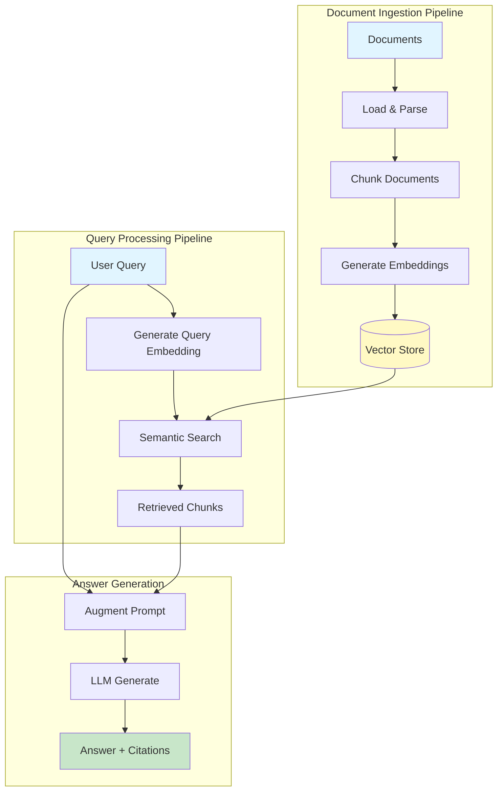

# Week 4 - Lesson 3: Building RAG Systems

## Repo Resources

- Week 4 Resources Index: [../resources/README.md](../resources/README.md)
- References: [../resources/references.md](../resources/references.md)
- RAG Cheatsheet: [../resources/rag-cheatsheet.md](../resources/rag-cheatsheet.md)
- Chunking Strategies: [../resources/chunking-strategies.md](../resources/chunking-strategies.md)
- Hybrid Retrieval & Re-ranking: [../resources/hybrid-reranking.md](../resources/hybrid-reranking.md)
- Evaluation Metrics: [../resources/evaluation-metrics.md](../resources/evaluation-metrics.md)
- Monitoring in Production: [../resources/monitoring-production.md](../resources/monitoring-production.md)
- Example Snippets: [../resources/example-snippets.md](../resources/example-snippets.md)

**Duration:** 90 minutes  
**Level:** Intermediate to Advanced  
**Prerequisites:** Week 4 Lessons 1-2, Understanding of embeddings and vector databases, Python proficiency

---

## 🎯 Learning Objectives

By the end of this lesson, you will:
- [ ] Understand the complete RAG pipeline architecture
- [ ] Implement document ingestion and preprocessing
- [ ] Apply effective chunking strategies
- [ ] Build a complete RAG system from scratch
- [ ] Handle different document formats (PDF, TXT, MD)
- [ ] Implement context-aware retrieval
- [ ] Generate answers with citations
- [ ] Apply error handling and fallback strategies

---

## 📚 Table of Contents

1. [RAG Pipeline Architecture](#1-rag-pipeline-architecture)
2. [Document Ingestion](#2-document-ingestion)
3. [Chunking Strategies](#3-chunking-strategies)
4. [Building the RAG Pipeline](#4-building-the-rag-pipeline)
5. [Query Processing](#5-query-processing)
6. [Answer Generation](#6-answer-generation)
7. [Complete RAG System](#7-complete-rag-system)
8. [Testing and Validation](#8-testing-and-validation)
9. [Summary](#9-summary)
10. [Further Reading](#10-further-reading)

---

## 1. RAG Pipeline Architecture

### Complete RAG Flow



### RAG Components

```python
"""
RAG System Components Overview
"""

from typing import List, Dict, Any, Optional
from dataclasses import dataclass
from datetime import datetime
import os
from dotenv import load_dotenv
from openai import OpenAI

load_dotenv()
client = OpenAI(api_key=os.getenv("OPENAI_API_KEY"))


@dataclass
class Document:
    """Document with metadata."""
    content: str
    metadata: Dict[str, Any]
    id: Optional[str] = None


@dataclass
class Chunk:
    """Document chunk with metadata."""
    content: str
    metadata: Dict[str, Any]
    embedding: Optional[List[float]] = None
    chunk_id: Optional[str] = None


@dataclass
class RetrievalResult:
    """Retrieved chunk with score."""
    chunk: Chunk
    score: float
    rank: int


@dataclass
class RAGResponse:
    """RAG system response."""
    answer: str
    sources: List[RetrievalResult]
    query: str
    metadata: Dict[str, Any]


print("RAG System Components:")
print("="*80)
print("""
Core Components:
1. Document Loader - Parse and load documents
2. Text Splitter - Chunk documents intelligently
3. Embedding Generator - Create vector representations
4. Vector Store - Store and retrieve embeddings
5. Retriever - Find relevant chunks
6. Prompt Builder - Construct augmented prompts
7. LLM Generator - Generate final answers
8. Response Builder - Format output with citations
""")
```

---

## 2. Document Ingestion

### 2.1 Document Loaders

```python
"""
Document Loading for Multiple Formats
"""

from pathlib import Path
import mimetypes


class DocumentLoader:
    """
    Load documents from various formats.
    """
    
    @staticmethod
    def load_text_file(filepath: str) -> Document:
        """Load plain text file."""
        with open(filepath, 'r', encoding='utf-8') as f:
            content = f.read()
        
        metadata = {
            "source": filepath,
            "filename": Path(filepath).name,
            "file_type": "text",
            "loaded_at": datetime.now().isoformat()
        }
        
        return Document(content=content, metadata=metadata)
    
    @staticmethod
    def load_markdown_file(filepath: str) -> Document:
        """Load markdown file."""
        with open(filepath, 'r', encoding='utf-8') as f:
            content = f.read()
        
        metadata = {
            "source": filepath,
            "filename": Path(filepath).name,
            "file_type": "markdown",
            "loaded_at": datetime.now().isoformat()
        }
        
        return Document(content=content, metadata=metadata)
    
    @staticmethod
    def load_pdf_file(filepath: str) -> Document:
        """
        Load PDF file.
        Requires: pip install pypdf2
        """
        try:
            from PyPDF2 import PdfReader
        except ImportError:
            raise ImportError("PyPDF2 is required for PDF loading. Install: pip install pypdf2")
        
        reader = PdfReader(filepath)
        
        # Extract text from all pages
        content_parts = []
        for page_num, page in enumerate(reader.pages, 1):
            text = page.extract_text()
            if text.strip():
                content_parts.append(f"[Page {page_num}]\n{text}")
        
        content = "\n\n".join(content_parts)
        
        metadata = {
            "source": filepath,
            "filename": Path(filepath).name,
            "file_type": "pdf",
            "page_count": len(reader.pages),
            "loaded_at": datetime.now().isoformat()
        }
        
        return Document(content=content, metadata=metadata)
    
    @classmethod
    def load_file(cls, filepath: str) -> Document:
        """
        Load file automatically based on extension.
        
        Args:
            filepath: Path to file
            
        Returns:
            Document object
        """
        filepath_obj = Path(filepath)
        
        if not filepath_obj.exists():
            raise FileNotFoundError(f"File not found: {filepath}")
        
        extension = filepath_obj.suffix.lower()
        
        if extension == '.pdf':
            return cls.load_pdf_file(filepath)
        elif extension == '.md':
            return cls.load_markdown_file(filepath)
        elif extension in ['.txt', '.text']:
            return cls.load_text_file(filepath)
        else:
            # Try as text file
            return cls.load_text_file(filepath)
    
    @classmethod
    def load_directory(
        cls,
        directory: str,
        extensions: Optional[List[str]] = None
    ) -> List[Document]:
        """
        Load all documents from a directory.
        
        Args:
            directory: Directory path
            extensions: File extensions to load (None = all)
            
        Returns:
            List of documents
        """
        if extensions is None:
            extensions = ['.txt', '.md', '.pdf']
        
        directory_path = Path(directory)
        documents = []
        
        for filepath in directory_path.rglob('*'):
            if filepath.is_file() and filepath.suffix.lower() in extensions:
                try:
                    doc = cls.load_file(str(filepath))
                    documents.append(doc)
                    print(f"✓ Loaded: {filepath.name}")
                except Exception as e:
                    print(f"✗ Failed to load {filepath.name}: {e}")
        
        return documents


# Test document loader
print("\nDocument Loader:")
print("="*80)

loader = DocumentLoader()

# Create sample text file
sample_text = """
# Introduction to RAG Systems

RAG (Retrieval-Augmented Generation) combines the power of retrieval systems
with language models to provide accurate, contextual answers.

## Key Benefits

1. Access to external knowledge
2. Reduced hallucinations
3. Updatable knowledge base
4. Source attribution

## Use Cases

- Customer support chatbots
- Document Q&A systems
- Knowledge management
- Research assistants
"""

# Save sample file
os.makedirs("./sample_docs", exist_ok=True)
with open("./sample_docs/rag_intro.md", 'w') as f:
    f.write(sample_text)

# Load document
doc = loader.load_file("./sample_docs/rag_intro.md")
print(f"\nLoaded document:")
print(f"  Filename: {doc.metadata['filename']}")
print(f"  Type: {doc.metadata['file_type']}")
print(f"  Content length: {len(doc.content)} characters")
print(f"\nFirst 200 characters:")
print(doc.content[:200])
```

### 2.2 Document Preprocessing

```python
"""
Document Preprocessing
"""

import re


class DocumentPreprocessor:
    """
    Preprocess documents before chunking.
    """
    
    @staticmethod
    def clean_text(text: str) -> str:
        """
        Clean text content.
        
        Args:
            text: Raw text
            
        Returns:
            Cleaned text
        """
        # Remove excessive whitespace
        text = re.sub(r'\s+', ' ', text)
        
        # Remove excessive newlines (keep max 2)
        text = re.sub(r'\n{3,}', '\n\n', text)
        
        # Remove special characters (keep basic punctuation)
        # text = re.sub(r'[^\w\s.,!?;:()\[\]{}"\'`-]', '', text)
        
        # Strip whitespace
        text = text.strip()
        
        return text
    
    @staticmethod
    def extract_metadata_from_content(content: str) -> tuple[str, Dict[str, Any]]:
        """
        Extract metadata from document content (e.g., markdown frontmatter).
        
        Args:
            content: Document content
            
        Returns:
            Tuple of (cleaned_content, extracted_metadata)
        """
        metadata = {}
        
        # Check for markdown frontmatter
        if content.startswith('---'):
            parts = content.split('---', 2)
            if len(parts) >= 3:
                # Parse frontmatter (simplified)
                frontmatter = parts[1].strip()
                for line in frontmatter.split('\n'):
                    if ':' in line:
                        key, value = line.split(':', 1)
                        metadata[key.strip()] = value.strip()
                
                # Remove frontmatter from content
                content = parts[2].strip()
        
        return content, metadata
    
    @classmethod
    def preprocess_document(cls, document: Document) -> Document:
        """
        Preprocess a document.
        
        Args:
            document: Input document
            
        Returns:
            Preprocessed document
        """
        content = document.content
        metadata = document.metadata.copy()
        
        # Extract metadata from content
        content, extracted_meta = cls.extract_metadata_from_content(content)
        metadata.update(extracted_meta)
        
        # Clean text
        content = cls.clean_text(content)
        
        # Update metadata
        metadata['preprocessed'] = True
        metadata['original_length'] = len(document.content)
        metadata['cleaned_length'] = len(content)
        
        return Document(
            content=content,
            metadata=metadata,
            id=document.id
        )


# Test preprocessing
print("\nDocument Preprocessing:")
print("="*80)

preprocessor = DocumentPreprocessor()

# Preprocess document
processed_doc = preprocessor.preprocess_document(doc)
print(f"\nOriginal length: {doc.metadata.get('original_length', len(doc.content))}")
print(f"Cleaned length: {processed_doc.metadata['cleaned_length']}")
print(f"\nProcessed content (first 200 chars):")
print(processed_doc.content[:200])
```

---

## 3. Chunking Strategies

### 3.1 Text Splitters

```python
"""
Text Chunking Strategies
"""

from typing import Callable


class TextSplitter:
    """
    Split text into chunks with various strategies.
    """
    
    @staticmethod
    def split_by_characters(
        text: str,
        chunk_size: int = 1000,
        chunk_overlap: int = 200
    ) -> List[str]:
        """
        Split text by character count.
        
        Args:
            text: Input text
            chunk_size: Maximum characters per chunk
            chunk_overlap: Overlap between chunks
            
        Returns:
            List of text chunks
        """
        chunks = []
        start = 0
        
        while start < len(text):
            end = start + chunk_size
            chunk = text[start:end]
            
            # Avoid breaking words
            if end < len(text) and not text[end].isspace():
                # Find last space
                last_space = chunk.rfind(' ')
                if last_space > 0:
                    end = start + last_space
                    chunk = text[start:end]
            
            chunks.append(chunk.strip())
            start = end - chunk_overlap
        
        return chunks
    
    @staticmethod
    def split_by_tokens(
        text: str,
        chunk_size: int = 512,
        chunk_overlap: int = 50,
        encoding_name: str = "cl100k_base"
    ) -> List[str]:
        """
        Split text by token count.
        Requires: pip install tiktoken
        
        Args:
            text: Input text
            chunk_size: Maximum tokens per chunk
            chunk_overlap: Overlap in tokens
            encoding_name: Tokenizer encoding
            
        Returns:
            List of text chunks
        """
        try:
            import tiktoken
        except ImportError:
            raise ImportError("tiktoken required for token splitting. Install: pip install tiktoken")
        
        encoding = tiktoken.get_encoding(encoding_name)
        tokens = encoding.encode(text)
        
        chunks = []
        start = 0
        
        while start < len(tokens):
            end = start + chunk_size
            chunk_tokens = tokens[start:end]
            chunk_text = encoding.decode(chunk_tokens)
            
            chunks.append(chunk_text.strip())
            start = end - chunk_overlap
        
        return chunks
    
    @staticmethod
    def split_by_sentences(
        text: str,
        chunk_size: int = 5,
        chunk_overlap: int = 1
    ) -> List[str]:
        """
        Split text by sentences.
        
        Args:
            text: Input text
            chunk_size: Number of sentences per chunk
            chunk_overlap: Overlapping sentences
            
        Returns:
            List of text chunks
        """
        # Simple sentence splitting (can be improved with NLP libraries)
        sentences = re.split(r'(?<=[.!?])\s+', text)
        
        chunks = []
        for i in range(0, len(sentences), chunk_size - chunk_overlap):
            chunk_sentences = sentences[i:i + chunk_size]
            chunk = ' '.join(chunk_sentences)
            if chunk.strip():
                chunks.append(chunk.strip())
        
        return chunks
    
    @staticmethod
    def split_by_paragraphs(
        text: str,
        chunk_size: int = 3,
        chunk_overlap: int = 1
    ) -> List[str]:
        """
        Split text by paragraphs.
        
        Args:
            text: Input text
            chunk_size: Number of paragraphs per chunk
            chunk_overlap: Overlapping paragraphs
            
        Returns:
            List of text chunks
        """
        # Split by double newlines
        paragraphs = [p.strip() for p in text.split('\n\n') if p.strip()]
        
        chunks = []
        for i in range(0, len(paragraphs), chunk_size - chunk_overlap):
            chunk_paras = paragraphs[i:i + chunk_size]
            chunk = '\n\n'.join(chunk_paras)
            if chunk.strip():
                chunks.append(chunk.strip())
        
        return chunks
    
    @staticmethod
    def split_markdown_by_headers(text: str) -> List[Dict[str, Any]]:
        """
        Split markdown by headers, preserving hierarchy.
        
        Args:
            text: Markdown text
            
        Returns:
            List of chunks with header context
        """
        lines = text.split('\n')
        chunks = []
        current_chunk = []
        current_headers = []
        
        for line in lines:
            # Check if line is a header
            if line.startswith('#'):
                # Save previous chunk if exists
                if current_chunk:
                    chunks.append({
                        'content': '\n'.join(current_chunk).strip(),
                        'headers': current_headers.copy()
                    })
                    current_chunk = []
                
                # Update header hierarchy
                level = len(line.split()[0])  # Count #'s
                header_text = line.lstrip('#').strip()
                
                # Remove headers of same or lower level
                current_headers = [h for h in current_headers if h['level'] < level]
                current_headers.append({'level': level, 'text': header_text})
                
                current_chunk.append(line)
            else:
                current_chunk.append(line)
        
        # Add final chunk
        if current_chunk:
            chunks.append({
                'content': '\n'.join(current_chunk).strip(),
                'headers': current_headers.copy()
            })
        
        return chunks


# Test chunking strategies
print("\nText Chunking Strategies:")
print("="*80)

splitter = TextSplitter()

# Test different splitting methods
print("\n1. Character-based splitting:")
char_chunks = splitter.split_by_characters(processed_doc.content, chunk_size=200, chunk_overlap=50)
print(f"   Created {len(char_chunks)} chunks")
for i, chunk in enumerate(char_chunks[:2], 1):
    print(f"\n   Chunk {i} ({len(chunk)} chars):")
    print(f"   {chunk[:100]}...")

print("\n\n2. Paragraph-based splitting:")
para_chunks = splitter.split_by_paragraphs(processed_doc.content, chunk_size=2, chunk_overlap=0)
print(f"   Created {len(para_chunks)} chunks")
for i, chunk in enumerate(para_chunks[:2], 1):
    print(f"\n   Chunk {i}:")
    print(f"   {chunk[:150]}...")

print("\n\n3. Markdown header-based splitting:")
md_chunks = splitter.split_markdown_by_headers(processed_doc.content)
print(f"   Created {len(md_chunks)} chunks")
for i, chunk_data in enumerate(md_chunks[:2], 1):
    headers = ' > '.join([h['text'] for h in chunk_data['headers']])
    print(f"\n   Chunk {i}:")
    print(f"   Headers: {headers}")
    print(f"   Content: {chunk_data['content'][:100]}...")
```

### 3.2 Smart Chunking

```python
"""
Smart Chunking with Context Preservation
"""

import uuid


class SmartChunker:
    """
    Intelligent document chunking with context preservation.
    """
    
    def __init__(
        self,
        chunk_size: int = 1000,
        chunk_overlap: int = 200,
        splitter_type: str = "character"
    ):
        self.chunk_size = chunk_size
        self.chunk_overlap = chunk_overlap
        self.splitter_type = splitter_type
        self.text_splitter = TextSplitter()
    
    def chunk_document(
        self,
        document: Document,
        add_metadata: bool = True
    ) -> List[Chunk]:
        """
        Chunk a document intelligently.
        
        Args:
            document: Input document
            add_metadata: Whether to add chunk metadata
            
        Returns:
            List of chunks
        """
        # Choose splitting strategy
        if self.splitter_type == "character":
            text_chunks = self.text_splitter.split_by_characters(
                document.content,
                self.chunk_size,
                self.chunk_overlap
            )
        elif self.splitter_type == "paragraph":
            text_chunks = self.text_splitter.split_by_paragraphs(
                document.content,
                chunk_size=3,
                chunk_overlap=1
            )
        elif self.splitter_type == "markdown":
            md_chunks = self.text_splitter.split_markdown_by_headers(document.content)
            text_chunks = [c['content'] for c in md_chunks]
        else:
            raise ValueError(f"Unknown splitter type: {self.splitter_type}")
        
        # Create Chunk objects
        chunks = []
        for i, text in enumerate(text_chunks):
            metadata = document.metadata.copy()
            
            if add_metadata:
                metadata.update({
                    'chunk_index': i,
                    'chunk_size': len(text),
                    'total_chunks': len(text_chunks),
                    'splitter_type': self.splitter_type
                })
            
            chunk = Chunk(
                content=text,
                metadata=metadata,
                chunk_id=f"{document.metadata.get('filename', 'doc')}_{i}_{uuid.uuid4().hex[:8]}"
            )
            chunks.append(chunk)
        
        return chunks
    
    def chunk_documents(self, documents: List[Document]) -> List[Chunk]:
        """
        Chunk multiple documents.
        
        Args:
            documents: List of documents
            
        Returns:
            List of all chunks
        """
        all_chunks = []
        
        for doc in documents:
            chunks = self.chunk_document(doc)
            all_chunks.extend(chunks)
        
        return all_chunks


# Test smart chunking
print("\nSmart Chunking:")
print("="*80)

chunker = SmartChunker(chunk_size=300, chunk_overlap=50, splitter_type="paragraph")

chunks = chunker.chunk_document(processed_doc)
print(f"\nCreated {len(chunks)} chunks")

for i, chunk in enumerate(chunks[:3], 1):
    print(f"\nChunk {i}:")
    print(f"  ID: {chunk.chunk_id}")
    print(f"  Size: {chunk.metadata['chunk_size']} characters")
    print(f"  Index: {chunk.metadata['chunk_index']}/{chunk.metadata['total_chunks']-1}")
    print(f"  Content: {chunk.content[:100]}...")
```

---

## 4. Building the RAG Pipeline

### 4.1 RAG Pipeline Components

```python
"""
Complete RAG Pipeline
"""

from typing import Protocol
import chromadb
from chromadb.config import Settings


class EmbeddingGenerator(Protocol):
    """Protocol for embedding generators."""
    def embed_text(self, text: str) -> List[float]: ...
    def embed_batch(self, texts: List[str]) -> List[List[float]]: ...


class SimpleEmbeddingGenerator:
    """Simple embedding generator using OpenAI."""
    
    def __init__(self, model: str = "text-embedding-3-small"):
        self.model = model
        self.client = client
    
    def embed_text(self, text: str) -> List[float]:
        """Generate embedding for single text."""
        text = text.replace("\n", " ")
        response = self.client.embeddings.create(input=[text], model=self.model)
        return response.data[0].embedding
    
    def embed_batch(self, texts: List[str]) -> List[List[float]]:
        """Generate embeddings for multiple texts."""
        cleaned_texts = [text.replace("\n", " ") for text in texts]
        response = self.client.embeddings.create(input=cleaned_texts, model=self.model)
        return [item.embedding for item in response.data]


class RAGPipeline:
    """
    Complete RAG pipeline.
    """
    
    def __init__(
        self,
        collection_name: str = "rag_documents",
        persist_directory: str = "./rag_db",
        chunk_size: int = 1000,
        chunk_overlap: int = 200
    ):
        self.collection_name = collection_name
        self.persist_directory = persist_directory
        
        # Initialize components
        self.document_loader = DocumentLoader()
        self.preprocessor = DocumentPreprocessor()
        self.chunker = SmartChunker(
            chunk_size=chunk_size,
            chunk_overlap=chunk_overlap,
            splitter_type="paragraph"
        )
        self.embedding_generator = SimpleEmbeddingGenerator()
        
        # Initialize vector store
        self.client = chromadb.Client(Settings(
            persist_directory=persist_directory,
            anonymized_telemetry=False
        ))
        self.collection = self.client.get_or_create_collection(
            name=collection_name,
            metadata={"description": "RAG document collection"}
        )
        
        self.llm_client = client
    
    def ingest_document(self, filepath: str) -> int:
        """
        Ingest a single document into the system.
        
        Args:
            filepath: Path to document
            
        Returns:
            Number of chunks created
        """
        print(f"\nIngesting: {filepath}")
        
        # Load document
        doc = self.document_loader.load_file(filepath)
        print(f"  ✓ Loaded ({len(doc.content)} chars)")
        
        # Preprocess
        doc = self.preprocessor.preprocess_document(doc)
        print(f"  ✓ Preprocessed ({len(doc.content)} chars)")
        
        # Chunk
        chunks = self.chunker.chunk_document(doc)
        print(f"  ✓ Chunked into {len(chunks)} pieces")
        
        # Generate embeddings
        chunk_texts = [chunk.content for chunk in chunks]
        embeddings = self.embedding_generator.embed_batch(chunk_texts)
        print(f"  ✓ Generated embeddings")
        
        # Store in vector database
        self.collection.add(
            documents=chunk_texts,
            embeddings=embeddings,
            metadatas=[chunk.metadata for chunk in chunks],
            ids=[chunk.chunk_id for chunk in chunks]
        )
        print(f"  ✓ Stored in vector database")
        
        return len(chunks)
    
    def ingest_directory(self, directory: str) -> int:
        """
        Ingest all documents from a directory.
        
        Args:
            directory: Directory path
            
        Returns:
            Total number of chunks created
        """
        documents = self.document_loader.load_directory(directory)
        
        total_chunks = 0
        for doc in documents:
            # Create temp file to process
            temp_path = f"./temp_{doc.metadata['filename']}"
            with open(temp_path, 'w') as f:
                f.write(doc.content)
            
            try:
                chunks_count = self.ingest_document(temp_path)
                total_chunks += chunks_count
            finally:
                if os.path.exists(temp_path):
                    os.remove(temp_path)
        
        return total_chunks
    
    def retrieve(
        self,
        query: str,
        n_results: int = 5,
        where: Optional[Dict[str, Any]] = None
    ) -> List[RetrievalResult]:
        """
        Retrieve relevant chunks for a query.
        
        Args:
            query: Search query
            n_results: Number of results
            where: Metadata filters
            
        Returns:
            List of retrieval results
        """
        # Generate query embedding
        query_embedding = self.embedding_generator.embed_text(query)
        
        # Search
        results = self.collection.query(
            query_embeddings=[query_embedding],
            n_results=n_results,
            where=where
        )
        
        # Convert to RetrievalResult objects
        retrieval_results = []
        
        for rank, (doc_id, document, distance, metadata) in enumerate(zip(
            results["ids"][0],
            results["documents"][0],
            results["distances"][0],
            results["metadatas"][0]
        ), 1):
            score = 1.0 - distance  # Convert distance to similarity
            
            chunk = Chunk(
                content=document,
                metadata=metadata or {},
                chunk_id=doc_id
            )
            
            retrieval_results.append(RetrievalResult(
                chunk=chunk,
                score=score,
                rank=rank
            ))
        
        return retrieval_results
    
    def generate_answer(
        self,
        query: str,
        retrieved_chunks: List[RetrievalResult],
        max_context_length: int = 3000
    ) -> str:
        """
        Generate answer using LLM with retrieved context.
        
        Args:
            query: User query
            retrieved_chunks: Retrieved context chunks
            max_context_length: Maximum context characters
            
        Returns:
            Generated answer
        """
        # Build context from retrieved chunks
        context_parts = []
        current_length = 0
        
        for result in retrieved_chunks:
            chunk_text = result.chunk.content
            if current_length + len(chunk_text) > max_context_length:
                break
            
            source = result.chunk.metadata.get('filename', 'Unknown')
            context_parts.append(f"[Source: {source}]\n{chunk_text}")
            current_length += len(chunk_text)
        
        context = "\n\n---\n\n".join(context_parts)
        
        # Build prompt
        prompt = f"""Answer the question based on the context below. If the answer cannot be found in the context, say "I don't have enough information to answer this question."

Context:
{context}

Question: {query}

Answer:"""
        
        # Generate response
        response = self.llm_client.chat.completions.create(
            model="gpt-4o-mini",
            messages=[
                {
                    "role": "system",
                    "content": "You are a helpful assistant that answers questions based on the provided context. Always cite your sources."
                },
                {
                    "role": "user",
                    "content": prompt
                }
            ],
            temperature=0.3
        )
        
        return response.choices[0].message.content
    
    def query(
        self,
        question: str,
        n_results: int = 5,
        include_sources: bool = True
    ) -> RAGResponse:
        """
        Complete RAG query: retrieve and generate.
        
        Args:
            question: User question
            n_results: Number of chunks to retrieve
            include_sources: Whether to include source information
            
        Returns:
            RAG response with answer and sources
        """
        # Retrieve relevant chunks
        retrieved = self.retrieve(question, n_results=n_results)
        
        # Generate answer
        answer = self.generate_answer(question, retrieved)
        
        # Build response
        return RAGResponse(
            answer=answer,
            sources=retrieved if include_sources else [],
            query=question,
            metadata={
                'model': 'gpt-4o-mini',
                'n_retrieved': len(retrieved),
                'timestamp': datetime.now().isoformat()
            }
        )
    
    def get_stats(self) -> Dict[str, Any]:
        """Get pipeline statistics."""
        return {
            'collection_name': self.collection_name,
            'total_chunks': self.collection.count(),
            'embedding_model': 'text-embedding-3-small',
            'llm_model': 'gpt-4o-mini'
        }


# Test RAG pipeline
print("\nRAG Pipeline:")
print("="*80)

# Create pipeline
rag_pipeline = RAGPipeline(
    collection_name="test_rag",
    persist_directory="./test_rag_db"
)

# Ingest document
chunks_created = rag_pipeline.ingest_document("./sample_docs/rag_intro.md")
print(f"\nTotal chunks created: {chunks_created}")

# Show stats
stats = rag_pipeline.get_stats()
print(f"\nPipeline stats:")
for key, value in stats.items():
    print(f"  {key}: {value}")
```

---

## 5. Query Processing

### 5.1 Query Enhancement

```python
"""
Query Enhancement and Optimization
"""


class QueryProcessor:
    """
    Process and enhance queries for better retrieval.
    """
    
    def __init__(self):
        self.client = client
    
    def expand_query(self, query: str) -> List[str]:
        """
        Expand query with synonyms and related terms.
        
        Args:
            query: Original query
            
        Returns:
            List of query variations
        """
        prompt = f"""Generate 3 variations of this search query that mean the same thing but use different words:

Original: {query}

Return only the variations, one per line."""
        
        response = self.client.chat.completions.create(
            model="gpt-4o-mini",
            messages=[{"role": "user", "content": prompt}],
            temperature=0.7
        )
        
        variations = response.choices[0].message.content.strip().split('\n')
        variations = [v.strip('- ').strip() for v in variations if v.strip()]
        
        return [query] + variations
    
    def extract_keywords(self, query: str) -> List[str]:
        """
        Extract key terms from query.
        
        Args:
            query: Input query
            
        Returns:
            List of keywords
        """
        prompt = f"""Extract the most important keywords from this query. Return only the keywords, comma-separated:

Query: {query}

Keywords:"""
        
        response = self.client.chat.completions.create(
            model="gpt-4o-mini",
            messages=[{"role": "user", "content": prompt}],
            temperature=0.3
        )
        
        keywords_str = response.choices[0].message.content.strip()
        keywords = [k.strip() for k in keywords_str.split(',')]
        
        return keywords
    
    def classify_query_intent(self, query: str) -> str:
        """
        Classify the intent of the query.
        
        Args:
            query: Input query
            
        Returns:
            Query intent (factual, how-to, comparison, etc.)
        """
        prompt = f"""Classify this query into one category: factual, how-to, comparison, opinion, definition

Query: {query}

Category:"""
        
        response = self.client.chat.completions.create(
            model="gpt-4o-mini",
            messages=[{"role": "user", "content": prompt}],
            temperature=0.3
        )
        
        intent = response.choices[0].message.content.strip().lower()
        return intent


# Test query processing
print("\nQuery Processing:")
print("="*80)

query_processor = QueryProcessor()

test_query = "How does RAG reduce hallucinations?"

print(f"\nOriginal query: {test_query}")

# Expand query
print("\n1. Query Expansion:")
variations = query_processor.expand_query(test_query)
for i, var in enumerate(variations, 1):
    print(f"   {i}. {var}")

# Extract keywords
print("\n2. Keyword Extraction:")
keywords = query_processor.extract_keywords(test_query)
print(f"   Keywords: {', '.join(keywords)}")

# Classify intent
print("\n3. Intent Classification:")
intent = query_processor.classify_query_intent(test_query)
print(f"   Intent: {intent}")
```

---

## 6. Answer Generation

### 6.1 Advanced Answer Generation

```python
"""
Advanced Answer Generation with Citations
"""


class AnswerGenerator:
    """
    Generate answers with citations and confidence scores.
    """
    
    def __init__(self, model: str = "gpt-4o-mini"):
        self.model = model
        self.client = client
    
    def generate_with_citations(
        self,
        query: str,
        context_chunks: List[RetrievalResult],
        max_tokens: int = 500
    ) -> Dict[str, Any]:
        """
        Generate answer with inline citations.
        
        Args:
            query: User query
            context_chunks: Retrieved context
            max_tokens: Maximum response tokens
            
        Returns:
            Dictionary with answer, citations, and confidence
        """
        # Build numbered context
        context_parts = []
        for i, result in enumerate(context_chunks, 1):
            source = result.chunk.metadata.get('filename', 'Unknown')
            context_parts.append(f"[{i}] (Source: {source})\n{result.chunk.content}")
        
        context = "\n\n".join(context_parts)
        
        # Build prompt with citation instructions
        prompt = f"""Answer the question based on the provided context. Include citations using [number] format.

Context:
{context}

Question: {query}

Instructions:
1. Answer the question using information from the context
2. Cite sources using [1], [2], etc. format
3. If you're uncertain, mention it
4. If the answer isn't in the context, say so

Answer:"""
        
        response = self.client.chat.completions.create(
            model=self.model,
            messages=[
                {
                    "role": "system",
                    "content": "You are a precise assistant that always cites sources and indicates confidence levels."
                },
                {
                    "role": "user",
                    "content": prompt
                }
            ],
            max_tokens=max_tokens,
            temperature=0.3
        )
        
        answer = response.choices[0].message.content
        
        # Extract citation numbers
        import re
        citations = re.findall(r'\[(\d+)\]', answer)
        cited_sources = []
        
        for cite_num in set(citations):
            idx = int(cite_num) - 1
            if idx < len(context_chunks):
                cited_sources.append({
                    'number': cite_num,
                    'source': context_chunks[idx].chunk.metadata.get('filename'),
                    'score': context_chunks[idx].score
                })
        
        return {
            'answer': answer,
            'citations': cited_sources,
            'total_sources': len(context_chunks)
        }
    
    def generate_with_confidence(
        self,
        query: str,
        context_chunks: List[RetrievalResult]
    ) -> Dict[str, Any]:
        """
        Generate answer with confidence assessment.
        
        Args:
            query: User query
            context_chunks: Retrieved context
            
        Returns:
            Answer with confidence score
        """
        result = self.generate_with_citations(query, context_chunks)
        
        # Assess confidence based on retrieval scores
        avg_score = sum(c.score for c in context_chunks) / len(context_chunks) if context_chunks else 0
        
        confidence = "high" if avg_score > 0.8 else "medium" if avg_score > 0.6 else "low"
        
        result['confidence'] = confidence
        result['avg_retrieval_score'] = avg_score
        
        return result


# Test answer generation
print("\nAdvanced Answer Generation:")
print("="*80)

answer_gen = AnswerGenerator()

# Query the RAG system
print("\nQuerying RAG system...")
rag_response = rag_pipeline.query("What are the benefits of RAG systems?")

print(f"\nQuery: {rag_response.query}")
print(f"\nAnswer:\n{rag_response.answer}")

print(f"\n\nSources used:")
for i, source in enumerate(rag_response.sources, 1):
    print(f"{i}. {source.chunk.metadata.get('filename')} (score: {source.score:.3f})")
```

---

## 7. Complete RAG System

### 7.1 Production-Ready RAG System

```python
"""
Complete Production-Ready RAG System
"""

import logging
from typing import Union

logging.basicConfig(level=logging.INFO)
logger = logging.getLogger(__name__)


class ProductionRAGSystem:
    """
    Production-ready RAG system with full features.
    """
    
    def __init__(
        self,
        collection_name: str = "production_rag",
        persist_directory: str = "./production_rag_db",
        chunk_size: int = 1000,
        chunk_overlap: int = 200,
        embedding_model: str = "text-embedding-3-small",
        llm_model: str = "gpt-4o-mini"
    ):
        self.collection_name = collection_name
        self.embedding_model = embedding_model
        self.llm_model = llm_model
        
        # Initialize core pipeline
        self.pipeline = RAGPipeline(
            collection_name=collection_name,
            persist_directory=persist_directory,
            chunk_size=chunk_size,
            chunk_overlap=chunk_overlap
        )
        
        # Initialize additional components
        self.query_processor = QueryProcessor()
        self.answer_generator = AnswerGenerator(model=llm_model)
        
        # Statistics
        self.stats = {
            'queries_processed': 0,
            'documents_ingested': 0,
            'total_chunks': 0
        }
    
    def ingest(
        self,
        source: Union[str, List[str]],
        source_type: str = "file"
    ) -> Dict[str, Any]:
        """
        Ingest documents into the system.
        
        Args:
            source: File path, directory path, or list of paths
            source_type: "file", "directory", or "files"
            
        Returns:
            Ingestion results
        """
        logger.info(f"Starting ingestion: {source_type}")
        
        try:
            if source_type == "file":
                chunks = self.pipeline.ingest_document(source)
                files_processed = 1
            elif source_type == "directory":
                chunks = self.pipeline.ingest_directory(source)
                files_processed = len(os.listdir(source))
            elif source_type == "files":
                chunks = 0
                for filepath in source:
                    chunks += self.pipeline.ingest_document(filepath)
                files_processed = len(source)
            else:
                raise ValueError(f"Unknown source_type: {source_type}")
            
            self.stats['documents_ingested'] += files_processed
            self.stats['total_chunks'] += chunks
            
            logger.info(f"✓ Ingestion complete: {chunks} chunks from {files_processed} files")
            
            return {
                'success': True,
                'files_processed': files_processed,
                'chunks_created': chunks,
                'total_chunks': self.pipeline.collection.count()
            }
            
        except Exception as e:
            logger.error(f"✗ Ingestion failed: {e}")
            return {
                'success': False,
                'error': str(e)
            }
    
    def query(
        self,
        question: str,
        n_results: int = 5,
        enhance_query: bool = True,
        include_confidence: bool = True
    ) -> Dict[str, Any]:
        """
        Query the RAG system.
        
        Args:
            question: User question
            n_results: Number of chunks to retrieve
            enhance_query: Whether to enhance the query
            include_confidence: Whether to include confidence assessment
            
        Returns:
            Complete response with answer, sources, and metadata
        """
        logger.info(f"Processing query: {question}")
        
        try:
            # Optionally enhance query
            if enhance_query:
                query_variations = self.query_processor.expand_query(question)
                logger.info(f"  Enhanced query with {len(query_variations)} variations")
            else:
                query_variations = [question]
            
            # Retrieve using primary query
            retrieved = self.pipeline.retrieve(query_variations[0], n_results=n_results)
            logger.info(f"  Retrieved {len(retrieved)} chunks")
            
            # Generate answer with confidence
            if include_confidence:
                result = self.answer_generator.generate_with_confidence(
                    question,
                    retrieved
                )
            else:
                result = self.answer_generator.generate_with_citations(
                    question,
                    retrieved
                )
            
            self.stats['queries_processed'] += 1
            
            logger.info(f"✓ Query complete")
            
            return {
                'success': True,
                'query': question,
                'answer': result['answer'],
                'confidence': result.get('confidence'),
                'citations': result.get('citations', []),
                'sources': [
                    {
                        'rank': r.rank,
                        'score': r.score,
                        'source': r.chunk.metadata.get('filename'),
                        'preview': r.chunk.content[:200] + '...'
                    }
                    for r in retrieved
                ],
                'metadata': {
                    'model': self.llm_model,
                    'n_retrieved': len(retrieved),
                    'timestamp': datetime.now().isoformat()
                }
            }
            
        except Exception as e:
            logger.error(f"✗ Query failed: {e}")
            return {
                'success': False,
                'error': str(e)
            }
    
    def get_system_info(self) -> Dict[str, Any]:
        """Get system information and statistics."""
        pipeline_stats = self.pipeline.get_stats()
        
        return {
            'system': {
                'collection': self.collection_name,
                'embedding_model': self.embedding_model,
                'llm_model': self.llm_model
            },
            'statistics': self.stats,
            'pipeline': pipeline_stats
        }


# Test production RAG system
print("\nProduction RAG System:")
print("="*80)

# Create system
rag_system = ProductionRAGSystem(
    collection_name="demo_rag",
    persist_directory="./demo_rag_db"
)

# Ingest documents
print("\n1. Ingesting documents...")
ingest_result = rag_system.ingest("./sample_docs/rag_intro.md", source_type="file")
print(f"   Result: {ingest_result}")

# Query system
print("\n2. Querying system...")
queries = [
    "What is RAG?",
    "How does RAG help with hallucinations?",
    "What are use cases for RAG systems?"
]

for query in queries:
    print(f"\n   Q: {query}")
    response = rag_system.query(query, n_results=3)
    
    if response['success']:
        print(f"   A: {response['answer'][:200]}...")
        print(f"   Confidence: {response.get('confidence')}")
        print(f"   Sources: {len(response['sources'])}")
    else:
        print(f"   Error: {response['error']}")

# Show system info
print("\n3. System Information:")
info = rag_system.get_system_info()
print(f"\n   System:")
for key, value in info['system'].items():
    print(f"     {key}: {value}")

print(f"\n   Statistics:")
for key, value in info['statistics'].items():
    print(f"     {key}: {value}")
```

---

## 8. Testing and Validation

### 8.1 RAG System Testing

```python
"""
Testing and Validation Framework
"""


class RAGTester:
    """
    Test RAG system quality and performance.
    """
    
    def __init__(self, rag_system: ProductionRAGSystem):
        self.rag_system = rag_system
    
    def test_retrieval_quality(
        self,
        test_queries: List[Dict[str, Any]]
    ) -> Dict[str, Any]:
        """
        Test retrieval quality with known queries.
        
        Args:
            test_queries: List of {'query': str, 'expected_source': str}
            
        Returns:
            Test results
        """
        results = {
            'total_tests': len(test_queries),
            'passed': 0,
            'failed': 0,
            'details': []
        }
        
        for test in test_queries:
            query = test['query']
            expected = test.get('expected_source')
            
            # Query system
            response = self.rag_system.query(query, n_results=3)
            
            if response['success']:
                # Check if expected source is in top results
                top_sources = [s['source'] for s in response['sources']]
                
                if expected and expected in top_sources:
                    results['passed'] += 1
                    status = "PASS"
                else:
                    results['failed'] += 1
                    status = "FAIL"
                
                results['details'].append({
                    'query': query,
                    'status': status,
                    'expected': expected,
                    'retrieved': top_sources[:3]
                })
            else:
                results['failed'] += 1
                results['details'].append({
                    'query': query,
                    'status': "ERROR",
                    'error': response['error']
                })
        
        results['pass_rate'] = results['passed'] / results['total_tests'] * 100
        
        return results
    
    def test_answer_quality(
        self,
        test_cases: List[Dict[str, Any]]
    ) -> Dict[str, Any]:
        """
        Test answer quality.
        
        Args:
            test_cases: List of {'query': str, 'expected_keywords': List[str]}
            
        Returns:
            Test results
        """
        results = {
            'total_tests': len(test_cases),
            'keyword_matches': 0,
            'details': []
        }
        
        for test in test_cases:
            query = test['query']
            expected_keywords = test.get('expected_keywords', [])
            
            response = self.rag_system.query(query)
            
            if response['success']:
                answer = response['answer'].lower()
                
                # Check keyword presence
                matches = sum(1 for kw in expected_keywords if kw.lower() in answer)
                match_rate = matches / len(expected_keywords) * 100 if expected_keywords else 0
                
                if match_rate >= 50:  # At least half keywords present
                    results['keyword_matches'] += 1
                
                results['details'].append({
                    'query': query,
                    'match_rate': match_rate,
                    'matches': matches,
                    'total_keywords': len(expected_keywords)
                })
        
        results['quality_score'] = results['keyword_matches'] / results['total_tests'] * 100
        
        return results


# Test the RAG system
print("\nRAG System Testing:")
print("="*80)

tester = RAGTester(rag_system)

# Retrieval quality tests
print("\n1. Retrieval Quality Test:")
retrieval_tests = [
    {
        'query': 'What are the benefits of RAG?',
        'expected_source': 'rag_intro.md'
    },
    {
        'query': 'RAG use cases',
        'expected_source': 'rag_intro.md'
    }
]

retrieval_results = tester.test_retrieval_quality(retrieval_tests)
print(f"   Pass rate: {retrieval_results['pass_rate']:.1f}%")
print(f"   Passed: {retrieval_results['passed']}/{retrieval_results['total_tests']}")

# Answer quality tests
print("\n2. Answer Quality Test:")
answer_tests = [
    {
        'query': 'What is RAG?',
        'expected_keywords': ['retrieval', 'generation', 'language']
    },
    {
        'query': 'Benefits of RAG',
        'expected_keywords': ['knowledge', 'hallucinations', 'accurate']
    }
]

answer_results = tester.test_answer_quality(answer_tests)
print(f"   Quality score: {answer_results['quality_score']:.1f}%")
print(f"   Matches: {answer_results['keyword_matches']}/{answer_results['total_tests']}")
```

---

## 9. Summary

### Key Takeaways

1. **RAG Pipeline** consists of ingestion, retrieval, and generation stages
2. **Document chunking** significantly impacts retrieval quality
3. **Context preservation** is crucial for maintaining semantic meaning
4. **Smart retrieval** uses embeddings for semantic similarity
5. **Answer generation** should include citations and confidence scores
6. **Query enhancement** can improve retrieval accuracy
7. **Testing** is essential for validating system quality
8. **Production systems** require error handling, logging, and monitoring

### RAG Pipeline Checklist

- [ ] Implement document loading for multiple formats
- [ ] Apply preprocessing and cleaning
- [ ] Use intelligent chunking with overlap
- [ ] Generate and store embeddings efficiently
- [ ] Implement semantic retrieval with metadata filtering
- [ ] Build context-aware prompts
- [ ] Generate answers with citations
- [ ] Add confidence scoring
- [ ] Implement comprehensive error handling
- [ ] Set up testing and validation
- [ ] Monitor performance metrics
- [ ] Document system configuration

### Best Practices Summary

**Ingestion:**
- Support multiple document formats
- Clean and normalize text
- Use appropriate chunking strategy
- Preserve metadata throughout pipeline
- Batch embeddings for efficiency

**Retrieval:**
- Use semantic search over keyword matching
- Retrieve sufficient context (3-5 chunks typical)
- Apply metadata filters when relevant
- Consider hybrid search (semantic + keyword)
- Re-rank results if needed

**Generation:**
- Build clear, structured prompts
- Include citation instructions
- Set appropriate temperature (0.3-0.5)
- Limit context to avoid token limits
- Validate generated answers

**System:**
- Implement comprehensive logging
- Add error handling and fallbacks
- Monitor query latency
- Track retrieval quality metrics
- Version control prompt templates

### Next Steps

- [ ] Complete Lab 2: Basic RAG Implementation
- [ ] Build RAG system for specific domain
- [ ] Experiment with different chunking strategies
- [ ] Implement advanced retrieval techniques
- [ ] Move to Lesson 4: RAG Optimization & Best Practices

---

## 10. Further Reading

### Official Documentation
- [LangChain RAG Tutorial](https://python.langchain.com/docs/use_cases/question_answering/)
- [OpenAI Embeddings Guide](https://platform.openai.com/docs/guides/embeddings)
- [ChromaDB Documentation](https://docs.trychroma.com/)

### Research Papers
- [Retrieval-Augmented Generation for Knowledge-Intensive NLP Tasks](https://arxiv.org/abs/2005.11401)
- [Dense Passage Retrieval](https://arxiv.org/abs/2004.04906)
- [REALM: Retrieval-Augmented Language Model](https://arxiv.org/abs/2002.08909)

### Libraries & Tools
- [LangChain](https://python.langchain.com/) - RAG framework
- [LlamaIndex](https://www.llamaindex.ai/) - Data framework for LLMs
- [Haystack](https://haystack.deepset.ai/) - NLP framework with RAG
- [txtai](https://neuml.github.io/txtai/) - Semantic search and RAG

### Tutorials & Guides
- [Building RAG Applications](https://www.pinecone.io/learn/retrieval-augmented-generation/)
- [RAG Best Practices](https://www.mongodb.com/developer/products/atlas/rag-best-practices/)
- [Advanced RAG Techniques](https://blog.langchain.dev/advanced-rag/)

---

## 📝 Review Questions

1. What are the three main stages of a RAG pipeline?
2. Why is document chunking important for RAG systems?
3. How does chunk overlap help maintain context?
4. What's the difference between semantic and keyword search?
5. Why should RAG answers include citations?
6. How do you measure RAG system quality?
7. What are common failure modes in RAG systems?

---

## 🔗 Related Content

- **Previous:** [Week 4 - Lesson 2: Embeddings & Vector Databases](02-embeddings-vector-databases.md)
- **Next:** [Week 4 - Lesson 4: RAG Optimization & Best Practices](04-rag-optimization-best-practices.md)
- **Related Lab:** `labs/lab-02-basic-rag-implementation.ipynb`

---

**Author:** Training Team  
**Provided by:** ADC ENGINEERING & CONSULTING LTD  
**Last Updated:** November 5, 2025  
**Version:** 1.0
