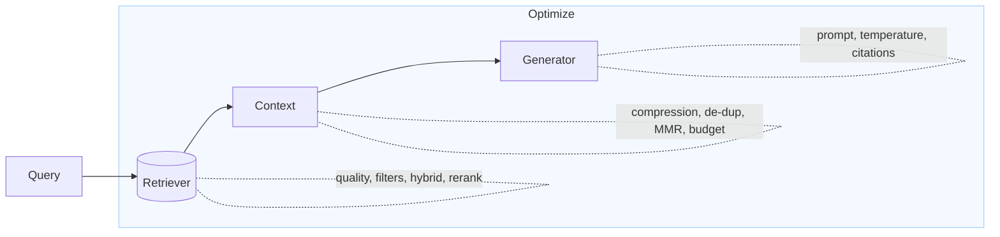
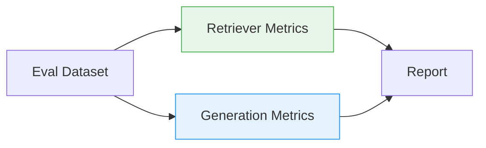

# Week 4 - Lesson 4: RAG Optimization & Best Practices

**Duration:** 90 minutes  
**Level:** Advanced  
**Prerequisites:** Week 4 Lessons 1-3, OpenAI API, embeddings & vector DBs, Python

---

## 🎯 Learning Objectives

By the end of this lesson, you will:
- [ ] Optimize retrieval quality (recall, precision, nDCG)
- [ ] Apply hybrid search and re-ranking strategies
- [ ] Tune chunking, overlap, and metadata for accuracy
- [ ] Compress and budget context for lower latency and cost
- [ ] Reduce hallucinations with verification & guardrails
- [ ] Build an evaluation framework with automated metrics
- [ ] Monitor RAG systems in production with actionable KPIs

---

## 📚 Table of Contents

1. [What to Optimize](#1-what-to-optimize)
2. [Retrieval Quality Optimization](#2-retrieval-quality-optimization)
3. [Hybrid Search & Re-ranking](#3-hybrid-search--re-ranking)
4. [Prompt & Context Optimization](#4-prompt--context-optimization)
5. [Performance & Cost Optimization](#5-performance--cost-optimization)
6. [Guardrails & Hallucination Reduction](#6-guardrails--hallucination-reduction)
7. [Evaluation Framework](#7-evaluation-framework)
8. [Observability & Monitoring](#8-observability--monitoring)
9. [Tuning Playbook & Checklists](#9-tuning-playbook--checklists)
10. [Summary & Further Reading](#10-summary--further-reading)

---

## 1. What to Optimize



- Quality: Recall@k, Precision@k, nDCG, Answer Correctness, Faithfulness
- Latency: P50/P95 end-to-end, retrieval time, generation time
- Cost: Tokens retrieved, tokens generated, embedding batch sizes
- Safety: Source-cited, policy-compliant, sensitive data filtering

---

## 2. Retrieval Quality Optimization

### 2.1 Chunking & Overlap

- Start with tokens: size 300–600, overlap 10–15% (domain dependent)
- Prefer semantic/paragraph-aware splitting over fixed characters
- Preserve structure (section headers, page, table context)
- Add document- and section-level metadata

```python
"""
Grid search helper for chunking parameters (tokens) and quick quality probe.
Requires: tiktoken
"""
from typing import List, Dict, Any, Tuple
import re

try:
    import tiktoken
except ImportError:
    tiktoken = None

class ChunkingGridSearch:
    def __init__(self, tokenizer: str = "cl100k_base"):
        if tiktoken is None:
            raise ImportError("Install tiktoken to use ChunkingGridSearch")
        self.enc = tiktoken.get_encoding(tokenizer)

    def split_by_tokens(self, text: str, size: int, overlap: int) -> List[str]:
        tokens = self.enc.encode(text)
        out = []
        i = 0
        while i < len(tokens):
            j = min(i + size, len(tokens))
            out.append(self.enc.decode(tokens[i:j]))
            i = max(j - overlap, 0)
        return [c.strip() for c in out if c.strip()]

    def run(self, text: str, candidates: List[Tuple[int,int]]) -> Dict[str, Any]:
        results = {}
        for size, overlap in candidates:
            chunks = self.split_by_tokens(text, size, overlap)
            avg_len = sum(len(c) for c in chunks) / max(1, len(chunks))
            results[f"size={size},overlap={overlap}"] = {
                "n_chunks": len(chunks),
                "avg_chars": round(avg_len, 1)
            }
        return results
```

### 2.2 Metadata & Filters

- Index and filter by: source, section, type (FAQ/Policy/Guide), date/version, language
- Improve precision: filter then retrieve (pre-filter) or retrieve then filter (post-filter)

### 2.3 Query Rewriting & Expansion

- Normalize entities and synonyms; expand acronyms (e.g., SSO → Single Sign-On)
- Use LLM-assisted query rewrite to increase recall while controlling drift

```python
"""LLM-based query rewriter with temperature control."""
from openai import OpenAI
import os

class QueryRewriter:
    def __init__(self, model: str = "gpt-4o-mini", temperature: float = 0.3):
        self.client = OpenAI(api_key=os.getenv("OPENAI_API_KEY"))
        self.model = model
        self.temperature = temperature

    def rewrite(self, query: str, n: int = 3) -> List[str]:
        prompt = f"""Rewrite the search query into {n} semantically equivalent variants
with different phrasing and synonyms. One per line, no numbering.

Query: {query}
"""
        resp = self.client.chat.completions.create(
            model=self.model,
            messages=[{"role":"user","content":prompt}],
            temperature=self.temperature
        )
        lines = [l.strip("- ") for l in resp.choices[0].message.content.splitlines() if l.strip()]
        return [query] + lines[:n]
```

### 2.4 MMR (Maximal Marginal Relevance) Context Selection

- Re-rank retrieved chunks to balance relevance and diversity, reduce redundancy

```python
"""MMR selector operating on (text, score, embedding) tuples."""
from typing import Optional
import math

def cosine(u, v):
    dot = sum(a*b for a,b in zip(u, v))
    nu = math.sqrt(sum(a*a for a in u))
    nv = math.sqrt(sum(b*b for b in v))
    return dot / (nu*nv + 1e-12)

class MMRSelector:
    def __init__(self, lambda_mult: float = 0.7):
        self.lmb = lambda_mult

    def select(self, query_emb: List[float], candidates: List[Dict[str,Any]], k: int = 5) -> List[Dict[str,Any]]:
        selected = []
        remaining = candidates.copy()
        while remaining and len(selected) < k:
            best = None
            best_score = -1e9
            for c in remaining:
                rel = c.get("score", 0.0)  # similarity to query
                div = 0.0
                if selected:
                    div = max(cosine(c["embedding"], s["embedding"]) for s in selected)
                mmr = self.lmb * rel - (1 - self.lmb) * div
                if mmr > best_score:
                    best, best_score = c, mmr
            selected.append(best)
            remaining.remove(best)
        return selected
```

---

## 3. Hybrid Search & Re-ranking

```mermaid
flowchart TB
  Q[Query]
  subgraph Retrieval
    V[Vector Search] --> M[Merge]
    K[Keyword/BM25] --> M
  end
  M --> RR[Re-ranker (LLM/Heuristic)] --> TopK[Top-k Context]
  style Retrieval fill:#fff7e6,stroke:#f0ad4e
```

- Hybrid = vector semantic recall + keyword precision (phrases, numbers, IDs)
- Candidate merge strategies: union, intersection, weighted sum
- Re-ranking: LLM-based judging, heuristic scoring, cross-encoders (optional)

```python
"""Hybrid retriever using vector search (Chroma) + keyword scoring + LLM rerank."""
from dataclasses import dataclass
from collections import Counter
import chromadb
from chromadb.config import Settings

@dataclass
class Candidate:
    id: str
    text: str
    meta: Dict[str,Any]
    vec_score: float = 0.0
    kw_score: float = 0.0
    final_score: float = 0.0

class SimpleKeywordScorer:
    def score(self, query: str, text: str) -> float:
        q = [w.lower() for w in re.findall(r"\w+", query)]
        t = [w.lower() for w in re.findall(r"\w+", text)]
        qc = Counter(q)
        tc = Counter(t)
        return sum(min(qc[w], tc[w]) for w in qc) / (len(q) + 1e-6)

class HybridRetriever:
    def __init__(self, collection_name: str, persist_directory: str = "./rag_db"):
        self.client = chromadb.Client(Settings(persist_directory=persist_directory, anonymized_telemetry=False))
        self.col = self.client.get_or_create_collection(name=collection_name)
        self.keyword = SimpleKeywordScorer()

    def vector_candidates(self, query_emb: List[float], k: int = 10) -> List[Candidate]:
        res = self.col.query(query_embeddings=[query_emb], n_results=k)
        outs = []
        for i,(cid, doc, dist, meta) in enumerate(zip(res["ids"][0], res["documents"][0], res["distances"][0], res["metadatas"][0])):
            outs.append(Candidate(id=cid, text=doc, meta=meta or {}, vec_score=1.0 - dist))
        return outs

    def keyword_candidates(self, query: str, all_docs: List[Dict[str,Any]], k: int = 10) -> List[Candidate]:
        scored = []
        for d in all_docs:
            s = self.keyword.score(query, d["text"]) 
            if s > 0:
                scored.append(Candidate(id=d["id"], text=d["text"], meta=d.get("meta", {}), kw_score=s))
        return sorted(scored, key=lambda c: c.kw_score, reverse=True)[:k]

    def merge_and_rerank(self, query: str, qemb: List[float], alpha: float = 0.7, k: int = 5) -> List[Candidate]:
        vec = self.vector_candidates(qemb, k=10)
        # fetch a small doc sample for keyword scoring (for demo; in prod, index inverted)
        # Here we re-use vector candidates' texts as the pool to keep example simple
        kw = []
        for c in vec:
            c.kw_score = self.keyword.score(query, c.text)
        # merge by weighted sum
        for c in vec:
            c.final_score = alpha * c.vec_score + (1 - alpha) * c.kw_score
        return sorted(vec, key=lambda c: c.final_score, reverse=True)[:k]
```

Optional: LLM-based re-ranker

```python
"""LLM reranker that scores relevance 0..1 for each candidate."""
class LLMReranker:
    def __init__(self, model: str = "gpt-4o-mini", temperature: float = 0.0):
        self.client = OpenAI(api_key=os.getenv("OPENAI_API_KEY"))
        self.model = model
        self.temperature = temperature

    def rerank(self, query: str, candidates: List[Candidate]) -> List[Candidate]:
        prompt = [
            {"role":"system","content":"Score relevance 0..1 for each passage; return JSON array [{id, score}]"},
            {"role":"user","content":"Query: " + query + "\n\n" + "\n\n".join([f"ID={c.id}\nPASSAGE=\n{c.text[:800]}" for c in candidates])}
        ]
        resp = self.client.chat.completions.create(model=self.model, messages=prompt, temperature=self.temperature)
        import json
        try:
            arr = json.loads(resp.choices[0].message.content)
            scores = {str(x.get("id")): float(x.get("score", 0)) for x in arr}
            for c in candidates:
                c.final_score = 0.5*c.final_score + 0.5*scores.get(c.id, 0.0)
        except Exception:
            pass
        return sorted(candidates, key=lambda c: c.final_score, reverse=True)
```

---

## 4. Prompt & Context Optimization

- De-duplicate near-identical chunks; avoid repeated headers
- Compress with extractive summaries; include exact quotes for citations
- Use instructions that enforce sourcing and cautious tone

```python
"""Token budgeter and context compressor."""
class TokenBudgeter:
    def __init__(self, target_tokens: int = 3000, encoding: str = "cl100k_base"):
        if tiktoken is None:
            raise ImportError("Install tiktoken for TokenBudgeter")
        self.enc = tiktoken.get_encoding(encoding)
        self.target = target_tokens

    def trim(self, parts: List[str]) -> List[str]:
        out, used = [], 0
        for p in parts:
            n = len(self.enc.encode(p))
            if used + n <= self.target:
                out.append(p)
                used += n
            else:
                break
        return out

class SimpleCompressor:
    def __init__(self, model: str = "gpt-4o-mini"):
        self.client = OpenAI(api_key=os.getenv("OPENAI_API_KEY"))
        self.model = model

    def compress(self, text: str, focus: str) -> str:
        prompt = f"""Compress the passage while preserving facts relevant to: {focus}.
Include exact numbers, names, and quotes when present. Output concise bullet points.

{text[:4000]}
"""
        r = self.client.chat.completions.create(model=self.model, messages=[{"role":"user","content":prompt}], temperature=0.2)
        return r.choices[0].message.content
```

---

## 5. Performance & Cost Optimization

- Batch embeddings (100–1000 items) with retries and caching
- Cache stable contexts by hash; reuse top-k retrieval for repeated queries
- Prefer small fast models for reranking and rewriting; larger for final answer if needed
- Tune search params (HNSW: efSearch; IVFPQ: nprobe) based on collection size
- Stream responses to reduce perceived latency

```python
"""Minimal caching wrapper based on content hash."""
import hashlib
from functools import lru_cache

class HashCache:
    def key(self, payload: str) -> str:
        return hashlib.md5(payload.encode("utf-8")).hexdigest()

class CachedQueryRewrite(QueryRewriter):
    def __init__(self, *args, **kwargs):
        super().__init__(*args, **kwargs)
        self.cache = {}

    def rewrite(self, query: str, n: int = 3) -> List[str]:
        k = self.cache_key(query, n)
        if k in self.cache:
            return self.cache[k]
        out = super().rewrite(query, n)
        self.cache[k] = out
        return out

    def cache_key(self, query: str, n: int) -> str:
        return HashCache().key(f"{query}|{n}")
```

---

## 6. Guardrails & Hallucination Reduction

- Strict instructions: "Only use the provided context. If unknown, say you don’t know."
- Faithfulness check: does the answer quote or paraphrase grounded snippets?
- Source enforcement: require [n]-style citations; refuse to answer without sources

```python
"""LLM-based faithfulness & citation checker."""
class FaithfulnessChecker:
    def __init__(self, model: str = "gpt-4o-mini"):
        self.client = OpenAI(api_key=os.getenv("OPENAI_API_KEY"))
        self.model = model

    def check(self, answer: str, context_snippets: List[str]) -> Dict[str,Any]:
        prompt = [
            {"role":"system","content":"Return JSON: {faithful: true/false, missing_citations: bool, reasons: [..]}"},
            {"role":"user","content":"Answer:\n" + answer[:4000] + "\n\nContext:\n" + "\n\n---\n\n".join(context_snippets[:8])}
        ]
        r = self.client.chat.completions.create(model=self.model, messages=prompt, temperature=0.0)
        import json
        try:
            return json.loads(r.choices[0].message.content)
        except Exception:
            return {"faithful": None, "missing_citations": None, "reasons": ["parse_error"]}
```

---

## 7. Evaluation Framework



### 7.1 Retrieval Metrics
- Recall@k, Precision@k
- MRR, nDCG (graded relevance if labels available)

### 7.2 Generation Metrics
- Answer Correctness (LLM-as-judge, rubric-based)
- Faithfulness & Citation Compliance
- Conciseness & Style guidelines

```python
"""Lightweight evaluation harness."""
from statistics import mean

class RAGEvaluator:
    def __init__(self, retriever, generator, judge_model: str = "gpt-4o-mini"):
        self.retriever = retriever
        self.generator = generator
        self.judge = OpenAI(api_key=os.getenv("OPENAI_API_KEY"))
        self.judge_model = judge_model

    def recall_at_k(self, expected_id: str, retrieved_ids: List[str], k: int) -> float:
        return 1.0 if expected_id in retrieved_ids[:k] else 0.0

    def mrr(self, expected_id: str, retrieved_ids: List[str]) -> float:
        for i, rid in enumerate(retrieved_ids, 1):
            if rid == expected_id:
                return 1.0 / i
        return 0.0

    def judge_answer(self, query: str, answer: str, ground_truth: str) -> float:
        prompt = f"""Score 0..1: Is the answer correct wrt ground truth? Just return a number.

Query: {query}
Answer: {answer}
Ground Truth: {ground_truth}
"""
        r = self.judge.chat.completions.create(model=self.judge_model, messages=[{"role":"user","content":prompt}], temperature=0.0)
        try:
            return float(re.findall(r"\d+(?:\.\d+)?", r.choices[0].message.content)[0])
        except Exception:
            return 0.0

    def run_eval(self, dataset: List[Dict[str,Any]], k: int = 5) -> Dict[str,Any]:
        recs, mrrs, accs = [], [], []
        for ex in dataset:
            q = ex["query"]; exp_id = ex.get("expected_id"); gt = ex.get("answer")
            # retrieve
            candidates = self.retriever(q, k)
            ids = [c["id"] for c in candidates]
            if exp_id:
                recs.append(self.recall_at_k(exp_id, ids, k))
                mrrs.append(self.mrr(exp_id, ids))
            # generate
            ans = self.generator(q, candidates)
            if gt:
                accs.append(self.judge_answer(q, ans, gt))
        return {
            "Recall@k": round(mean(recs),3) if recs else None,
            "MRR": round(mean(mrrs),3) if mrrs else None,
            "AnswerAccuracy": round(mean(accs),3) if accs else None,
            "n": len(dataset)
        }
```

---

## 8. Observability & Monitoring

Track at minimum:
- Retrieval: hit rate, avg. distance/score, filters usage, empty results rate
- Generation: token usage, citation rate, refusal rate, latency distribution
- System: errors by stage, timeouts, cache hit rate, cost per query

```python
"""Simple metrics aggregator (extend with Prometheus/OpenTelemetry)."""
from time import perf_counter

class Metrics:
    def __init__(self):
        self.counters = Counter()
        self.timers = []

    def time(self, name: str):
        class T:
            def __enter__(self2):
                self2.t0 = perf_counter(); return self2
            def __exit__(self2, *exc):
                self.timers.append((name, perf_counter() - self2.t0))
        return T()

    def inc(self, name: str, n: int = 1):
        self.counters[name] += n

    def summary(self) -> Dict[str,Any]:
        by_name = {}
        for name, dur in self.timers:
            by_name.setdefault(name, []).append(dur)
        agg = {k: {"count": len(v), "p50": sorted(v)[len(v)//2], "avg": sum(v)/len(v)} for k,v in by_name.items()}
        return {"counters": dict(self.counters), "timers": agg}
```

---

## 9. Tuning Playbook & Checklists

### Quick Playbook
1. Verify ingestion quality: clean text, headers preserved, correct metadata
2. Tune chunking grid (size 300–600, overlap 10–15%) and measure Recall@k
3. Add filters (doc type/section) and measure Precision@k increase
4. Add MMR selection to reduce redundancy
5. Add hybrid retrieval; rerank with LLM only if needed (budgeted)
6. Compress context; enforce citations; reduce temperature
7. Build eval set; automate RAG evaluation weekly
8. Add monitoring dashboards and alerts (empty retrieval, low citation rate)

### Checklists
- Retrieval
  - [ ] Appropriate chunk size/overlap
  - [ ] Metadata captured and used
  - [ ] Hybrid retrieval evaluated
  - [ ] Re-ranking improves nDCG/Recall@k
- Generation
  - [ ] Prompts enforce citations and caution
  - [ ] Context compressed within budget
  - [ ] Temperature tuned (0.2–0.5)
- System
  - [ ] Caching for rewrites and context
  - [ ] Observability (latency, costs, errors)
  - [ ] Guardrails and faithfulness checks

---

## 10. Summary & Further Reading

### Key Takeaways
- Retrieval quality drives RAG performance—optimize before model tinkering
- Hybrid + reranking often beats vector-only
- Token budgeting and compression cut latency and cost
- Guardrails (citations, faithfulness) reduce hallucinations
- Evaluation and monitoring turn RAG into a maintainable system

### Further Reading
- OpenAI: Embeddings & RAG guides
- Pinecone, Weaviate, Chroma: hybrid and HNSW tuning
- "Contriever" and "ColBERTv2" for dense retrieval research
- Evaluation: nDCG, MRR, TREC-style methodologies

---

## 🔗 Related Content
- **Previous:** [Week 4 - Lesson 3: Building RAG Systems](03-building-rag-systems.md)
- **Labs:** `labs/lab-03-enterprise-rag-system.ipynb`

---

**Author:** Training Team  \
**Provided by:** ADC ENGINEERING & CONSULTING LTD  \
**Last Updated:** November 5, 2025  \
**Version:** 1.0
