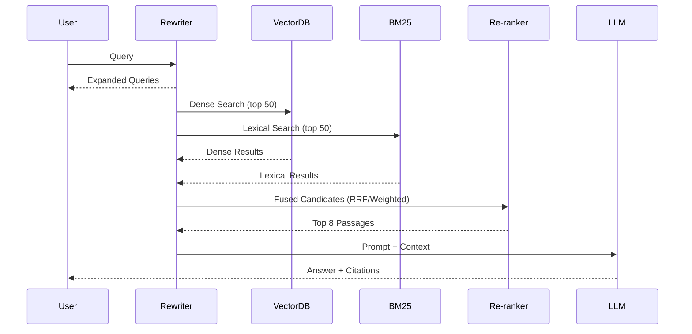

# Week 5 - Lesson 1: Advanced RAG Architectures & Retrieval Strategies

**Duration:** 90 minutes  
**Level:** Advanced  
**Prerequisites:** Week 4 (RAG Fundamentals: Lessons 1–4), Python, OpenAI API, basic vector DB experience

---

## 🎯 Learning Objectives

By the end of this lesson, you will:
- [ ] Design advanced RAG architectures for enterprise scale and reliability
- [ ] Tune vector database indexing and search parameters for quality/latency
- [ ] Implement hybrid retrieval (dense + lexical) with re-ranking at scale
- [ ] Apply query rewriting (HyDE, multi-query, step-back) to boost recall
- [ ] Plan for multi-tenant, multi-collection, and sharded deployments

---

## 📚 Table of Contents

1. [Introduction](#1-introduction)
2. [Advanced Retrieval Concepts](#2-advanced-retrieval-concepts)
3. [Vector DB Deep Dive](#3-vector-db-deep-dive)
4. [Architectures & Patterns](#4-architectures--patterns)
5. [Practical Examples](#5-practical-examples)
6. [Best Practices](#6-best-practices)
7. [Common Pitfalls](#7-common-pitfalls)
8. [Summary](#8-summary)
9. [Further Reading](#9-further-reading)

---

## 1. Introduction

Week 4 gave you the core RAG loop. This week we go deeper: query planning, hybrid retrieval, re-ranking pipelines, index tuning, and production-scale architecture with sharding, filtering, and multi-tenancy.

### Overview Diagram

```mermaid
graph TB
    subgraph Ingestion
        A[Documents] --> B[Smart Chunking]
        B --> C[Embeddings]
        C --> D[(Vector Index)]
        B --> E[(BM25 Index)]
        B --> M[Metadata Catalog]
    end

    subgraph Query
        Q[User Query] --> R1[Rewrite: HyDE/Multi-Query/Step-back]
        R1 --> R2[Dense Search]
        R1 --> R3[BM25 Search]
        R2 --> F[Score Fusion (RRF/Weighted)]
        R3 --> F
        F --> RR[Re-ranker (Cross-Encoder/LLM)]
        RR --> S[Selected Context]
        S --> G[LLM Generation]
        G --> O[Answer + Citations]
    end

    M -. filters .-> R2
    M -. filters .-> R3
```

---

## 2. Advanced Retrieval Concepts

### 2.1 Hybrid Retrieval (Dense + Lexical)
- Combine semantic vectors with BM25/keyword to recover rare terms, IDs, and exact matches.
- Fusion strategies: weighted score fusion (α·dense + (1-α)·bm25), Reciprocal Rank Fusion (RRF), rank voting.
- Always normalize per-retriever before fusion.

### 2.2 Re-ranking Pipelines
- Cross-encoder: high-precision passage scoring on top-N (e.g., 50 → keep 8).
- LLM re-ranking: instruct an LLM to rate relevance with JSON output; use a cheaper/different model than final generation to avoid leakage.
- Heuristics: demote near-duplicates, boost freshness or authoritative sources.

### 2.3 Query Rewriting & Expansion
- HyDE: Generate a hypothetical answer then embed it to retrieve (great for underspecified queries).
- Multi-query: Produce 3–5 paraphrases; union-retrieve and fuse.
- Step-back prompting: Ask for the higher-level concept first, then retrieve with refined intent.

### 2.4 Multi-Vector Per Document
- Store multiple vectors per doc: title, summary, sections, tables, code.
- Improves coverage for diverse query intents.

### 2.5 Multi-Hop Retrieval
- Break complex questions into hops: retrieve for sub-questions, compose, then final answer.
- Use chain-of-thought internally; only return concise final answers to users.

---

## 3. Vector DB Deep Dive

### 3.1 Index Types & Knobs (Conceptual)
- HNSW: ef_construction, M (graph degree) control index build time/quality; ef_search controls recall/latency at query time.
- IVF/Flat/PQ/OPQ: training-based indexes; trade memory for speed; ensure codebook quality.
- Filters: metadata predicates (tenant, doc_type, date, language) must be indexed/efficient.

### 3.2 Sharding, Replication, Multi-Tenancy
- Sharding by tenant or document domain; keep hot shards small.
- Replicate for availability; ensure consistency for updates.
- Namespaces/collections per tenant for isolation and RBAC.

### 3.3 Freshness & Backfills
- Incremental ingestion; track last_updated and invalidate stale entries.
- Blue/green index rebuilds for major changes.

### 3.4 Observability
- Track recall@k on shadow queries, p95 latency per stage, token/cost per query.

---

## 4. Architectures & Patterns

### 4.1 Late Fusion with Re-ranking



### 4.2 Multi-Stage Retrieval
- Stage 1: Fast, wide (k=50–100) using dense + lex.
- Stage 2: Re-rank to top 8–12.
- Stage 3: Compress to token budget (sentence extraction or LLM summarization with citation preservation).

### 4.3 Enterprise Data Plane
- Ingestion service, embedding workers, index builders, query service, observability pipeline, evaluation harness.

---

## 5. Practical Examples

> The snippets are framework-agnostic and compatible with OpenAI Embeddings + any vector DB (e.g., Chroma, Pinecone, Weaviate, Qdrant, FAISS).

### 5.1 Query Rewriting (HyDE + Multi-Query)

```python
from typing import List
from openai import OpenAI
import os

client = OpenAI(api_key=os.getenv("OPENAI_API_KEY"))


def hyde_prompt(question: str) -> str:
    sys = "You write a short, factual draft answer to help retrieve relevant passages."
    user = f"Question: {question}\nWrite a 4-6 sentence factual draft answer."
    out = client.chat.completions.create(
        model="gpt-4o-mini",
        messages=[{"role": "system", "content": sys}, {"role": "user", "content": user}],
        temperature=0.2,
    )
    return out.choices[0].message.content


def multi_query_prompt(question: str, n: int = 3) -> List[str]:
    sys = "Generate diverse paraphrases to improve retrieval recall."
    user = f"Question: {question}\nParaphrase this into {n} different concise queries."
    out = client.chat.completions.create(
        model="gpt-4o-mini",
        messages=[{"role": "system", "content": sys}, {"role": "user", "content": user}],
        temperature=0.5,
    )
    text = out.choices[0].message.content
    # simple split; consider JSON formatting for robustness
    return [q.strip("- ") for q in text.split("\n") if q.strip()]
```

### 5.2 Hybrid Retrieval + Fusion

```python
from typing import Dict, List, Tuple
import numpy as np


def normalize(scores: Dict[str, float]) -> Dict[str, float]:
    if not scores:
        return {}
    vals = list(scores.values())
    lo, hi = min(vals), max(vals)
    if hi - lo < 1e-9:
        return {k: 0.0 for k in scores}
    return {k: (v - lo) / (hi - lo) for k, v in scores.items()}


def fuse_weighted(dense: Dict[str, float], bm25: Dict[str, float], alpha: float = 0.6) -> Dict[str, float]:
    d, b = normalize(dense), normalize(bm25)
    ids = set(d) | set(b)
    return {i: alpha * d.get(i, 0.0) + (1 - alpha) * b.get(i, 0.0) for i in ids}


def rrf(ranks_sources: Dict[str, Dict[str, int]], k: int = 60) -> Dict[str, float]:
    # ranks_sources: {"dense": {doc_id: rank1}, "bm25": {doc_id: rank2}}
    scores: Dict[str, float] = {}
    for source, ranks in ranks_sources.items():
        for doc_id, r in ranks.items():
            scores[doc_id] = scores.get(doc_id, 0.0) + 1.0 / (k + r)
    return scores
```

### 5.3 Re-ranking (LLM Pattern)

```python
def llm_rerank(question: str, candidates: List[str]) -> List[Tuple[int, float]]:
    sys = "You rank passages by relevance to the query. Return JSON list of {index, score, reason}."
    user = f"Query: {question}\nCandidates:\n" + "\n".join(f"{i}) {c}" for i, c in enumerate(candidates))
    out = client.chat.completions.create(
        model="gpt-4o-mini",
        messages=[{"role": "system", "content": sys}, {"role": "user", "content": user}],
        temperature=0.0,
    )
    text = out.choices[0].message.content
    # parse JSON with your preferred method; return top-N indices with scores
    # ...
    return []
```

### 5.4 Tuning HNSW (Conceptual Checklist)

```text
Build-time (quality vs speed):
- M (graph degree): 16–48 typical; higher can improve recall but increase memory.
- ef_construction: 100–400; higher improves graph quality.

Query-time (recall vs latency):
- ef_search: 50–400; higher increases recall but adds latency.

Operational:
- Ensure CPU/NUMA locality; pin hot shards; monitor p95 latency.
- Validate recall with shadow evals when changing ef_search.
```

---

## 6. Best Practices

- Retrieve wide, then re-rank narrow; compress to fit token budget while preserving citations.
- Use hybrid retrieval by default for enterprise data; tune fusion weight via offline evals.
- Enforce metadata filters early (tenant, confidentiality, freshness).
- Cache embeddings and retrieval results; log features for offline analysis.
- Separate models: one for rewriting, one for re-ranking, one for answering.
- Treat retrieval as a product: metrics, baselines, A/B tests, and rollbacks.

---

## 7. Common Pitfalls

- Over-reliance on a single retriever; recall craters on edge queries.
- Missing normalization before fusion; scores become incomparable.
- Overlapping too much in chunking; redundancy harms diversity and token budget.
- Using the same LLM instance for both re-ranking and answering (leakage bias).
- Ignoring index freshness; stale context increases hallucinations.

---

## 8. Summary

You now have the patterns to move beyond basic RAG: hybrid retrieval with principled fusion, robust re-ranking, query rewriting for recall, and the operational knobs of modern vector databases. These tools let you scale reliably while improving quality and controlling latency/cost.

---

## 9. Further Reading

- Week 4 Resources (for refreshers):
  - `training-materials/week-04/resources/rag-cheatsheet.md`
  - `training-materials/week-04/resources/hybrid-reranking.md`
  - `training-materials/week-04/resources/evaluation-metrics.md`
- Vector DB docs (Chroma, Pinecone, Weaviate, Qdrant) for index-specific parameters
- Papers: DPR, ColBERT, Contriever; RRF and MMR for fusion/diversity

---

## Repo Resources

- Week 5 Resources Index: [../resources/README.md](../resources/README.md)
- Index Tuning Cheatsheet: [../resources/index-tuning-cheatsheet.md](../resources/index-tuning-cheatsheet.md)
- Hybrid Retrieval Tuning: [../resources/hybrid-retrieval-tuning.md](../resources/hybrid-retrieval-tuning.md)
- Recall vs Latency Evaluation: [../resources/recall-vs-latency-evaluation.md](../resources/recall-vs-latency-evaluation.md)
- Week 4 RAG Cheatsheet: [../../week-04/resources/rag-cheatsheet.md](../../week-04/resources/rag-cheatsheet.md)
- Week 4 Hybrid Retrieval & Re-ranking: [../../week-04/resources/hybrid-reranking.md](../../week-04/resources/hybrid-reranking.md)
- Week 4 Evaluation Metrics: [../../week-04/resources/evaluation-metrics.md](../../week-04/resources/evaluation-metrics.md)
