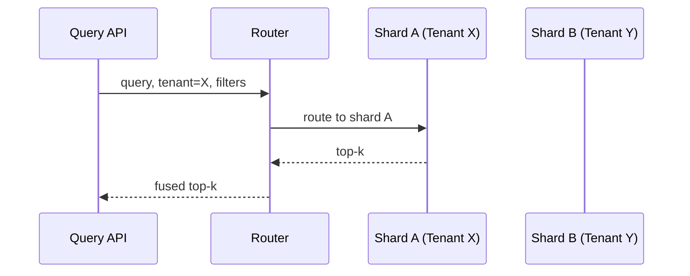

# Week 5 - Lesson 2: Vector Databases Deep Dive & Index Tuning

**Duration:** 90 minutes  
**Level:** Advanced  
**Prerequisites:** Week 4 RAG Fundamentals, Week 5 Lesson 1

---

## 🎯 Learning Objectives

By the end of this lesson, you will:
- [ ] Compare index types (Flat, HNSW, IVF, PQ/OPQ) and when to use each
- [ ] Tune critical parameters (ef_search, ef_construction, M, nlist, nprobe, code sizes)
- [ ] Balance recall, latency, and memory footprint with principled experiments
- [ ] Design schemas for filters, multi-tenancy, and sharding
- [ ] Operate indexes in production (ingest, rebuilds, compaction, deletes)

---

## 📚 Table of Contents

1. [Introduction](#1-introduction)
2. [Index Types](#2-index-types)
3. [Key Tuning Knobs](#3-key-tuning-knobs)
4. [Filtering, Tenancy, and Sharding](#4-filtering-tenancy-and-sharding)
5. [Performance & Evaluation](#5-performance--evaluation)
6. [Operational Playbook](#6-operational-playbook)
7. [Practical Examples](#7-practical-examples)
8. [Best Practices](#8-best-practices)
9. [Common Pitfalls](#9-common-pitfalls)
10. [Summary](#10-summary)
11. [Further Reading](#11-further-reading)

---

## 1. Introduction

Index choice and configuration drives your RAG system’s quality and cost. This lesson provides a vendor-neutral mental model you can map to Chroma, Qdrant, Pinecone, Weaviate, FAISS, or Milvus.

### Architecture Overview

```mermaid
graph TB
    subgraph Index Fleet
      A[(Flat)]
      B[(HNSW)]
      C[(IVF+Flat)]
      D[(IVF+PQ/OPQ)]
    end

    subgraph Query Path
      Q[Query Embedding] --> F[Filter Routing]
      F -->|Tenant/Filter| B
      F -->|Long-tail| A
      F -->|High-QPS| C
      F -->|Memory-optimized| D
      B --> R[Top-k]
      A --> R
      C --> R
      D --> R
    
    R --> RR[Re-rank]
    RR --> G[Answer]
```

---

## 2. Index Types

- Flat (exact): highest recall, slowest, large memory/compute.
- HNSW (graph): excellent recall/latency trade-off; memory grows with M.
- IVF (coarse quantization): partitions space; tune nlist (buckets) and nprobe (buckets searched per query).
- PQ/OPQ (compression): reduces memory; recall hit; OPQ learns rotation to improve code quality.

| Index | Recall | Latency | Memory | Notes |
|------|--------|---------|--------|------|
| Flat | High | High | High | Simple; great baseline |
| HNSW | High | Low | Medium-High | Tune M, ef_search |
| IVF+Flat | Med-High | Low | Medium | Tune nlist, nprobe |
| IVF+PQ | Med | Low | Low | Compression vs quality |

---

## 3. Key Tuning Knobs

### HNSW
- M (graph degree): 16–48 typical. Higher → better recall, more memory.
- ef_construction: 100–400. Higher → better graph → better recall.
- ef_search: 50–400. Higher → higher recall, higher latency.

### IVF
- nlist: number of clusters/buckets (e.g., 1024–16384). Larger nlist → finer partition.
- nprobe: clusters searched per query (e.g., 8–128). Higher nprobe → better recall.

### PQ/OPQ
- m (subvectors), bits per code (e.g., 8). More bits → better recall, more memory.
- OPQ: learns rotation before PQ; improves quantization.

---

## 4. Filtering, Tenancy, and Sharding

- Metadata filters: pre-filter candidates by tenant, doc_type, freshness, region.
- Multi-tenant isolation: namespaces/collections per tenant; avoid cross-tenant recall bleed.
- Sharding: by tenant or by semantic space; keep hot shards small; balance load.
- Replication: availability and throughput; consistency for upserts/deletes.



---

## 5. Performance & Evaluation

- Measure recall@k, nDCG, MRR under varying ef_search/nprobe.
- Track p50/p95 latency per stage (embed, search, rerank, generate).
- Token/cost per query; cache hit rates; batch embedding throughput.
- Evaluate with a fixed canary set before/after index changes.

---

## 6. Operational Playbook

- Ingestion: incremental; backfills for schema changes.
- Blue/green index rebuilds when changing index type or codebooks.
- Compaction: reclaim space after deletes; data hygiene.
- TTLs and tombstones: design for deletes; audit trails.
- Freshness: monitor last_updated; fail closed on stale sources.

---

## 7. Practical Examples

> Examples are illustrative and vendor-agnostic; adapt to your chosen DB.

### 7.1 Recall vs Latency Harness (Pseudo-Python)

```python
from typing import Callable, Dict, List, Tuple
import time

# Types
# search_fn: (query_vec, k, **params) -> List[Doc]
# ground_truth: Dict[str, set[str]] mapping query_id -> relevant doc_ids


def benchmark(
    queries: List[Tuple[str, list[float]]],
    ground_truth: Dict[str, set[str]],
    search_fn: Callable,
    k: int,
    param_grid: List[Dict]
) -> List[Dict]:
    results = []
    for params in param_grid:
        recalls = []
        latencies = []
        for qid, qvec in queries:
            t0 = time.perf_counter()
            docs = search_fn(qvec, k=k, **params)
            latencies.append((time.perf_counter() - t0) * 1000)
            hits = sum(1 for d in docs if d.id in ground_truth[qid])
            recalls.append(hits / max(1, len(ground_truth[qid])))
        results.append({
            'params': params,
            'recall@k': sum(recalls)/len(recalls),
            'latency_p50_ms': sorted(latencies)[len(latencies)//2],
            'latency_p95_ms': sorted(latencies)[int(len(latencies)*0.95)],
        })
    return results
```

### 7.2 FAISS HNSW (Local Example)

```python
# pip install faiss-cpu numpy
import faiss, numpy as np

# Data
d = 1536
xb = np.random.random((100_000, d)).astype('float32')
xb /= np.linalg.norm(xb, axis=1, keepdims=True)

# Build HNSW index
M = 32
index = faiss.IndexHNSWFlat(d, M)
index.hnsw.efConstruction = 200
index.add(xb)

# Query
eq = np.random.random((1, d)).astype('float32')
eq /= np.linalg.norm(eq)
index.hnsw.efSearch = 100
D, I = index.search(eq, 10)
print(I[0])  # top-10 ids
```

### 7.3 IVF+PQ (Conceptual FAISS)

```python
# Train coarse quantizer + PQ codebooks
nlist = 4096
m = 32  # subvectors (32 * 8 bits = 256-bit code)
quantizer = faiss.IndexFlatL2(d)
index = faiss.IndexIVFPQ(quantizer, d, nlist, m, 8)
index.train(xb)       # requires representative sample
index.add(xb)
index.nprobe = 16     # at query time
```

### 7.4 Filtering Pattern

```python
# Pseudocode for pre-filtering
candidates = vector_db.search(qvec, k=200, filters={'tenant': 'acme', 'doctype': 'policy'})
# Then rerank and select top-k for augmentation
```

---

## 8. Best Practices

- Start with HNSW; add IVF/PQ only when memory/QPS constraints require.
- Normalize embeddings; ensure consistent preprocessing across ingest/query.
- Keep filters in metadata and apply early; index hot fields.
- Validate index changes offline; promote with canary traffic.
- Log features (scores, ranks, params) for reproducibility and drift detection.

---

## 9. Common Pitfalls

- Changing index params without a stable evaluation harness.
- Searching too few clusters (nprobe) or too low ef_search → silent recall drops.
- Over-compressing with PQ → irrecoverable quality loss.
- Ignoring delete/TTL flows → stale or orphaned results surface.
- Neglecting tenant isolation; cross-tenant leakage.

---

## 10. Summary

You can now choose and tune vector indexes with confidence, design for filters and tenancy, and evaluate trade-offs with a repeatable harness. These skills underpin reliable, scalable retrieval in enterprise RAG.

---

## 11. Further Reading

- Week 4 Resources:
  - `training-materials/week-04/resources/chunking-strategies.md`
  - `training-materials/week-04/resources/hybrid-reranking.md`
  - `training-materials/week-04/resources/evaluation-metrics.md`
- Vendor docs: Chroma, Pinecone, Weaviate, Qdrant, FAISS, Milvus

---

## Repo Resources

- Week 5 Resources Index: [../resources/README.md](../resources/README.md)
- Index Tuning Cheatsheet: [../resources/index-tuning-cheatsheet.md](../resources/index-tuning-cheatsheet.md)
- Hybrid Retrieval Tuning: [../resources/hybrid-retrieval-tuning.md](../resources/hybrid-retrieval-tuning.md)
- Recall vs Latency Evaluation: [../resources/recall-vs-latency-evaluation.md](../resources/recall-vs-latency-evaluation.md)
