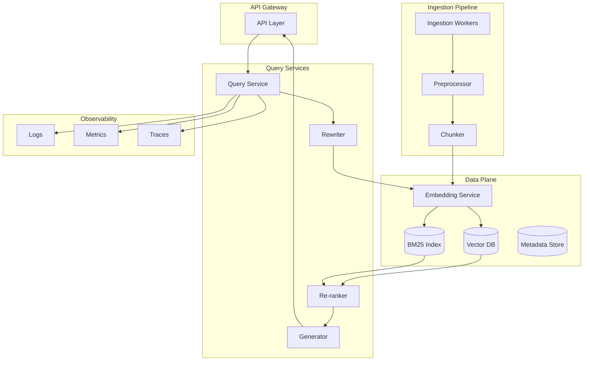

# Week 5 - Lesson 4: Scaling & Operations for Enterprise RAG

**Duration:** 90 minutes  
**Level:** Advanced  
**Prerequisites:** Week 5 Lessons 1–3, production systems experience

---

## 🎯 Learning Objectives

By the end of this lesson, you will:
- [ ] Design horizontally scalable RAG architectures with service boundaries
- [ ] Implement observability (traces, logs, metrics) and SLOs for RAG systems
- [ ] Plan for data privacy, compliance, and multi-tenant isolation
- [ ] Operate indexes (ingestion, blue/green rebuilds, compaction, freshness)
- [ ] Respond to incidents with runbooks and feature flags

---

## 📚 Table of Contents

1. [Introduction](#1-introduction)
2. [Production Architecture](#2-production-architecture)
3. [Observability & Monitoring](#3-observability--monitoring)
4. [SLOs & Incident Response](#4-slos--incident-response)
5. [Privacy, Compliance, and Multi-Tenancy](#5-privacy-compliance-and-multi-tenancy)
6. [Operational Playbooks](#6-operational-playbooks)
7. [Practical Examples](#7-practical-examples)
8. [Best Practices](#8-best-practices)
9. [Common Pitfalls](#9-common-pitfalls)
10. [Summary](#10-summary)
11. [Further Reading](#11-further-reading)

---

## 1. Introduction

Moving RAG to production requires reliability, observability, and operational rigor. This lesson covers architecture patterns, SLOs, monitoring, privacy, and incident handling.

---

## 2. Production Architecture

### 2.1 Service Boundaries



### 2.2 Horizontal Scaling
- Query service: stateless; scale behind load balancer
- Embedding service: batch-friendly; autoscale on queue depth
- Vector DB: shard by tenant or domain; replicate for availability
- Ingestion: async workers; backpressure and dead-letter queues

### 2.3 Caching Strategy
- Query embeddings: TTL-based cache (Redis/Memcached)
- Retrieval results: cache fused top-k with cache key = (query_hash, params)
- Generated answers: session-level cache for identical follow-ups

---

## 3. Observability & Monitoring

### 3.1 Telemetry Model

- **Traces**: one span per stage (embed → retrieve → rerank → generate)
- **Logs**: structured JSON with query_id, user_hash, doc_ids, scores, tokens, costs
- **Metrics**: counters/histograms for latency, success/error, tokens, costs, recall

### 3.2 Key Metrics

| Metric | Description | SLO Target |
|--------|-------------|------------|
| Availability | % of successful requests | ≥99.9% |
| p95 Latency | Total query time | <2.0s |
| Recall@10 | Shadow eval on canary | ≥0.75 |
| Faithfulness | LLM judge on sample | ≥95% |
| Token/query | Cost efficiency | Monitored |
| Cache hit rate | % queries hitting cache | >60% |

### 3.3 Dashboards and Alerts

- Real-time: latency (p50/p95), error rates, QPS, token usage
- Quality: recall@k, faithfulness, deflection rate
- Operations: index staleness, queue depth, worker health

---

## 4. SLOs & Incident Response

### 4.1 Service Level Objectives

- **Availability**: 99.9% (43 min downtime/month)
- **Latency**: p95 < 2.0s total
- **Quality**: recall@10 ≥ 0.75, faithfulness ≥ 95%

### 4.2 Runbooks

- Vector DB down: fall back to cache-only or simpler retrieval
- LLM rate limits: queue, retry with backoff, fail gracefully
- Stale index: alert, disable affected shards, trigger rebuild
- High latency: reduce k, disable re-ranking temporarily via feature flag

### 4.3 Feature Flags

- Toggle rewriting, re-ranking, hybrid search, MMR per tenant or globally
- Canary rollouts: route 5% traffic to new params; rollback on SLO breach

---

## 5. Privacy, Compliance, and Multi-Tenancy

### 5.1 Data Privacy

- PII redaction in logs; hash user identifiers
- Encryption at rest and in transit
- Data retention policies: auto-delete logs/indexes after TTL
- Access controls: RBAC on document collections

### 5.2 Multi-Tenancy

- Namespace/collection per tenant in vector DB
- Metadata filters enforced at query time
- Audit trails: who accessed what and when

### 5.3 Compliance (GDPR, HIPAA, SOC2)

- Right to be forgotten: delete flows and tombstone tracking
- Data residency: regional sharding
- Audit logs: immutable, tamper-proof

---

## 6. Operational Playbooks

### 6.1 Ingestion & Indexing

- Incremental ingestion: process new/updated docs; track last_updated
- Blue/green rebuilds: build new index, validate, swap atomically
- Compaction: reclaim space after deletes; schedule during low traffic

### 6.2 Freshness

- Monitor index age; alert on staleness thresholds
- Continuous ingestion pipelines with backpressure handling

### 6.3 Disaster Recovery

- Backup vector index and metadata; test restore procedures
- Multi-region replication for critical tenants

---

## 7. Practical Examples

### 7.1 Structured Logging (JSON)

```python
import json, time
from typing import Dict, Any

def log_query_event(
    query_id: str,
    stage: str,
    latency_ms: float,
    metadata: Dict[str, Any]
):
    event = {
        "ts": time.time(),
        "query_id": query_id,
        "stage": stage,
        "latency_ms": latency_ms,
        **metadata
    }
    print(json.dumps(event))  # ship to log aggregator

# Example
log_query_event(
    "q123",
    "retrieve",
    45.2,
    {"k": 10, "retriever": "hybrid", "doc_ids": ["d1","d2"], "cost_usd": 0.003}
)
```

### 7.2 Circuit Breaker Pattern

```python
from datetime import datetime, timedelta

class CircuitBreaker:
    def __init__(self, failure_threshold: int = 5, timeout: int = 60):
        self.failure_threshold = failure_threshold
        self.timeout = timeout
        self.failures = 0
        self.last_failure_time = None
        self.state = "closed"  # closed, open, half_open
    
    def call(self, func, *args, **kwargs):
        if self.state == "open":
            if datetime.now() - self.last_failure_time > timedelta(seconds=self.timeout):
                self.state = "half_open"
            else:
                raise Exception("Circuit breaker is OPEN")
        
        try:
            result = func(*args, **kwargs)
            if self.state == "half_open":
                self.state = "closed"
                self.failures = 0
            return result
        except Exception as e:
            self.failures += 1
            self.last_failure_time = datetime.now()
            if self.failures >= self.failure_threshold:
                self.state = "open"
            raise e
```

### 7.3 Feature Flag Pattern

```python
FLAGS = {
    "enable_rewriting": True,
    "enable_reranking": True,
    "enable_hybrid": True,
}

def query_pipeline(question: str, flags: dict = FLAGS):
    if flags.get("enable_rewriting"):
        question = rewrite(question)
    
    if flags.get("enable_hybrid"):
        results = hybrid_retrieve(question)
    else:
        results = dense_retrieve(question)
    
    if flags.get("enable_reranking"):
        results = rerank(results)
    
    return generate_answer(results)
```

---

## 8. Best Practices

- Separate concerns: ingestion, retrieval, generation as independent services
- Emit structured logs and traces; attach query_id for traceability
- Cache aggressively (embeddings, retrieval, answers); invalidate on index updates
- Gate deployments with canary traffic and automatic rollbacks on SLO breaches
- Run shadow evals continuously; track drift over time

---

## 9. Common Pitfalls

- No observability → debugging incidents is impossible
- Missing circuit breakers → cascading failures
- Skipping data privacy controls → compliance violations
- Over-caching without TTL/invalidation → stale results surface
- Ignoring multi-tenancy isolation → data leaks across customers

---

## 10. Summary

You now have the architecture patterns, observability strategies, operational playbooks, and privacy/compliance guardrails to run RAG in production at enterprise scale.

---

## 11. Further Reading

- OpenTelemetry, Prometheus, Grafana for metrics/tracing
- GDPR, HIPAA, SOC2 compliance frameworks
- Chaos engineering and resilience patterns
- Week 4 and Week 5 resources on monitoring and evaluation

---

## Repo Resources

- Week 5 Resources Index: [../resources/README.md](../resources/README.md)
- Index Tuning Cheatsheet: [../resources/index-tuning-cheatsheet.md](../resources/index-tuning-cheatsheet.md)
- Hybrid Retrieval Tuning: [../resources/hybrid-retrieval-tuning.md](../resources/hybrid-retrieval-tuning.md)
- Recall vs Latency Evaluation: [../resources/recall-vs-latency-evaluation.md](../resources/recall-vs-latency-evaluation.md)
- Week 4 Monitoring in Production: [../../week-04/resources/monitoring-production.md](../../week-04/resources/monitoring-production.md)
