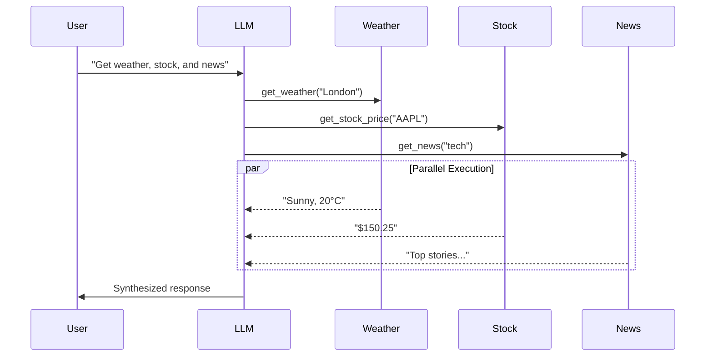
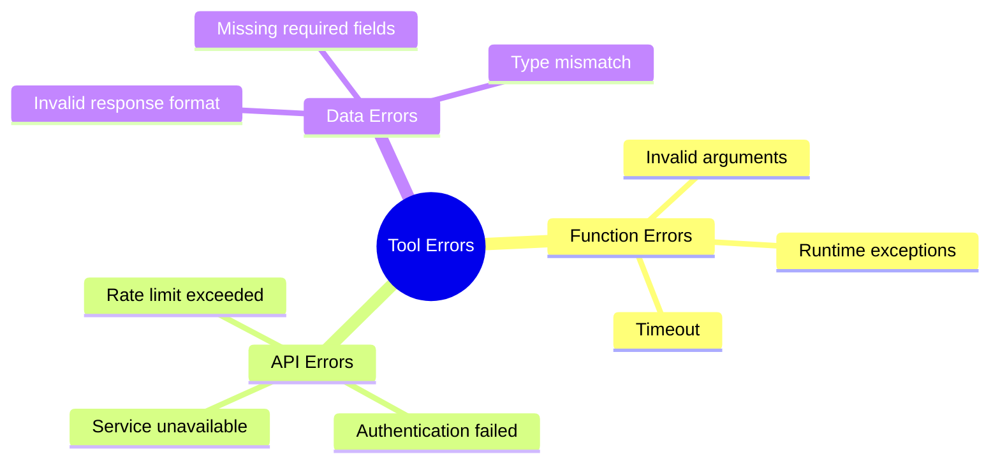

# Week 6 - Lesson 1: Advanced Function Calling Patterns

**Duration:** 2 hours  
**Level:** Intermediate to Advanced  
**Prerequisites:** Week 3 Lesson 3 (Function Calling basics)

---

## 📋 Table of Contents

1. [Introduction](#introduction)
2. [Parallel Function Calling](#parallel-function-calling)
3. [Error Handling Patterns](#error-handling-patterns)
4. [Retry Mechanisms](#retry-mechanisms)
5. [Tool Execution Monitoring](#tool-execution-monitoring)
6. [Advanced Tool Schemas](#advanced-tool-schemas)
7. [Performance Optimization](#performance-optimization)
8. [Best Practices](#best-practices)

---

## Introduction

### Lesson Objectives

By the end of this lesson, you will be able to:
- Implement parallel function calling for efficiency
- Design robust error handling strategies
- Build retry mechanisms with exponential backoff
- Monitor and log tool execution
- Create type-safe tool schemas
- Optimize tool performance with caching

### Why Advanced Function Calling Matters

In production systems:
- **Multiple tools** may need to execute simultaneously
- **Failures** must be handled gracefully without crashing
- **Rate limits** and **retries** are critical for reliability
- **Monitoring** enables debugging and optimization
- **Type safety** prevents runtime errors

---

## Parallel Function Calling

### The Problem

Sequential tool execution is slow when tools are independent:

```python
# Sequential: 6 seconds total
weather = get_weather("London")      # 2s
stock = get_stock_price("AAPL")      # 2s  
news = get_news("technology")        # 2s
```

### The Solution: Parallel Execution

OpenAI's API supports parallel function calling when `parallel_tool_calls=True` (default).



### Implementation

```python
from openai import OpenAI
import json

client = OpenAI()

# Define multiple tools
tools = [
    {
        "type": "function",
        "function": {
            "name": "get_weather",
            "description": "Get current weather for a location",
            "parameters": {
                "type": "object",
                "properties": {
                    "location": {"type": "string", "description": "City name"},
                    "unit": {"type": "string", "enum": ["celsius", "fahrenheit"]}
                },
                "required": ["location"]
            }
        }
    },
    {
        "type": "function",
        "function": {
            "name": "get_stock_price",
            "description": "Get current stock price",
            "parameters": {
                "type": "object",
                "properties": {
                    "symbol": {"type": "string", "description": "Stock symbol (e.g., AAPL)"}
                },
                "required": ["symbol"]
            }
        }
    },
    {
        "type": "function",
        "function": {
            "name": "search_web",
            "description": "Search the web for information",
            "parameters": {
                "type": "object",
                "properties": {
                    "query": {"type": "string", "description": "Search query"}
                },
                "required": ["query"]
            }
        }
    }
]

# Simulate tool implementations
def get_weather(location: str, unit: str = "celsius") -> dict:
    # Mock implementation
    return {"location": location, "temp": 20, "unit": unit, "condition": "Sunny"}

def get_stock_price(symbol: str) -> dict:
    # Mock implementation
    return {"symbol": symbol, "price": 150.25, "change": +2.5}

def search_web(query: str) -> dict:
    # Mock implementation
    return {"query": query, "results": ["Result 1", "Result 2", "Result 3"]}

# Map function names to implementations
available_functions = {
    "get_weather": get_weather,
    "get_stock_price": get_stock_price,
    "search_web": search_web,
}

def execute_parallel_tools(messages: list) -> str:
    """
    Execute function calls with parallel support.
    """
    # Initial API call
    response = client.chat.completions.create(
        model="gpt-4o-mini",
        messages=messages,
        tools=tools,
        parallel_tool_calls=True,  # Enable parallel execution
    )
    
    message = response.choices[0].message
    
    # Check if model wants to call functions
    if not message.tool_calls:
        return message.content
    
    # Execute all tool calls (potentially in parallel)
    messages.append(message)
    
    for tool_call in message.tool_calls:
        function_name = tool_call.function.name
        function_args = json.loads(tool_call.function.arguments)
        
        print(f"Calling {function_name} with {function_args}")
        
        # Execute function
        function_to_call = available_functions[function_name]
        function_response = function_to_call(**function_args)
        
        # Append tool result
        messages.append({
            "role": "tool",
            "tool_call_id": tool_call.id,
            "content": json.dumps(function_response),
        })
    
    # Second API call with tool results
    second_response = client.chat.completions.create(
        model="gpt-4o-mini",
        messages=messages,
    )
    
    return second_response.choices[0].message.content

# Usage
messages = [
    {"role": "system", "content": "You are a helpful assistant with access to tools."},
    {"role": "user", "content": "What's the weather in London, the stock price of AAPL, and latest AI news?"}
]

result = execute_parallel_tools(messages)
print(result)
```

### Controlling Parallel Execution

Disable parallel calls when order matters:

```python
response = client.chat.completions.create(
    model="gpt-4o-mini",
    messages=messages,
    tools=tools,
    parallel_tool_calls=False,  # Force sequential execution
)
```

**When to disable parallel calls:**
- Tools have dependencies (e.g., create user → get user ID)
- Rate limiting concerns
- Resource constraints (CPU/memory)
- Debugging and testing

---

## Error Handling Patterns

### Common Tool Execution Errors



### Pattern 1: Try-Catch with Fallbacks

```python
def safe_tool_execution(function_name: str, function_args: dict) -> dict:
    """
    Execute tool with error handling and fallback.
    """
    try:
        function_to_call = available_functions.get(function_name)
        
        if not function_to_call:
            return {
                "error": f"Function {function_name} not found",
                "success": False
            }
        
        # Execute with timeout
        import signal
        
        def timeout_handler(signum, frame):
            raise TimeoutError("Function execution timed out")
        
        signal.signal(signal.SIGALRM, timeout_handler)
        signal.alarm(5)  # 5 second timeout
        
        try:
            result = function_to_call(**function_args)
            signal.alarm(0)  # Cancel timeout
            return {"result": result, "success": True}
        except TimeoutError as e:
            return {"error": str(e), "success": False}
            
    except TypeError as e:
        # Invalid arguments
        return {
            "error": f"Invalid arguments for {function_name}: {str(e)}",
            "success": False
        }
    except Exception as e:
        # Catch-all for unexpected errors
        return {
            "error": f"Unexpected error in {function_name}: {str(e)}",
            "success": False
        }
```

### Pattern 2: Graceful Degradation

```python
def execute_with_fallback(primary_func, fallback_func, *args, **kwargs):
    """
    Try primary function, fall back to secondary if it fails.
    """
    try:
        return primary_func(*args, **kwargs)
    except Exception as e:
        print(f"Primary function failed: {e}. Using fallback...")
        return fallback_func(*args, **kwargs)

# Example: Use cached data if API fails
def get_weather_api(location: str) -> dict:
    # Real API call
    response = requests.get(f"https://api.weather.com/v1/{location}")
    response.raise_for_status()
    return response.json()

def get_weather_cached(location: str) -> dict:
    # Fallback to cached data
    cache = {"London": {"temp": 18, "condition": "Cloudy"}}
    return cache.get(location, {"temp": None, "condition": "Unknown"})

# Usage
weather = execute_with_fallback(
    get_weather_api,
    get_weather_cached,
    location="London"
)
```

### Pattern 3: Error Context for LLM

Return structured errors that the LLM can reason about:

```python
def create_tool_response(success: bool, data: dict = None, error: str = None) -> str:
    """
    Create structured tool response for LLM.
    """
    response = {
        "success": success,
        "timestamp": datetime.utcnow().isoformat(),
    }
    
    if success:
        response["data"] = data
    else:
        response["error"] = error
        response["suggestion"] = get_error_suggestion(error)
    
    return json.dumps(response)

def get_error_suggestion(error: str) -> str:
    """
    Provide helpful suggestions based on error type.
    """
    if "rate limit" in error.lower():
        return "Wait a few seconds and try again, or use cached data."
    elif "authentication" in error.lower():
        return "Check that API credentials are valid."
    elif "timeout" in error.lower():
        return "The service is slow. Try again or simplify the request."
    else:
        return "Check the function arguments and try again."
```

---

## Retry Mechanisms

### Exponential Backoff Strategy

```python
import time
from typing import Callable, Any

def retry_with_backoff(
    func: Callable,
    max_attempts: int = 3,
    initial_delay: float = 1.0,
    max_delay: float = 60.0,
    exponential_base: float = 2.0,
    *args,
    **kwargs
) -> Any:
    """
    Retry function with exponential backoff.
    
    Args:
        func: Function to retry
        max_attempts: Maximum number of attempts
        initial_delay: Initial delay in seconds
        max_delay: Maximum delay between retries
        exponential_base: Base for exponential backoff
    """
    attempt = 0
    delay = initial_delay
    
    while attempt < max_attempts:
        try:
            return func(*args, **kwargs)
        except Exception as e:
            attempt += 1
            
            if attempt >= max_attempts:
                raise Exception(f"Max retries exceeded. Last error: {e}")
            
            # Calculate backoff delay
            delay = min(delay * exponential_base, max_delay)
            
            print(f"Attempt {attempt} failed: {e}. Retrying in {delay}s...")
            time.sleep(delay)

# Usage
def flaky_api_call():
    """API that fails 50% of the time."""
    import random
    if random.random() < 0.5:
        raise Exception("API temporarily unavailable")
    return {"status": "success"}

result = retry_with_backoff(flaky_api_call, max_attempts=5)
```

### Using Tenacity Library

```python
from tenacity import (
    retry,
    stop_after_attempt,
    wait_exponential,
    retry_if_exception_type,
    before_sleep_log
)
import logging

logger = logging.getLogger(__name__)

@retry(
    stop=stop_after_attempt(3),
    wait=wait_exponential(multiplier=1, min=1, max=10),
    retry=retry_if_exception_type((ConnectionError, TimeoutError)),
    before_sleep=before_sleep_log(logger, logging.WARNING)
)
def call_external_api(endpoint: str, **params) -> dict:
    """
    Call external API with automatic retry.
    """
    response = requests.get(endpoint, params=params, timeout=5)
    response.raise_for_status()
    return response.json()

# Usage
try:
    data = call_external_api("https://api.example.com/data", query="test")
except Exception as e:
    print(f"API call failed after retries: {e}")
```

### Conditional Retry Logic

```python
def should_retry(exception: Exception) -> bool:
    """
    Determine if exception is retryable.
    """
    # Retry on transient errors
    transient_errors = (
        ConnectionError,
        TimeoutError,
        requests.exceptions.HTTPError,
    )
    
    if isinstance(exception, transient_errors):
        # Check HTTP status code
        if hasattr(exception, 'response') and exception.response is not None:
            status_code = exception.response.status_code
            # Retry on 5xx (server errors) and 429 (rate limit)
            return status_code >= 500 or status_code == 429
        return True
    
    # Don't retry on client errors
    return False

def smart_retry(func: Callable, max_attempts: int = 3) -> Any:
    """
    Retry only on transient errors.
    """
    for attempt in range(max_attempts):
        try:
            return func()
        except Exception as e:
            if not should_retry(e) or attempt == max_attempts - 1:
                raise
            print(f"Retryable error: {e}. Attempt {attempt + 1}/{max_attempts}")
            time.sleep(2 ** attempt)  # Exponential backoff
```

---

## Tool Execution Monitoring

### Structured Logging

```python
import logging
import json
from datetime import datetime
from typing import Any, Dict

# Configure structured JSON logging
class JSONFormatter(logging.Formatter):
    def format(self, record):
        log_data = {
            "timestamp": datetime.utcnow().isoformat(),
            "level": record.levelname,
            "message": record.getMessage(),
            "module": record.module,
            "function": record.funcName,
        }
        
        # Add extra fields
        if hasattr(record, 'tool_name'):
            log_data['tool_name'] = record.tool_name
        if hasattr(record, 'duration_ms'):
            log_data['duration_ms'] = record.duration_ms
        if hasattr(record, 'success'):
            log_data['success'] = record.success
            
        return json.dumps(log_data)

# Setup logger
logger = logging.getLogger("tool_execution")
handler = logging.StreamHandler()
handler.setFormatter(JSONFormatter())
logger.addHandler(handler)
logger.setLevel(logging.INFO)

def execute_tool_with_logging(
    tool_name: str,
    tool_func: Callable,
    **kwargs
) -> Dict[str, Any]:
    """
    Execute tool with comprehensive logging.
    """
    start_time = time.time()
    
    logger.info(
        f"Starting tool execution: {tool_name}",
        extra={
            "tool_name": tool_name,
            "arguments": kwargs
        }
    )
    
    try:
        result = tool_func(**kwargs)
        duration_ms = (time.time() - start_time) * 1000
        
        logger.info(
            f"Tool execution succeeded: {tool_name}",
            extra={
                "tool_name": tool_name,
                "duration_ms": duration_ms,
                "success": True
            }
        )
        
        return {"success": True, "result": result, "duration_ms": duration_ms}
        
    except Exception as e:
        duration_ms = (time.time() - start_time) * 1000
        
        logger.error(
            f"Tool execution failed: {tool_name}",
            extra={
                "tool_name": tool_name,
                "duration_ms": duration_ms,
                "success": False,
                "error": str(e)
            }
        )
        
        return {"success": False, "error": str(e), "duration_ms": duration_ms}
```

### Metrics Collection

```python
from collections import defaultdict
from dataclasses import dataclass
from typing import List

@dataclass
class ToolMetrics:
    """Metrics for a tool execution."""
    tool_name: str
    duration_ms: float
    success: bool
    timestamp: datetime

class MetricsCollector:
    """Collect and aggregate tool execution metrics."""
    
    def __init__(self):
        self.metrics: List[ToolMetrics] = []
        self.counters = defaultdict(lambda: {"success": 0, "failure": 0})
        self.latencies = defaultdict(list)
    
    def record(self, tool_name: str, duration_ms: float, success: bool):
        """Record a tool execution."""
        metric = ToolMetrics(
            tool_name=tool_name,
            duration_ms=duration_ms,
            success=success,
            timestamp=datetime.utcnow()
        )
        
        self.metrics.append(metric)
        
        if success:
            self.counters[tool_name]["success"] += 1
        else:
            self.counters[tool_name]["failure"] += 1
        
        self.latencies[tool_name].append(duration_ms)
    
    def get_summary(self) -> Dict:
        """Get summary statistics."""
        summary = {}
        
        for tool_name in self.counters:
            success = self.counters[tool_name]["success"]
            failure = self.counters[tool_name]["failure"]
            total = success + failure
            
            latencies = self.latencies[tool_name]
            
            summary[tool_name] = {
                "total_calls": total,
                "success_rate": success / total if total > 0 else 0,
                "avg_latency_ms": sum(latencies) / len(latencies) if latencies else 0,
                "p95_latency_ms": sorted(latencies)[int(len(latencies) * 0.95)] if latencies else 0,
            }
        
        return summary

# Usage
metrics = MetricsCollector()

def monitored_tool_call(tool_name: str, tool_func: Callable, **kwargs):
    """Execute tool with metrics collection."""
    start = time.time()
    
    try:
        result = tool_func(**kwargs)
        duration = (time.time() - start) * 1000
        metrics.record(tool_name, duration, success=True)
        return result
    except Exception as e:
        duration = (time.time() - start) * 1000
        metrics.record(tool_name, duration, success=False)
        raise

# After running tools
print(json.dumps(metrics.get_summary(), indent=2))
```

---

## Advanced Tool Schemas

### Type-Safe Schemas with Pydantic

```python
from pydantic import BaseModel, Field, validator
from typing import Optional, Literal
from enum import Enum

class TemperatureUnit(str, Enum):
    CELSIUS = "celsius"
    FAHRENHEIT = "fahrenheit"

class WeatherRequest(BaseModel):
    """Type-safe weather request schema."""
    location: str = Field(..., description="City name", min_length=2, max_length=100)
    unit: TemperatureUnit = Field(default=TemperatureUnit.CELSIUS, description="Temperature unit")
    include_forecast: bool = Field(default=False, description="Include 5-day forecast")
    
    @validator('location')
    def validate_location(cls, v):
        if not v.replace(" ", "").isalpha():
            raise ValueError("Location must contain only letters and spaces")
        return v.title()

class WeatherResponse(BaseModel):
    """Type-safe weather response schema."""
    location: str
    temperature: float
    unit: TemperatureUnit
    condition: str
    humidity: Optional[int] = None
    forecast: Optional[list] = None

def get_weather_typed(location: str, unit: str = "celsius", include_forecast: bool = False) -> dict:
    """
    Get weather with type validation.
    """
    # Validate input
    request = WeatherRequest(
        location=location,
        unit=unit,
        include_forecast=include_forecast
    )
    
    # Simulate API call
    response = WeatherResponse(
        location=request.location,
        temperature=20.0,
        unit=request.unit,
        condition="Sunny",
        humidity=65
    )
    
    return response.dict()

# Convert Pydantic model to OpenAI function schema
def pydantic_to_openai_schema(model: type[BaseModel]) -> dict:
    """
    Convert Pydantic model to OpenAI function schema.
    """
    schema = model.schema()
    
    return {
        "type": "object",
        "properties": schema["properties"],
        "required": schema.get("required", []),
    }

# Generate schema automatically
weather_tool = {
    "type": "function",
    "function": {
        "name": "get_weather",
        "description": "Get current weather for a location",
        "parameters": pydantic_to_openai_schema(WeatherRequest)
    }
}
```

### Schema Validation

```python
def validate_tool_arguments(tool_name: str, arguments: dict, schema: BaseModel) -> tuple[bool, Optional[str]]:
    """
    Validate tool arguments against Pydantic schema.
    
    Returns:
        (is_valid, error_message)
    """
    try:
        schema(**arguments)
        return True, None
    except ValidationError as e:
        error_msg = f"Invalid arguments for {tool_name}: {e}"
        return False, error_msg

# Usage in tool execution
def execute_validated_tool(tool_name: str, arguments: dict) -> dict:
    """Execute tool with validation."""
    
    # Get schema for tool
    tool_schemas = {
        "get_weather": WeatherRequest,
        # ... other tools
    }
    
    schema = tool_schemas.get(tool_name)
    if not schema:
        return {"error": f"Unknown tool: {tool_name}"}
    
    # Validate arguments
    is_valid, error = validate_tool_arguments(tool_name, arguments, schema)
    if not is_valid:
        return {"error": error}
    
    # Execute tool
    function_to_call = available_functions[tool_name]
    return function_to_call(**arguments)
```

---

## Performance Optimization

### Caching Strategy

```python
from functools import lru_cache
import hashlib
import pickle

class ToolCache:
    """Simple file-based cache for tool results."""
    
    def __init__(self, cache_dir: str = ".tool_cache"):
        self.cache_dir = cache_dir
        os.makedirs(cache_dir, exist_ok=True)
    
    def _get_cache_key(self, tool_name: str, kwargs: dict) -> str:
        """Generate cache key from tool name and arguments."""
        # Create deterministic hash of arguments
        args_str = json.dumps(kwargs, sort_keys=True)
        hash_obj = hashlib.md5(f"{tool_name}:{args_str}".encode())
        return hash_obj.hexdigest()
    
    def get(self, tool_name: str, kwargs: dict, ttl_seconds: int = 300):
        """Get cached result if available and not expired."""
        cache_key = self._get_cache_key(tool_name, kwargs)
        cache_file = os.path.join(self.cache_dir, f"{cache_key}.pkl")
        
        if not os.path.exists(cache_file):
            return None
        
        # Check if cache is expired
        file_age = time.time() - os.path.getmtime(cache_file)
        if file_age > ttl_seconds:
            os.remove(cache_file)
            return None
        
        # Load cached result
        with open(cache_file, 'rb') as f:
            return pickle.load(f)
    
    def set(self, tool_name: str, kwargs: dict, result: Any):
        """Cache tool result."""
        cache_key = self._get_cache_key(tool_name, kwargs)
        cache_file = os.path.join(self.cache_dir, f"{cache_key}.pkl")
        
        with open(cache_file, 'wb') as f:
            pickle.dump(result, f)

# Usage
cache = ToolCache()

def cached_tool_call(tool_name: str, tool_func: Callable, ttl: int = 300, **kwargs):
    """
    Execute tool with caching.
    """
    # Check cache
    cached_result = cache.get(tool_name, kwargs, ttl_seconds=ttl)
    if cached_result is not None:
        print(f"Cache hit for {tool_name}")
        return cached_result
    
    # Execute tool
    print(f"Cache miss for {tool_name}, executing...")
    result = tool_func(**kwargs)
    
    # Cache result
    cache.set(tool_name, kwargs, result)
    
    return result

# Example
weather = cached_tool_call("get_weather", get_weather, ttl=600, location="London")
```

### Rate Limiting

```python
import time
from collections import deque
from threading import Lock

class RateLimiter:
    """
    Token bucket rate limiter.
    """
    def __init__(self, calls_per_second: float):
        self.rate = calls_per_second
        self.tokens = calls_per_second
        self.max_tokens = calls_per_second
        self.last_update = time.time()
        self.lock = Lock()
    
    def acquire(self, blocking: bool = True) -> bool:
        """
        Acquire permission to make a call.
        
        Args:
            blocking: If True, wait until token available. If False, return immediately.
        
        Returns:
            True if permission granted, False if rate limit exceeded (non-blocking mode)
        """
        with self.lock:
            # Refill tokens based on time elapsed
            now = time.time()
            elapsed = now - self.last_update
            self.tokens = min(self.max_tokens, self.tokens + elapsed * self.rate)
            self.last_update = now
            
            if self.tokens >= 1.0:
                self.tokens -= 1.0
                return True
            
            if not blocking:
                return False
            
            # Calculate wait time
            wait_time = (1.0 - self.tokens) / self.rate
            time.sleep(wait_time)
            self.tokens = 0.0
            return True

# Usage
api_limiter = RateLimiter(calls_per_second=10)  # Max 10 calls/second

def rate_limited_api_call(endpoint: str, **params):
    """
    API call with rate limiting.
    """
    api_limiter.acquire()  # Wait if necessary
    return requests.get(endpoint, params=params).json()
```

---

## Best Practices

### 1. Always Handle Errors Gracefully

```python
# ❌ Bad: Let errors crash the system
def execute_tool(tool_name, args):
    return available_functions[tool_name](**args)

# ✅ Good: Return error information to LLM
def execute_tool(tool_name, args):
    try:
        result = available_functions[tool_name](**args)
        return {"success": True, "data": result}
    except Exception as e:
        return {
            "success": False,
            "error": str(e),
            "suggestion": "Check arguments and try again"
        }
```

### 2. Use Type-Safe Schemas

```python
# ❌ Bad: String-based validation
def validate_args(tool_name, args):
    if tool_name == "get_weather":
        assert "location" in args
        assert isinstance(args["location"], str)

# ✅ Good: Pydantic models
class WeatherArgs(BaseModel):
    location: str
    unit: TemperatureUnit = TemperatureUnit.CELSIUS

def validate_args(tool_name, args):
    WeatherArgs(**args)  # Automatic validation
```

### 3. Log Everything

```python
# ❌ Bad: Silent execution
def execute_tool(tool_name, args):
    return available_functions[tool_name](**args)

# ✅ Good: Comprehensive logging
def execute_tool(tool_name, args):
    logger.info(f"Executing {tool_name} with {args}")
    start = time.time()
    
    try:
        result = available_functions[tool_name](**args)
        duration = time.time() - start
        logger.info(f"{tool_name} succeeded in {duration:.2f}s")
        return result
    except Exception as e:
        logger.error(f"{tool_name} failed: {e}")
        raise
```

### 4. Implement Retries for Transient Failures

```python
# ❌ Bad: Single attempt
def call_api(url):
    return requests.get(url).json()

# ✅ Good: Retry with backoff
@retry(stop=stop_after_attempt(3), wait=wait_exponential(multiplier=1))
def call_api(url):
    response = requests.get(url)
    response.raise_for_status()
    return response.json()
```

### 5. Use Caching for Expensive Operations

```python
# ❌ Bad: Repeated identical calls
for _ in range(10):
    weather = get_weather("London")

# ✅ Good: Cache results
@lru_cache(maxsize=100)
def get_weather(location):
    return api.fetch_weather(location)
```

---

## Summary

### Key Takeaways

1. **Parallel function calling** improves efficiency when tools are independent
2. **Error handling** prevents cascading failures and provides context to LLM
3. **Retry mechanisms** handle transient failures automatically
4. **Monitoring and logging** enable debugging and optimization
5. **Type-safe schemas** catch errors before runtime
6. **Caching** reduces API calls and improves performance
7. **Rate limiting** prevents quota exhaustion

### Production Checklist

- [ ] Implement error handling for all tools
- [ ] Add retry logic with exponential backoff
- [ ] Use type-safe schemas (Pydantic)
- [ ] Log all tool executions with structured logs
- [ ] Cache expensive or repetitive operations
- [ ] Apply rate limiting for external APIs
- [ ] Monitor tool performance metrics
- [ ] Test failure scenarios (timeouts, rate limits, errors)
- [ ] Document tool behavior and error cases
- [ ] Set up alerts for tool failures

### Next Steps

- **Lesson 2:** Building Production Tool Systems
- **Lesson 3:** Tool Orchestration & Workflows
- **Lab 1:** Parallel Function Calling & Error Handling

---

## Repo Resources

- Week 3 Function Calling Basics: [../../week-03/lessons/03-function-calling-tool-use.md](../../week-03/lessons/03-function-calling-tool-use.md)
- Function Calling Cheatsheet: [../../week-03/resources/function-calling-cheatsheet.md](../../week-03/resources/function-calling-cheatsheet.md)
- OpenAI Function Calling Docs: https://platform.openai.com/docs/guides/function-calling

**Last Updated:** November 14, 2025
