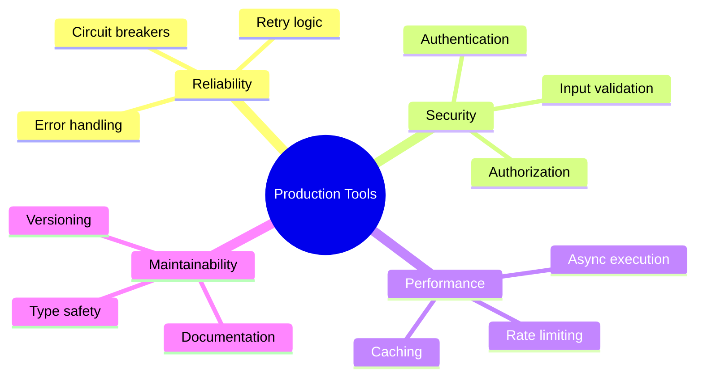

# Week 6 - Lesson 2: Building Production Tool Systems

**Duration:** 2 hours  
**Level:** Advanced  
**Prerequisites:** Lesson 1 (Advanced Function Calling Patterns), REST API basics

---

## 📋 Table of Contents

1. [Introduction](#introduction)
2. [Tool Registry Architecture](#tool-registry-architecture)
3. [Authentication & Authorization](#authentication--authorization)
4. [Rate Limiting & Quotas](#rate-limiting--quotas)
5. [Type Safety & Validation](#type-safety--validation)
6. [Async Tool Execution](#async-tool-execution)
7. [Tool Versioning](#tool-versioning)
8. [Security Best Practices](#security-best-practices)

---

## Introduction

### Lesson Objectives

By the end of this lesson, you will be able to:
- Design and implement a tool registry system
- Secure tools with authentication and authorization
- Implement rate limiting and quota management
- Build type-safe tools with comprehensive validation
- Execute tools asynchronously with httpx
- Version tools for backwards compatibility
- Apply security best practices

### Production Tool Requirements



---

## Tool Registry Architecture

### Why a Tool Registry?

As your system grows, managing tools becomes complex:
- **Discovery:** How does the LLM know what tools are available?
- **Configuration:** Different environments need different tool settings
- **Versioning:** Tools evolve; backwards compatibility matters
- **Monitoring:** Which tools are used most? Which fail?

### Registry Design

```python
from typing import Dict, List, Optional, Callable, Any
from dataclasses import dataclass, field
from pydantic import BaseModel
from enum import Enum
import inspect

class ToolCategory(str, Enum):
    """Tool categories for organization."""
    SEARCH = "search"
    DATA = "data"
    COMMUNICATION = "communication"
    COMPUTATION = "computation"
    INTEGRATION = "integration"

@dataclass
class ToolMetadata:
    """Metadata for a registered tool."""
    name: str
    description: str
    category: ToolCategory
    version: str
    parameters_schema: type[BaseModel]
    function: Callable
    requires_auth: bool = False
    rate_limit: Optional[int] = None  # calls per minute
    timeout_seconds: int = 30
    enabled: bool = True
    tags: List[str] = field(default_factory=list)

class ToolRegistry:
    """
    Central registry for all available tools.
    """
    
    def __init__(self):
        self.tools: Dict[str, ToolMetadata] = {}
        self.call_counts: Dict[str, int] = {}
    
    def register(
        self,
        name: str,
        description: str,
        category: ToolCategory,
        version: str,
        parameters_schema: type[BaseModel],
        function: Callable,
        **kwargs
    ) -> None:
        """
        Register a new tool.
        
        Args:
            name: Unique tool identifier
            description: Human-readable description
            category: Tool category
            version: Semantic version (e.g., "1.0.0")
            parameters_schema: Pydantic model for parameters
            function: Tool implementation
            **kwargs: Additional metadata (requires_auth, rate_limit, etc.)
        """
        if name in self.tools:
            raise ValueError(f"Tool '{name}' already registered")
        
        metadata = ToolMetadata(
            name=name,
            description=description,
            category=category,
            version=version,
            parameters_schema=parameters_schema,
            function=function,
            **kwargs
        )
        
        self.tools[name] = metadata
        self.call_counts[name] = 0
        print(f"✓ Registered tool: {name} v{version}")
    
    def get(self, name: str) -> Optional[ToolMetadata]:
        """Get tool metadata by name."""
        return self.tools.get(name)
    
    def list_tools(
        self,
        category: Optional[ToolCategory] = None,
        enabled_only: bool = True
    ) -> List[ToolMetadata]:
        """
        List all registered tools.
        
        Args:
            category: Filter by category
            enabled_only: Only return enabled tools
        """
        tools = list(self.tools.values())
        
        if category:
            tools = [t for t in tools if t.category == category]
        
        if enabled_only:
            tools = [t for t in tools if t.enabled]
        
        return tools
    
    def to_openai_schema(self, name: str) -> dict:
        """
        Convert tool to OpenAI function calling schema.
        """
        metadata = self.get(name)
        if not metadata:
            raise ValueError(f"Tool '{name}' not found")
        
        # Convert Pydantic schema to OpenAI format
        schema = metadata.parameters_schema.schema()
        
        return {
            "type": "function",
            "function": {
                "name": metadata.name,
                "description": metadata.description,
                "parameters": {
                    "type": "object",
                    "properties": schema.get("properties", {}),
                    "required": schema.get("required", []),
                }
            }
        }
    
    def get_all_openai_schemas(self) -> List[dict]:
        """Get OpenAI schemas for all enabled tools."""
        return [
            self.to_openai_schema(name)
            for name, meta in self.tools.items()
            if meta.enabled
        ]
    
    def execute(self, name: str, **kwargs) -> Any:
        """
        Execute a tool by name.
        
        Args:
            name: Tool name
            **kwargs: Tool parameters
        
        Returns:
            Tool execution result
        """
        metadata = self.get(name)
        if not metadata:
            raise ValueError(f"Tool '{name}' not found")
        
        if not metadata.enabled:
            raise ValueError(f"Tool '{name}' is disabled")
        
        # Validate parameters
        try:
            validated_params = metadata.parameters_schema(**kwargs)
        except Exception as e:
            raise ValueError(f"Invalid parameters for '{name}': {e}")
        
        # Track call count
        self.call_counts[name] += 1
        
        # Execute function
        return metadata.function(**validated_params.dict())
    
    def get_stats(self) -> Dict[str, Any]:
        """Get registry statistics."""
        return {
            "total_tools": len(self.tools),
            "enabled_tools": len([t for t in self.tools.values() if t.enabled]),
            "total_calls": sum(self.call_counts.values()),
            "calls_by_tool": self.call_counts.copy(),
        }

# Create global registry
registry = ToolRegistry()
```

### Registering Tools

```python
from pydantic import BaseModel, Field

# Define parameter schema
class WeatherParams(BaseModel):
    location: str = Field(..., description="City name")
    unit: str = Field(default="celsius", description="Temperature unit")

# Define tool function
def get_weather(location: str, unit: str = "celsius") -> dict:
    """Get current weather for a location."""
    # Mock implementation
    return {
        "location": location,
        "temperature": 20,
        "unit": unit,
        "condition": "Sunny"
    }

# Register tool
registry.register(
    name="get_weather",
    description="Get current weather for a location",
    category=ToolCategory.DATA,
    version="1.0.0",
    parameters_schema=WeatherParams,
    function=get_weather,
    rate_limit=100,  # 100 calls per minute
    timeout_seconds=10,
    tags=["weather", "external-api"]
)

# Use with OpenAI
tools = registry.get_all_openai_schemas()
print(f"Available tools: {len(tools)}")
```

### Decorator-Based Registration

```python
from functools import wraps

def tool(
    name: str,
    description: str,
    category: ToolCategory,
    version: str = "1.0.0",
    **kwargs
):
    """
    Decorator to register a function as a tool.
    """
    def decorator(func: Callable):
        # Extract parameters from function signature
        sig = inspect.signature(func)
        
        # Create Pydantic model from function signature
        # (simplified - in production, use proper type introspection)
        fields = {}
        for param_name, param in sig.parameters.items():
            if param_name == "self":
                continue
            
            annotation = param.annotation if param.annotation != inspect.Parameter.empty else str
            default = param.default if param.default != inspect.Parameter.empty else ...
            
            fields[param_name] = (annotation, default)
        
        # Create dynamic Pydantic model
        ParamsModel = type(f"{name}Params", (BaseModel,), {
            "__annotations__": {k: v[0] for k, v in fields.items()},
            **{k: Field(v[1], description=f"Parameter {k}") for k, v in fields.items()}
        })
        
        # Register tool
        registry.register(
            name=name,
            description=description,
            category=category,
            version=version,
            parameters_schema=ParamsModel,
            function=func,
            **kwargs
        )
        
        return func
    
    return decorator

# Usage
@tool(
    name="calculate_sum",
    description="Calculate sum of two numbers",
    category=ToolCategory.COMPUTATION,
    version="1.0.0",
    rate_limit=1000
)
def calculate_sum(a: float, b: float) -> float:
    """Add two numbers."""
    return a + b

# Tool is automatically registered
result = registry.execute("calculate_sum", a=10, b=20)
print(f"Sum: {result}")  # 30
```

---

## Authentication & Authorization

### API Key Management

```python
import os
from typing import Optional
from dataclasses import dataclass

@dataclass
class APICredentials:
    """Credentials for external API."""
    api_key: str
    api_secret: Optional[str] = None
    base_url: str = ""

class CredentialsManager:
    """
    Secure credential storage and retrieval.
    """
    
    def __init__(self):
        self.credentials: Dict[str, APICredentials] = {}
        self._load_from_env()
    
    def _load_from_env(self):
        """Load credentials from environment variables."""
        # Example: WEATHER_API_KEY, WEATHER_API_SECRET, WEATHER_BASE_URL
        api_names = ["WEATHER", "STOCK", "NEWS"]
        
        for api_name in api_names:
            api_key = os.getenv(f"{api_name}_API_KEY")
            if api_key:
                self.credentials[api_name.lower()] = APICredentials(
                    api_key=api_key,
                    api_secret=os.getenv(f"{api_name}_API_SECRET"),
                    base_url=os.getenv(f"{api_name}_BASE_URL", "")
                )
    
    def get(self, service: str) -> Optional[APICredentials]:
        """Get credentials for a service."""
        return self.credentials.get(service.lower())
    
    def set(self, service: str, credentials: APICredentials):
        """Set credentials for a service."""
        self.credentials[service.lower()] = credentials
    
    def has_credentials(self, service: str) -> bool:
        """Check if credentials exist for a service."""
        return service.lower() in self.credentials

# Global credentials manager
credentials_manager = CredentialsManager()

# Tool with authentication
def get_weather_api(location: str, unit: str = "celsius") -> dict:
    """
    Get weather from external API with authentication.
    """
    creds = credentials_manager.get("weather")
    if not creds:
        raise ValueError("Weather API credentials not configured")
    
    headers = {
        "Authorization": f"Bearer {creds.api_key}",
        "Content-Type": "application/json"
    }
    
    url = f"{creds.base_url}/weather"
    params = {"location": location, "unit": unit}
    
    response = requests.get(url, headers=headers, params=params)
    response.raise_for_status()
    
    return response.json()
```

### User-Based Authorization

```python
from enum import Enum
from typing import Set

class UserRole(str, Enum):
    ADMIN = "admin"
    USER = "user"
    GUEST = "guest"

@dataclass
class User:
    """User with role-based permissions."""
    id: str
    username: str
    roles: Set[UserRole]
    api_quota: int = 1000  # calls per day

class AuthorizationManager:
    """
    Manage user permissions for tools.
    """
    
    def __init__(self):
        self.tool_permissions: Dict[str, Set[UserRole]] = {}
    
    def set_tool_permissions(self, tool_name: str, roles: Set[UserRole]):
        """Define which roles can use a tool."""
        self.tool_permissions[tool_name] = roles
    
    def can_use_tool(self, user: User, tool_name: str) -> bool:
        """Check if user has permission to use tool."""
        required_roles = self.tool_permissions.get(tool_name)
        
        if not required_roles:
            # No permissions set = available to all
            return True
        
        # Check if user has any of the required roles
        return bool(user.roles & required_roles)
    
    def authorize_or_raise(self, user: User, tool_name: str):
        """Raise exception if user cannot use tool."""
        if not self.can_use_tool(user, tool_name):
            raise PermissionError(
                f"User '{user.username}' does not have permission to use '{tool_name}'"
            )

# Global authorization manager
auth_manager = AuthorizationManager()

# Configure permissions
auth_manager.set_tool_permissions(
    "delete_user",
    {UserRole.ADMIN}  # Only admins can delete users
)

auth_manager.set_tool_permissions(
    "get_weather",
    {UserRole.ADMIN, UserRole.USER}  # Guests cannot use
)

# Authorized tool execution
def execute_tool_with_auth(user: User, tool_name: str, **kwargs) -> Any:
    """
    Execute tool with authorization check.
    """
    # Check permissions
    auth_manager.authorize_or_raise(user, tool_name)
    
    # Execute tool
    return registry.execute(tool_name, **kwargs)

# Example
admin_user = User(
    id="1",
    username="admin",
    roles={UserRole.ADMIN}
)

guest_user = User(
    id="2",
    username="guest",
    roles={UserRole.GUEST}
)

# Admin can use weather tool
result = execute_tool_with_auth(admin_user, "get_weather", location="London")

# Guest cannot (raises PermissionError)
try:
    execute_tool_with_auth(guest_user, "get_weather", location="London")
except PermissionError as e:
    print(f"Access denied: {e}")
```

---

## Rate Limiting & Quotas

### Per-User Quotas

```python
from datetime import datetime, timedelta
from collections import defaultdict
from threading import Lock

class QuotaManager:
    """
    Manage per-user API quotas.
    """
    
    def __init__(self):
        self.user_calls: Dict[str, List[datetime]] = defaultdict(list)
        self.lock = Lock()
    
    def record_call(self, user_id: str, tool_name: str):
        """Record a tool call for quota tracking."""
        with self.lock:
            now = datetime.utcnow()
            key = f"{user_id}:{tool_name}"
            self.user_calls[key].append(now)
            
            # Clean up old entries (older than 24 hours)
            cutoff = now - timedelta(hours=24)
            self.user_calls[key] = [
                ts for ts in self.user_calls[key]
                if ts > cutoff
            ]
    
    def get_usage(
        self,
        user_id: str,
        tool_name: str,
        window_hours: int = 24
    ) -> int:
        """
        Get number of calls in time window.
        
        Args:
            user_id: User identifier
            tool_name: Tool name
            window_hours: Time window in hours
        
        Returns:
            Number of calls in window
        """
        with self.lock:
            key = f"{user_id}:{tool_name}"
            cutoff = datetime.utcnow() - timedelta(hours=window_hours)
            
            return sum(1 for ts in self.user_calls[key] if ts > cutoff)
    
    def check_quota(
        self,
        user: User,
        tool_name: str,
        limit: int,
        window_hours: int = 24
    ) -> bool:
        """
        Check if user is within quota.
        
        Returns:
            True if within quota, False if exceeded
        """
        usage = self.get_usage(user.id, tool_name, window_hours)
        return usage < limit
    
    def enforce_quota(
        self,
        user: User,
        tool_name: str,
        limit: int,
        window_hours: int = 24
    ):
        """
        Raise exception if quota exceeded.
        """
        if not self.check_quota(user, tool_name, limit, window_hours):
            usage = self.get_usage(user.id, tool_name, window_hours)
            raise Exception(
                f"Quota exceeded for '{tool_name}': {usage}/{limit} calls "
                f"in past {window_hours} hours"
            )

# Global quota manager
quota_manager = QuotaManager()

def execute_with_quota(user: User, tool_name: str, **kwargs) -> Any:
    """
    Execute tool with quota enforcement.
    """
    # Get tool metadata
    metadata = registry.get(tool_name)
    if not metadata:
        raise ValueError(f"Tool '{tool_name}' not found")
    
    # Check authorization
    auth_manager.authorize_or_raise(user, tool_name)
    
    # Enforce quota
    quota_limit = metadata.rate_limit or user.api_quota
    quota_manager.enforce_quota(user, tool_name, quota_limit, window_hours=24)
    
    # Execute tool
    result = registry.execute(tool_name, **kwargs)
    
    # Record call
    quota_manager.record_call(user.id, tool_name)
    
    return result
```

### Rate Limiting with Redis

```python
import redis
from typing import Optional

class RedisRateLimiter:
    """
    Distributed rate limiter using Redis.
    """
    
    def __init__(self, redis_url: str = "redis://localhost:6379"):
        self.redis_client = redis.from_url(redis_url)
    
    def is_allowed(
        self,
        key: str,
        max_calls: int,
        window_seconds: int
    ) -> tuple[bool, int]:
        """
        Check if request is allowed under rate limit.
        
        Args:
            key: Unique identifier (e.g., f"user:{user_id}:tool:{tool_name}")
            max_calls: Maximum calls allowed
            window_seconds: Time window in seconds
        
        Returns:
            (is_allowed, remaining_calls)
        """
        now = datetime.utcnow().timestamp()
        
        # Use sorted set to track timestamps
        pipe = self.redis_client.pipeline()
        
        # Remove old entries
        cutoff = now - window_seconds
        pipe.zremrangebyscore(key, 0, cutoff)
        
        # Count current entries
        pipe.zcard(key)
        
        # Add current timestamp
        pipe.zadd(key, {str(now): now})
        
        # Set expiry
        pipe.expire(key, window_seconds)
        
        results = pipe.execute()
        current_count = results[1]
        
        is_allowed = current_count < max_calls
        remaining = max(0, max_calls - current_count - 1)
        
        return is_allowed, remaining
    
    def enforce(self, key: str, max_calls: int, window_seconds: int):
        """
        Enforce rate limit, raise exception if exceeded.
        """
        is_allowed, remaining = self.is_allowed(key, max_calls, window_seconds)
        
        if not is_allowed:
            raise Exception(
                f"Rate limit exceeded for '{key}': "
                f"{max_calls} calls per {window_seconds}s"
            )
        
        return remaining

# Usage with Redis
redis_limiter = RedisRateLimiter()

def execute_with_redis_rate_limit(
    user: User,
    tool_name: str,
    **kwargs
) -> Any:
    """
    Execute tool with Redis-based rate limiting.
    """
    # Create rate limit key
    rate_key = f"user:{user.id}:tool:{tool_name}"
    
    # Enforce rate limit (100 calls per minute)
    remaining = redis_limiter.enforce(rate_key, max_calls=100, window_seconds=60)
    
    print(f"Rate limit: {remaining} calls remaining")
    
    # Execute tool
    return registry.execute(tool_name, **kwargs)
```

---

## Type Safety & Validation

### Advanced Pydantic Schemas

```python
from pydantic import BaseModel, Field, validator, root_validator
from typing import Literal, Union, List
from datetime import datetime

class Location(BaseModel):
    """Location with coordinates or name."""
    name: Optional[str] = None
    latitude: Optional[float] = Field(None, ge=-90, le=90)
    longitude: Optional[float] = Field(None, ge=-180, le=180)
    
    @root_validator
    def check_location_provided(cls, values):
        """Ensure either name or coordinates are provided."""
        name = values.get('name')
        lat = values.get('latitude')
        lon = values.get('longitude')
        
        if not name and (lat is None or lon is None):
            raise ValueError("Must provide either name or coordinates")
        
        return values

class WeatherQueryParams(BaseModel):
    """Advanced weather query parameters."""
    location: Location
    unit: Literal["celsius", "fahrenheit", "kelvin"] = "celsius"
    include_forecast: bool = False
    forecast_days: int = Field(default=3, ge=1, le=14)
    include_alerts: bool = False
    language: str = Field(default="en", regex="^[a-z]{2}$")
    
    @validator('forecast_days')
    def validate_forecast_days(cls, v, values):
        """Validate forecast_days only if include_forecast is True."""
        if not values.get('include_forecast') and v > 3:
            raise ValueError(
                "forecast_days can only be > 3 when include_forecast=True"
            )
        return v

class WeatherResponse(BaseModel):
    """Type-safe weather response."""
    location: Location
    timestamp: datetime
    temperature: float
    feels_like: float
    humidity: int = Field(..., ge=0, le=100)
    condition: str
    wind_speed: float = Field(..., ge=0)
    forecast: Optional[List[dict]] = None

def get_weather_advanced(
    location: Location,
    unit: str = "celsius",
    include_forecast: bool = False,
    **kwargs
) -> WeatherResponse:
    """
    Get weather with advanced type safety.
    """
    # Validate input
    params = WeatherQueryParams(
        location=location,
        unit=unit,
        include_forecast=include_forecast,
        **kwargs
    )
    
    # Mock response
    response = WeatherResponse(
        location=params.location,
        timestamp=datetime.utcnow(),
        temperature=20.0,
        feels_like=18.5,
        humidity=65,
        condition="Sunny",
        wind_speed=5.2
    )
    
    return response
```

### Custom Validators

```python
from pydantic import validator
import re

class StockQueryParams(BaseModel):
    """Stock query with custom validation."""
    symbol: str = Field(..., description="Stock symbol (e.g., AAPL)")
    market: Literal["NYSE", "NASDAQ", "LSE", "TSE"] = "NYSE"
    period: Literal["1d", "1w", "1m", "3m", "1y", "5y"] = "1d"
    
    @validator('symbol')
    def validate_symbol(cls, v):
        """Validate stock symbol format."""
        # Stock symbols: 1-5 uppercase letters
        if not re.match(r'^[A-Z]{1,5}$', v):
            raise ValueError(
                "Stock symbol must be 1-5 uppercase letters (e.g., AAPL)"
            )
        return v
    
    @validator('symbol')
    def check_delisted(cls, v):
        """Check if symbol is delisted."""
        # Mock delisted list
        delisted = ["ENRON", "LTCM", "BEAR"]
        if v in delisted:
            raise ValueError(f"Symbol '{v}' is delisted and unavailable")
        return v

# Usage
try:
    params = StockQueryParams(symbol="apple")  # Fails: lowercase
except ValueError as e:
    print(f"Validation error: {e}")

try:
    params = StockQueryParams(symbol="ENRON")  # Fails: delisted
except ValueError as e:
    print(f"Validation error: {e}")

params = StockQueryParams(symbol="AAPL")  # Success
```

---

## Async Tool Execution

### Async Tools with httpx

```python
import httpx
import asyncio
from typing import List

class AsyncToolExecutor:
    """
    Execute tools asynchronously for better performance.
    """
    
    def __init__(self):
        self.client = httpx.AsyncClient(timeout=30.0)
    
    async def execute_async(
        self,
        tool_name: str,
        **kwargs
    ) -> dict:
        """
        Execute a single tool asynchronously.
        """
        metadata = registry.get(tool_name)
        if not metadata:
            raise ValueError(f"Tool '{tool_name}' not found")
        
        # Validate parameters
        validated_params = metadata.parameters_schema(**kwargs)
        
        # Check if function is async
        if asyncio.iscoroutinefunction(metadata.function):
            result = await metadata.function(**validated_params.dict())
        else:
            # Run sync function in executor
            loop = asyncio.get_event_loop()
            result = await loop.run_in_executor(
                None,
                metadata.function,
                **validated_params.dict()
            )
        
        return result
    
    async def execute_parallel(
        self,
        tool_calls: List[tuple[str, dict]]
    ) -> List[dict]:
        """
        Execute multiple tools in parallel.
        
        Args:
            tool_calls: List of (tool_name, kwargs) tuples
        
        Returns:
            List of results in same order
        """
        tasks = [
            self.execute_async(tool_name, **kwargs)
            for tool_name, kwargs in tool_calls
        ]
        
        results = await asyncio.gather(*tasks, return_exceptions=True)
        
        # Convert exceptions to error dicts
        processed_results = []
        for result in results:
            if isinstance(result, Exception):
                processed_results.append({
                    "error": str(result),
                    "success": False
                })
            else:
                processed_results.append({
                    "result": result,
                    "success": True
                })
        
        return processed_results
    
    async def close(self):
        """Close HTTP client."""
        await self.client.aclose()

# Async tool implementations
async def get_weather_async(location: str, unit: str = "celsius") -> dict:
    """Async weather API call."""
    async with httpx.AsyncClient() as client:
        response = await client.get(
            f"https://api.weather.com/v1/current",
            params={"location": location, "unit": unit}
        )
        return response.json()

async def get_stock_async(symbol: str) -> dict:
    """Async stock API call."""
    async with httpx.AsyncClient() as client:
        response = await client.get(
            f"https://api.stocks.com/v1/quote",
            params={"symbol": symbol}
        )
        return response.json()

# Usage
async def main():
    executor = AsyncToolExecutor()
    
    # Parallel execution
    tool_calls = [
        ("get_weather", {"location": "London"}),
        ("get_stock", {"symbol": "AAPL"}),
        ("get_weather", {"location": "Tokyo"}),
    ]
    
    results = await executor.execute_parallel(tool_calls)
    
    for i, result in enumerate(results):
        print(f"Tool {i}: {result}")
    
    await executor.close()

# Run
# asyncio.run(main())
```

### Timeout Handling

```python
import asyncio

async def execute_with_timeout(
    coro,
    timeout_seconds: float
) -> dict:
    """
    Execute async function with timeout.
    
    Args:
        coro: Coroutine to execute
        timeout_seconds: Timeout in seconds
    
    Returns:
        Result dict with success flag
    """
    try:
        result = await asyncio.wait_for(coro, timeout=timeout_seconds)
        return {"success": True, "result": result}
    except asyncio.TimeoutError:
        return {
            "success": False,
            "error": f"Tool execution timed out after {timeout_seconds}s"
        }
    except Exception as e:
        return {
            "success": False,
            "error": str(e)
        }

# Usage
async def slow_tool():
    """Simulate slow tool."""
    await asyncio.sleep(10)
    return {"data": "result"}

result = await execute_with_timeout(slow_tool(), timeout_seconds=5)
# Returns: {"success": False, "error": "Tool execution timed out after 5s"}
```

---

## Tool Versioning

### Semantic Versioning

```python
from typing import Dict, List
import re

class VersionedToolRegistry:
    """
    Registry supporting multiple versions of the same tool.
    """
    
    def __init__(self):
        # tool_name -> version -> metadata
        self.tools: Dict[str, Dict[str, ToolMetadata]] = {}
        self.default_versions: Dict[str, str] = {}
    
    def register_version(
        self,
        name: str,
        version: str,
        metadata: ToolMetadata,
        set_as_default: bool = False
    ):
        """
        Register a specific version of a tool.
        """
        if not self._is_valid_semver(version):
            raise ValueError(f"Invalid semantic version: {version}")
        
        if name not in self.tools:
            self.tools[name] = {}
        
        self.tools[name][version] = metadata
        
        if set_as_default or name not in self.default_versions:
            self.default_versions[name] = version
        
        print(f"✓ Registered {name} v{version}")
    
    def _is_valid_semver(self, version: str) -> bool:
        """Check if version follows semantic versioning."""
        pattern = r'^\d+\.\d+\.\d+(-[a-zA-Z0-9.-]+)?$'
        return bool(re.match(pattern, version))
    
    def get_version(
        self,
        name: str,
        version: Optional[str] = None
    ) -> Optional[ToolMetadata]:
        """
        Get specific version of a tool.
        
        Args:
            name: Tool name
            version: Specific version or None for default
        """
        if name not in self.tools:
            return None
        
        if version is None:
            version = self.default_versions.get(name)
        
        return self.tools[name].get(version)
    
    def list_versions(self, name: str) -> List[str]:
        """List all versions of a tool."""
        if name not in self.tools:
            return []
        return sorted(self.tools[name].keys())
    
    def execute(
        self,
        name: str,
        version: Optional[str] = None,
        **kwargs
    ) -> Any:
        """Execute specific version of tool."""
        metadata = self.get_version(name, version)
        if not metadata:
            version_str = f" v{version}" if version else ""
            raise ValueError(f"Tool '{name}{version_str}' not found")
        
        # Validate and execute
        validated_params = metadata.parameters_schema(**kwargs)
        return metadata.function(**validated_params.dict())

# Example: Multiple versions
versioned_registry = VersionedToolRegistry()

# Version 1.0.0: Simple weather
def get_weather_v1(location: str) -> dict:
    return {"location": location, "temp": 20}

class WeatherParamsV1(BaseModel):
    location: str

versioned_registry.register_version(
    name="get_weather",
    version="1.0.0",
    metadata=ToolMetadata(
        name="get_weather",
        description="Get weather",
        category=ToolCategory.DATA,
        version="1.0.0",
        parameters_schema=WeatherParamsV1,
        function=get_weather_v1
    )
)

# Version 2.0.0: Added unit parameter
def get_weather_v2(location: str, unit: str = "celsius") -> dict:
    return {"location": location, "temp": 20, "unit": unit}

class WeatherParamsV2(BaseModel):
    location: str
    unit: str = "celsius"

versioned_registry.register_version(
    name="get_weather",
    version="2.0.0",
    metadata=ToolMetadata(
        name="get_weather",
        description="Get weather with unit",
        category=ToolCategory.DATA,
        version="2.0.0",
        parameters_schema=WeatherParamsV2,
        function=get_weather_v2
    ),
    set_as_default=True
)

# Use default version (2.0.0)
result = versioned_registry.execute("get_weather", location="London")

# Use specific version
result = versioned_registry.execute("get_weather", version="1.0.0", location="London")
```

---

## Security Best Practices

### Input Sanitization

```python
import html
import re
from typing import Any

class InputSanitizer:
    """Sanitize tool inputs to prevent injection attacks."""
    
    @staticmethod
    def sanitize_string(value: str, max_length: int = 1000) -> str:
        """
        Sanitize string input.
        
        - Limit length
        - Remove control characters
        - HTML escape
        """
        # Truncate
        value = value[:max_length]
        
        # Remove control characters
        value = re.sub(r'[\x00-\x1f\x7f-\x9f]', '', value)
        
        # HTML escape
        value = html.escape(value)
        
        return value
    
    @staticmethod
    def sanitize_sql_identifier(value: str) -> str:
        """
        Sanitize SQL identifier (table/column name).
        Only allow alphanumeric and underscore.
        """
        if not re.match(r'^[a-zA-Z_][a-zA-Z0-9_]*$', value):
            raise ValueError(
                f"Invalid SQL identifier: {value}. "
                "Must start with letter/underscore and contain only alphanumeric/underscore"
            )
        return value
    
    @staticmethod
    def sanitize_path(value: str) -> str:
        """
        Sanitize file path to prevent directory traversal.
        """
        # Remove any path traversal attempts
        if '..' in value or value.startswith('/'):
            raise ValueError(f"Invalid path: {value}")
        
        # Only allow safe characters
        if not re.match(r'^[a-zA-Z0-9_./\-]+$', value):
            raise ValueError(f"Path contains unsafe characters: {value}")
        
        return value

# Apply sanitization to tool inputs
def execute_with_sanitization(tool_name: str, **kwargs) -> Any:
    """Execute tool with input sanitization."""
    sanitizer = InputSanitizer()
    
    # Sanitize string inputs
    sanitized_kwargs = {}
    for key, value in kwargs.items():
        if isinstance(value, str):
            if 'path' in key.lower():
                sanitized_kwargs[key] = sanitizer.sanitize_path(value)
            elif 'sql' in key.lower() or 'table' in key.lower():
                sanitized_kwargs[key] = sanitizer.sanitize_sql_identifier(value)
            else:
                sanitized_kwargs[key] = sanitizer.sanitize_string(value)
        else:
            sanitized_kwargs[key] = value
    
    return registry.execute(tool_name, **sanitized_kwargs)
```

### Secrets Management

```python
from cryptography.fernet import Fernet
import base64
import os

class SecretsManager:
    """
    Encrypt and decrypt sensitive credentials.
    """
    
    def __init__(self, key: Optional[bytes] = None):
        if key is None:
            # Load from environment or generate
            key_str = os.getenv('ENCRYPTION_KEY')
            if key_str:
                self.key = base64.urlsafe_b64decode(key_str)
            else:
                self.key = Fernet.generate_key()
        else:
            self.key = key
        
        self.cipher = Fernet(self.key)
    
    def encrypt(self, value: str) -> str:
        """Encrypt a string value."""
        encrypted = self.cipher.encrypt(value.encode())
        return base64.urlsafe_b64encode(encrypted).decode()
    
    def decrypt(self, encrypted_value: str) -> str:
        """Decrypt an encrypted value."""
        encrypted_bytes = base64.urlsafe_b64decode(encrypted_value.encode())
        decrypted = self.cipher.decrypt(encrypted_bytes)
        return decrypted.decode()
    
    def store_credential(
        self,
        service: str,
        credential: str
    ) -> str:
        """
        Encrypt and store a credential.
        
        Returns:
            Encrypted credential (safe to store)
        """
        return self.encrypt(credential)
    
    def retrieve_credential(self, encrypted_credential: str) -> str:
        """Retrieve and decrypt a credential."""
        return self.decrypt(encrypted_credential)

# Usage
secrets = SecretsManager()

# Store API key securely
api_key = "sk-1234567890abcdef"
encrypted_key = secrets.store_credential("openai", api_key)
print(f"Encrypted: {encrypted_key}")

# Retrieve when needed
decrypted_key = secrets.retrieve_credential(encrypted_key)
print(f"Decrypted: {decrypted_key}")
```

### Audit Logging

```python
import json
from datetime import datetime
from typing import Optional

class AuditLogger:
    """
    Log all tool executions for security auditing.
    """
    
    def __init__(self, log_file: str = "tool_audit.jsonl"):
        self.log_file = log_file
    
    def log_execution(
        self,
        user_id: str,
        tool_name: str,
        parameters: dict,
        success: bool,
        result: Optional[Any] = None,
        error: Optional[str] = None,
        ip_address: Optional[str] = None
    ):
        """
        Log tool execution for audit trail.
        """
        log_entry = {
            "timestamp": datetime.utcnow().isoformat(),
            "user_id": user_id,
            "tool_name": tool_name,
            "parameters": parameters,
            "success": success,
            "ip_address": ip_address,
        }
        
        if result:
            # Don't log sensitive data
            log_entry["result_type"] = type(result).__name__
        
        if error:
            log_entry["error"] = error
        
        # Append to log file
        with open(self.log_file, 'a') as f:
            f.write(json.dumps(log_entry) + '\n')
    
    def search_logs(
        self,
        user_id: Optional[str] = None,
        tool_name: Optional[str] = None,
        start_time: Optional[datetime] = None,
        end_time: Optional[datetime] = None
    ) -> List[dict]:
        """
        Search audit logs.
        """
        results = []
        
        with open(self.log_file, 'r') as f:
            for line in f:
                entry = json.loads(line)
                
                # Apply filters
                if user_id and entry['user_id'] != user_id:
                    continue
                
                if tool_name and entry['tool_name'] != tool_name:
                    continue
                
                timestamp = datetime.fromisoformat(entry['timestamp'])
                
                if start_time and timestamp < start_time:
                    continue
                
                if end_time and timestamp > end_time:
                    continue
                
                results.append(entry)
        
        return results

# Usage
audit_logger = AuditLogger()

def execute_with_audit(
    user_id: str,
    tool_name: str,
    ip_address: str,
    **kwargs
) -> dict:
    """
    Execute tool with audit logging.
    """
    try:
        result = registry.execute(tool_name, **kwargs)
        
        audit_logger.log_execution(
            user_id=user_id,
            tool_name=tool_name,
            parameters=kwargs,
            success=True,
            result=result,
            ip_address=ip_address
        )
        
        return {"success": True, "result": result}
        
    except Exception as e:
        audit_logger.log_execution(
            user_id=user_id,
            tool_name=tool_name,
            parameters=kwargs,
            success=False,
            error=str(e),
            ip_address=ip_address
        )
        
        return {"success": False, "error": str(e)}
```

---

## Summary

### Key Takeaways

1. **Tool Registry** centralizes tool management, configuration, and discovery
2. **Authentication** secures external API access with credential management
3. **Authorization** controls which users can access which tools
4. **Rate Limiting** prevents abuse with quotas and Redis-based limiters
5. **Type Safety** with Pydantic catches errors before runtime
6. **Async Execution** improves performance with httpx and asyncio
7. **Versioning** enables backwards compatibility as tools evolve
8. **Security** requires input sanitization, secrets encryption, and audit logging

### Production Tool System Checklist

- [ ] Implement centralized tool registry
- [ ] Add authentication for external APIs
- [ ] Configure role-based authorization
- [ ] Implement per-user quotas
- [ ] Add rate limiting (local or Redis)
- [ ] Use Pydantic for type-safe schemas
- [ ] Convert synchronous tools to async
- [ ] Version all tools with semantic versioning
- [ ] Sanitize all user inputs
- [ ] Encrypt sensitive credentials
- [ ] Enable comprehensive audit logging
- [ ] Set up monitoring and alerts
- [ ] Document all tools with examples
- [ ] Write integration tests for each tool

### Next Steps

- **Lesson 3:** Tool Orchestration & Workflows
- **Lab 1:** Parallel Function Calling & Error Handling
- **Lab 2:** Building a Tool Registry System

---

## Additional Resources

- OpenAI Function Calling: https://platform.openai.com/docs/guides/function-calling
- Pydantic Documentation: https://docs.pydantic.dev/
- httpx Async Client: https://www.python-httpx.org/async/
- Redis Rate Limiting: https://redis.io/docs/manual/patterns/rate-limiter/
- OWASP Input Validation: https://cheatsheetseries.owasp.org/cheatsheets/Input_Validation_Cheat_Sheet.html

**Last Updated:** November 14, 2025
