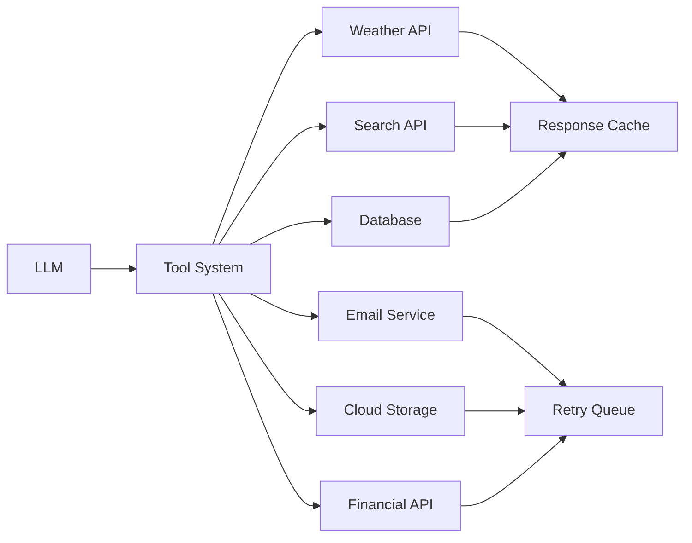

# Week 6 - Lesson 4: Real-World Tool Integrations

**Duration:** 2 hours  
**Level:** Advanced  
**Prerequisites:** Lessons 1-3, REST API experience, API authentication concepts

---

## 📋 Table of Contents

1. [Introduction](#introduction)
2. [Weather APIs](#weather-apis)
3. [Search & Web APIs](#search--web-apis)
4. [Database Integration](#database-integration)
5. [Email & Communication](#email--communication)
6. [Cloud Services](#cloud-services)
7. [Financial APIs](#financial-apis)
8. [Complete Integration Example](#complete-integration-example)

---

## Introduction

### Lesson Objectives

By the end of this lesson, you will be able to:
- Integrate real-world weather APIs (OpenWeatherMap)
- Implement web search tools (Tavily, Serper)
- Connect to databases (PostgreSQL, MongoDB)
- Send emails and notifications
- Use cloud services (AWS S3, Azure Storage)
- Access financial data (Alpha Vantage, Yahoo Finance)
- Build production-ready integrations with error handling

### API Integration Patterns



---

## Weather APIs

### OpenWeatherMap Integration

```python
import httpx
from pydantic import BaseModel, Field
from typing import Optional, List
import os
from datetime import datetime

class WeatherParams(BaseModel):
    """Parameters for weather query."""
    location: str = Field(..., description="City name (e.g., 'London,UK')")
    units: str = Field(default="metric", description="Units: metric, imperial, or standard")

class WeatherData(BaseModel):
    """Weather response data."""
    location: str
    temperature: float
    feels_like: float
    humidity: int
    pressure: int
    wind_speed: float
    description: str
    icon: str
    timestamp: datetime

class OpenWeatherMapTool:
    """
    OpenWeatherMap API integration.
    Sign up: https://openweathermap.org/api
    """
    
    def __init__(self, api_key: Optional[str] = None):
        self.api_key = api_key or os.getenv("OPENWEATHER_API_KEY")
        if not self.api_key:
            raise ValueError("OpenWeatherMap API key required")
        
        self.base_url = "https://api.openweathermap.org/data/2.5"
        self.client = httpx.AsyncClient(timeout=10.0)
    
    async def get_current_weather(
        self,
        location: str,
        units: str = "metric"
    ) -> WeatherData:
        """
        Get current weather for a location.
        
        Args:
            location: City name, optionally with country code (e.g., "London,UK")
            units: metric (Celsius), imperial (Fahrenheit), or standard (Kelvin)
        
        Returns:
            WeatherData object with current conditions
        """
        params = {
            "q": location,
            "appid": self.api_key,
            "units": units
        }
        
        response = await self.client.get(
            f"{self.base_url}/weather",
            params=params
        )
        
        response.raise_for_status()
        data = response.json()
        
        return WeatherData(
            location=data["name"],
            temperature=data["main"]["temp"],
            feels_like=data["main"]["feels_like"],
            humidity=data["main"]["humidity"],
            pressure=data["main"]["pressure"],
            wind_speed=data["wind"]["speed"],
            description=data["weather"][0]["description"],
            icon=data["weather"][0]["icon"],
            timestamp=datetime.utcnow()
        )
    
    async def get_forecast(
        self,
        location: str,
        days: int = 5,
        units: str = "metric"
    ) -> List[dict]:
        """
        Get weather forecast for next N days.
        
        Args:
            location: City name
            days: Number of days (1-5)
            units: Temperature units
        
        Returns:
            List of forecast data points
        """
        params = {
            "q": location,
            "appid": self.api_key,
            "units": units,
            "cnt": days * 8  # API returns 3-hour intervals
        }
        
        response = await self.client.get(
            f"{self.base_url}/forecast",
            params=params
        )
        
        response.raise_for_status()
        data = response.json()
        
        return data["list"]
    
    async def close(self):
        """Close HTTP client."""
        await self.client.aclose()

# Usage
async def demo_weather():
    weather_tool = OpenWeatherMapTool()
    
    # Get current weather
    weather = await weather_tool.get_current_weather("London,UK")
    print(f"Temperature in {weather.location}: {weather.temperature}°C")
    print(f"Conditions: {weather.description}")
    
    # Get forecast
    forecast = await weather_tool.get_forecast("London,UK", days=3)
    print(f"\nForecast: {len(forecast)} data points")
    
    await weather_tool.close()

# Register with tool registry
@tool(
    name="get_weather",
    description="Get current weather for any city worldwide",
    category=ToolCategory.DATA,
    version="1.0.0",
    rate_limit=60  # 60 calls per minute
)
async def get_weather_tool(location: str, units: str = "metric") -> dict:
    """OpenWeatherMap integration."""
    weather_tool = OpenWeatherMapTool()
    try:
        weather = await weather_tool.get_current_weather(location, units)
        return weather.dict()
    finally:
        await weather_tool.close()
```

### Alternative: WeatherAPI.com

```python
class WeatherAPITool:
    """
    WeatherAPI.com integration (more generous free tier).
    Sign up: https://www.weatherapi.com/
    """
    
    def __init__(self, api_key: Optional[str] = None):
        self.api_key = api_key or os.getenv("WEATHERAPI_KEY")
        if not self.api_key:
            raise ValueError("WeatherAPI key required")
        
        self.base_url = "https://api.weatherapi.com/v1"
        self.client = httpx.AsyncClient(timeout=10.0)
    
    async def get_current_weather(self, location: str) -> dict:
        """Get current weather."""
        params = {
            "key": self.api_key,
            "q": location,
            "aqi": "no"  # Air quality index
        }
        
        response = await self.client.get(
            f"{self.base_url}/current.json",
            params=params
        )
        
        response.raise_for_status()
        data = response.json()
        
        return {
            "location": data["location"]["name"],
            "country": data["location"]["country"],
            "temperature": data["current"]["temp_c"],
            "feels_like": data["current"]["feelslike_c"],
            "humidity": data["current"]["humidity"],
            "condition": data["current"]["condition"]["text"],
            "wind_speed": data["current"]["wind_kph"],
            "last_updated": data["current"]["last_updated"]
        }
    
    async def close(self):
        await self.client.aclose()
```

---

## Search & Web APIs

### Tavily Search API

```python
from typing import List, Optional
from pydantic import BaseModel

class SearchParams(BaseModel):
    """Parameters for web search."""
    query: str = Field(..., description="Search query")
    max_results: int = Field(default=5, ge=1, le=20, description="Max results to return")
    search_depth: str = Field(default="basic", description="basic or advanced")

class SearchResult(BaseModel):
    """Single search result."""
    title: str
    url: str
    content: str
    score: float

class TavilySearchTool:
    """
    Tavily Search API - Built for LLMs.
    Sign up: https://tavily.com/
    """
    
    def __init__(self, api_key: Optional[str] = None):
        self.api_key = api_key or os.getenv("TAVILY_API_KEY")
        if not self.api_key:
            raise ValueError("Tavily API key required")
        
        self.base_url = "https://api.tavily.com"
        self.client = httpx.AsyncClient(timeout=30.0)
    
    async def search(
        self,
        query: str,
        max_results: int = 5,
        search_depth: str = "basic",
        include_answer: bool = True
    ) -> dict:
        """
        Perform web search optimized for LLM consumption.
        
        Args:
            query: Search query
            max_results: Number of results (1-20)
            search_depth: 'basic' or 'advanced'
            include_answer: Generate AI answer from results
        
        Returns:
            Search results with optional AI-generated answer
        """
        payload = {
            "api_key": self.api_key,
            "query": query,
            "max_results": max_results,
            "search_depth": search_depth,
            "include_answer": include_answer,
            "include_raw_content": False,
            "include_images": False
        }
        
        response = await self.client.post(
            f"{self.base_url}/search",
            json=payload
        )
        
        response.raise_for_status()
        data = response.json()
        
        return {
            "answer": data.get("answer"),
            "results": [
                SearchResult(
                    title=r["title"],
                    url=r["url"],
                    content=r["content"],
                    score=r["score"]
                )
                for r in data.get("results", [])
            ]
        }
    
    async def close(self):
        await self.client.aclose()

# Register tool
@tool(
    name="search_web",
    description="Search the web for current information on any topic",
    category=ToolCategory.SEARCH,
    version="1.0.0",
    rate_limit=100
)
async def search_web_tool(
    query: str,
    max_results: int = 5
) -> dict:
    """Tavily web search integration."""
    search_tool = TavilySearchTool()
    try:
        results = await search_tool.search(query, max_results)
        return results
    finally:
        await search_tool.close()
```

### Serper Google Search API

```python
class SerperSearchTool:
    """
    Serper Google Search API - Cost-effective Google Search.
    Sign up: https://serper.dev/
    """
    
    def __init__(self, api_key: Optional[str] = None):
        self.api_key = api_key or os.getenv("SERPER_API_KEY")
        if not self.api_key:
            raise ValueError("Serper API key required")
        
        self.base_url = "https://google.serper.dev"
        self.client = httpx.AsyncClient(timeout=10.0)
    
    async def search(
        self,
        query: str,
        num_results: int = 10,
        search_type: str = "search"  # search, news, images, places
    ) -> dict:
        """
        Perform Google search via Serper API.
        
        Args:
            query: Search query
            num_results: Number of results
            search_type: Type of search (search, news, images, places)
        
        Returns:
            Google search results
        """
        headers = {
            "X-API-KEY": self.api_key,
            "Content-Type": "application/json"
        }
        
        payload = {
            "q": query,
            "num": num_results
        }
        
        response = await self.client.post(
            f"{self.base_url}/{search_type}",
            json=payload,
            headers=headers
        )
        
        response.raise_for_status()
        return response.json()
    
    async def close(self):
        await self.client.aclose()

# Usage
async def demo_search():
    serper = SerperSearchTool()
    
    # Web search
    results = await serper.search("latest AI developments", num_results=5)
    for result in results.get("organic", []):
        print(f"- {result['title']}: {result['link']}")
    
    # News search
    news = await serper.search("artificial intelligence", search_type="news")
    for article in news.get("news", []):
        print(f"- {article['title']} ({article['source']})")
    
    await serper.close()
```

---

## Database Integration

### PostgreSQL Integration

```python
import asyncpg
from typing import List, Dict, Any, Optional

class PostgreSQLTool:
    """
    PostgreSQL database integration.
    """
    
    def __init__(
        self,
        host: str = "localhost",
        port: int = 5432,
        database: str = "mydb",
        user: str = "postgres",
        password: Optional[str] = None
    ):
        self.connection_params = {
            "host": host,
            "port": port,
            "database": database,
            "user": user,
            "password": password or os.getenv("POSTGRES_PASSWORD")
        }
        self.pool: Optional[asyncpg.Pool] = None
    
    async def connect(self):
        """Create connection pool."""
        self.pool = await asyncpg.create_pool(**self.connection_params)
    
    async def query(
        self,
        sql: str,
        params: Optional[tuple] = None
    ) -> List[Dict[str, Any]]:
        """
        Execute SELECT query.
        
        Args:
            sql: SQL query
            params: Query parameters (for parameterized queries)
        
        Returns:
            List of rows as dictionaries
        """
        if not self.pool:
            await self.connect()
        
        async with self.pool.acquire() as conn:
            if params:
                rows = await conn.fetch(sql, *params)
            else:
                rows = await conn.fetch(sql)
            
            return [dict(row) for row in rows]
    
    async def execute(
        self,
        sql: str,
        params: Optional[tuple] = None
    ) -> str:
        """
        Execute INSERT/UPDATE/DELETE query.
        
        Returns:
            Status message
        """
        if not self.pool:
            await self.connect()
        
        async with self.pool.acquire() as conn:
            if params:
                result = await conn.execute(sql, *params)
            else:
                result = await conn.execute(sql)
            
            return result
    
    async def close(self):
        """Close connection pool."""
        if self.pool:
            await self.pool.close()

# Safe query tool with SQL injection prevention
@tool(
    name="query_database",
    description="Query database for user information",
    category=ToolCategory.DATA,
    version="1.0.0",
    requires_auth=True
)
async def query_database_tool(query_type: str, user_id: Optional[int] = None) -> dict:
    """
    Safe database queries with predefined templates.
    
    Args:
        query_type: Type of query (get_user, list_users, get_orders)
        user_id: Optional user ID for filtering
    """
    db = PostgreSQLTool()
    
    try:
        # Predefined safe queries (no SQL injection risk)
        if query_type == "get_user" and user_id:
            results = await db.query(
                "SELECT id, name, email, created_at FROM users WHERE id = $1",
                (user_id,)
            )
            return {"user": results[0] if results else None}
        
        elif query_type == "list_users":
            results = await db.query(
                "SELECT id, name, email FROM users ORDER BY name LIMIT 100"
            )
            return {"users": results}
        
        elif query_type == "get_orders" and user_id:
            results = await db.query(
                "SELECT id, product, amount, status FROM orders WHERE user_id = $1",
                (user_id,)
            )
            return {"orders": results}
        
        else:
            return {"error": "Invalid query type or missing parameters"}
    
    finally:
        await db.close()
```

### MongoDB Integration

```python
from motor.motor_asyncio import AsyncIOMotorClient
from typing import List, Dict, Any

class MongoDBTool:
    """
    MongoDB integration with async support.
    """
    
    def __init__(
        self,
        connection_string: Optional[str] = None,
        database: str = "mydb"
    ):
        self.connection_string = connection_string or os.getenv("MONGODB_URI")
        if not self.connection_string:
            raise ValueError("MongoDB connection string required")
        
        self.client = AsyncIOMotorClient(self.connection_string)
        self.db = self.client[database]
    
    async def find(
        self,
        collection: str,
        query: Dict[str, Any],
        limit: int = 100
    ) -> List[Dict[str, Any]]:
        """
        Find documents in collection.
        
        Args:
            collection: Collection name
            query: MongoDB query
            limit: Max results
        
        Returns:
            List of documents
        """
        cursor = self.db[collection].find(query).limit(limit)
        return await cursor.to_list(length=limit)
    
    async def insert(
        self,
        collection: str,
        document: Dict[str, Any]
    ) -> str:
        """
        Insert document into collection.
        
        Returns:
            Inserted document ID
        """
        result = await self.db[collection].insert_one(document)
        return str(result.inserted_id)
    
    async def update(
        self,
        collection: str,
        query: Dict[str, Any],
        update: Dict[str, Any]
    ) -> int:
        """
        Update documents matching query.
        
        Returns:
            Number of documents modified
        """
        result = await self.db[collection].update_many(
            query,
            {"$set": update}
        )
        return result.modified_count
    
    def close(self):
        """Close connection."""
        self.client.close()
```

---

## Email & Communication

### SendGrid Email Integration

```python
from sendgrid import SendGridAPIClient
from sendgrid.helpers.mail import Mail, Email, To, Content

class SendGridTool:
    """
    SendGrid email integration.
    Sign up: https://sendgrid.com/
    """
    
    def __init__(self, api_key: Optional[str] = None):
        self.api_key = api_key or os.getenv("SENDGRID_API_KEY")
        if not self.api_key:
            raise ValueError("SendGrid API key required")
        
        self.client = SendGridAPIClient(self.api_key)
    
    def send_email(
        self,
        to_email: str,
        subject: str,
        body: str,
        from_email: str = "noreply@example.com",
        content_type: str = "text/plain"
    ) -> dict:
        """
        Send email via SendGrid.
        
        Args:
            to_email: Recipient email
            subject: Email subject
            body: Email body
            from_email: Sender email
            content_type: text/plain or text/html
        
        Returns:
            Response with status
        """
        message = Mail(
            from_email=from_email,
            to_emails=to_email,
            subject=subject,
            plain_text_content=body if content_type == "text/plain" else None,
            html_content=body if content_type == "text/html" else None
        )
        
        response = self.client.send(message)
        
        return {
            "status_code": response.status_code,
            "success": response.status_code in [200, 201, 202],
            "message_id": response.headers.get("X-Message-Id")
        }

# Register tool
@tool(
    name="send_email",
    description="Send email notification to a user",
    category=ToolCategory.COMMUNICATION,
    version="1.0.0",
    requires_auth=True,
    rate_limit=10  # 10 emails per minute
)
def send_email_tool(
    to_email: str,
    subject: str,
    body: str
) -> dict:
    """SendGrid email integration."""
    email_tool = SendGridTool()
    return email_tool.send_email(to_email, subject, body)
```

### Slack Integration

```python
from slack_sdk.web.async_client import AsyncWebClient

class SlackTool:
    """
    Slack integration for notifications.
    """
    
    def __init__(self, token: Optional[str] = None):
        self.token = token or os.getenv("SLACK_BOT_TOKEN")
        if not self.token:
            raise ValueError("Slack bot token required")
        
        self.client = AsyncWebClient(token=self.token)
    
    async def send_message(
        self,
        channel: str,
        text: str,
        blocks: Optional[List[dict]] = None
    ) -> dict:
        """
        Send message to Slack channel.
        
        Args:
            channel: Channel ID or name (e.g., #general)
            text: Message text
            blocks: Optional rich formatting blocks
        
        Returns:
            Response with timestamp
        """
        response = await self.client.chat_postMessage(
            channel=channel,
            text=text,
            blocks=blocks
        )
        
        return {
            "success": response["ok"],
            "timestamp": response["ts"],
            "channel": response["channel"]
        }
    
    async def upload_file(
        self,
        channels: str,
        file_path: str,
        title: Optional[str] = None,
        initial_comment: Optional[str] = None
    ) -> dict:
        """Upload file to Slack."""
        response = await self.client.files_upload(
            channels=channels,
            file=file_path,
            title=title,
            initial_comment=initial_comment
        )
        
        return {
            "success": response["ok"],
            "file_id": response["file"]["id"]
        }
```

---

## Cloud Services

### AWS S3 Integration

```python
import boto3
from botocore.exceptions import ClientError
from typing import Optional, BinaryIO

class S3Tool:
    """
    AWS S3 storage integration.
    """
    
    def __init__(
        self,
        access_key: Optional[str] = None,
        secret_key: Optional[str] = None,
        region: str = "us-east-1"
    ):
        self.s3_client = boto3.client(
            's3',
            aws_access_key_id=access_key or os.getenv("AWS_ACCESS_KEY_ID"),
            aws_secret_access_key=secret_key or os.getenv("AWS_SECRET_ACCESS_KEY"),
            region_name=region
        )
    
    def upload_file(
        self,
        file_path: str,
        bucket: str,
        object_name: Optional[str] = None
    ) -> dict:
        """
        Upload file to S3 bucket.
        
        Args:
            file_path: Local file path
            bucket: S3 bucket name
            object_name: S3 object name (defaults to file_path basename)
        
        Returns:
            Upload result
        """
        if object_name is None:
            object_name = os.path.basename(file_path)
        
        try:
            self.s3_client.upload_file(file_path, bucket, object_name)
            
            # Generate public URL
            url = f"https://{bucket}.s3.amazonaws.com/{object_name}"
            
            return {
                "success": True,
                "bucket": bucket,
                "key": object_name,
                "url": url
            }
        except ClientError as e:
            return {
                "success": False,
                "error": str(e)
            }
    
    def download_file(
        self,
        bucket: str,
        object_name: str,
        file_path: str
    ) -> dict:
        """Download file from S3."""
        try:
            self.s3_client.download_file(bucket, object_name, file_path)
            return {
                "success": True,
                "file_path": file_path
            }
        except ClientError as e:
            return {
                "success": False,
                "error": str(e)
            }
    
    def generate_presigned_url(
        self,
        bucket: str,
        object_name: str,
        expiration: int = 3600
    ) -> str:
        """
        Generate presigned URL for temporary access.
        
        Args:
            bucket: S3 bucket
            object_name: S3 object key
            expiration: URL expiration in seconds
        
        Returns:
            Presigned URL
        """
        try:
            url = self.s3_client.generate_presigned_url(
                'get_object',
                Params={'Bucket': bucket, 'Key': object_name},
                ExpiresIn=expiration
            )
            return url
        except ClientError as e:
            raise Exception(f"Failed to generate presigned URL: {e}")
```

### Azure Blob Storage Integration

```python
from azure.storage.blob.aio import BlobServiceClient

class AzureBlobTool:
    """
    Azure Blob Storage integration.
    """
    
    def __init__(self, connection_string: Optional[str] = None):
        self.connection_string = connection_string or os.getenv("AZURE_STORAGE_CONNECTION_STRING")
        if not self.connection_string:
            raise ValueError("Azure Storage connection string required")
        
        self.blob_service_client = BlobServiceClient.from_connection_string(
            self.connection_string
        )
    
    async def upload_blob(
        self,
        container_name: str,
        blob_name: str,
        data: bytes
    ) -> dict:
        """
        Upload blob to Azure Storage.
        
        Args:
            container_name: Container name
            blob_name: Blob name
            data: Binary data to upload
        
        Returns:
            Upload result
        """
        blob_client = self.blob_service_client.get_blob_client(
            container=container_name,
            blob=blob_name
        )
        
        await blob_client.upload_blob(data, overwrite=True)
        
        return {
            "success": True,
            "container": container_name,
            "blob": blob_name,
            "url": blob_client.url
        }
    
    async def download_blob(
        self,
        container_name: str,
        blob_name: str
    ) -> bytes:
        """Download blob from Azure Storage."""
        blob_client = self.blob_service_client.get_blob_client(
            container=container_name,
            blob=blob_name
        )
        
        stream = await blob_client.download_blob()
        return await stream.readall()
    
    async def close(self):
        """Close client."""
        await self.blob_service_client.close()
```

---

## Financial APIs

### Alpha Vantage Integration

```python
class AlphaVantageTool:
    """
    Alpha Vantage stock market data.
    Sign up: https://www.alphavantage.co/
    """
    
    def __init__(self, api_key: Optional[str] = None):
        self.api_key = api_key or os.getenv("ALPHAVANTAGE_API_KEY")
        if not self.api_key:
            raise ValueError("Alpha Vantage API key required")
        
        self.base_url = "https://www.alphavantage.co/query"
        self.client = httpx.AsyncClient(timeout=10.0)
    
    async def get_quote(self, symbol: str) -> dict:
        """
        Get real-time stock quote.
        
        Args:
            symbol: Stock symbol (e.g., AAPL)
        
        Returns:
            Stock quote data
        """
        params = {
            "function": "GLOBAL_QUOTE",
            "symbol": symbol,
            "apikey": self.api_key
        }
        
        response = await self.client.get(self.base_url, params=params)
        response.raise_for_status()
        
        data = response.json()
        quote = data.get("Global Quote", {})
        
        return {
            "symbol": quote.get("01. symbol"),
            "price": float(quote.get("05. price", 0)),
            "change": float(quote.get("09. change", 0)),
            "change_percent": quote.get("10. change percent"),
            "volume": int(quote.get("06. volume", 0)),
            "latest_trading_day": quote.get("07. latest trading day")
        }
    
    async def get_daily_series(
        self,
        symbol: str,
        outputsize: str = "compact"
    ) -> dict:
        """
        Get daily time series data.
        
        Args:
            symbol: Stock symbol
            outputsize: 'compact' (100 data points) or 'full' (20+ years)
        
        Returns:
            Time series data
        """
        params = {
            "function": "TIME_SERIES_DAILY",
            "symbol": symbol,
            "outputsize": outputsize,
            "apikey": self.api_key
        }
        
        response = await self.client.get(self.base_url, params=params)
        response.raise_for_status()
        
        return response.json()
    
    async def close(self):
        await self.client.aclose()

# Register tool
@tool(
    name="get_stock_price",
    description="Get current stock price and market data",
    category=ToolCategory.DATA,
    version="1.0.0",
    rate_limit=5  # Free tier: 5 calls per minute
)
async def get_stock_price_tool(symbol: str) -> dict:
    """Alpha Vantage stock data integration."""
    stock_tool = AlphaVantageTool()
    try:
        quote = await stock_tool.get_quote(symbol)
        return quote
    finally:
        await stock_tool.close()
```

---

## Complete Integration Example

### Multi-Tool Agent

```python
from openai import AsyncOpenAI
import json

class MultiToolAgent:
    """
    Agent with multiple real-world tool integrations.
    """
    
    def __init__(self, openai_api_key: str):
        self.client = AsyncOpenAI(api_key=openai_api_key)
        self.tools = self._setup_tools()
        self.conversation_history = []
    
    def _setup_tools(self) -> List[dict]:
        """Define all available tools."""
        return [
            {
                "type": "function",
                "function": {
                    "name": "get_weather",
                    "description": "Get current weather for a city",
                    "parameters": {
                        "type": "object",
                        "properties": {
                            "location": {
                                "type": "string",
                                "description": "City name (e.g., 'London,UK')"
                            },
                            "units": {
                                "type": "string",
                                "enum": ["metric", "imperial"],
                                "description": "Temperature units"
                            }
                        },
                        "required": ["location"]
                    }
                }
            },
            {
                "type": "function",
                "function": {
                    "name": "search_web",
                    "description": "Search the web for current information",
                    "parameters": {
                        "type": "object",
                        "properties": {
                            "query": {
                                "type": "string",
                                "description": "Search query"
                            },
                            "max_results": {
                                "type": "integer",
                                "description": "Maximum number of results"
                            }
                        },
                        "required": ["query"]
                    }
                }
            },
            {
                "type": "function",
                "function": {
                    "name": "get_stock_price",
                    "description": "Get current stock price",
                    "parameters": {
                        "type": "object",
                        "properties": {
                            "symbol": {
                                "type": "string",
                                "description": "Stock symbol (e.g., AAPL)"
                            }
                        },
                        "required": ["symbol"]
                    }
                }
            },
            {
                "type": "function",
                "function": {
                    "name": "send_email",
                    "description": "Send email to a recipient",
                    "parameters": {
                        "type": "object",
                        "properties": {
                            "to_email": {"type": "string"},
                            "subject": {"type": "string"},
                            "body": {"type": "string"}
                        },
                        "required": ["to_email", "subject", "body"]
                    }
                }
            }
        ]
    
    async def execute_tool(self, tool_name: str, arguments: dict) -> dict:
        """Execute a tool call."""
        try:
            if tool_name == "get_weather":
                weather_tool = OpenWeatherMapTool()
                result = await weather_tool.get_current_weather(**arguments)
                await weather_tool.close()
                return result.dict()
            
            elif tool_name == "search_web":
                search_tool = TavilySearchTool()
                result = await search_tool.search(**arguments)
                await search_tool.close()
                return result
            
            elif tool_name == "get_stock_price":
                stock_tool = AlphaVantageTool()
                result = await stock_tool.get_quote(arguments["symbol"])
                await stock_tool.close()
                return result
            
            elif tool_name == "send_email":
                email_tool = SendGridTool()
                result = email_tool.send_email(**arguments)
                return result
            
            else:
                return {"error": f"Unknown tool: {tool_name}"}
        
        except Exception as e:
            return {"error": str(e)}
    
    async def chat(self, user_message: str) -> str:
        """
        Process user message with tool calling.
        """
        # Add user message
        self.conversation_history.append({
            "role": "user",
            "content": user_message
        })
        
        # Initial LLM call
        response = await self.client.chat.completions.create(
            model="gpt-4o",
            messages=[
                {"role": "system", "content": "You are a helpful assistant with access to real-world tools."},
                *self.conversation_history
            ],
            tools=self.tools,
            tool_choice="auto"
        )
        
        message = response.choices[0].message
        
        # Process tool calls
        while message.tool_calls:
            self.conversation_history.append(message)
            
            # Execute all tool calls
            for tool_call in message.tool_calls:
                function_name = tool_call.function.name
                arguments = json.loads(tool_call.function.arguments)
                
                print(f"🔧 Calling {function_name}({arguments})")
                
                result = await self.execute_tool(function_name, arguments)
                
                # Add tool response
                self.conversation_history.append({
                    "role": "tool",
                    "tool_call_id": tool_call.id,
                    "content": json.dumps(result)
                })
            
            # Get next response
            response = await self.client.chat.completions.create(
                model="gpt-4o",
                messages=[
                    {"role": "system", "content": "You are a helpful assistant with access to real-world tools."},
                    *self.conversation_history
                ],
                tools=self.tools,
                tool_choice="auto"
            )
            
            message = response.choices[0].message
        
        # Add final response
        self.conversation_history.append(message)
        return message.content

# Demo usage
async def demo_multi_tool_agent():
    agent = MultiToolAgent(openai_api_key=os.getenv("OPENAI_API_KEY"))
    
    # Complex query requiring multiple tools
    response = await agent.chat(
        "What's the weather in San Francisco? "
        "Also check the AAPL stock price and search for recent Apple news."
    )
    
    print(response)

# Run demo
# asyncio.run(demo_multi_tool_agent())
```

---

## Summary

### Key Takeaways

1. **Weather APIs** provide real-time meteorological data (OpenWeatherMap, WeatherAPI)
2. **Search APIs** enable web search capabilities (Tavily, Serper)
3. **Databases** allow structured data access (PostgreSQL, MongoDB)
4. **Communication** tools send emails and notifications (SendGrid, Slack)
5. **Cloud Storage** integrates with S3 and Azure Blob Storage
6. **Financial APIs** provide market data (Alpha Vantage)
7. **Multi-tool agents** orchestrate multiple services in single conversation

### Integration Best Practices

- [ ] Store API keys securely in environment variables
- [ ] Implement rate limiting per API's requirements
- [ ] Use async clients for better performance
- [ ] Handle errors gracefully with fallbacks
- [ ] Cache expensive API calls
- [ ] Validate inputs before API calls
- [ ] Log all external API interactions
- [ ] Set appropriate timeouts
- [ ] Test with mock responses first
- [ ] Monitor API usage and costs

### API Key Setup

```bash
# Set environment variables
export OPENWEATHER_API_KEY="your_key"
export TAVILY_API_KEY="your_key"
export SERPER_API_KEY="your_key"
export SENDGRID_API_KEY="your_key"
export ALPHAVANTAGE_API_KEY="your_key"
export POSTGRES_PASSWORD="your_password"
export MONGODB_URI="mongodb://localhost:27017"
export AWS_ACCESS_KEY_ID="your_key"
export AWS_SECRET_ACCESS_KEY="your_secret"
```

### Next Steps

- **Lab 1:** Parallel Function Calling & Error Handling
- **Lab 2:** Building a Tool Registry System
- **Lab 3:** Multi-Tool Workflow Orchestration

---

## Additional Resources

- OpenWeatherMap: https://openweathermap.org/api
- Tavily Search: https://tavily.com/
- Serper API: https://serper.dev/
- SendGrid: https://sendgrid.com/
- Alpha Vantage: https://www.alphavantage.co/
- AsyncPG: https://magicstack.github.io/asyncpg/
- Motor (MongoDB): https://motor.readthedocs.io/
- Boto3 (AWS): https://boto3.amazonaws.com/v1/documentation/api/latest/index.html

**Last Updated:** November 14, 2025
