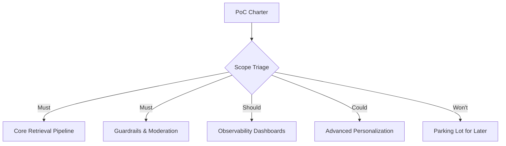
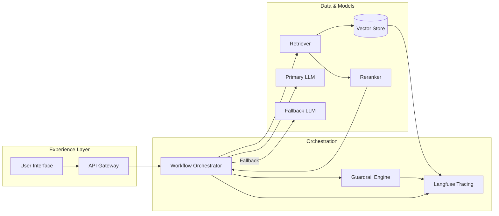

# Lesson 1: PoC Kickoff & Architecture Alignment

**Duration:** 120 minutes  
**Level:** Advanced  
**Prerequisites:** Weeks 1-7 content completed, shared PoC charter approved

## Table of Contents
- [Why This Lesson Matters](#why-this-lesson-matters)
- [PoC Charter Deep Dive](#poc-charter-deep-dive)
- [Scope Triage and Guardrails](#scope-triage-and-guardrails)
- [Architecture Alignment Workshop](#architecture-alignment-workshop)
- [Dependency and Risk Mapping](#dependency-and-risk-mapping)
- [Workstream Ownership Model](#workstream-ownership-model)
- [Deliverables and Success Metrics](#deliverables-and-success-metrics)
- [Automation & Tooling Foundations](#automation--tooling-foundations)
- [Kickoff Ceremony Agenda](#kickoff-ceremony-agenda)
- [Action Items and Templates](#action-items-and-templates)

---

## Why This Lesson Matters

The PoC kickoff sets the tone for the integration sprint. Without explicit alignment on scope, architecture, and success criteria, the team is likely to thrash during the week or overcommit to features that do not maximize stakeholder impact. This lesson gives you the concrete artifacts and facilitation patterns needed to:

- Validate that the PoC charter is actionable and bounded
- Translate architectural aspirations into implementable workstreams
- Surface risks early and assign clear mitigation owners
- Align every contributor on the definition of "demo-ready"

By the end of the kickoff, stakeholders should have confidence in the plan, and the engineering team should have a concise backlog aligned with technical constraints.

---

## PoC Charter Deep Dive

The PoC charter is a living one-pager that captures the vision, stakeholders, assumptions, and target metrics. Revisit it before the kickoff to ensure everyone starts from the same context.

**Charter Sections to Validate:**

| Section | Key Questions |
| ------- | ------------- |
| Problem Statement | Which workflow or persona are we solving for? |
| Target Users | Who will interact with the PoC during the demo? |
| Success Metrics | What numbers determine success (latency, accuracy, CSAT)? |
| Guardrails | What must not happen (data leaks, hallucinated policies, downtime)? |
| Stakeholder Expectations | Which moments will make the demo memorable? |

If the charter is missing information, assign owners to fill the gaps within 24 hours. Do not proceed to full integration with an ambiguous charter.

---

## Scope Triage and Guardrails

Scope creep is the number one risk during integration weeks. To prevent it, apply a triage framework that classifies features into **Must**, **Should**, **Could**, and **Won't**.



**Checklist for Scope Triage:**
- Does every "Must" map to a use-case moment in the demo script?
- Are "Should" items optional enhancements that can be dropped without breaking the storyline?
- Have "Won't" items been parked with context so they can be re-evaluated after demo day?
- Have we captured dependencies for each item (datasets, APIs, credentials)?

Document the triage outcome in a shared spreadsheet or Kanban board with RAG (red-amber-green) status tags.

---

## Architecture Alignment Workshop

Run a two-hour workshop to confirm the target state architecture. The goal is not to generate net-new ideas but to converge on implementation details, interfaces, and constraints.

### Inputs to Bring
- High-level architecture diagram from Week 5 (RAG) and Week 6 (Tooling)
- Observability and guardrail patterns from Week 7
- Infrastructure constraints (network, identity, deployment targets)

### Output Artifact
A refined architecture view that covers:

1. **Data Plane**: ingestion sources, vector store, retrieval pipeline
2. **Model Plane**: primary LLM, fallback models, routing logic
3. **Control Plane**: guardrails, evaluators, feature flags
4. **Experience Plane**: front-end, API gateway, integrations
5. **Non-Functional Overlays**: logging, tracing, metrics, secrets management



Capture the diagram in Markdown (Mermaid) and export a PNG for executive decks if needed.

---

## Dependency and Risk Mapping

Create a dependency matrix that lists upstream and downstream relationships. Use a lightweight scoring model to prioritize resolution.

**Dependency Matrix Template:**

| Component | Depends On | Owner | Status | Risk Level |
| --------- | ---------- | ----- | ------ | ---------- |
| Retrieval API | Vector store indexing job | Data Engineering | In progress | Medium |
| Guardrail Engine | Policy configuration | Security | Ready | Low |
| Analytics Dashboard | Langfuse events | Observability | Blocked | High |

**Risk Scoring Guide:**
- **High:** Potential demo stopper, unresolved blocker, or external dependency
- **Medium:** Workaround available but requires careful coordination
- **Low:** Monitored but unlikely to jeopardize success

Assign a risk owner for every high or medium item. The owner is responsible for daily updates during the PoC week.

---

## Workstream Ownership Model

Divide the PoC into discrete workstreams that can execute in parallel but converge toward a shared integration target. A typical breakdown:

1. **Core Retrieval & Orchestration** (Lead: Backend engineer)
2. **Guardrails & Safety** (Lead: Security engineer)
3. **Observability & Analytics** (Lead: SRE or data engineer)
4. **Experience & Demo Layer** (Lead: Product engineer or designer)
5. **Program Management & Stakeholder Enablement** (Lead: Product manager)

Define a RACI (Responsible, Accountable, Consulted, Informed) model for each major deliverable. Example:

| Deliverable | Responsible | Accountable | Consulted | Informed |
| ----------- | ----------- | ----------- | --------- | -------- |
| Langfuse Dashboard MVP | SRE | Head of Platform | Backend, Security | Stakeholders |
| Guardrail Policy Bundle | Security Engineer | CISO Delegate | Legal, Compliance | Product |
| Demo Script | Product Manager | Executive Sponsor | Engineering Leads | All |

Publish the RACI in the project wiki or README so there is no ambiguity.

---

## Deliverables and Success Metrics

Before coding starts, agree on the acceptance criteria for each deliverable. Link every criterion to a metric or observable signal.

**Example Acceptance Criteria:**

- **End-to-End Query Flow:** 95 percent of demo queries return a response in under 3 seconds.
- **Guardrail Coverage:** 100 percent of red-team prompts from Week 7 are blocked or redirected.
- **Observability Dashboard:** Displays latency, token usage, error rate, and cost attribution for the latest 24 hours.
- **Demo Narrative:** Includes a quantitative impact statement (e.g., "saves 20 minutes per case").

Store these criteria in the backlog tool as definitions of done (DoD) for the corresponding stories.

---

## Automation & Tooling Foundations

Set up the shared tooling required for continuous integration and visibility during the week.

```bash
# Example GitHub Actions workflow snippet for PoC branch protection
name: poc-ci

on:
  push:
    branches: [ "poc-integration" ]
  pull_request:
    branches: [ "poc-integration" ]

jobs:
  test-and-lint:
    runs-on: ubuntu-latest
    steps:
      - uses: actions/checkout@v4
      - name: Set up Python
        uses: actions/setup-python@v5
        with:
          python-version: "3.11"
      - name: Install dependencies
        run: pip install -r requirements.txt
      - name: Run unit tests
        run: pytest tests/smoke --maxfail=1 --disable-warnings -q
      - name: Trigger Langfuse annotation sync
        run: python scripts/sync_traces.py
```

Align on which dashboards will be monitored daily (Grafana, Langfuse, custom notebooks) and who is responsible for updating status artifacts.

---

## Kickoff Ceremony Agenda

A focused two-hour kickoff keeps momentum high. Suggested agenda:

| Time | Topic | Owner |
| ---- | ----- | ----- |
| 0:00-0:10 | Welcome, objectives, success metrics | Executive Sponsor |
| 0:10-0:30 | Charter walkthrough & stakeholder expectations | Product Manager |
| 0:30-1:00 | Architecture alignment & interface contracts | Tech Lead |
| 1:00-1:20 | Scope triage outcomes & backlog overview | Delivery Lead |
| 1:20-1:35 | Risk review & mitigation assignments | Tech Lead |
| 1:35-1:50 | Tooling, environments, and CI/CD plan | DevOps |
| 1:50-2:00 | Next steps, communication cadence, Q&A | Program Manager |

Record decisions in the kickoff notes document and circulate within one hour of the meeting.

---

## Action Items and Templates

| Artifact | Location | Owner |
| -------- | -------- | ----- |
| Updated PoC Charter | `resources/poc-integration-checklist.md` | Product Manager |
| Architecture Diagram (Mermaid) | `lessons/01-poc-kickoff-and-architecture-alignment.md` | Tech Lead |
| Scope Triage Sheet | Shared spreadsheet (`/resources/poc-scope-triage.csv`) | Delivery Lead |
| Risk Register | `/resources/stakeholder-communication-plan.md` (Risk section) | Program Manager |
| Daily Standup Template | `/resources/demo-storyboard-template.md` (Appendix A) | Program Manager |

### Homework
- Confirm access to all required environments and API keys.
- Populate the dependency matrix with current statuses.
- Schedule daily syncs and assign note-takers.

### Stretch
- Draft the first version of the demo storyline summary (three paragraphs max).
- Prepare a "Day 0" Langfuse dashboard snapshot to serve as a baseline.

---

**Next Lesson Preview:** We will move from planning to execution by designing integration sprints, defining checkpoints, and establishing daily delivery cadences.
