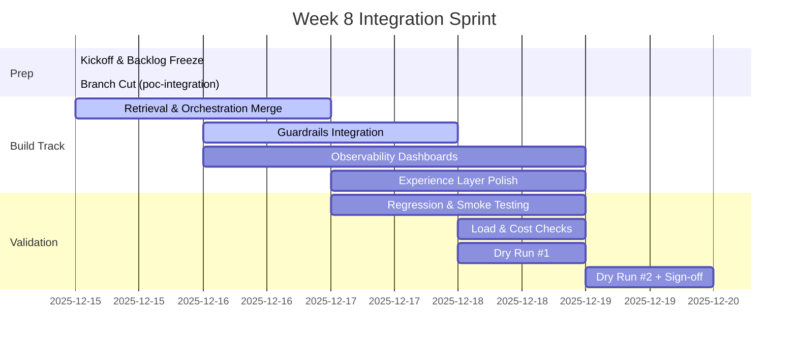

# Lesson 2: Integration Sprints & Delivery Cadence

**Duration:** 110 minutes  
**Level:** Advanced  
**Prerequisites:** Lesson 1 complete, Week 8 Kanban board initialized, CI pipeline available

## Table of Contents
- [Lesson Goals](#lesson-goals)
- [Integration Sprint Blueprint](#integration-sprint-blueprint)
- [Workstream Synchronization Patterns](#workstream-synchronization-patterns)
- [Daily Cadence & Rituals](#daily-cadence--rituals)
- [Integration Checkpoints & Quality Gates](#integration-checkpoints--quality-gates)
- [Automation Backbone](#automation-backbone)
- [Feature Flags, Rollbacks & Release Safety](#feature-flags-rollbacks--release-safety)
- [Telemetry-Driven Progress Tracking](#telemetry-driven-progress-tracking)
- [Collaboration Artifacts](#collaboration-artifacts)
- [Action Items & Exercises](#action-items--exercises)

---

## Lesson Goals

By the end of this session you will be able to:

- Design a 4-day integration sprint plan that balances velocity and risk
- Coordinate multi-track workstreams without blocking the critical path
- Apply daily rituals that surface integration issues within hours
- Establish mandatory quality gates for code merges and demo readiness
- Leverage automation (CI, data refresh, smoke tests) to maintain confidence
- Implement rollout strategies (feature flags, progressive exposure, rollbacks)
- Track progress via shared telemetry and operating dashboards

---

## Integration Sprint Blueprint

Week 8 is structured around a tightly scoped integration sprint. Use the following blueprint as a starting point, adapting to team size and dependencies.



**Key Principles:**
- **Timeboxing:** Every stream has a defined window; no open-ended tasks.
- **Dependency overlap:** Guardrail work starts while core retrieval stabilizes; validation begins as soon as first end-to-end path exists.
- **Buffer time:** Reserve Friday morning for unexpected rework and demo rehearsal.

---

## Workstream Synchronization Patterns

To prevent cross-stream contention, define explicit sync points and ownership hand-offs.

### Swimlane Model

| Stream | Scope | Artifacts | Primary Owner | Sync Touchpoints |
| ------ | ----- | --------- | ------------- | ---------------- |
| **Core Retrieval** | API contracts, vector search routing | `retrieval/` services, API schema | Backend Lead | Daily standup, Tues integration checkpoint |
| **Guardrails** | Prompt filters, red-team automation | `guardrails.yaml`, test harness | Security Lead | Guardrail huddle (Tue/Thu) |
| **Observability** | Langfuse spans, metrics, dashboards | `observability/` configs, Grafana board | SRE Lead | Telemetry sync (Wed) |
| **Experience** | Front-end, demo scripts, UX instrumentation | `ui/` repo, storyboard updates | Product Engineer | Daily post-standup alignment |
| **Program Ops** | Risk register, comms, stakeholder updates | Daily brief, change log | Program Manager | Twice-daily RAG review |

### Handoff Checklist
- API contract published (OpenAPI/JSON schema)
- Feature flag toggles defined with defaults
- Test data seeds updated and merged
- Observability tags agreed (trace/service names)

If any item is missing, the consumer stream must block or isolate the change behind a feature flag.

---

## Daily Cadence & Rituals

Maintain a predictable rhythm to surface integration issues early.

### Core Rituals
1. **09:30 Standup (15 min)**
   - Format: What integrated in last 24h? What is integrating today? Blockers?
   - Enforce demo-backlog language: "Which scene did we enable?" vs "Which ticket did we close?"
2. **13:00 Integration Sync (20 min)**
   - Review build status (CI, deployments)
   - RAG board update (Red/Amber/Green per stream)
   - Decision log updated in real time
3. **17:00 Async Brief**
   - Owner posts daily summary (accomplishments, blockers, needs) to `#poc-war-room`
   - Link updated dashboards/logs for context

### Optional Rituals
- **Guardrail Fire Drill (Wed 11:00):** Run red-team scripts live and capture breakages.
- **Telemetry Hour (Thu 09:00):** Walk through dashboards to confirm metrics stability.

**Facilitation Tips:**
- Rotate facilitation to keep energy up.
- Use parking lot notes for deep dives; maintain timebox.
- Close each session with explicit "blockers resolved?" confirmation.

---

## Integration Checkpoints & Quality Gates

Set non-negotiable checkpoints that must pass before moving forward.

| Checkpoint | Timing | Gate Criteria | Owner |
| ---------- | ------ | ------------- | ----- |
| **End-to-End Path** | Tuesday 17:00 | Query -> Retrieval -> Guardrails -> LLM -> UX returns success | Backend Lead |
| **Guardrail Coverage** | Wednesday 15:00 | >95 percent of red-team catalog blocked or deflected | Security Lead |
| **Observability Ready** | Thursday 10:00 | Langfuse spans and key metrics flow to dashboard | SRE Lead |
| **Regression Green** | Thursday 14:00 | Smoke and regression suites pass in CI | QA/Program Ops |
| **Demo Dry Run Pass** | Friday 10:00 | Narrative hits timing, no critical defects | Product Manager |

### Example Gate Script

```bash
#!/bin/bash
set -euo pipefail
python scripts/check_end_to_end.py --scenario exec-briefing \
  --expected-latency-ms 3000 --max-retries 1
pytest tests/regression -m "critical"
python scripts/guardrail_report.py --min-block-rate 0.95
```

Failing a gate pauses feature work until resolution. Log failures in the risk register and assign an owner immediately.

---

## Automation Backbone

Automation keeps integration velocity high without sacrificing quality.

### CI/CD Enhancements
- **Branch protections:** Require approvals from impacted stream owners.
- **Matrix testing:** Run smoke tests against both primary and fallback LLMs.
- **Dataset checks:** Validate embeddings or vector indices before merging ingestion changes.

```yaml
# .github/workflows/poc-smoke.yml (excerpt)
name: poc-smoke

on:
  pull_request:
    branches: [ "poc-integration" ]

jobs:
  smoke:
    runs-on: ubuntu-latest
    strategy:
      matrix:
        llm: ["primary", "fallback"]
    steps:
      - uses: actions/checkout@v4
      - name: Install deps
        run: pip install -r requirements.txt
      - name: Seed test data
        run: python scripts/seed_demo_dataset.py --mode=ci
      - name: Run smoke tests
        run: pytest tests/smoke -m integration --llm=${{ matrix.llm }}
      - name: Upload Langfuse annotation
        run: python scripts/upload_traces.py --ci-build $GITHUB_RUN_ID
```

### Data Refresh Automation
- Schedule nightly jobs to refresh embeddings/content.
- Generate delta reports to highlight changes affecting demo scenes.

```bash
make data-refresh
python scripts/delta_report.py --output reports/data_delta.md
```

Publish the report for UX and narrative owners so they can adjust scripts if content changes.

---

## Feature Flags, Rollbacks & Release Safety

Integration sprints demand reversible changes.

### Feature Flag Strategy
- Use a centralized service or configuration file (e.g., `config/feature_flags.yaml`).
- Default to "off" until end-to-end validation passes.
- Tag each flag with owner, expiry date, and rollback command.

```yaml
features:
  guardrail_chain_v2:
    default: false
    owner: security-lead
    expires_on: 2026-01-15
    notes: "Enable after red-team sign-off"
  adaptive_reranker:
    default: false
    owner: backend-lead
    expires_on: 2026-02-01
    notes: "Requires cost ceiling check"
```

### Rollback Playbook
1. Identify issue via telemetry or manual testing.
2. Flip feature flag off (if available) or redeploy previous stable build (`poc-integration@<sha>`).
3. Notify stakeholders with template from `stakeholder-communication-plan.md`.
4. Create incident note capturing timeline, impact, remediation path.

Maintain a "Demo Safe Mode" environment that only allows whitelisted features. Use this environment for final rehearsal until all gates succeed.

---

## Telemetry-Driven Progress Tracking

Treat dashboards and logs as first-class standups participants.

### Minimum Telemetry Set
- **Langfuse Trace Dashboard:** End-to-end spans with latency, error counts.
- **Metrics Panel:** p50/p95 latency, token usage, cost per persona.
- **Guardrail Monitor:** Blocked vs allowed requests, rule hit distribution.
- **CI Health Board:** Recent build statuses, failing suites, time to fix.

Update `resources/readiness-scorecard.csv` with current values after each integration checkpoint.

### Example Query Snippets

```sql
-- Token burn per persona (Postgres/ClickHouse)
SELECT persona,
       SUM(total_tokens) AS tokens,
       SUM(cost_usd) AS cost
FROM analytics.poc_usage
WHERE timestamp > now() - interval '24 hours'
GROUP BY persona
ORDER BY cost DESC;
```

```python
# Pull Langfuse spans tagged with "demo" and compute error rate
from langfuse import Langfuse

client = Langfuse()
spans = client.fetch_spans(tags=["demo"], last_hours=12)
error_rate = sum(1 for s in spans if s.status == "error") / max(len(spans), 1)
print(f"Demo span error rate: {error_rate:.2%}")
```

Share results in daily briefs so all stakeholders understand the operational picture.

---

## Collaboration Artifacts

Ensure everyone can find the latest decisions and status quickly.

| Artifact | Location | Owner | Refresh Frequency |
| -------- | -------- | ----- | ----------------- |
| `poc-integration` Kanban | Project tracker (Jira/Linear) | Delivery Lead | Real-time |
| Decision log | `/resources/stakeholder-communication-plan.md` Appendix | Program Manager | After each sync |
| Integration notes | `/resources/poc-integration-checklist.md` | Tech Lead | Daily |
| Change log | `docs/poc-week/change-log.md` *(create if absent)* | Product Manager | Daily |

Adopt a "no status in DMs" policy: updates must live in shared channels or documents.

---

## Action Items & Exercises

1. **Map Dependencies:** Update `resources/poc-scope-triage.csv` with current owners and statuses.
2. **Instrument Gate Script:** Commit a version of the gate script to `scripts/` and add to CI.
3. **Publish Daily Brief Template:** Copy the communication template into your Slack channel and assign rotation.
4. **Telemetry Dry Run:** Execute a demo scenario and confirm spans/metrics appear on dashboards within five minutes.
5. **Feature Flag Audit:** Review all existing flags, set expiry dates, and document rollback playbook.

### Stretch Challenges
- Implement a Slack bot that posts CI results and gate statuses automatically.
- Add cost anomaly detection using a simple rules engine or statistical threshold.
- Create a burndown chart correlating readiness scorecard metrics with demo scenes.

---

**Next Lesson Preview:** We shift focus to operational hardening, ensuring the PoC can withstand load, security scrutiny, and compliance checks before demo day.
