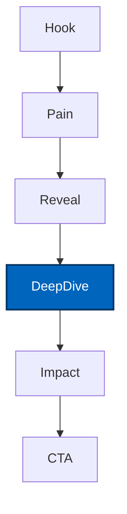

# Lesson 4: Demo Storytelling & Stakeholder Enablement

**Duration:** 90 minutes  
**Level:** Advanced  
**Prerequisites:** Lessons 1-3 completed, demo environment stable, storyboard draft available

## Table of Contents
- [Lesson Objectives](#lesson-objectives)
- [Designing the Narrative Arc](#designing-the-narrative-arc)
- [Persona-Centric Framing](#persona-centric-framing)
- [Demo Script Engineering](#demo-script-engineering)
- [Visual Anchors & Evidence](#visual-anchors--evidence)
- [Objection Handling & FAQs](#objection-handling--faqs)
- [Stakeholder Enablement Plan](#stakeholder-enablement-plan)
- [Dry Runs & Feedback Loops](#dry-runs--feedback-loops)
- [Post-Demo Follow-Through](#post-demo-follow-through)
- [Action Items](#action-items)

---

## Lesson Objectives

By the end of this session you will:

- Craft a compelling narrative arc that links PoC capabilities to business outcomes.
- Tailor demo moments to stakeholder personas and their success metrics.
- Engineer a demo script with precise timing, cues, and backup plans.
- Curate visual anchors (dashboards, logs, metrics) that reinforce credibility.
- Prepare concise, confident responses to top stakeholder objections.
- Build a stakeholder enablement plan so champions can carry the story forward.
- Conduct dry runs, capture feedback, and iterate with minimal churn.
- Define post-demo follow-up that converts excitement into next steps.

---

## Designing the Narrative Arc

A successful demo behaves like a well-produced story: clear stakes, tension/resolution, and concrete proof points.

### Core Structure
1. **Hook (0:00-0:45):** Highlight the burning problem and cost of inaction.
2. **Current Pain (0:45-2:00):** Reveal inefficiencies, metrics, and user quotes.
3. **Solution Reveal (2:00-3:30):** Introduce PoC, architecture map, and key differentiator.
4. **Deep Dive (3:30-5:00):** Showcase one hero workflow with measurable outcomes.
5. **Impact (5:00-6:00):** Quantify benefits using dashboards and analytics.
6. **Call to Action (6:00-7:00):** Outline next steps, investment needs, and timeline.

### Storyboard Template
Use `resources/demo-storyboard-template.md` to script each scene, assign owners, and capture proof points.



Emphasize that the deep dive is the emotional center—show not only what the system does but also why it matters.

---

## Persona-Centric Framing

Different stakeholders care about different outcomes. Map each scene to a persona and their metrics.

| Persona | Top Concern | Evidence to Provide | Call to Action |
| ------- | ----------- | ------------------ | -------------- |
| Executive Sponsor | Strategic impact, ROI | Before/after KPIs, cost savings | Green-light pilot or production planning |
| Operations Lead | Reliability, throughput | Latency dashboards, load test summaries | Approve operational handoff plan |
| Security Officer | Guardrails, compliance | Red-team report, policy sign-off | Acknowledge risk mitigations |
| Product Owner | User adoption, backlog | UX highlights, user feedback | Align on feature roadmap |

Customize the narrative voice for each persona—use their language, not technical jargon.

---

## Demo Script Engineering

Precision matters. Build a script that eliminates improvisation risk while leaving room for natural delivery.

### Script Components
- **Narration bullets:** Key phrases to communicate value concisely.
- **Action cues:** Which screen to share, which button to click.
- **Evidence references:** Which dashboard, log, or KPI to mention.
- **Timing markers:** Target timestamps per scene.
- **Fallback notes:** Alternative path if a service glitches.

Example script snippet:
```
Scene: Deep Dive — Risk Analyst Assist
Narration:
- "Let's watch how a risk analyst resolves a flagged case 10 minutes faster."
- "Notice how guardrails flag sensitive data before the analyst views it."
Actions:
- Switch to analyst dashboard tab.
- Trigger demo query using preloaded case ID.
Evidence:
- Highlight Langfuse trace showing latency < 2.5s.
- Show guardrail log entry with block event.
Fallback:
- If retrieval misfires, play backup recording with commentary.
```

Upload finalized scripts to the shared drive and version them in git (`resources/demo-storyboard-template.md` appendices).

---

## Visual Anchors & Evidence

Support every claim with a visual artifact. Prioritize clarity and legibility.

### Recommended Anchors
- **Langfuse Trace View:** Show structured spans to prove observability maturity.
- **Metrics Dashboard:** Highlight latency, success rate, and cost tracked during dry runs.
- **Guardrail Report:** Display red-team block rates and policy decisions.
- **Experience Screenshot:** Showcase polished UX elements tied to user stories.

Ensure resolution and contrast are dialed in; practice zooming or highlighting to guide attention. Use cursor walkthroughs or annotations to avoid confusion.

---

## Objection Handling & FAQs

Anticipate tough questions so you can respond crisply.

### Top Objections
1. **"How accurate is it?"**
   - Response: Cite evaluation metrics, user feedback, and guardrail fail-safes.
   - Evidence: Link to eval report or mention upcoming A/B test.
2. **"Is our data safe?"**
   - Response: Summarize guardrail, redaction, and audit controls.
   - Evidence: Show compliance checklist or security sign-off.
3. **"How hard is this to deploy?"**
   - Response: Describe deployment script, infrastructure plan, and training materials.
   - Evidence: Reference runbooks, mention scaffolded IaC.
4. **"What's the cost outlook?"**
   - Response: Share cost-per-query estimates, scaling strategy, budget guardrails.
   - Evidence: Display cost alert screenshot or cost modeling sheet.

Maintain a FAQ doc (appendix in storyboard template) synced with stakeholder feedback.

---

## Stakeholder Enablement Plan

Help internal champions retell the story.

### Enablement Assets
- **Executive One-Pager:** Problem, solution, metrics, ask.
- **Demo Recording (optional):** Clean capture with captions (shorter edit if possible).
- **FAQ Packet:** Top objections and answers, updated post dry runs.
- **Playbook:** Next-step options (pilot, integration, budget request).

### Distribution Strategy
- Share assets 24 hours before the demo with instructions.
- Create a "Demo Toolkit" folder linked in `resources/stakeholder-communication-plan.md`.
- Offer optional briefing session for champions to practice messaging.

---

## Dry Runs & Feedback Loops

Dry runs convert planning into muscle memory.

### Dry Run Workflow
1. **Schedule:** Two formal rehearsals (Thu afternoon, Fri morning).
2. **Roles:** Narrator, driver, observer/timekeeper, QA (records issues).
3. **Tools:** Timer, checklist, recording tool, feedback form.
4. **Feedback:** Use the template in `stakeholder-communication-plan.md` to capture wins and gaps.

Emulate real conditions: same environment, same network, minimal interruptions. After each run, prioritize fixes and track in the risk register or backlog.

---

## Post-Demo Follow-Through

Sustain momentum beyond the wow moment.

### Immediate (within 2 hours)
- Send thank-you note with recording, deck, key metrics, and CTA.
- Update risk register with any new concerns raised.

### Short-Term (within 48 hours)
- Conduct stakeholder interviews to capture feedback and decision insights.
- Refresh project board with new tasks or pivots.
- Start drafting pilot plan or production roadmap.

### Long-Term (within 1 week)
- Publish retrospective summarizing outcomes, lessons, and next steps.
- Archive demo assets with version history and usage notes.
- Align on resource allocation for post-demo phase.

---

## Action Items

1. Finalize storyboard using `resources/demo-storyboard-template.md`; assign owners per scene.
2. Produce or update enablement assets (one-pager, FAQ, cost summary); store in demo toolkit folder.
3. Run at least one dry run with full team, capture feedback, and resolve blockers.
4. Update `resources/stakeholder-communication-plan.md` with final schedule, comms, and follow-up plan.
5. Prepare post-demo follow-up templates (email, meeting invites) ahead of time.

### Stretch Goals
- Create a short highlight reel (1-2 minutes) for executive recap.
- Draft a stakeholder-specific roadmap showing how PoC evolves per persona needs.
- Develop a "demo scorecard" capturing audience sentiment and conversion signals.

---

**Week 8 Wrap-Up:** With Lessons 1-4 complete, you now have a comprehensive playbook covering kickoff, integration, operational readiness, and storytelling. Next, apply these lessons in the Week 8 labs to rehearse, instrument, and deliver a standout PoC demonstration.
