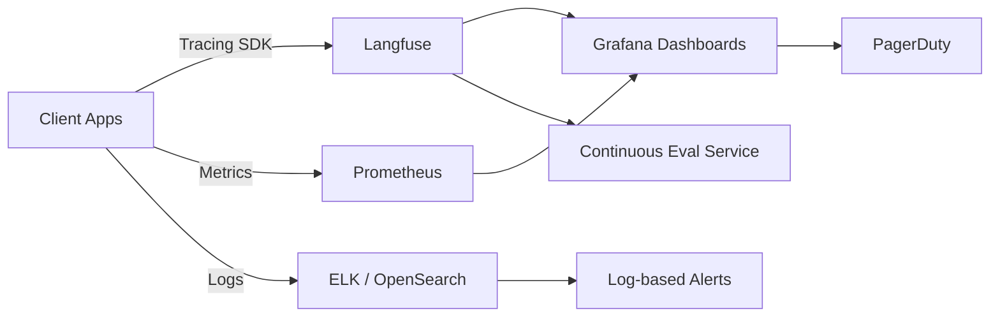

# Lesson 03 – Observability, Drift Detection & Incident Response

**Session Length:** 3.5 hours (2h lecture + 1.5h tabletop exercise)

---

## 1. Objectives

- Instrument end-to-end observability for production GenAI services (metrics, logs, traces)
- Detect model and data drift before it impacts end users
- Define incident response mechanics tailored to GenAI failure modes
- Practice tabletop exercises covering outage, hallucination spikes, and data leaks

---

## 2. Observability Architecture



**Key Components**
- **Tracing:** Langfuse spans for request lifecycle -> guardrail decisions, model invocations, fallback paths.
- **Metrics:** Prometheus scraping FastAPI, Celery, vector DB; custom metrics for quality scores.
- **Logs:** Structured logs with correlation IDs, guardrail verdicts, and compliance events.
- **Dashboards:** Unified view for SLOs, error budgets, persona breakdowns.
- **Alerting:** Multi-channel (PagerDuty, Slack, email) with severity-based routing.

---

## 3. Continuous Evaluation & Drift Detection

| Drift Type | Signal | Tooling | Mitigation |
| ---------- | ------ | ------- | ---------- |
| **Input Drift** | Change in request distribution | Embedding distance, Kolmogorov-Smirnov test | Retrain retrieval index, update prompts |
| **Output Drift** | Shift in response tone/quality | Quality evaluator, sentiment classifier | Refresh prompts, reinforce guardrails |
| **Model Drift** | Performance drop vs benchmark | Scheduled offline eval, synthetic tests | Rollback to previous model, escalate to ML team |
| **Data Drift** | Vector store content divergence | Checksums, coverage reports | Trigger re-ingestion, data quality review |

### Drift Pipeline Skeleton

```python
from datetime import datetime, timedelta

from evaluations.pipeline import DriftMonitor
from notifications import AlertClient

monitor = DriftMonitor(
    baseline_window=timedelta(days=14),
    comparison_window=timedelta(days=1),
    thresholds={
        "embedding_distance": 0.25,
        "helpfulness_score": -0.4,
    },
)

result = monitor.run()

if result.exceeds_thresholds:
    AlertClient().notify(
        severity="sev2",
        title="Output drift detected",
        details=result.to_markdown(),
    )
    monitor.snapshot("artifacts/drift-report" + datetime.utcnow().strftime("%Y%m%d"))
```

---

## 4. Incident Response Lifecycle

| Phase | Questions | Actions |
| ----- | --------- | ------- |
| **Detect** | Did an alert fire? Is it valid? | Triage runbook, pull traces/logs, confirm scope |
| **Mobilize** | Who is on-call? Do we need SMEs? | Page on-call tree, open incident channel, assign roles |
| **Mitigate** | Can we stop impact quickly? | Apply feature flag, rollback release, throttle traffic |
| **Communicate** | Who needs updates? | Update status page, inform stakeholders, log communications |
| **Resolve** | Has service returned to SLO? | Verify metrics, confirm guardrails restored, close alert |
| **Post-Incident** | What did we learn? | Run postmortem, capture action items, update runbooks |

**Severity Matrix Example**

| Severity | Definition | Response Time | Channels |
| -------- | ---------- | ------------- | -------- |
| **Sev1** | Critical outage, regulatory breach, sensitive data leak | 5 min | PagerDuty, exec bridge, status page |
| **Sev2** | Major functionality loss, error budget burn > 25% | 15 min | PagerDuty, Slack incident room |
| **Sev3** | Partial degradation, increased latency | 60 min | Slack, ticketing system |
| **Sev4** | Cosmetic, minor bug | 1 business day | Ticket only |

---

## 5. Tabletop Exercise Scenarios

1. **Hallucination Surge**
   - Trigger: Quality evaluator flags 30% drop in helpfulness for legal persona.
   - Focus: Guardrail fallback, communication to legal/compliance, hotfix strategy.

2. **Prompt Injection Bypass in Production**
   - Trigger: Red-team regression catches live bypass; data exfiltration attempt logged.
   - Focus: Secrets rotation, policy patch, incident disclosure.

3. **Vendor Outage (LLM Provider)**
   - Trigger: Primary inference API returns 5xx; fallback provider slower.
   - Focus: Traffic routing, status page transparency, cost impact of backup.

**Exercise Flow**
- Assign roles (Incident Commander, Comms Lead, Ops, Security).
- Walk through timeline with injects every 5-10 min.
- Capture decisions in incident timeline doc.
- Review metrics: Was SLO breached? Did we consume error budget?

---

## 6. Runbook Essentials

- Trigger conditions & severity classification
- Immediate actions checklist (disable feature flag, switch to fallback)
- Diagnostic queries (Langfuse search, Prometheus dashboards, log patterns)
- Escalation contacts (LLM vendor TAM, security operations center)
- Communication templates (internal Slack, external status page, customer email)
- Post-incident tasks (document RCA, attach evidence, update guardrails)

Store runbooks in version control: `resources/incident-playbook-template.md` as starting point.

---

## 7. Metrics & Alert Design

| Metric | Alert Threshold | Action |
| ------ | --------------- | ------ |
| `request_success_rate` | < 0.97 over 5 min | Page on-call, investigate dependency | 
| `p95_latency_ms` | > 2500ms over 10 min | Scale inference, check provider status |
| `guardrail_block_rate` | < 0.93 over 30 min | Pause risky persona, rerun red-team suite |
| `output_drift_score` | > 0.25 daily | Initiate drift runbook |
| `cost_per_request_usd` | > $0.35 over 1h | Validate usage, enforce rate limits |

**Alert Hygiene Tips**
- Route alerts by persona or surface (web, chat, API) to the right team.
- Include runbook links and diagnostic steps in alert payloads.
- Suppress noisy alerts with multi-window evaluations (e.g., 2/3 rule).

---

## 8. Post-Incident Reviews (PIR)

Structure your PIR document:
- Summary and impact assessment
- Timeline with detection, mitigation, resolution milestones
- Root cause analysis (5 Whys / Fishbone)
- Contributing factors (process, tooling, training)
- Lessons learned and follow-up actions with owners/dates
- Updates to runbooks, training, or guardrails

Ensure PIRs feed into the Week 10 governance backlog.

---

## 9. Deliverables

- Updated observability diagrams stored in `docs/architecture/week-09/`
- Drift detection job definition committed to repo (`jobs/drift-monitor.yaml`)
- On-call schedule + escalation matrix documented in `resources/mlops-operating-model.md`
- Incident runbooks templated and stored under `resources/incident-playbook-template.md`

---

## 10. Discussion Prompts

- Which leading indicators provide the earliest warning for GenAI regressions?
- How do we balance alert sensitivity with on-call fatigue?
- What automation can close the loop from drift detection to prompt/model update?
- Which stakeholders must approve incident communications before external release?

---

## 11. Preparation for Lesson 04

- Finalize runbook drafts and share with security, compliance, and support leads.
- Ensure drift detection alerts feed into the same incident tooling as infrastructure alerts.
- Document outstanding monitoring gaps and assign owners before release planning.

> Next session: We will consolidate release management, CAB processes, and stakeholder operations to orchestrate go-live.
