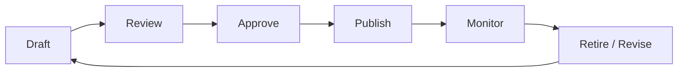

# Lesson 02 – Policy Management & Responsible AI Guardrails

**Session Length:** 3 hours (75 min lecture + 45 min policy workshop + 60 min tooling lab)

---

## 1. Connecting Policy to Practice

Engineering controls only work if they map to clearly articulated Responsible AI (RAI) policies. This lesson covers how to:

- Translate RAI principles into enforceable requirements.
- Manage policy-as-code repositories and CI gates.
- Align multi-stakeholder approvals (Legal, Compliance, Ethics, Product).
- Continuously monitor for policy drift as prompts/models evolve.

> **Goal:** Produce policy artifacts, enforcement rules, and lifecycle workflows that integrate with the GenAI delivery pipeline.

---

## 2. Responsible AI Claims & Requirements

### Sample Principle → Requirement Mapping

| RAI Principle | Requirement | Enforcement Mechanism |
| ------------- | ----------- | --------------------- |
| **Transparency** | Provide persona-appropriate disclosure in every response | Prompt templates include disclosure snippet |
| **Safety** | Block or human-review high-risk topics | Guardrail rules referencing content taxonomy |
| **Privacy** | Mask PII before persistence | Presidio redaction in orchestration layer |
| **Fairness** | Evaluate demographic parity weekly | Automated fairness pipeline + scorecard |
| **Accountability** | Track policy changes with approvals | Git-based workflow with reviewer checks |

Document agreed principles and requirements with policy stakeholders before codifying.

---

## 3. Policy Lifecycle



- **Draft:** Policy owner collaborates with legal/compliance to define scope.
- **Review:** Cross-functional review (security, product, ethics) for risk alignment.
- **Approve:** Formal sign-off recorded (CAB, Responsible AI council).
- **Publish:** Policy-as-code merged, version tagged, documentation updated.
- **Monitor:** Metrics, audits, and alerts ensure adherence.
- **Revise/Retire:** Triggered by incidents, regulations, or product changes.

Store metadata (owner, effective date, review cycle) in `resources/responsible-ai-assessment-checklist.md`.

---

## 4. Policy-as-Code Implementation

### OPA / Rego Example

```rego
package genai.guardrails

default allow = false

allow {
  input.persona == "executive"
  input.topic not in blocked_topics
}

blocked_topics = {"M&A", "financial_forecast", "PII_request"}
```

### Guardrails AI YAML Example

```yaml
filters:
  - id: pii-mask
    description: Mask PII in generated content
    on:
      - output
    action: replace
    pattern: "(?i)(ssn:|passport:|account#)"
```

**Best Practices**
- Version policies alongside code with semantic or calendar versioning.
- Sign policy bundles for tamper detection.
- Require CI to run policy regression tests before merge.
- Provide rollback instructions for emergency hotfixes.

---

## 5. Policy Enforcement in CI/CD

1. **Policy Linting:** Validate Rego/YAML syntax and schema.
2. **Simulation Tests:** Replay historical prompts/responses to ensure policy outcomes.
3. **Red-Team Regression:** Run attack catalog to test policy coverage.
4. **Approval Gates:** Block deployments if new policies lack required sign-offs.
5. **Evidence Capture:** Store policy diffs, test results, and approvals in audit vault.

Use GitHub Actions or equivalent pipelines with mandatory reviewers representing security and compliance.

---

## 6. Workshop Tasks

- Draft RAI policy statements for the PoC assistant.
- Translate two policies into code (OPA/Guardrails) covering safety and privacy.
- Define approval workflow (owners, SLAs) in governance tool (Jira/ServiceNow).
- Update policy registry (`docs/policies/week-10/`) with metadata and change log.

---

## 7. Monitoring & Drift Detection

- Create policy compliance dashboards (pass/fail counts, alert trends).
- Monitor policy utilization across personas and channels (API, web, chat).
- Establish periodic policy reviews (monthly/quarterly) with Responsible AI council.

**Alerts to Configure**
- Policy bypass detected.
- Policy coverage gap discovered (new persona without rules).
- Policy drift (more than X overrides within a week).

---

## 8. Deliverables

- Policy narrative document (Markdown) outlining principles and scope.
- Policy-as-code repository updates with unit tests and reviewers.
- Approval matrix stored in `resources/responsible-ai-assessment-checklist.md`.
- Policy change log shared with stakeholders (link or PR reference).

---

## 9. Discussion Prompts

- How do we avoid policy overreach that blocks legitimate use cases?
- What is the process for emergency policy changes? Who can bypass approvals?
- How do we educate product and support teams on new/updated policies?
- How will we measure policy effectiveness (metrics vs qualitative feedback)?

---

## 10. Homework

- Prepare policy-as-code bundle for Lab 02 where you will enforce and test policies.
- Collect recent incident reports to ensure policies address observed risks.
- Confirm access to CI pipelines and guardrail infrastructure for testing.

> Next lesson: We will automate bias/fairness evaluations to ensure policies deliver equitable outcomes.
