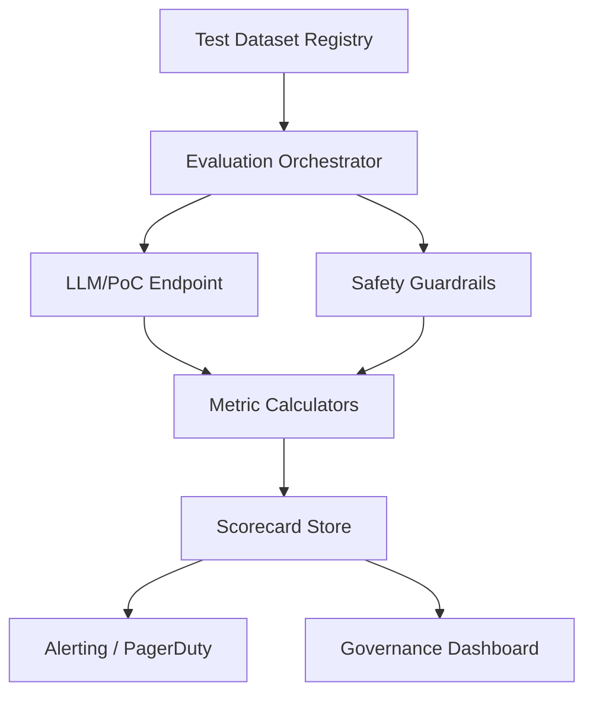

# Lesson 03 – Bias, Fairness & Evaluation Automation

**Session Length:** 3 hours (60 min lecture + 45 min demo + 75 min evaluation lab)

---

## 1. Responsible AI Evaluation Goals

- Detect inequities in model outputs across demographic or contextual groups.
- Quantify robustness to adversarial prompts and domain shifts.
- Automate alerts and remediation workflows when thresholds breach.
- Provide auditable evidence to regulators and stakeholders.

> **Key Outcome:** A repeatable evaluation pipeline feeding the Responsible AI scorecard and governance processes.

---

## 2. Bias & Fairness Concepts

| Bias Type | Description | Example | Mitigation |
| --------- | ----------- | ------- | ---------- |
| **Demographic** | Output varies by protected attribute | Different loan recommendations by gender | Re-rank responses, enforce constraints |
| **Contextual** | Bias triggered by specific contexts | Humor queries produce unsafe content for minors | Context-aware prompts, guardrail policies |
| **Interactional** | Multi-turn drift leads to bias | Chat escalation leads to stereotype reinforcement | State-aware logging, conversation resets |
| **Systemic** | Training data replicates historical bias | Retrieval knowledge base over-representing one group | Data curation, weighting, counterfactual augmentation |

---

## 3. Evaluation Pipeline Architecture



Components:
- **Dataset registry:** Governance over test sets (versioning, provenance, consent).
- **Orchestrator:** Executes evaluations (Papermill, custom pipelines, Airflow).
- **Metrics:** Fairness (equal opportunity, demographic parity), toxicity, hallucination rate.
- **Scorecard:** Results persisted (CSV, database) with history.
- **Alerts:** Triggered when metrics fall below thresholds.

---

## 4. Implementing Fairness Metrics

### Fairlearn Example

```python
from fairlearn.metrics import MetricFrame, selection_rate
from collections import defaultdict

results = defaultdict(list)
for record in evaluation_dataset:
    response = pipeline.run(query=record["prompt"], persona=record["persona"])
    results["y_pred"].append(response.label)
    results["sensitive_attr"].append(record["group"])

metric_frame = MetricFrame(
    metrics=selection_rate,
    y_true=[r["expected_label"] for r in evaluation_dataset],
    y_pred=results["y_pred"],
    sensitive_features=results["sensitive_attr"],
)

print("Selection rate by group:")
print(metric_frame.by_group)
print("Difference:", metric_frame.difference())
```

### Responsible AI Toolbox Integration

- Use `responsible-ai-toolbox` to combine fairness, error analysis, and counterfactual exploration.
- Configure thresholds (e.g., disparity ratio ≤ 1.2) and export reports as part of governance evidence.

---

## 5. Automation & Alerting

1. **Scheduling:** Run evaluations daily/weekly depending on risk appetite.
2. **Result Storage:** Append to `resources/responsible-ai-scorecard.csv` with timestamp.
3. **Alert Thresholds:** Trigger PagerDuty/Slack when fairness difference exceeds tolerance.
4. **Remediation Workflow:** Assign owner, create ticket, plan mitigation (data augmentation, prompt adjustments).
5. **KPI Reporting:** Visualize trends in dashboards (Grafana, Superset, PowerBI).

---

## 6. Integrating with CI/CD

- Include fairness evaluation job in release pipeline (Stage -> Prod promotion).
- Block releases if metrics degrade beyond limits unless exception approved.
- Store evaluation artifacts (notebooks, CSVs, logs) with release ID.
- Maintain golden datasets with replay ability for incident investigations.

---

## 7. Lab Preparation Steps

- Curate or generate evaluation dataset with sensitive attributes and expected outcomes.
- Define baseline metrics and thresholds (commit to scorecard).
- Ensure access to pipeline APIs and guardrail decisions for instrumentation.
- Coordinate with data privacy team on storage/handling of sensitive evaluation data.

---

## 8. Deliverables

- Evaluation pipeline script/notebook stored under `evaluations/responsible-ai/`.
- Updated `resources/responsible-ai-scorecard.csv` with baseline fairness metrics.
- Alert configuration documented (routing, runbook) in `resources/compliance-audit-runbook.md`.
- Summary memo of evaluation results & mitigations shared with governance council.

---

## 9. Discussion Prompts

- How do we ensure evaluation datasets represent real user demographics while respecting privacy?
- What cadence of evaluations balances cost with risk mitigation?
- How are exceptions documented when fairness metrics fail but release must proceed?
- How do we communicate results to non-technical stakeholders (legal, ethics board)?

---

## 10. Homework

- Finalize evaluation dataset and pipeline for Lab 02/03 integration.
- Draft remediation runbook steps for top fairness risks found.
- Align with governance stakeholders on reporting expectations.

> Next lesson: We will package governance artifacts, automate audit evidence, and prepare executive briefings.
