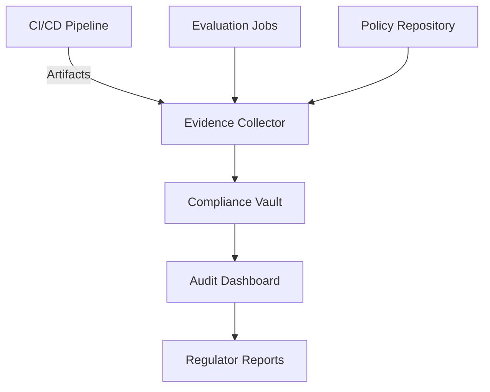

# Lesson 04 – Governance, Audit Evidence & Executive Reporting

**Session Length:** 3 hours (60 min lecture + 60 min governance workshop + 60 min executive briefing lab)

---

## 1. Governance Objectives

- Establish Responsible AI governance structures (councils, working groups, escalation paths).
- Automate evidence capture for audits, regulators, and customer assurances.
- Communicate status, risks, and remediation plans to executives concisely.
- Align governance outputs with business incentives and compliance requirements.

> **Outcome:** A governance charter, operating rhythm, and reporting package ready for executive review.

---

## 2. Responsible AI Operating Model

| Layer | Purpose | Participants | Cadence | Artifacts |
| ----- | ------- | ----------- | ------- | --------- |
| **Steering Council** | Strategic alignment, approve exceptions | Exec sponsor, Legal, Product, Security | Monthly | Council minutes, decision log |
| **Working Group** | Tactical reviews, runbook updates | Engineering, Applied Science, Compliance | Weekly | Action log, scorecards |
| **Incident Review Board** | Post-incident analysis & remediation | SRE, Safety, Ethics | After each incident | PIRs, mitigation backlog |
| **Advisory Forum** | External input, user feedback | Customers, partners, SMEs | Quarterly | Advisory report, roadmap inputs |

Document roles and cadence updates in `resources/stakeholder-brief-template.md` and `resources/responsible-ai-scorecard.csv`.

---

## 3. Audit Evidence Automation

### Evidence Types
- Policy versions, approvals, and diff history.
- Evaluation results (fairness, safety, drift) with timestamps and thresholds.
- Deployment records (release IDs, sign-offs, rollback logs).
- Incident reports, remediation status, and lessons learned.
- Stakeholder communications (status pages, exec briefs, customer notices).

### Automation Tips
- Use metadata tags (release_id, policy_version) to link artifacts.
- Employ notebooks (Papermill) to generate periodic compliance reports.
- Store evidence in immutable storage (WORM) with retention policies.

---

## 4. Executive Reporting Framework

1. **Status Overview** – Traffic, adoption, SLO/RAI scorecard summary.
2. **Risk Highlights** – Top 3 risks, mitigations, deadlines, owners.
3. **Compliance Posture** – Policy coverage, audit status, outstanding actions.
4. **Incidents & Lessons** – Summary of recent incidents, root causes, follow-up.
5. **Next Steps** – Upcoming governance reviews, policy changes, roadmap impact.

Use `resources/stakeholder-brief-template.md` as the foundation for briefing documents.

---

## 5. Workshop Activities

- Draft governance charter detailing councils, membership, decision rights.
- Define evidence automation approach (tools, storage, responsibilities).
- Build executive briefing (Markdown/Notion) summarizing Week 10 findings.
- Plan regulator/customer communication cadence (monthly, quarterly).

---

## 6. Integration with Week 9 Outputs

- Reference production SLO dashboards; align RAI metrics with SLOs.
- Leverage Week 9 incident runbooks to ensure evidence capture includes post-incident reviews.
- Ensure CAB process incorporates governance checkpoints before high-risk changes.

---

## 7. Deliverables

- Governance charter stored in `docs/governance/week-10-charter.md`.
- Evidence automation runbook added to `resources/compliance-audit-runbook.md`.
- Updated `resources/responsible-ai-scorecard.csv` with governance metrics and owners.
- Executive briefing (Markdown/PDF) summarizing readiness, risks, and next steps.
- Communication plan updates (launch, incident, regulator) aligned with Week 9 outputs.

---

## 8. Discussion Prompts

- How do we balance transparency with legal/regulatory constraints?
- Which governance metrics best capture ethical performance over time?
- What triggers a governance escalation vs operational escalation?
- How do we keep governance artifacts current without adding excessive overhead?

---

## 9. Homework

- Finalize governance charter and share with stakeholders for feedback.
- Prepare evidence bundle for Lab 03 (audit simulation).
- Draft executive briefing for Friday review session; incorporate feedback loops.

> This concludes the Week 10 lessons. Labs will reinforce threat mitigation, policy enforcement, and governance automation.
