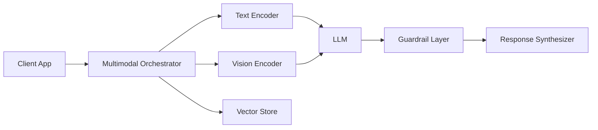

# Lesson 01 – Multimodal Architecture Patterns & Model Selection

**Session Length:** 3.5 hours (90 min lecture + 45 min comparison lab + 75 min architecture review)

---

## 1. Framing Multimodal Requirements

Week 11 expands the PoC into a multimodal assistant. Before writing code, align on:

- **Use cases:** Visual inspection, document understanding, marketing asset review, compliance audits.
- **Modalities:** Images, scanned documents, tables, video frames, audio transcripts.
- **Constraints:** Latency, GPU availability, security requirements, data sensitivity.
- **Success metrics:** Accuracy, coverage, response time, confidence scoring, stakeholder satisfaction.

> **Goal:** Produce a model selection memo + architecture diagram endorsed by engineering, design, and compliance.

---

## 2. Multimodal Model Landscape

| Category | Examples | Strengths | Considerations |
| -------- | -------- | --------- | -------------- |
| **Vision Foundation Models (VFM)** | ViT, SAM, DINOv2 | High-quality embeddings, flexible | Requires downstream fine-tuning, larger compute |
| **Vision-Language Models (VLM)** | CLIP, BLIP-2, LLaVA, GPT-4o | Joint embedding space, natural language I/O | API cost, bias, hallucination risks |
| **Universal Multimodal (UMM)** | Gemini, Kosmos | Handles mixed modalities in single prompt | Vendor lock-in, limited control |
| **Adapters & LoRA** | Q-Former, Flamingo adapters | Efficient adaptation of base LLM | Added complexity, policy compliance |

**Decision Drivers**
- Domain-specific data availability.
- Need for on-prem vs SaaS inference.
- Fine-tuning capacity vs zero-shot performance.
- Privacy/compliance constraints (PHI, PII, export controls).

---

## 3. Architecture Patterns

### 3.1 Orchestrated Multimodal Pipeline

### 3.2 Retrieval-Augmented Multimodal (RA+MM)

1. Extract embeddings for images/documents.
2. Retrieve relevant assets with CLIP / BLIP similarity.
3. Compose prompt with textual summary + visual references.
4. Pass to LLM or VLM, enforce guardrails.
5. Output textual summary + optional links/screenshots.

### 3.3 Streaming Multimodal

- Combine video frame sampling, audio transcript, and context window management.
- Useful for live monitoring or call center scenarios.

---

## 4. Model Selection Framework

| Criterion | Questions | Data Sources |
| --------- | --------- | ------------ |
| Performance | Does model achieve target accuracy/latency? | Benchmarks, pilot tests |
| Coverage | Does model support required modalities/formats? | Evaluation dataset |
| Compliance | Can we host data where required? | Legal, infosec reviews |
| Cost | GPU/API cost vs budget? | Finance, capacity planning |
| Operations | Does platform support observability, rollback? | SRE, platform team |

**Deliverable:** Model Selection Decision Log referencing evaluation results, vendor assessments, and risk notes.

---

## 5. Workshop Agenda

1. **Use Case Alignment (15 min)** – Stakeholders articulate target scenarios.
2. **Model Shortlist (20 min)** – Compare 3-4 candidates using decision matrix.
3. **Latency & Cost Estimation (20 min)** – SRE/Finance provide projections.
4. **Compliance Review (15 min)** – Security/legal flag requirements.
5. **Architecture Sketch (30 min)** – Build updated system diagram.
6. **Decision Log (30 min)** – Document choice, alternatives, mitigation plan.

---

## 6. Integration Checklist

- [ ] Create architecture diagram with modality-specific components.
- [ ] Document chosen model(s), deployment plan, fallback strategy.
- [ ] Identify data ingestion requirements (resolution, metadata schema).
- [ ] Align guardrail strategy with Week 10 policies.
- [ ] Update backlog with technical spikes and compliance reviews.

---

## 7. Discussion Prompts

- What trade-offs exist between hosted multimodal APIs vs self-managed models?
- How do we handle versioning of vision models alongside text models?
- Which failure modes could damage trust (misclassification, bias, missing imagery)?
- How do we gather user feedback for visual outputs (thumbnails, annotations)?

---

## 8. Homework / Lab Prep

- Prepare sample dataset (images/docs) for ingestion pipeline (Lab 01).
- Draft evaluation plan with metrics and baseline targets.
- Secure GPU/API access credentials and add to environment secrets.

> Next lesson: Build ingestion pipelines for documents and images to power multimodal retrieval.
