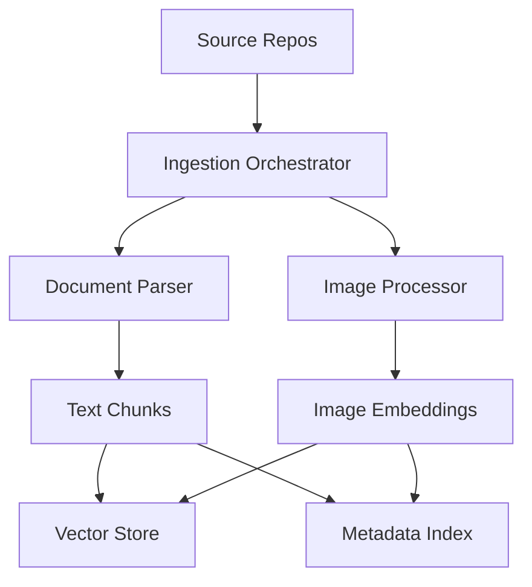

# Lesson 02 – Document & Image Ingestion Pipelines

**Session Length:** 3 hours (60 min lecture + 45 min demo + 75 min hands-on lab prep)

---

## 1. Objectives

- Extract structured knowledge from PDFs, slide decks, and scanned documents.
- Generate embeddings and metadata for images and visual assets.
- Store multimodal artifacts with traceability and compliance controls.
- Prepare ingestion pipeline for Week 11 labs and Week 12 final demo.

---

## 2. Pipeline Overview

**Key Components**
- **Ingestion Orchestrator:** Airflow, Dagster, custom Celery pipeline.
- **Document Parser:** Unstructured, pdfplumber, layoutparser.
- **Image Processor:** OpenCV, CLIP embeddings, NSFW detection.
- **Storage:** Vector DB (text + image), object store (S3, Azure Blob), metadata index (Postgres, Elastic).

---

## 3. Document Processing Steps

1. **Ingestion & Versioning**
   - Fetch from repositories (SharePoint, S3, Google Drive, Confluence).
   - Maintain document IDs, version numbers, checksum.
2. **Parsing & Chunking**
   - Use layout-aware parsing for tables, headings, sidebars.
   - Chunk text by semantic boundaries; capture page numbers and figure references.
3. **Embedding Generation**
   - Use text embedding model (e.g., `text-embedding-3-large`, Sentence Transformers).
   - Store vectors with chunk metadata (title, section, tags).
4. **Compliance Checks**
   - Redact PII/PHI via Presidio.
   - Tag classification level (internal, confidential, restricted).
5. **Audit Trail**
   - Log ingestion event with user, timestamp, success/failure, document fingerprint.

---

## 4. Image Processing Steps

1. **Normalization**
   - Resize, normalize color space, ensure orientation.
   - Generate thumbnails for preview.
2. **Feature Extraction**
   - Compute embeddings using CLIP/BLIP.
   - Extract OCR text if relevant (charts, screenshots).
   - Detect objects (YOLO, DETR) and store labels.
3. **Safety & Compliance**
   - Run NSFW detector, brand/logo compliance checks.
   - Apply watermark detection, store results for guardrails.
4. **Metadata Enrichment**
   - Tags, captions, alt-text suggestions.
   - Link to related documents or knowledge base entries.

---

## 5. Storage Patterns

| Storage Layer | Purpose | Example |
| ------------- | ------- | ------- |
| Vector store | Similarity search for text + images | Weaviate, Qdrant, Pinecone |
| Object store | Raw assets, thumbnails | S3, Azure Blob, GCS |
| Metadata DB | Structured fields, compliance tags | Postgres, Elastic |
| Audit log | Traceability, compliance | DynamoDB, SQL, logging service |

**Best Practices**
- Use consistent IDs across storage layers.
- Store provenance (source, ingestion date, pipeline version).
- Support soft deletes / legal holds.

---

## 6. Observability & Quality

- Track ingestion success/failure rates, latency, document coverage.
- Log extracted content lengths, embedding nulls, safety flags.
- Expose dashboards showing daily ingestion volume and issues.
- Add alerts for ingestion drift (fewer docs, unusual formats).

---

## 7. Workshop Tasks

- Map source systems and access requirements.
- Define metadata schema (fields, types, tags).
- Choose embedding models and vector store configuration.
- Plan compliance checks (redaction, watermark, NSFW) with owners.
- Outline retry strategy and dead-letter queue for failed ingestions.

---

## 8. Deliverables

- Ingestion architecture diagram (Mermaid) stored under `docs/architecture/week-11/`.
- Metadata schema document with required/optional fields.
- Ingestion runbook (step-by-step, contacts, monitoring) draft.
- Backlog items for missing automation or tools.

---

## 9. Discussion Prompts

- How do we ensure ingestion pipelines align with data retention policies?
- What is the rebuild strategy if vector store loses sections of data?
- How do we test ingestion at scale (load testing, synthetic data)?
- What human review is required for sensitive images or scans?

---

## 10. Homework

- Prepare dataset samples for Lab 01 (images, PDFs, metadata).
- Ensure access credentials stored securely (Vault, Secrets Manager).
- Set up or verify vector store environment for multimodal embeddings.

> Next lesson: Combine ingestion outputs with multimodal retrieval, orchestration, and guardrails.
