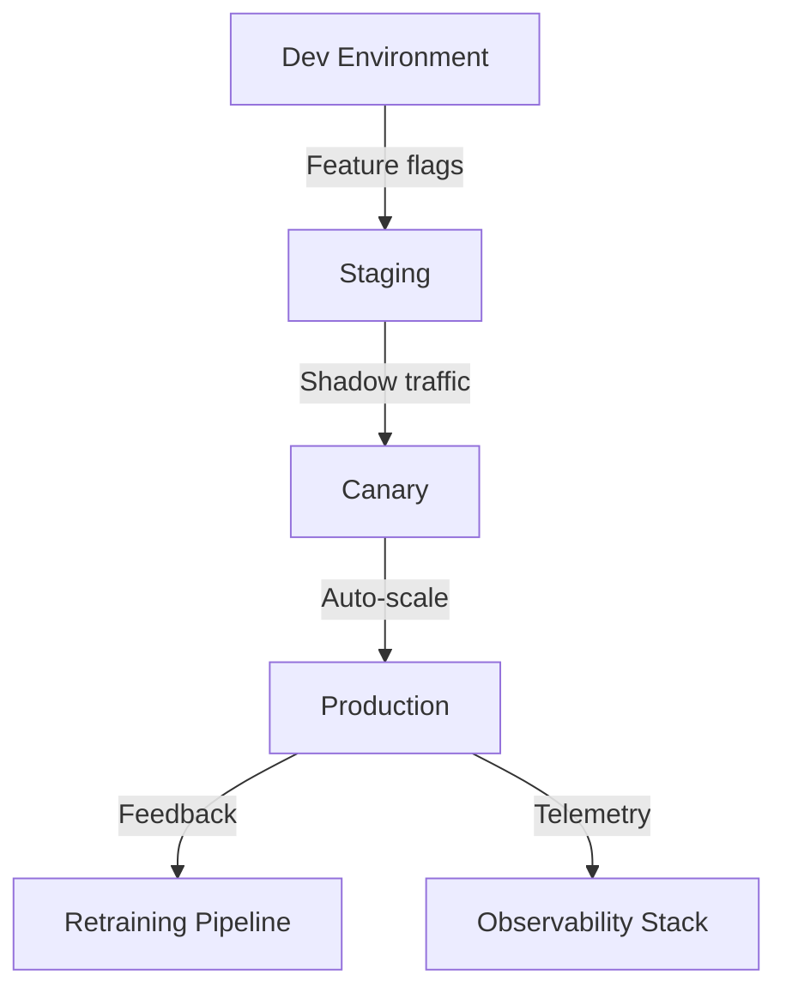

# Lesson 04 – Evaluating & Deploying Multimodal Assistants

**Session Length:** 3.5 hours (60 min lecture + 45 min demo + 90 min lab + 15 min retrospective)

---

## 1. Objectives

- Define evaluation criteria for multimodal assistant quality and safety.
- Build red/blue team playbooks for structured testing of text + image flows.
- Plan deployment architecture across dev/test/prod with rollout safeguards.
- Operationalize feedback loops, drift monitoring, and model update cadence.

---

## 2. Evaluation Frameworks

| Dimension | Metrics | Tooling |
| --------- | ------- | ------- |
| **Accuracy** | Groundedness, hallucination rate, citation coverage | Trulens, PromptFoo |
| **Safety** | NSFW false negatives, PII leakage rate, brand policy violations | Guardrails, custom classifiers |
| **UX** | Task success rate, time-to-answer, user satisfaction | Playwright flows, UX surveys |
| **Performance** | Latency per modality, throughput, cost per interaction | Langfuse, Prometheus |

**Baseline Targets**
- Hallucination rate < 5% judged by domain SMEs.
- Safety violation probability < 0.1% with manual review queue.
- P95 latency < 2.5s with GPU-backed inference.

---

## 3. Test Strategy

1. **Synthetic Scenarios** – Generate canonical test set of documents + images.
2. **Golden Answers** – Capture SME-approved responses with citations.
3. **Automated Runs** – Execute evaluation harness nightly with drift detection.
4. **Red Teaming** – Attack prompts (jailbreaks, watermark removal) to test guardrails.
5. **Blue Teaming** – Document mitigations, update prompt & policy playbooks.

```python
for case in test_cases:
    result = multimodal_agent(case.input)
    metrics.log(case.id, groundedness(result), safety(result))
```

---

## 4. Deployment Architecture



- **Dev:** Experiment with prompt orchestration, integration tests.
- **Staging:** Connect to anonymized corpora, run evaluation harness.
- **Canary:** Send 5% real traffic, monitor safety + latency.
- **Prod:** Auto-scale GPU/CPU pools, enforce guardrails, log feedback.
- **Retraining:** Curate hard examples for periodic fine-tuning or RAG updates.

---

## 5. Rollout Safeguards

- Feature flag toggles for multimodal capabilities per user cohort.
- Circuit breakers triggered by safety score, latency, or error spikes.
- Shadow mode to compare legacy assistant vs multimodal responses.
- Observability SLOs, on-call rotations, and incident communication templates.

---

## 6. Continuous Improvement Loop

| Stage | Description |
| ----- | ----------- |
| **Collect** | Feedback widgets, analyst review queues, telemetry logs |
| **Curate** | Label edge cases, annotate failure modes |
| **Retrain** | Fine-tune VLM adapters, update guardrail thresholds |
| **Validate** | Re-run evaluation battery, compare against baseline |
| **Deploy** | Controlled rollout with approvals |

---

## 7. Workshop Activities

- Configure evaluation harness with sample multimodal test set.
- Simulate canary rollout using feature flags & shadow traffic.
- Draft red/blue team runbooks with escalation matrix.
- Define SLO dashboard (latency, safety, accuracy, cost).

---

## 8. Deliverables

- Evaluation plan stored in `docs/runbooks/week-11/evaluation-plan.md`.
- Deployment checklist covering staging certificates, content filters, rollback.
- Incident playbook for multimodal safety escalation.
- Continuous improvement tracker template (Notion or Confluence).

---

## 9. Discussion Prompts

- How often should we re-run multimodal evaluations after deployment?
- What human-in-the-loop checkpoints are required for safety assurance?
- Which telemetry signals should trigger automatic rollback?
- How do we balance experimentation vs governance in production?

---

## 10. Homework

- Finalize lab submission for evaluation harness implementation.
- Schedule tabletop exercise for multimodal incident response.
- Draft KPI targets for Week 12 executive review.

> Next: Labs will operationalize evaluation harness and deployment safeguards in hands-on scenarios.
